# Il Processo Software

Il processo software inizia quando si inizia ad esplorare il problema e finisce quando il prodotto viene ritirato dal mercato.

Si compone quindi in fasi:

1. **Analisi Requisiti**
2. **Specifica**
3. **Progettazione**
4. **Implementazione**
5. **Integrazione**
6. **Mantenimento**
7. **Ritiro**

Quindi equivale alla **sequenza** di **attività** necessarie allo **sviluppo** di un **software**. Sicuramente, tra le fasi elencate sopra, saranno sempre necessarie quelle di **specifica**, **progettazione** ed **implementazione**, **validazione** ed **evoluzione**.

Solitamente si parla quindi di **modello di software**, ossia una sua **rappresentazione astratta** del **processo**. A volte questi modelli vengono standardizzati (es. Standard ISO 12207).

## Modelli Ciclo di Vita del Software

1. **Build & Fix**: Sistema software sviluppato **senza specifica/progettazione** che viene **modificato più volte** fino a quando non soddisfa il committente.

### Modelli Prescrittivi - Sequenziali

1. **Modello a Cascata**: Segue delle fasi ben definite, ossia:

    - Raccolta Requisiti
    - Progettazione Software
    - Implementazione e Testing
    - Integrazione di Funzionalità e Testing
    - Operatività e Mantenimento

    In alcune sue versioni prevedeva anche dei feedback loop che permettessero di mantenere più versatilità tra le fasi.

    Quindi con questo modello per la **prima volta** si distinguono **fasi ben definite** dello sviluppo software. Allo stesso tempo si genera un **eccessiva rigidità** e produzione di documentazione. Seguendo poi in maniera ideale questo schema, il prodotto non viene mai valutato in una sua versione parziale dal cliente, di conseguenza l'**interazione tra prodotto e cliente** nello **sviluppo** risulta essere **nulla**.

    Viene quindi ricordato perchè è il primo modello a strutturare delle fasi ben definite per lo sviluppo software.

2. **Modello a V**: Viene preso il modello a cascata e "spezzato" in modo tale da suddividere le attività in **analisi** a **sx** e **sintesi** a **dx**.

    <div style="text-align: center;">
    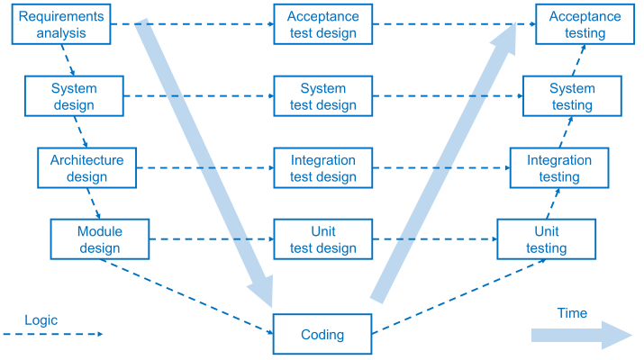
    </div>

    - **SX**: Attività di analisi che scompongono le esigenze degli utenti in piccole parti.
    - **DX**: Attività di sintesi che aggregano e testano tali parti per verificare che il sistema soddisfi le esigenze degli utenti.
    - **CENTRO**: Progettazione dei test da svolgere dunrante le fasi di sviluppo.

    Questo ci permette di definire questo modello come test driven, dato che potremmo definire i test anche subito dopo aver scritto i requisiti.    

### Modelli Prescrittivi - Iterativi

3. **Rapid Prototyping**: Si basa sulla **creazione** di un **primo prototipo** da presentare al cliente per capire se sono stati ben **acquisiti i requisiti**. In caso negativo si reitera modificando il prototipo e ripresentandolo al cliente.

4. **Modello Incrementale**: I requisiti vengono pesati in base alle priorità, questo permette di rilasciare mano mano nuove versioni con implementazioni e feature prima non presenti, integrando e testando con passaggi incrementali.

    - **Pro**:
        - Ottengo subito prime versioni di software
        - Ottengo un feedback rapido sullo sviluppo e sui requisiti
        - Riduce il costo causato dai cambiamenti richiesti
    - **Contro**:
        - Poco chiaro lo schema di sviluppo
        - Rischio di ricadere nel Build & Fix

5. **Modello a Spirale**: Si itera su quattro fasi fondamentali:
    - Definizione di obiettivi
    - Valutazione rischi e possibili alternative
    - Implementazione e sviluppo
    - Definizione di una nuova iterazione

    Questo tipo di schema è detto **risk-driven** dato che ad ogni iterazione si valutano tutte le possibili scelte e rischi.

### Unified Process

Schema basato sulla gestione delle fasi dello schema a cascata in base al periodo corrente del prodotto software.

<div style="text-align: center;">
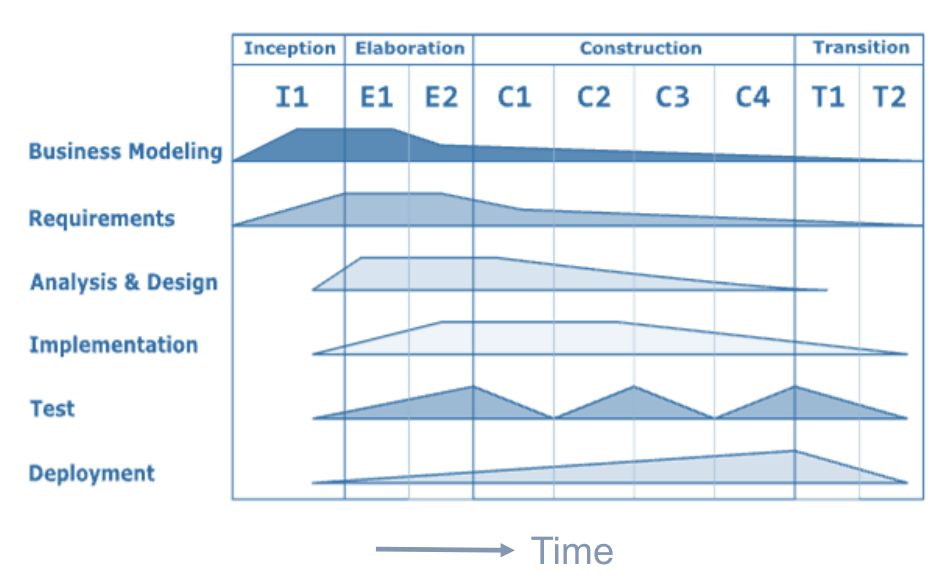
</div>

### Modelli Agili

Prima di definire questi modelli ricapitoliamo le fasi "ideali" di un processo software:

1. **Specifica**: Estrazione ed analisi requisiti, specifica requisiti e convalida requisiti.
2. **Progettazione**: Progettazione dell'architettura del SW, del DB, delle intefacce tra i componenti e nel dettaglio dei componenti stessi.
3. **Sviluppo**: Spesso in interleaving a quella di progettazione, l'obiettivo è quello di sviluppare le componenti descritte sopra. Sono comprese in questa fase le azioni di programmazione e debugging.
4. **Validazione**: Bisogna dimostrare che i componenti sviluppati rispettino i requisiti raccolti all'inizio, di conseguenza vanno costruiti dei test.
5. **Evoluzione**: I requisiti possono cambiare, le tecnologie alla base si possono evolvere, di conseguenza vanno anticipati questi cambiamenti preservando la change tollerance, ossia la proprietà per cui il processo software non soffra in modo pesante questi cambiamenti.

Il **manifesto Agile** affronta diversamente il problema grazie a dei **principi**:

- **Customer Involvement**: Costante feedback al cliente, soprattutto durante le fasi di sviluppo.
- **Incremental Delivery**: Le varie versioni sono rilasciate incrementalmente.
- **People not Process**: I team di sviluppo dovrebbero essere lasciati liberi di agire "a modo loro".
- Nozioni di codice funzionante vince su grandi documentazioni.
- Aggiornamenti frequenti che cercano di stare al passo a cambiamenti frequenti di requisiti.
- Accettare la possibilita di cambiamento dei requisiti.
- Mantenere semplice il progetto così saranno più semplici le modifiche.

#### Caratteristiche dell'Agile
- Solitamente progetti piccoli/medi possono permettersi di seguire in maniera precisa l'Agile.
- Il cliente deve essere disponibile a questo tipo d'interazione continua.
- Il **CI/CD** (Continuous Integration/Continuous Deployment) e la figura del DevOps diventa fondamentale in questo contesto.

#### Esempi di Agile (XP, Scrum)

1. **Extreme Programming (XP)**: Approccio estremamente agile ed iterativo basato su caratteristiche come:
    - Nuove versioni più volte al giorno.
    - Incrementale sulle versioni.
    - Basato sul buildare -> testare -> runnare.
    - Piccole release che forniscano funzionalità di base del sistema.
    - Release frequenti ed incrementali di nuove funzionalità.
    - **Design semplice**: comprensibile e che soddisfi i requisiti.
    - **Test-first**: Casi di test prima del codice, spesso generati con framework per unit test automatici.
    - **Pair Programming**: Gli sviluppatori scrivono in coppia, dove chi non scrive "giudica" chi sta scrivendo.
    - **Refactoring continuo**: dato che codice semplice sarebbe anche semplice da sostituire come implementazione nuova ma mantenendo la semantica vecchia.
    - **Collective Ownership**: Tutti hanno responsibilità e permessi di modificare codice.
    - **Sustainable Pace**: No al troppo lavoro straordinario, essendo causa di calo di qualità.
    - **On-Site Customer**: Un rappresentante del cliente deve essere parte del team.

2. **Scrum**: Lavoro compatto di team, nome che richiama la fase di mischia del rugby:

    - **Figure Coinvolte**:
        - **Development Team**: Gruppo autogestito di sviluppatori, non dovrebbe superare le 7 persone.
        - **Product Owner**: Individuo che si occupa della raccolta requisiti e valuta le caratteristiche del prodotto software, non ha quindi controllo diretto sul lavoro dei dev, ma può valutarne il lavoro.
        - **Scrum Master**: Figura responsabile del processo Scrum, garantisce condizioni ambientali favorevoli ai dev e non ha responsabilità dirette sul prodotto.


    - **Fasi dello Scrum**:
        1. **Pre-Game Phase**: pianificazione di massima.
            - **Planning SubPhase**: Definizione del sistema che deve eessere sviluppato in termini di product backlog.
            - **Architecture SubPhase**: Design di alto livello, anche ad esempio dell'architettura.
        2. **Gestione degli Sprint - GamePhase - Sviluppo**: Ciascuno sprint contiene le fasi classiche di sviluppo software.
        3. **Post-Game Phase**: Conclude il processo di sviluppo e il prodotto viene preparato per il rilascio.

    - **Pro dello Scrum**:
        - Prodotto partizionato in pezzi gestibili
        - I requisiti non ancora stabili non richiedono progressi
        - L'intero team può vedere tutto
        - Il cliente ha costante feedback

- **Kanban**: suddivisione del to-do, doing, done, questo permette di prendere un
attività e portarla a termine, "astraendo" dalla precisione del fatto, bisogna che si inizi che che si finisca:
    - Work in progress limit, permette di definire un limite alle attività inserite in doing
    - Questo permette di risparmiare i context switch che risultano essere costosi

## Analisi Requisiti

- **Dominio**: Va specificato l'ambito ed il contesto del prodotto, tramite:    
    - **Glossario** dei **termini**.
    - **Due** modelli **statico** e **dinamico** del dominio.
        - **Statico**: Descrizione fisica del contesto. Solitamente viene descritto con il linguaggio UML.
        - **Dinamico**: Descrizione dei processi da eseguire. Solitamente descritto con una descrizione testuale oppure in UML.
    
    Quindi alla fine dell'analisi del dominio si ottengono:
    - **Entità**
    - **Relazioni**
    - **Processi** e **Comportamenti**
    
    I vari requisiti devono essere anche standardizzati (ISO...) e molto probabilmente il cliente non è minimamente a conoscenza di questi dettagli.

### Tipi di Requisiti

E' buona prassi tenere divise queste due tipologie di requisiti.

1. **Requisiti Funzionali**: Descrivono funzionalità che il sistema deve realizzare in termini di azioni, reazioni ad input e comportamenti in specifici condizioni, ma astrae dal tipo di specifica ed implementazione.
2. **Requisiti Non Funzionali**: Proprietà del sistema software
    - **Caratteristiche di Qualità**: Sicurezza, usabilità, security (riguardante i dati), affidabilità, efficienza, safety (in termini di assenze di crash in contesti critici), robustezza...
    - **Caratteristiche del Processo di Sviluppo**: Standard di processo, uso di ambienti CASE, linguaggi di programmazione, metodi di sviluppo...
    - **Caratteristiche Esterne**: Vincoli legislativi...
    - **Requisiti Fisici**: Hardware, rete...

### Esempio di Esercizio su Analisi Requisiti

```
Si consideri un sistema per il prelievo automatizzato di denaro contante (Bancomat). Per poter utilizzare il sistema l'utente deve possedere una tessera magnetica. Il sistema deve mettere a disposizione le funzioni di prelievo, saldo, estratto conto. Il sistema deve essere disponibile a persone non vedenti, deve garantire un tempo di risposta inferiore al minuto, e deve essere sviluppato su architettura X86. Le operazioni di prelievo devono richiedere autenticazione tramite un codice segreto memorizzato sulla carta. Il sistema deve essere facilmente espandibile, e adattabile alle future esigenze bancarie.
```

1. **Requisito Funzionale**: Sistema deve mettere permettere prelievo, saldo, estratto conto.
2. **Requisito Non Funzionale**: Sistema deve essere disponibile a persone non vedenti.
3. **Requisito Non Funzionale**: Sistema deve garantire un tempo di risposta inferiore al minuto.
4. **Requisito Non Funzionale**: Sistema deve essere sviluppato su architettura X86.
5. **Requisito Funzionale**: Le operazioni di prelievo devono richiedere autenticazione tramite un codice segreto
6. **Requisito Non Funzionale**: Il sistema deve essere facilmente espandibile, e adattabile alle future esigenze bancarie.

### Descrizione di Requisiti di un Sistema

Posso seguire due approcci

1. **Linguaggio Naturale** (Glossario e Specifica dei Requisiti)
2. **Linguaggio Grafici** (Modello del Dominio e Casi d'Uso)

I requisiti di un sistema valgono come contratto tra cliente e consulente.

### Fasi dell'Analisi dei Requisiti

Presentati in cascata ma non per forza di cose raccolti in cascata.

1. **Acquisizione**: Si procede con analisti che effettuano interviste strutturate e non al cliente. Possono essere utilizzati questionari, prototipi del prodotto, osservazione del cliente e altre tecniche interattive.
2. **Elaborazione**: Raffinamento dei requisiti raccolti e bozza di documento dei requisiti, seguendo uno standard (come l'IEEE/ANSI 830-1993), con documento caratterizzato da elementi come:
    - Introduzione
    - Glossario
    - Definizione requisiti funzionali e non
    - Architettura
    - Specifica di requisiti del SW
    - Modelli astratti del sistema
    - Evoluzione del sistema
    - Appendici
    - Indici
    
    I requisiti ben posti sono asserzioni sul sistema. Bisogna evitare **omissioni**, **inconsistenze** (più requisiti che parlano della stessa cosa e si contraddicono), **ambiguità** (vanno controllati i quantificatori), **sinonimi** ed **omonimi**, **presenza di dettagli tecnici**, **ridondanza**.
3. **Convalida**: Si valuta la stesura appena definita cercando potenziali omissioni, inconsistenze, ambiguità, sinonimi ed omonimi, presenza di dettagli tecnici ed eventuale ridondanza. Le ambiguità possono essere di vario tipo, ad esempio causate da quantificatori usati in modo improprio, da disgiunzioni, da coordinazione non vincolata dal linguaggio naturale, da referenzialità non ben definita dal linguaggio naturale. Si evitano quindi volontariamente doppie negazioni, verbi deboli e forme passive.

    #### Tecniche di Convalida di Requisiti

    1. **Deskcheck**:
        - **Walkthrough**: Lettura sequenziale dei documenti
        - **Ispezione**: Lettura strutturata dei documenti
            - **Tecnica del lemmario**: Utilizzo dei termini del glossario con puntatori ai requisiti che li nominano, si facilità la ricerca di inconsistenze, sinonimi, omonimi o ridondanze.
            - Ricerca di rimozioni, distorsioni, generalizzazione.
    2. Uso di strumenti di analisi del linguaggio naturale
    3. Prototipi: Provare requisiti tramite demo proposta al cliente.

    **Verificabilità di Requisito**: Un requisito è detto verificabile se, tramite testing in modo oggettivo, se il sistema soddisfa quel requisito.

4. **Negoziazione**: Si assegnano delle priorità ai requisiti, ad esempio secondo il **principio MoSCoW**:
Per ordine d'importanza: Must Have, Should Have, Could Have, Want to Have.

5. **Gestione**: 
    - Ogni **requisito** va **denominato** con ad esempio un **id**, ed ogni requisito avrà questi **attributi**:
    - Stato: proposto, approvato, rifiutato.
    - Priorità: importanza, settando ad esempio con il MoSCoW
    - Effort: richiesta gg/uomo.
    - Rischio: valutazione della fattibilità tecnica
    - Stabilità: 
    - Versione Destinazione.

    Va anche tracciato il percorso di vita di un requisito, costruendo delle mappe tra componenti del sistema, codice e relativi test, detti strumenti CASE per la gestione dei requisiti

#### Aspetti Contrattuali

Il **documento dei requisiti** normalmente precede la **stipulazione di un contratto**, ne è quindi una **parte integrante**, riformulare i requisiti vuol dire quindi riformulare un contratto.

### User Stories

Tecnica dei processi Agile dove i requisiti sono descritti con un template predefinito

$$\text{As a USER ROLE, I want GOAL so that BENEFIT}$$

Ad esempio "In qualità di **cliente** voglio **cancellare la mia prenotazione** in hotel, per **avere un rimborso**.

Solitamente si utilizzano delle user story cards, strumento su carta come preset.

# Modellazione UML (Unified Model Language)

- Un sistema va descritto tramite **modelli statici/dinamici**, con linguaggi **formali/informali**.
- L'UML permette descrizione e progettazione di sistemi software, non permette solo **modellazione statica ma anche dinamica** permettendo, grazie a sintassi e semantica ben definita, qualcosa come automi a stati finiti o diagrammi di flusso.
- Il software di riferimento sarà **Visual Paradigm**.

## Modello Statico vs Dinamico

1. **Modello Statico**: Rappresentato dai **diagrammi di casi d'uso**.
    - Un caso d'uso è un compito che un attore può svolgere con l'aiuto del sistema.
    - Un attore è una persona che interagisce con il sistema.
    - Elenchiamo tutti gli **elementi fondamentali del modello statico**:
        - **Attori**: Hanno un nome, come una classe. Esiste un attore principale, è il primo che "mette la mano sulla tastiera". **Se** il **tempo** è **menzionato tra gli attori**, allora il **tempo è attore principale**.
        - **Caso d'uso**: Hanno un nome, rappresentano un compito.
            - **Narrativa di un Caso d'Uso**: Serie di attributi (?vedi slide?), ma in particolare:
                - **Precondizioni**.
                - **Sequenza Di Eventi**: Solitamente il primo evento è quello eseguito dall'attore protagonista.
                - **Postcondizioni**.
                - Sequenze alternative in caso di Fallimento.
            - La sequenza principale di eventi non è unica ma può differenziarsi tramite l'uso di if che possono coprire le varie possibilità.
            - Le **precondizioni** e le **postcondizioni** sono **sempre asserzioni** e **mai azioni**.
            - **Inclusione di Caso d'Uso**: Si definisce una dipendenza con la keyword `include`, solitamente le keyword sono definite tra virgolette, questioni di sintassi. Solitamente utilizzato per fattorizzare, non si usa l'`include` per dettagliare i casi d'uso, ma solo se si invoca qualcosa di già definito in un altro caso d'uso. Si crea quindi una dipendenza tra il $\text{caso d'uso}_2$ che include un $\text{caso d'uso}_1$.
            - **Estensione di Caso d'Uso**: Creazione di dipendenza "al contrario", ossia un $\text{caso d'uso}_1$ esiste ed è istanziabile ed un $\text{caso d'uso}_2$ lo estende "decorandolo". Esisterebbe un processo di decomposizione funzionale, ma il caso d'uso vuole essere una macro entità, non un entità piccola.
        - **Relazioni**: Relazioni sisgnificative tra gli attori ed il caso d'uso, rappresentano interazione.
        - **Confine del Sistema**: Indica il confine del sistema oggetto del modello.

            <div style="text-align: center;">
            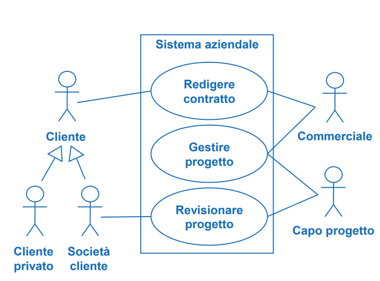
            </div>


2. Modello Dinamico: Basato sull'utilizzo di diagrammi di macchina a stati, attività o sequenza

## Classi ed Oggetti in UML

- **Classi**: Descrivono un tipo di oggetto
    - **Nome**: Nome della classe in maiuscolo e sempre al singolare.
    - **Attributi**: Tipizzati. Questi attributi seguono una specifica **sintassi**, ossia: $$ visibilità \: nome : tipo \: [molteplicità] = valore Iniziale \{ proprietà \}$$
    Un attributo ha una molteplicità, se è $[0 .. 1]$ allora è opzionale, invece se è esattamente $1$ viene omesso.
    
    - **Operazioni**: Metodi tipizzati, segue sistassi $$visibilità \: nome (tipoParametri) : tipoRitorno \:$$
    - **Classi Astratte e Interfacce**: Esistono anche questo tipo di classi e si indicano rispettivamente con le keyword $<<interface>>$ e $\{ abstract \}$.

- **Relazioni**: Permettono di correlare classi tra loro. Esistono le **Relazioni Cicliche** e permettono di stabilire gerarchie (come in BD). Poi abbiamo tipi diversi di relazioni tra classi:
    - **Associazione**: Riferimenti ad altre classi tramite attributi di tipo della classe a cui stiamo puntando.
    - **Molteplicità**: Come in BD, un associazione ha una molteplicità che indica il numero di oggetti coinvolti nell'associazione in un dato istante, da entrambi i versi dell'associazione. Queste associazioni spesso vengono rinominate, soprattutto se sono presenti molteplici associazioni tra stesse classi.
    - **Aggregazione**: Relazione poco forte, non ha un nome.
    - **Composizione**: Relazione molto forte, non ha un nome.
    - **Generalizzazione**: Relazione di sotto/superclasse, dove classi condividono attributi,
- **Dipendenze**: Solitamente una classe X **usa** un metodo di una classe Y.   Non è un se e solo se, non per forza un utilizzo causa una dipendenza, magari il metodo invocato da X aveva come tipo di ritorno un `void`.
- **Oggetti**: Istanze delle classi
- **Enumerazioni**: Non delle classi effettive, permettono la definizione di tipi $enum$.

Dato un concetto questo è una **Classe** o un **Attributo**? Dipende da se mi interessa descriverne ex novo una struttura oppure se volgio solo mantenere una informazione (es. degli Autori dei Libri come Classi oppure come Attributo di Libro)

### Identificazione Classi

Risulta quindi necessario stabilire delle pratiche per identificare le classi, queste infatti:

- Rappresentano l'astrazione di uno specifico elemento del dominio.
- Hanno numero ridotto di responsabilità.
- Alcune best practice: Evitare funzioni che si travestono da classi, ed evitare gerarchie di ereditarietà profonde.

Si seguono **due macro approcci** per l'identificazione di classi:

1. **Approccio Data Driven**: Si identificano i **dati del sistema** e si dividono in classi.
2. **Approccio Responsibility Driven**: Si identificano **responsabilità** e le si dividono in classi.

Un metodo comune di riconoscimento classi è tramite **analisi nome-verbo** dove solitamente:

1. I **sostantivi** sono **classi** oppure **attributi**.
2. I **verbi** sono **operazioni** e quindi responsabilità di una classe.

## Modellazione Processi

- Modellazione di processi dinamici tramite cose come **diagrammi di flusso**, per descrivere il **modello dinamico** di un **dominio**.

- **Attività in UML**: Attività contenuta in un rettangolo con gli angoli smussati, che definiranno i nodi di un grafo diretto:
    - Ciascun **nodo** indica un **azione** (diverso da uno stato di un automa a stati finiti). Ci aspettiamo solo un arco uscente e solo un arco entrante in un nodo.
    - Ciascun **arco** rappresenta il **control flow**, ossia la sequenza del flusso possibile trovandosi nell'azione del nodo.
- **Nodi di Controllo**: 
    Due frecce entranti in un azione (NON UTILIZZATE IN QUESTO CORSO) hanno la semantica di una join, mentre due frecce uscenti in un azione (NON UTILIZZATE IN QUESTO CORSO) hanno la semantica di una selezione di flusso.
    <div style="text-align: center;">
    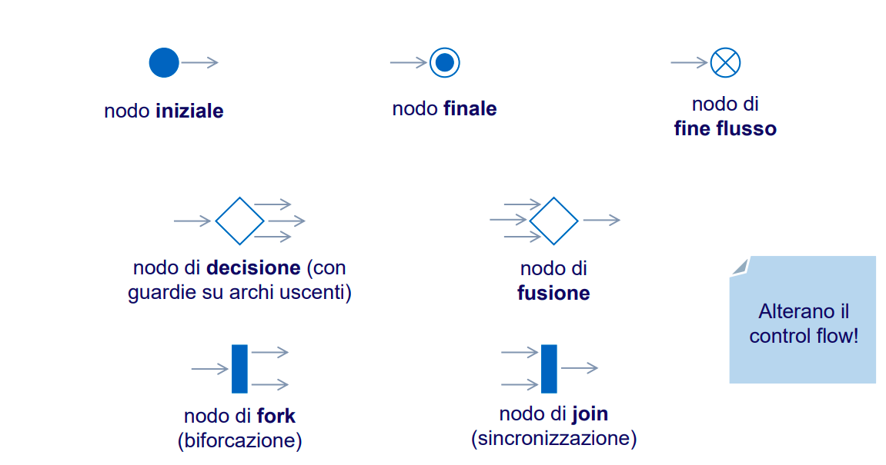
    </div>

    La **join moltiplica i token**, dato un token in ingresso infatti li moltiplica per ogni freccia entrante, mentre la **join li consuma**, lasciandone uscire solo uno. Differente è il comportamento di una merge, che se posizionata dopo una fork lascia che tutti i token seguano lo stesso arco entrante, ma mantenendo la loro molteplicità.
- **Segnali ed Eventi**: Gestione asincrona di attività:
    - **Invio di Segnale**: Asincrono e non blocca l'attività corrente. Permette l'interazione con cose esterne, non parte del sistema.


    - **Accettazione di evento esterno**: Operazione duale alla precedente.


    - **Accettazione di evento temporale**: Permette di definire un attesa arbitraria (assoluta o relativa).
    
    <div style="text-align: center;">
    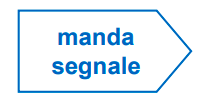
    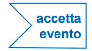
    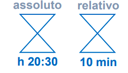
    </div>

- **Sottoattività**: Possono indicare attività che mappano su sequenze di azioni atomiche, quindi descritte da un altra parte.

    <div style="text-align: center;">
    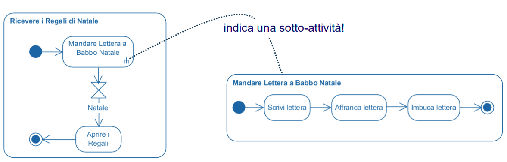
    </div>

- **Partizioni**: Permettono di assegnare la responsabilità delle azioni a delle unità operative.
    <div style="text-align: center;">
    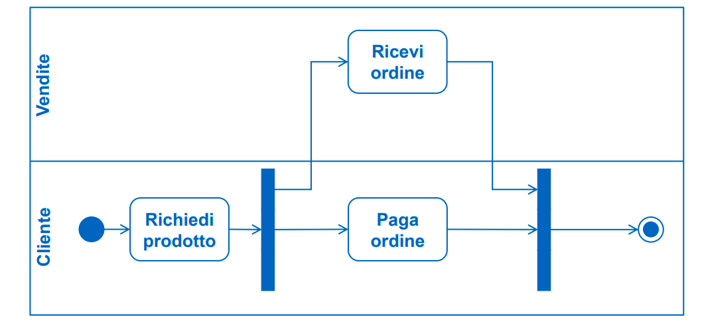
    </div>

## Comportamenti in UML - Diagramma di Macchina a Stati Finiti

- Una **macchina a stati finiti** ci permette di descrivere il **comportamento** delle **istanze** di una **classe**.
- Dunque l'evento non è più il rettangolo dagli angoli smussati, è lo stato indicato da un rettangolo ed un evento triggera lo spostamento da uno stato ad un altro

    <div style="text-align: center;">
    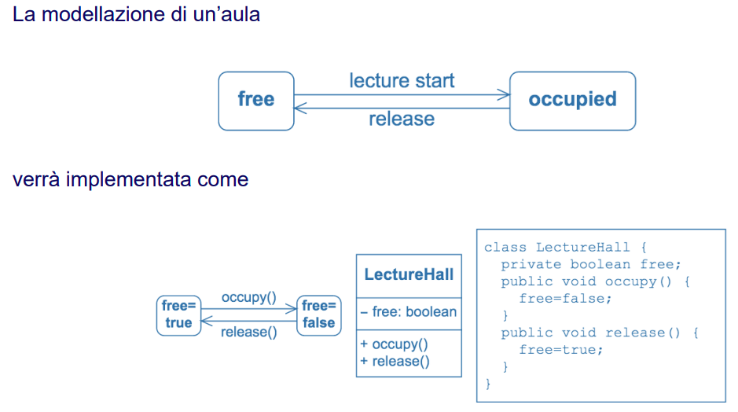
    </div>

### Stati e Transizioni

La sintassi di una transizione è così definita:

<div style="text-align: center;">
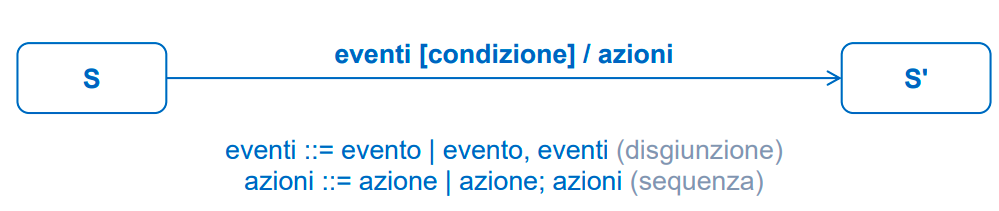
</div>

Quindi in occorrenza di un **evento**, se la **condizione** risulta essere **vera** allora questo comporta l'**esecuzione delle azioni** elencate.

Un esempio potrebbe essere:

<div style="text-align: center;">
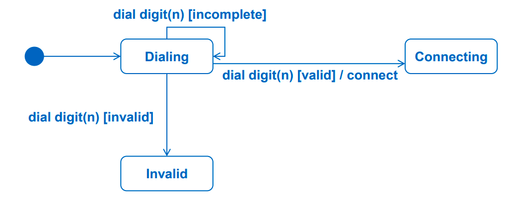
</div>

### Tipologie di Eventi

Esistono tre tipi di eventi: un **operazione** `op(a)`, un **evento di variazione** `when(exp)` oppure un **evento temporale** `after(t)`.

<div style="text-align: center;">
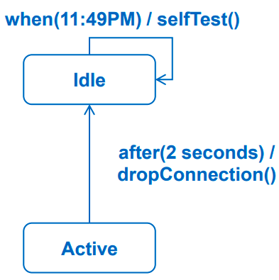
</div>

### Entry, Exit, Do, Transizioni Interne

- **Entry**: Azione eseguita appena entrati in uno stato.
- **Do**: Azione interna eseguita in modo continuato mentre l'oggetto si trova in quello stato.
- **Exit**: Azione eseguita appena usciti da uno stato.
- **Transizioni Interne**: Risposte ad un evento che causano l'esecuzione di un azione senza il cambio di stato esterno.

### Stato Composito

Stato che al suo interno contiene un altro automa. Questo favorisce la visualizzazione dell'automa, rendendolo meno complesso da un punto di vista grafico.

L'ingresso allo stato della macchina avviene se una freccia si posiziona sul suo bordo, proseguendo quindi dallo stato iniziale al suo interno.

L'uscita avviene da una transizione di completamento, quindi dallo stato finale dello stato composito in direzione della transizione di completamento.

<div style="text-align: center;">
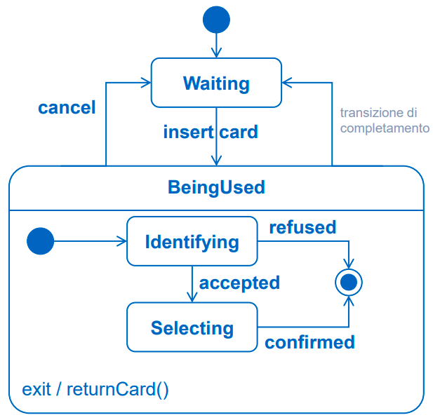
</div>

Questi possono essere sia sequenziali sia paralleli, quindi sottostati attivati per regione dello stato.

- **Sottomacchina**: Per **ragioni di fattorizzazione** potremmo pensare che sia utile poter definire tipi di stati compositi, questo porta all'utilizzo di **sottomacchine**, che ci permette di definire appunto un tipo di sottostati e riutilizzarli quando necessario.

<div style="text-align: center;">
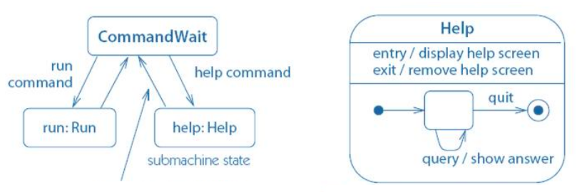
</div>

- **Pseudostati: Scelta, Giunzione, History**
    - **Scelta**: definita pseudostato perchè non sto fermo nello stato, ma è stato di transizione e mi permette di valutare la guardia. Non posso sapere l'esecuzione prima dell'effettiva valutazione della guardia.
    - **Giunzione**: Le condizioni in questo caso sono valutabili staticamente, solitamente posto prima degli eventi che attivano le transizioni di ingresso.

    Quando viene scelto **Giunzione o Scelta**? Giunzione viene valutata la guardia prima di uscire dallo stato di partenza, invece Scelta viene valutata la guardia durante l'occorrenza dell'evento.

    - **History**: ???

### Scelta Descrizione Modello Dinamico

- **Diagramma di Macchina a Stati**: descrive l'evoluzione delle istanze di un classificatore (Focus sull'evoluzione di un oggetto in relazione ad eventi che accadono).
- **Diagramma di Attività**: descrive un flusso di azioni da svolgere. (Focus sulla sequenza e l'ordine delle cose da fare).

Esistono quindi best practices per la buona definizione di Macchine a Stati/Attività.

# Progettazione Software

Progettazione delle componenti di un sistema più complesso

- **Architettura Software**: Struttura del sistema composta dalle parti, dalle relazione e dalle proprietà visibili.

- Come in vari ambiti ingegneristici, vogliamo standardizzare il linguaggio in cui esprimiamo la nostra progettazione. Esistono quindi vari stili che vengono analizzati in viste diverse.

- **Viste del Software**:
    - **Vista Comportamentale**: 
        - Permette di descrivere un **sistema SW** come **composizione** di **componenti SW**, definendo le componenti e le loro interfacce, caratterizzando i connettori.
        - Descrive tramite uno snapshot di un sistema dinamico, quindi uno schema statico di un sistema dinamico.
        - **Componente**: Unità di SW indipendente e riusabile.
            - Ha interfacce ben fissate.
            - Può essere indipendente dagli altri.
            - Il sistema viene composto da componenti che tra loro si collegano comunicando.
            - **Porti delle Interfacce**: Insieme di interfacce omogenee.
            - **Connettori**: Permette la connessioni di componenti, spesso con **prototipi** che spiegano il tipo di connessione. Nella versione semplificata si usa la notazione a lollipop e forchette, ma indicano solo chi invoca e chi viene invocato, ma in ogni caso queste possono essere sia get sia set quindi non si determina la direzione di comunicazione solo dalle notazioni lollipop/forchetta.
    - **Vista Strutturale**:
        - Struttura effettiva del codice, analisi delle dipendenze.
        - Si valuta la portabilità del SW
        - Permette la progettazione dei test.
        - Elementi di questa parte sono detti **moduli**, con relazioni di elementi del tipo **parte di**, **eredita da**, **dipende da**, **può usare**...
        - E' importante definire **visibilità e metodi in questa sezione**
        - Tipi di Relazione:
            - **Relazione d'Uso (dipendenza)**: Classe A usa Classe B. ATTENZIONE, invocazione e dipendenza non sono in se e solo se, se invoco un metodo esterno di cui non devo aspettare l'esito, allora non dipendo da esso.
            - **AllowedToUse (dipendenza asimmetrica)**: Se layerizzo a 3 strati, non permetto al livello 1 ed il 3 di comunicare direttamente, ma dovranno passare per il livello 2.
            - Generalizzazione (Super/Sottoclasse): Relazione canonica di sottoclasse, ma posso farlo anche tra package. Questo risulta utile se voglio definire un interfaccia di package per poi implementarlo in modi differenti.
    - **Vista Logistica o di Deployment**:
        - Come viene allocato il software nell'ambiente di esecuzione.
        - Ambienti di esecuzione vengono rappresentati come dei parallelepipedi
        - Gli **artefatti sono gli eseguibili** che rilasciamo.


- **Stili di Progettazione**: 
    - **Pipe & Filter**: Flusso di elaborazione dei dati, che viaggiano lungo le pipe e sono fitrati da filter.
    - **Client/Server**:
        - **P2P**
    - **Publish/Subscribe**: Basato sulle figure di Broker, Publisher e Subscriber.
        - Publisher: Genera classi di eventi
        - Broker: Smista gli eventi
        - Subscriber: Si abbona alle classi di eventi che ritiene rilevanti.

        Questo può seguire modalità diverse, ossia pull o push.
    - **Model View Controller**: Viste differenti dal modello da view diverse controllate dal controller. La comunicazione viene fatta direttamente dal model alla view.
    - **Model View Presenter**: Simile, ma l'aggiornamento della vista passa dal controller.
    - Process Coordinator: Visto anche come pipeline, un client che invoca tanti servizi magari già preesistenti, li invoca nell'ordine giusto e rielabora fungendo da server per l'utente.