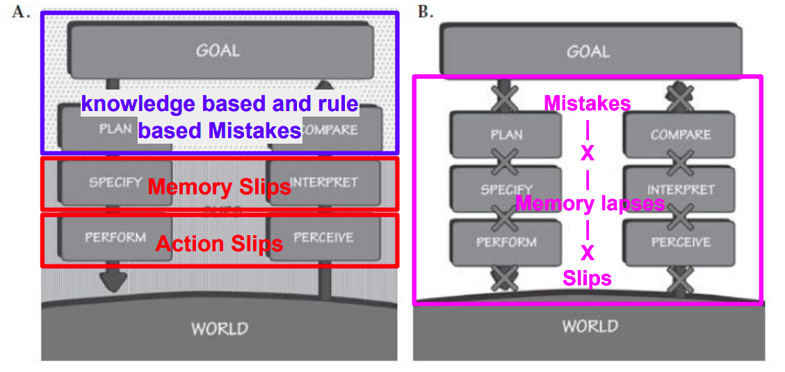

# Lezione 1 - Prodotto e Design dell'Interazione Uomo Macchina - 18/09/2025

- Obiettivo del corso: Fornire gli strumenti necessari a **comprendere** e gestire il **processo di sviluppo delle interfacce** e dei prodotti interattivi.
- L'**interazione** infatti tra **utente e prodotto** va progettata in modo tale da far sentire l'**utente a suo agio**.
- **Design**: Processo di progettazione e pianificazione, ma in italiano allo stesso tempo indica anche l'output stesso di questo processo.
## Pensiero Computazionale vs Design

- **Pensiero Computazionale**: Suddivisione di un **problema** in tanti **sottoproblemi** ed **approccio algoritmico** per la soluzione di ciascuno dei sottoproblemi identificati.
- **Design**: Non si pone l'obiettivo di risolvere il **problema** ma di **comprenderlo** nel suo insieme. Questo vuol dire che se esiste un problema di cui l'utente non è a conoscenza, allora per il design non è presente alcun problema.

Questo non implica che questi due elementi siano in mutua esclusione, anzi devono spesso coesistere.

## Interaction Design

L'obiettivo della **progettazione d'interazione** è quello di rendere macchine e **sistemi il più usabili dagli utenti**. Bisogna che al **centro** dello sviluppo siano messi i **bisogni degli utenti**. Nel nostro caso parleremo quindi di **Human Machine Interaction** (HMI) nello specifico.

Quindi l'Interaction Design si compone di **tre discipline**:

- **Product Design**: Progettazione di beni e servizi il cui obiettivo è quello di essere utilizzati da più utenti possibili.
- **User Experience Design**
- **User Interface Design**

# Lezione 2 - UX/UI e Human Centered Design - 19/09/2025

## UX - User Experience Design

- Lo scopo dell'UX Design è quello di **soddisfare il cliente**
e di renderlo più fedele al prodotto migliorandone l'**usabilità**. Questi aspetti possono ad esempio essere analizzati con una heatmap che mantiene traccia della navigabilità dell'app da parte dell'utente.
- E' anche ruolo del marketing quella di integrare tutti gli **aspetti di business, marketing e sviluppo del prodotto**.
- **Non puoi progettare** l'UX, ma puoi **progettare per** l'UX: Questo vuol dire che se un tecnico ha definito un interfaccia, **non potrà** mai prevedere il **comportamento di un utente**. Puoi invece progettare per l'UX, cercando di **immedesimarsi in un User**.
- **L'output "atteso"** alla fine di questa fase **non è un interfaccia**, ma una lista di **requisiti delle necessità degli utenti**.
- L'**obiettivo ideale** di questa fase è quella di **mettere a suo agio l'utente** nel momento in cui dovrà utilizzare il prodotto.

### UI - User Interaction Design

- L'UI Design è parte della UX Design, dopo un prodotto della UX viene fatta la UI Design.
- Quindi questa fase è la **creazione** di un **interfaccia**, **dopo** aver eseguito un **analisi della UX**.

## Human Centered Design

- La **capacità umana** di **adattamento allo sviluppo tecnico è bassa**, lo sviluppo tecnico è molto rapido.
- Il fondamento quindi è sviluppare software che sia amabile, in modo tale da stabilire un interazione tra l'uomo e la macchina. Da immaginare come una relazione tra uomo ed un altra specie, in **completa opposizione** all'**approccio tecno-centrico**, dato che rallenta la diffusione di un software.
- **Design antropocentrico**: si inverte il paradigma di progettazione mettendo l'utente al centro del processo. Questo approccio è normato dalla ISO. Non bisogna progettare per delle persone ideali che si comportano come vorremmo, ma progettare per come realmente sono.
- Molto spesso **l'utente non sa nemmeno cosa vuole** (simile al discorso della raccolta requisiti), di conseguenza risulta **necessario osservare l'utente** e non solo chiedere cosa vuole.
- L'obiettivo è creare empatia tra il SW e l'utente.
- Il **costo di transizione** è il costo principale per un utente per il cambiamento di prodotto (es. Edge vs Chrome a lezione delle tab. verticali).
- E' necessario pensare in maniera creativa ed iterativa seguendo le **fasi** di:
    1. **Proposta**
    2. **Test**
    3. **Analisi**
- **Flusso del processo** di **HCD (Human Centered Design)**:
    - Specificare il contesto d'uso
    - Specificare i requirements
    - Progettare la soluzione
    - Testare e valutare
- Le **metriche di utilizzo** sono pilastro dello **sviluppo HCD**, perchè ci permettono di **orientarci** studiando l'esperienza utente.

# Lezione 3 - Principi d'Interazione - 25/09/2025

## Progettazione dell'Interazione

1. **Discoverability**: Capacità di un sistema di comunicare i propri possibili usi all'utente. Il prodotto si autointroduce?
Questa proprietà dipende dall'utente a cui stiamo dando il prodotto.
Questo principio (**discoverability**) si basa su altri 6 principi psicologici:
    - **Affordances**: Un oggetto ha delle **proprietà** e un utente ha delle **capacità**. Il **rapporto** proprietà/capacità è detto affordance, quindi questa **NON è una proprietà dell'oggetto** ma un rapporto oggetto/utente. Ne è un esempio la vite del tappo della candeggina, che consente l'apertura ad un adulto ma non ad un bambino, chiaro esempio di **affordances**. Esiste anche un anti-affordance, ossia prevenzione d'interazione tra oggetto e utente. Le affordances non sono da subito chiare ma utilizzando il prodotto.
    - **Signifiers**: Elemento del design detto **significante** perchè da appunto **semantica** ad una **affordance**. Quindi le affordance non possono essere posizionate nel prodotto, solo i **signifiers possono essere posizionati**, e diranno **dove**, **cosa** e **perchè**. Questi però vanno usati con parsimonia, seguendo il paradigma Less is More. 
        - **Signifiers Intenzionale**: Segnali come "spingi" sulle porte.
        - **Signifiers Accidentale**: Azione compiuta da tanti potrebbe diventare involontariamente un signifier.
    - **Constraints**: Vincoli (vedi lez. successiva).
    - **Mapping**: Solitamente il **map** tra **affordances** e **signifiers** viene fatto per **convenzione**, però **dipende** fortemente **dal background dell'utente**. Questo mapping quindi può risultare ambiguo per utenti e non ambiguo per altri (esempio dell'indicatore del galleggiante di mezzi europei oppure giapponesi).
    - **Feedback**: L'utente si aspetta sempre un risultato da un azione che ha effettuato. L'utente associa la reazione dell'interlocutore come associata all'azione appena compiuta se il feedback arriva entro al massimo di $100 ms$. Lo stesso avviene con i SW, motivo per cui si preme più volte sui bottoni proposti, dato che l'utente ha il dubbio di non aver fatto nulla. 
    Il feedback deve essere informativo, solitamente viene anche fatto **prima** di una potenziale chiamata ad un API. Un feedback può essere anche **poor**, come ad esempio una lavastoviglie che ci informa di aver finito il suo ciclo alle tre di notte. I **poor feedback** sono **peggio di feedback mancati**, **perchè rendono inutili anche i feedback progettati bene**.

2. **Understanding**: Capacità di un sistema di comunicare il proprio corretto utilizzo.

# Lezione 4 - Conceptual Models - 26/09/2025

Un modello concettuale è una maniera semplice e schematica per spiegare come funziona qualcosa.

La **gestione logica dei file** in **file systems** non esisteva prima, ma qualcuno ha creato un **modello concettuale** basandosi sul **esempio reale di libreria**.

La **semplificazione** di un sistema mette in discussione le sue funzionalità. Ne è un esempio i file disponibili o meno in cloud, perchè la semplificazione sull'accesso ai file era si una bella astrazione ma la tecnologia del tempo di DropBox non era al passo con l'astrazione del modello concettuale stesso.

## Mental Model vs Conceptual Model

Un **Mental Model** è l'**interpretazione dell'utente** del **Conceptual Model** a cui si sta interfacciando. L'**obiettivo** del designer è quello di permettere il **fitting** tra **Mental Model** (dell'utente) e **Conceptual Model** (del designer).

Questo si applica molto bene alle lettere sui tastierini numerici dei vecchi telefoni. Quello è un conceptual model basato sul fatto che negli USA era possibile comprare e chiamare stringhe alfanumeriche. Il nostro Mental Model però non fitta perchè nella nostra cultura questo non era mai stato utilizzato.

## System Image

Sono istruzioni e guide per l'utente per interfacciarsi al Modello Concettuale.

Quindi:

1. Designer **progetta** un Design/**Conceptual Model**
2. Il designer deve comunicare qualcosa per rendere più probabile che **il Mental Model del utente fitti** il **Conceptual Model**, questa comunicazione avviene proprio tramite la **System Image**. Va "raccontato" all'utente il funzionamento di un prodotto e di come ci siamo immaginati che si utilizzi quel prodotto.

## Changing Conventions

All'utente solitamente risulta pesante ogni cambiamento effettuato al prodotto. Se le convenzioni vengono violate allora è necessario nuovo apprendimento da parte dell'utente. Di conseguenza nella progettazione risulta necessario mantenere consistenza, in modo tale da rendere il meno possibile frustrante la nuova esperienza d'apprendimento.

## Constraints

Noi capiamo come agire spesso in risposta a vincoli. Sviluppo quindi un modello concettuale in base a questi vincoli, che sono di 4 tipi:

1. Fisico
2. Culturale
3. Semantico: I cartelli semafori sono il più semplice esempio di vincolo semantico. Viene assegnato arbitrariamente un significato a dei segni.
4. Logico: Si evince un vincolo logico "intuendo".

**Esempio del Lego**: il fitting tra Conceptual Model e nostro Mental Model è completamente composto dai vincoli, che ci permettono di montare il lego senza istruzioni.

### Forcing Functions

1. **Interlock**: A volte i vincoli diventano **forcing functions**, ossia viene forzato il funzionamento completamente da un vincolo, ad esempio un tappo di un frullatore, se non inserito il prodotto non si avvia. Ma anche un 2fa è un **interlock** perchè senza 2fa non vogliamo che un utente possa utilizzare la nostra app. Quindi un **interlock** forza **operazioni** ad essere **eseguite** in una **sequenza prestabilita**.
2. **Lock-in**: Il lock-in mantiene un operazione attiva, **evitando** che **l'utente possa terminarla prematuramente**. Un classico esempio è il pop up che si apre in chiusura di un editor di file, previene la chiusura involontaria.
3. **Lock-out**: Il lock-out previene che un operazione in ingresso venga effettuata involontariamente, è necessario che l'utente riconfermi la propria operazione. Un classico esempio è il pop up che chiede di essere maggiorenni per poter accedere.

# Lezione 5 - Golfi di Esecuzione e Valutazione - 02/10/2025

## User Goals and Interaction

Il principio di **interazione** si basa su elementi di **sfida** in modo tale da capire come **fornire input** per ottenere uno **specifico output**.

## Definizioni di Golfo di Esecuzione/Valutazione

- **Golfo di Esecuzione**: Come mi posso interfacciare per fornire i miei input.
    - **Definizione**: sforzo mentale per tradurre obiettivi in azioni fisiche.
    - Ponte tra Intento e Azione.
    - Strettamente legato alle Affordances
    - Correlato all'esecuzione fisica dell'azione.

    L'idea sarebbe quella di compensare questo golfo utilizzando dei ponti. L'utente interagirà con il sistema, definendo il golfo, attraverso:
    - Le intenzioni, il goal dell'utente
    - Le azioni che eseguirà
    - Interfacciarsi con l'input da fornire al sistema

- **Golfo di Valutazione**: Capire cosa sia successo, nel momento in cui entro a contatto con l'output prodotto.
    - **Definizione**: Comprendere lo stato del sistema, capire se i cambiamenti percepiti hanno mosso il sistema verso il goal.
    - L'user richiederà quindi un feedback continuo riguardo i risultati e lo stato corrente del sistema.
    - **Obiettivo**: Gli utenti devono aver capito come funziona il sistema.

    Il golfo di Valutazione quindi è all'inizio valutato come semplice da compensare ed attraversare con un ponte, ma in realtà va definito tramite tre elementi:
    - Interfaccia (display) del sistema
    - Interpretazione
    - Valutazione

## 7 Stati dell'Azione

- La possibilità di saper utilizzare un prodotto non dipende esclusivamente dall'utente ma anche dal modo in cui il prodotto si pone. Molto spesso se non so come interfacciarmi con un sistema è anche causato dal sistema stesso.

- Descrizione degli Stati:
    - **Golfo d'Esecuzione**:

        1. **Specificare** il Goal
        2. **Pianificare** il Goal
        3. **Specificare** il Goal
        4. **Eseguire**
    - **Golfo di Valutazione**:

        5. **Percepire** l'Esito
        6. **Interpretare** l'Esito
        7. **Comparare** l'Esito 

- Spesso queste **fasi** sono **iterate** oppure basate su **feedback loop**, ossia che si interrompono su una specifica fase per testarla.

### Domande e Checklist per le 7 Fasi dell'Azione

- Domande per quella fase (per definire il ponte):
    - **Golfo d'Esecuzione - Feed Forward**:

        1. Cosa voglio ottenere?
        2. Quali sono le alternative?
        3. Cosa posso fare e come lo faccio?
        4. Esecuzione.
    - **Golfo di Valutazione - Feed Back**:

        5. Cosa è successo?
        6. Cosa vuol dire?
        7. E' quello che volevo fare?

### Funzionamento Feed Forward e Feed Back

- **Feed Forward**: si basa sull'utilizzo appropriato di signifiers, vincoli e ???
- **Feed Back**: ???

### I 7 Principi Fondamentali del Design - Ulteriore Presentazione

- Discoverability: Determinare il corrente stato del sistema.
- Feedback: Avere un esito da un azione eseguita per definire lo stato del sistema.
- Modello Concettuale: Proiezione del sistema che porta ad una convinzione ed un buon feeling sulla comprensione del sistema.
- Affordances: Rende possibili le azioni che l'user vuole eseguire.
- Signifiers: Migliora la discoverability per rendere migliore la comunicazione tra sistema ed utente.
- Mappings: Link tra funzionalità e layout presentato all'utente.
- ?:?

### Opportunistic vs Planned Actions

- **Azioni Opportunistiche**: Non tutto è risolvibile con un algoritmo, il comportamento trae vantaggio dalle circostanze attuali, invece che pianificare ed analizzare il range di azioni, e appena è presentata l'opportunità viene eseguita un azione. Si basa sul pensiero del subconscio.

- **Azioni Pianificate**: Richiedono più effort e pianificano algoritmicamente tutto il comportamento. Si basa sul pensiero conscio. L'**overlearning**, dopo anni d'esperienza, rende azioni pianificate ad azioni opportunistiche.

Vengono effettuati quindi processi di pattern matching del pensiero del subconscio, invece il pensiero conscio è più algoritmico.

## Livelli di Brain Processing

- **Livello Viscerale**: Ci permette di rispondere velocemente, senza controllo o awareness dell'azione che stiamo compiendo. Le risposte viscerali sono rapide ed automatiche e si basano sui concetti di buono, cattivo, pericoloso...
Da un **punto di vista di design**, molta risposta alla presentazione di un prodotto è viscerale, bravi designer utilizzano questi design estetici che tranquillizzino gli utenti in maniera primordiale. E' il livello più a contatto con il mondo.
- **Livello Comportamentale**: Si basa sulle skill acquisite e triggerate da situazioni che matchano il pattern. Le azioni di questo livello sono largamente appartenenti al subconscio, anche essendo consapevoli della situazione, non siamo coscienti del processo nello specifico. Il feedback è parte critica di questa fase sulla gestione delle aspettative, il tutto si basa su un feedback loop in relazione alle aspettative. Esiste un processo di nudging, guidando l'utente alla formazione di un modello mentale aderente al modello concettuale del sistema.
- **Livello Riflessivo**: Livello di analisi, conscio decision-making, ragionamento profondo. Solitamente la fase riflessiva è lenta, profonda e cognitiva. I livelli di emozioni più alti vengono dal livello riflessivo, qui assegno e peso tutti i feedback ottenuti essendo che sto anche pagando di più da un punto di vista di risorse mentali. Da un **punto di vista di design**, sappiamo che le scelte effettuate in questo livello sono quelle più durature, formano la memoria dell'utente sugli eventi accaduti. L'appeal di questo livello causa ad esempio una review positiva/negativa. ?MAPPING PRESENTE NELLE SLIDE (INSERISCI L'IMMAGINE)?

# Lezione 6

# Lezione 7 - - 16/10/2025

# Lezione 8 - Human Errors and Mitigation Strategies - 17/10/2025

## Errori e Causa

- La maggior parte degli errori è causata dall'uomo
- L'errore comune del designer è quello di considerare che l'utente interagirà continuamente al massimo dell'attenzione con l'applicazione in questione
- Quindi **interruzioni** e **comportamenti ripetitivi** spengono l'attenzione dell'utente. Può accadere quindi che una fase potenzialmente importante, che richiederebbe davvero l'attenzione dell'utente, viene approcciata con poca attenzione, ormai persa.
- E' una **bad practice** quella di **dare la colpa all'utente** per un cattivo utilizzo del prodotto. Questo non porterebbe nulla di vantaggioso al design del prodotto stesso, a massimo si cerca la colpa lato progettazione.

### Route Cause Analysis

Gli incidenti avvengono a causa di insiemi di sorgenti. Quindi vanno seguiti dei principi, come ad esempio limitando il dominio dell'utente, per limitare i potenziali casi di errore. Si acquisiscono quindi ad esempio le analitics degli utenti e poi si segue lo schema **The Five Whys**, ossia non basta chiedersi solo una volta perchè è stato commesso un errore ma tante volte (ad esempio 5 volte).

### 5 Motivazioni per cui Chiedersi 5 Perchè

- Identificare la causa e non curare solo i sintomi.
- Rendere oggettivo il mondo, per rendere evidente tramite dati delle scelte
- Migliorare problemi sul prodotto per il bene generato.
- Ricercare miglioramente e accettare il cambiamento.
- Embrace della cultura del progresso.

## Classificazione di Errori

Suddivisi in due macroclassi: **slips** e **mistakes**:

- **Slips - (Tradotti come Lapsus)**:
    - **Action Based**: Azioni svolte in "autopilot", lapsus di azione, pianifico e specifico bene l'azione ma la eseguo in maniera sbagliata. 
    
        Esempio: "Devo uscire di casa con la moto, prendo le chiavi, ho preso le chiavi della macchina."
    - **Memory Lapse**: Non eseguo l'azione. 
    
        Esempio: "Devo uscire di casa con la moto, non prendo le chiavi"
- **Mistakes - (Tradotti come Errori Cognitivi)**:
    - **Knowledge Based**: L'user non ha capito il funzionamento, di conseguenza ha un modello mentale disallineato dal modello concettuale progettato.
    - **Rule Based**
    - **Memory Lapse**: Dimenticanza, come se fosse un lapsus di memoria nello stato di transizione tra i golfi, che causa un interruzione nelle fasi di pianificazione.

## Feedback e Utenti Esperti

Abbiamo già detto come il feedback sia utile ad un utente, ma diventa inutile per gli utenti esperti, ad esempio il feedback speech può risultare pesante ed inutile in determinati contesti.

## Error Prevention

- Capire le cause degli errori per minimizzarle.
- Fare sensibility check, solitamente magari non viene mai fatta un azione e quindi viene effettuato un secondo check prima di effettuare l'operazione. Esempio: "Solitamente la media del bonifico è 2000$, ne viene effettuato uno da $20000 allora si chiede una conferma esplicita."
- Possibilità dell'azione di undo.
- Rendere semplice per l'utente capire quale sia l'errore.
- Non bisogna trattare azioni distanti da quelle attese come errori.

### Constraint to Block Errors

Vedi Slide

### Conferme e Messaggi d'Errore

Vedi Slide

### Minimizzazione Slips

Difficile pensare di diminuire gli slips degli utenti, quindi gli slips devono essere fatti ma senza danni. Non devono essere eliminati gli errori, ma **bisogna fare in modo** che quegli **errori non causino incidenti**

### Key Principles

- Bisogna mettere l'utente nella posizione di sapere tutto il necessario per operare con la nostra teconologia.
- Vedi slide
- Bisogna progettare per colmare la distanza tra due golfi

# Lezione 9 - Information Architecture - 23/10/2025

## GUI Design in Generale

- Il design di interfacce grafiche si basa sull'anticipare cosa l'utente vuole fare, garantendo che quest'ultimo abbia gli strumenti di cui ha bisogno. La progettazione di queste intefacce si basa su concetti di **interaction design**, **visual design** e **information architecture**.

- Questo design quindi si basa su una rappresentazione a strati, ossia:
    1. **Data and Content**: Information Architecture
    2. **Functionality, Inputs and Outputs**: ...
    3. **Presentation Layer**: ...

- Focus di questa lezione è il **layer di Data and Content**, che ha anche maggiore priorità rispetto agli altri layer dato che definirà dei constraint per i livelli successivi.

## Users Behavior Patters

- Pattern più a basso livello di come un utente si interfaccerà con il prodotto, nello specifico con la UI.

- L'analisi di questi pattern ci permette di applicare uno studio a prescindere dal contesto di progettazione.

1. **Self Exploration**: Esplorazione senza che l'utente possa perdersi o fare azioni pericolose.
    - Spesso l'utente skippa l'onboarding o non legge il manuale.
    - I primi momenti saranno dedicati all'esplorazione dell'utente, e l'interfaccia deve essere progettata in questa direzione.
    - Quindi creare possibilità di esplorazione, ad esempio tramite menù, che indichi il modo per interagire con l'applicazione.
2. **Instant Gratification**: L'utente vuole essere gratificato al momento dell'esecuzione dell'azione.
    - Le prime azioni dovrebbero essere assolutamente semplici per gratificare e direzionare l'utente ad un buon rapporto con l'interfaccia.
    - Successivamente può diventare difficili, ma l'ingresso confident dell'utente può spingerlo a continuare.
    - Da evitare lunghe istruzioni, tempi di caricamenti lunghi o pubblicità vanno contro questo pattern.
3. **Satisficing**: Buono abbastanza, meglio qualcosa che funziona adesso che qualcosa che funzionerà meglio dopo.
    - Satisficing: Satisftying + Sufficing.
    - Bene abbastanza è meglio di ottimo in relazione all'investimento di tempo e impegno.
    - Scelta delle etichette che non generi confusione tra i significati nell'interfaccia.
    - Cambiare qualcosa dell'interfaccia, anche se dovesse velocizzare i processi dell'utente, questo probabilmente troverà comodo non cambiare e restare nella routine di cui è abituato, diventa quasi una sorta di debito nei confronti del design, dato che durante la progettazione bisogna trovare un compromesso con questo effetto.
4. **Changes in Midstream**: L'interfaccia non deve chiudere l'utente in un ambiente con poche scelte. La navigazione dovrebbe essere globale, per permettere all'utente di spostarsi senza perdere lo stato corrente.
5. **Deferred Choices**: Rispondere al minimo richiesto, l'utente non risponde a domande non necessarie, quindi bisogna permettere di rispondere dopo.
    - Bisognerebbe fornire valori dei campi di default.
6. **Incremental Construction**: Bisogna dare all'utente la possibilità di affinare dopo l'azione che sta eseguendo.
    - Soprattutto in applicazioni creative, bisognerebbe tenere gli utenti in uno stato di flow, quindi aumentando la skill dell'utente dovrebbe aumentare anche la difficoltà dell'interfaccia.
7. **Habituation**: Le gesture spesso sono molto legate ad una familiarità di azioni eseguite altrove.
    - Capire cosa le persone sanno, per fare in modo di poter supportare quei comportamenti.
8. **Microbreaks**: Le interfacce devono supportare questo comportamento per cui gli utenti tendono a fare delle pause tra i task.
9. **Spatial Memory**: Spesso gli utenti legano una funzionalità rispetto alla posizione della sua etichetta.
10. **Prospective Memory**: Lo stesso concetto di lasciare non letta una mail, voglio fare in modo che si supporti l'utente con piccoli reminder.
11. **Streamlined Repetition**: Comportamenti ripetitivi vanno resi rapidi, permettere ad esempio la selezione multipla nello spostamento di file.
12. **Keyboard Only**: Sono date per scontate le shortcut, come `ctrl-s`, `ctrl-z`, ...
13. **Other People's Advice**: Spesso le persone sono influenzate da scelte di altri. Spesso quindi online community sono grandi asset per un servizio.

### Systematic Ways to Support Patterns

**vedi dettagli slide**

- Organizing content
- Structuring navigation
- vedi slide
- vedi slide

## Information Architecture

L'**obiettivo** di questa architettura è quello di aiutare **gli utenti a trovare le informazioni** che cercano.

Si basa tanto sul contenuto, dal contesto e dagli utenti a cui punta.

### Organization Schemes

Come viene categorizzato il contenuto della nostra interfaccia? Questo può essere definito da **schemi esatti o soggettivi**, che **non sono tra loro mutuamente esclusivi**.

1. **Exact Organization Schemes**: Dividere informazioni in sezioni mutualmente esclusive. Di carattere molto **data-driven**:
    - Lo schema alfabetico è un esempio classico di questo tipo di schema.
    - Lo schema temporale (in base alla data)
    - Lo schema geografico 

2. **Subjective Organization Schemes**: Non sono oggettivi ma dipendono dagli utenti. Difficili da modellare perchè devono essere aderenti al modello mentale dell'utente. Degli esempi potrebbero essere:
    - **Topic Schema**: Ad esempio le sezioni di Netflix in apertura.
    - Task Schema: Schema che cercano di guidare l'utente nei task che deve effettuare.
    - **Audience Schema**: Clusterizzare in base al segmento utente (bambini, adulti...)
    - **Metaphor Schema**: Usare metafore per clusterizzare funzionalità (come il cestino come astrazione sopra fs di un sistema).

Queste tipologie possono essere combinate tra loro generando **schemi misti**

### Organizational Schemes

Vanno definite delle relazioni tra pezzi di content. Esistono quattro main strutture organizzative:
- **Modello Gerarchico**: Da categorie generali di informazioni scendendo giù verso informazioni precise (a simil albero). I menù a tendina sono i classici esempi di strutture gerarchiche.
- **Modello Sequenziale**: Informazioni definite step-by-step, un classico esempio è il checkout di Amazon.
- **Modello Matriciale**: Ogni utente può definire il proprio path di navigazione, un esempio classico è la navigazione di HTML.
- **Modello a Database**: Permette la ricerca dell'informazione, classico esempio Google.

Bisogna considerare che anche allo **scalare delle informazioni**, lo schema scelto deve risultare **sostenibile**, permettendo e facilitando la crescita del sistema.

Si **evitano** strutture che siano **troppo verticali o troppo orizzontali**.

Un interfaccia deve essere **findable**, al sapere di che informazione sto cercando devo essere in grado di trovare quell'informazione nell'interfaccia, garantendo quindi una **buona navigazione**. Una struttura gerarchica quindi potrebbe non risultare molto efficace se non conosco a priori il path per raggiungerlo. Quindi una **search bar** in questo caso migliorerebbe la **discoverability**. Quindi vanno considerate contemporaneamente sia discoverability sia findability.

### Interfaces Components

Si utilizzano elementi standard che siano familiari con gli utenti:

- **Input Controls**: vedi slide
- **Navigational Components**: slider, paginazione, tags, icone
- **Informational Components**: modali, messages boxes, icone
- **Containers**: vedi slide

# Lezione 10 - Innovation Methods - 24/10/2025

## Sustaining vs Disruptive Innovation

Esistono due tipi di innovazione, ossia la **costruttiva** e la **distruttiva**:

- **Sustaining Innovation**: Basata sull'innovazione incrementale, vengono quindi effettuate microinnovazioni su sistemi già esistenti.
    - Mercato di riferimento rimane lo stesso, mercato prevedibile-
    - I big player non hanno motivo di distruggere il mercato innovando in maniera eccezionale.
    - Mercato già esistente che resta lo stesso nel tempo.
- **Disruptive Innovation**: Basata sull'innovazione estrema, che spazza via tutto il mercato costruito fino a quel momento. Un esempio potrebbe essere Spotify che entra sul mercato rinnovandolo del tutto.
    - Creazione di un nuovo mercato.
    - L'innovazione è pesante
    - La disruptive è pesantemente Human Centered, spesso l'innovazione estrema cerca di mettere come focus la persona e i vantaggi che porta a quest'ultimo.

Non per forza tutte le innovazioni sono distruttive, anche se rivoluzionarie. Esempio: Non è stato il motore a scoppio (lato tecnico) ad avviare l'utilizzo massiccio di macchine, ma dello studio di come poteva essere posizionato nel mercato (lato economico).

## Product Manager vs Project Manager

Il **product manager** analizza il mercato, analizza il mercato con le user stories e produce un backlog da consegnare ad un **project manager**.

Quindi esiste una profonda differenza tra Product Management e Project Management.

## Human Centered Design Process

L'HCI è una forma mentis, l'HCDP è un processo che permetta di generare qualcosa che sia HCI. Quindi si definisce un metodo a step, detto metodo a **doppio diamante**, definita a divergenza e convergenza:

### Modello a Doppio Diamante

- **Fase Inspiration**: User Stories.
- **Fase Ideation**: Scenarios.
- **Fase Implementation**: Implementazione.

Le fasi in parallelo invece sono quelle divergenti e convergenti:

- **Fase Divergente**: Si lascia libertà alle persone del team di essere creativi.
- **Fase Convergente**: Si definisce una conversazione, in modo tale da sintetizzare un compromesso ragionato tra le parti.

Quindi si definisce uno spazio di problema ed uno della soluzione.

### Design Thinking

- **Processo iterativo** basato su delle **fasi aggiuntive** rispetto al **doppio diamante**, **focussando di più sul prototipo ed il testing**, fornendo delle fasi specifiche per l'iterazione su prototipazione e testing.

- Il design thinking fornisce un approccio basato sulla risoluzione dei problemi delle persone.

- Definito da 5 fasi:
    - **Empathise**: Si studiano gli utenti
    - **Define**: Si definiscono bene le domande, le personas...
    - **Ideate**: Si propongono delle prime soluzioni
    - **Prototype**: Si definisce un prototipo
    - **Testing**: Si testa un prototipo

## Human Centered Design vs Thinking Design

Tutte queste tecniche sono ben definite per stabilire soluzioni che siano capaci di generare soldi. Quindi l'HCI centra i bisogni delle persone che sono quindi disposte a pagare.

Quindi se vogliamo sono due processi (HCD Process e Design Thinking) cercano di implementare l'idea del HCD. I due processi non sono tra loro antitetiche, possono entrambe essere applicate.

## Agile & Scrum

- **Progetto a Cascata (Waterfall)**: Definizione dei requisiti e di tutte le fasi successive in maniera sequenziale.
- **Agile**: Nel software non lo si utilizza, dato che le componenti possono essere definite anche nel mentre, quindi si definisce l'approccio **Agile**. Viene dall'abilità di creare e rispondere in base al cambiamento.
    - L'Agile non è un metodo ma una **forma mentis**, definito da un **manifesto**:
        - Gli individui e le interazioni battono i processi ed i mezzi.
        - Software funzionante è meglio di documentazione estesa.
        - Collaborazione dei clienti è meglio della negoziazione dei contratti.
        - Rispondere al cambiamento è meglio di seguire piani.
    - Testing e costo dei fallimenti: Più si va avanti nelle fasi di sviluppo e più costa cambiare qualcosa e fallire.
    - Non si mette in discussione la data di rilascio, quindi è un approccio **time constrained**, si preferisce ridurre le feature al mettere in discussione la data d'uscita.

- **Scrum**: Lo scrum è um processo che cerca di implementare la forma mentis agile, definita da specifiche fasi, attori ed altri elementi.
    - **Sprint**: Set temporali, unità base dello sviluppo in Scrum, solitamente durano $k$  settimane, ed ognuna di queste fasi include le sottofasi di $\{ Plan, Design, Build, Test, Review, Launch \} $.
    - **Task**: La grande differenza è che ogni dipendente quindi è responsabile di tutte le sottofasi dello sprint elencate prima.
    - **Standup**: Si interazione tra Scrum Master e i membri del team che si confronta per capire cosa farà nella giornata e quale sottofase.
    - **Backlog**: Definisce le feature da implementare.
