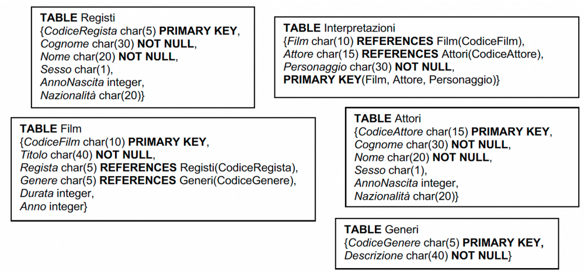

# Esercizi SQL 1 Moodle Corso B

## Traccia

<div style="text-align: center;">

</div>

## Esercizio 1

Per ogni genere il numero di film prodotti.

```SQL
SELECT g.Descrizione, COUNT(*)
FROM Film f JOIN Generi g ON f.Genere = g.CodiceGenere
GROUP BY g.Descrizione
```

## Esercizio 2

Per ogni genere il numero di film prodotti dopo il 2000 con durata media per genere superiore alle 2 ore escludendo quelli che ne hanno zero.

### Soluzione in Blind

Si assume che la durata sia in ore.

```SQL
SELECT g.Descrizione, COUNT(*)
FROM Film f JOIN Generi g ON f.Generi = g.CodiceGenere
WHERE f.Anno > 2000 AND AVG(f.Durata) > 2
GROUP BY g.Descrizione
```

### Soluzione Corretta

Le condizioni sulle funzioni di raggruppamento vanno fatte nella clausola `HAVING` e non nel `WHERE`.

```SQL
SELECT g.Descrizione, COUNT(*)
FROM Film f JOIN Generi g ON f.Generi = g.CodiceGenere
WHERE f.Anno > 2000
GROUP BY g.Descrizione
HAVING AVG(f.Durata) > 2
```

## Esercizio 3

Elencare gli attori uomini che hanno interpretato film comici.

### Soluzione in Blind

```SQL
SELECT a.Nome, a.Cognome
FROM Attori a 
    JOIN Interpretazioni i ON a.CodiceAttore = i.Attore
    JOIN Film f ON i.Film = f.CodiceFilm
    JOIN Generi g ON f.Genere = g.CodiceGenere
WHERE g.Descrizione = 'Comico'
```

### Soluzione Corretta

Se voglio avere la garanzia che un attore appaia solo una volta, allora devo utilizzare `DISTINCT` sul `SELECT`.

```SQL
SELECT DISTINCT a.Nome, a.Cognome
FROM Attori a 
    JOIN Interpretazioni i ON a.CodiceAttore = i.Attore
    JOIN Film f ON i.Film = f.CodiceFilm
    JOIN Generi g ON f.Genere = g.CodiceGenere
WHERE g.Descrizione = 'Comico'
```

## Esercizio 4

Elencare gli attori che hanno recitato un film thriller in coppia con un altro attore australiano.

### Soluzione in Blind (corretta successivamente)

```SQL
SELECT DISTINCT a.Nome, a.Cognome
FROM Attori a1
    JOIN Interpretazioni i1 ON a1.CodiceAttore = i1.Attore
    JOIN Interpretazioni i2 ON i1.Film = i2.Film
    JOIN Attori a2 ON i2.Attore = a2.CodiceAttore
    JOIN Film f ON i1.Film = f.CodiceFilm
    JOIN Generi g ON f.Genere = g.CodiceGenere
WHERE g.Descrizione = 'Thriller'
    AND a2.Nazionalità = 'Australiano'
    AND i1.CodiceAttore <> i2.CodiceAttore
```

## Esercizio 5

Elencare i film degli anni ‘80 interpretati e diretti da un francese.

### Soluzione in Blind

```SQL
SELECT DISTINCT f.Titolo
FROM Film f
    JOIN Interpretazioni i ON f.CodiceFilm = i.Film
    JOIN Registi r ON f.Regista = r.CodiceRegista
    JOIN Attori a ON i.Attore = a.CodiceAttore
WHERE f.Anno >= 1980 
    AND f.Anno <= 1989
    AND r.Nazionalità = 'Francese'
    AND a.Nazionalità = 'Francese'
```

## Esercizio 6

Elencare gli attori che hanno recitato in film muti sia negli anni ’60 che negli anni ’70

### Da rivedere

```SQL
SELECT a.Nome
FROM Attori a
    JOIN Interpretazioni i ON a.CodiceAttore = i.Attore
    JOIN Film f ON i.Film = f.CodiceFilm
    JOIN Generi g ON f.Genere = g.CodiceGenere
GROUP BY f.Anno
```

## Esercizio 7

Per ogni regista il numero di film diretti dopo il 1990 includendo quelli che ne hanno zero

### Soluzione in Blind

```SQL
SELECT r.Nome
FROM Registi r
    JOIN Film f ON r.CodiceRegista = f.Regista
WHERE f.Anno > 1990
GROUP BY r.CodiceRegista, r.Nome
```

### Soluzione Corretta

Mancava la left join per includere i null e la count effettiva sul campo dei film.

```SQL
SELECT r.Nome, COUNT(f.CodiceFilm)
FROM Registi r
LEFT JOIN Film f ON r.CodiceRegista = f.Regista
    AND f.Anno > 1990
GROUP BY r.CodiceRegista, r.Nome;
```

## Esercizio 8 - uguale alla 6

## Esercizio 9

Elencare gli attori inglesi che hanno interpretato solo film comici

### Soluzione in Blind

```SQL
SELECT a.Nome
FROM Attori a
    JOIN Interpretazioni I ON a.CodiceAttore = i.Attore
    JOIN Film f ON i.Film = f.CodiceFilm
    JOIN Generi g ON f.Genere = g.CodiceGenere
WHERE NOT EXISTS (
    SELECT *
    FROM Film f1
        JOIN Generi g1 ON f1.Genere = g1.Generi
    WHERE g1.Descrizione <> `Comico`
)
```

### Soluzione Corretta

Dimentichi due punti:

- Correlazione tra la query interna e quella esterna
- La condizione per la quale l'attore è inglese

```SQL
SELECT a.Nome
FROM Attori a
    JOIN Interpretazioni i ON a.CodiceAttore = i.Attore
    JOIN Film f ON i.Film = f.CodiceFilm
    JOIN Generi g ON f.Genere = g.CodiceGenere
WHERE a.Nazionalità = 'Inglese'
    AND NOT EXISTS (
        SELECT *
        FROM Film f1
            JOIN Generi g1 ON f1.Genere = g1.CodiceGenere
            JOIN Interpretazioni i1 ON f1.CodiceFilm = i1.Film
        WHERE g1.Descrizione <> `Comico`
            AND i1.Attore = a.CodiceAttore
)
```

## Esercizio 10

Per ogni regista il numero totale degli attori che hanno lavorato nei suoi film e il numero dei film.

### Soluzione in Blind

```SQL
SELECT r.Nome, SUM(i.Attore), COUNT(f.CodiceFilm)
FROM Registi r
    JOIN Film f ON r.CodiceRegista = f.Regista
    JOIN Interpretazioni i ON f.CodiceFilm = i.Film
    JOIN Attori a ON i.Attore = a.CodiceAttore
GROUP BY r.CodiceRegista, r.Nome
```

### Soluzione Corretta

Ti era richieso di contare, non di sommare. La sum e la count su una misura rispettivamente contano o sommano i valori sotto quel campo, quindi appartenenti alla colonna.

```SQL
SELECT r.Nome, SUM(DISTINCT i.Attore), COUNT(DISTINCT f.CodiceFilm)
FROM Registi r
    JOIN Film f ON r.CodiceRegista = f.Regista
    JOIN Interpretazioni i ON f.CodiceFilm = i.Film
    JOIN Attori a ON i.Attore = a.CodiceAttore
GROUP BY r.CodiceRegista, r.Nome
```

## Esercizio 11

Per ogni regista la durata totale dei film di genere Horror in cui hanno recitato almeno dieci attori australiani per i registi che hanno diretto almeno tre film

### Soluzione in Blind

```SQL
SELECT r.Nome, SUM(f.Durata)
FROM Registi r
    JOIN Film f ON r.CodiceRegista = f.Regista
    JOIN Interpretazioni i ON f.CodiceFilm = i.Film
    JOIN Attori a ON i.Attore = a.CodiceAttore
    JOIN Generi g ON f.Genere = g.CodiceGenere
WHERE g.Descrizione = 'Horror' 
    AND EXISTS (
        SELECT *
        FROM Attori a1
            JOIN Interpretazioni i1 ON a1.CodiceAttore = i1.Attore
            JOIN Film f1 ON i1.Film = f1.CodiceFilm
        WHERE a1.Nazionalità = 'Australiani'
            AND f1.CodiceFilm = f.CodiceFilm
        GROUP BY a1.CodiceAttore
        HAVING COUNT(*) > 10
)
GROUP BY r.CodiceRegista
HAVING COUNT(*) > 3
```

### Soluzione Corretta

- Nella sottoquery era necessario un `HAVING COUNT(DISTINCT a1.CodiceAttore) >= 10`


```SQL
SELECT r.Nome, SUM(f.Durata)
FROM Registi r
    JOIN Film f ON r.CodiceRegista = f.Regista
    JOIN Interpretazioni i ON f.CodiceFilm = i.Film
    JOIN Attori a ON i.Attore = a.CodiceAttore
    JOIN Generi g ON f.Genere = g.CodiceGenere
WHERE g.Descrizione = 'Horror' 
    AND EXISTS (
        SELECT *
        FROM Attori a1
            JOIN Interpretazioni i1 ON a1.CodiceAttore = i1.Attore
            JOIN Film f1 ON i1.Film = f1.CodiceFilm
        WHERE a1.Nazionalità = 'Australiani'
            AND f1.CodiceFilm = f.CodiceFilm
        GROUP BY a1.CodiceAttore
        HAVING COUNT(DISTINCT a1.CodiceAttore) >= 10
)
GROUP BY r.CodiceRegista
HAVING COUNT(DISTINCT f.CodiceFilm) >= 3
```