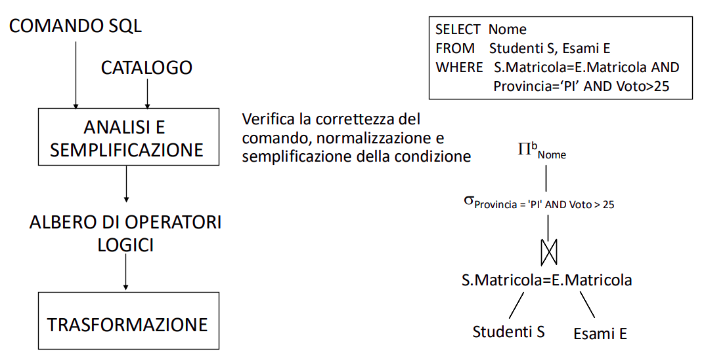
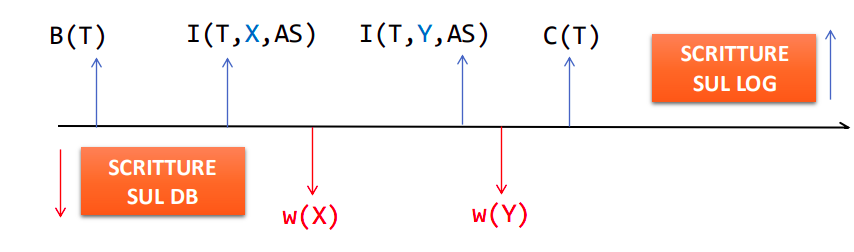

# Lezione I - Gestione a Pagine e Gestione Strutture di Memorizzazione

DBMS è un sistema software che gestisce grandi quantità di dati che devono essere persistenti e condivisi

Verranno trattate gestione dei dati, delle interrogazioni, della concorrenza e dell'affidabilità. Si va in verticale su questi argomenti per ciascuna lezione.

La gestione fisica e logica non è uguale, solitamente fisicamente è gestita per correlazione in pagine. L'accesso deve essere gestito in maniera efficiente, tramite strutture dati, buffer in memoria e gestione efficiente di query.


Le memorie a disco sono caratterizzate da tempi influenzati dal posizionamento delle testine sui settori del disco.

## Gestione a Pagine

- **Pagina (o Blocco)**: Sequenza contigua di settori su una traccia e costituisce un unità per l'I/O per il trasferimento di dati.
    - **Tempo di Trasferimento di Pagina**: Ogni dispositivo quindi è caratterizzato da un tempo di trasferimento di pagina. Il dimensionamento delle pagine e il modo in cui i dati sono posizionati in memoria influenzano i tempi di recupero di quelle informazioni.

- Gestione Memoria Permanente e Gestore del Buffer
    - **Gestore Memoria Permanente**: Astrazione per cui insiemi di file sono composti di pagine fisiche, astraendo dal tipo specifico di disco.
    - **Gestore del Buffer**: Gestione trasferimento da memoria permanente a temporanea.
        - **Area delle Pagine**: Si mantengono dei campi per metainformazioni sulla pagina nel buffer, come `nome` oppure flags `pinCount`, `dirty`.
        - **Gestione Rimpiazzamento nel Buffer**: Solitamente a tempo di riempimento di buffer, si applicano delle politiche (solitamente LRU), ma in alcuni casi nella join LRU sarebbe poco efficiente, quindi i DBMS preferiscono la **MRU** (Most Recently Used).
        - **Struttura di Pagina**: La struttura logica di una pagina è un area che contiene le stringhe che rappresentano i record. Per dereferenziare un record quindi utilizzeremo una **coppia** definita come (PID pagina, posizione nella pagina).
        - **Slot di Pagine**: Posso dereferenziare record passando prima per lo slot (come se facessi `*slot`) e successivamente `*offsetPagina`.
    
## Gestione di Strutture di Memorizzazione

- **Organizzazione Seriale vs Sequenziale**:
    - **Organizzazione Seriale**: Basato su Heap, **non rispetto alcun ordine**, dipende dal ordine di inserimento. È inefficiente sulle operazioni di query successive, perchè non si possono fare assunzioni sulla posizione dei dati.
    - **Organizzazione Sequenziale**: Basato su una **struttura ordinata**, quindi più costoso in aggiornamento ma meno costoso a tempo di query.

    Quindi la scelta di seriale/sequenziale viene fatto in base a se si modifica o si legge più spesso.

- **Organizzazione per Chiave**: Noto il valore della chiave, trovo il valore della chiave a tempo 1. Questo può essere definito in maniera procedurale (hash) o tabellare (indicizzazione).
    - **Metodo Procedurale Statico (Hash)**: Utilizzo una funzione $h(k)$ con $k$ valore della chiave per indirizzare la pagina. Questo causa delle collisioni, che in questo contesto assumiamo che vengano risolte in chaining. Questo non è efficiente per ricerche basate su intervalli, perchè una sequenza $XXX1, XXX2, XXX3$ verrebbe splittata in 3 pagine diverse. Ho quindi dei tradeoff.
    - **Metodo Tabellare**: Si usa un indice, ossia un **insieme ordinato** di coppie $k, r(k)$ dove $k$ è chiave e $r(k)$ è riferimento al record con chiave $k$. Questo solitamente è gestito con un B+ albero.

# Lezione II - Vedi Slide

# Lezione III - Piani di Accesso

Un **piano d'accesso** è un **exp algebrica** in cui operatori logici sono sostituiti da operatori fisici.

In un piano d'accesso si attua anche un ottimizzazione grazie all'utilizzo del parse tree generato, in pseudocodice JAVA

```JAVA
// analisi lessicale e sintattica del comando SQL Q
SQLCommand parseTree = Parser.parseStatement(Q);
// analisi semantica del comando
Type type = parseTree.check();
// ottimizzazione dell'interrogazione
Value pianoDiAccesso = parseTree.Optimize();
// esecuzione del piano di accesso
pianoDiAccesso.open();
while !pianoDiAccesso.isDone() do
{ Record rec = pianoDiAccesso.next();
 print(rec);
}
pianoDiAccesso.close();
```

- **Ottimizzatore di Query**: Bisogna conoscerlo non ad un livello di progettazione concettuale ma di strutture dati utilizzate (seriali/sequenziali) ed indici (primari/secondari) in base a cosa vado ad eseguire sulle tabelle costruite. La meta-base di dati (**catalogo**), ci permette di definire un costo asintotico per le query su quella tabella.

<div style="text-align: center;">
    
</div>

In questo caso potrei applicare la restrizione $\rho$ prima della giunzione su ciascuna tabella.

- **Ottimizzazione Fisica**: Trova un piano di accesso che non è ottimo in maniera matematica, ma cerca di evitare i piani di accesso peggiori.

## Codifica di Operatori

Gli operatori relazionali si codificano in opportuni operatori fisici.

- **TableScan(R)**: Operatore fisico per la scansione della tabella R. Ogni operatore fisico è un **iteratore**, quindi un oggetto con metodi `open`, `next`, `isDone`, `reset`, `close`.

### Esempio di Codifiche di Operatori

Per ogni operatore logico quali operatori fisici possiamo utilizzare e le loro caratteristiche.

<div style="text-align: center;">
    
</div>

<div style="text-align: center;">
    
</div>

Il sort viene utilizzato in ogni caso in cui siano richieste a livello fisico delle righe ordinate, quindi ad esempio nel caso di `DISTINCT`, `GROUP BY` e `ORDER BY`

<div style="text-align: center;">
    
</div>

# Lezione IV - Transazioni e Gestione Affidabilità

- Una transazione deve mantenere 4 proprietà ACID. Una transazione è quindi un unità logica che corrisponde ad una serie di operazioni fisiche.
- Quindi le **transazioni** sono l'**unità di lavoro elementare** che modificano in contenuto di una base di dati, sono **atomiche**, o succedono per intero oppure non succedono.
    - `commit`: Effetti riportati sulla base di dati in caso di chiusura con successo di transazione.
    - `rollback`: Nessun effetto riportato sulla base di dati in caso di chiusura con fallimento.

- **Proprietà di Transazioni**:
    - **Atomicità**: slide
    - **Serializzabilità**: slide
    - **Persistenza**: slide

- **Proprietà ACID di Transazioni**:
    - **Atomicità**: Segue la regola del tutto e niente.
    - **Consistenza**: La transazione lascia il DB in uno stato consistente, nessun vincolo d iintegrià deve essere violato.
    - **Isolamento**: Esecuzione di una transazione è indipendente dalle altre.
    - **Durability**: L'effetto di una transazione chiusa con successo non deve essere perso.

## Nomenclatura di Transazioni

Utilizzeremo questa nomenclatura $w_i[x]$ se in scrittura della pagina $x$ o $r_i[x]$ se in lettura della pagina $x$.

## TIpi di Malfunzionamento

- **Fallimento di Transazioni**: Non comportano la perdita di dati in memoria temporanea ne persistente.
- **Fallimento di Sistema**: Comportano la perdita di dati in memoria temporanea ma non memoria persistente.
- **Disastri**: Comportano perdita di dati in memoria persistente.

- **Ripresa a Caldo/a Freddo**: Rispettivamente responsabile di malfunzionamenti software oppure hardware.

## File di LOG

Mantiene un log di tutte le transazioni effettuate sulla base di dati.

### Regola WAL - Write Ahead Lock

La parte $BS$ di ogni record di log deve essere scritta prima che la corrispondente operazione venga effettuata nella base di dati.

### Regola Commit Precedence

La parte $AS$ di ogni record di log deve essere scritta prima di effettuare il commit dell'operazione.

<div style="text-align: center;">
    
</div>

### Checkpoint

Punti posizionati periodicamente sul file di log per garantire che tutto quello che sta prima del checkpoint sia consistente.

Segue un meccanismo specifico:

Inizia un `begin checkpoint`, per segnarsi quali siano le transazioni in corso, lasciando partire un flush del buffer delle pagine flaggate come modificate dal buffer in memoria.

Quindi le scritture avvenute tra `BeginCkp` ed `EndCkp` non so se siano effettivamente finite o meno, ma ho la garanzia che quelle chiuse prima di `BeginCkp` siano realmente chiuse.

## Primitive di Transazione

- Notazioni di Operazioni con Stato:

    - $B(T)$: Begin transaction.
    - $C(T)$: Commit transaction.
    - $A(T)$: Abort transaction.
    - $U(T, O, BS, AS)$ = Update relativa a tabella $T$ su oggetto $O$ portandosi dietro un $BF$ before state dell'operazione ed $AF$ after state dell'operazione.
    - $I(T, O, AS)$ = Insert relativa a tabella $T$ su oggetto $O$ portandosi dietro un ed $AF$ after state dell'operazione.
    - $D(T, O, BS)$ = Delete relativa a tabella $T$ su oggetto $O$ portandosi dietro un ed $BF$ after state dell'operazione.

- **Primitive UNDO/REDO - (Disfare/Rifare)**:

    - **UNDO**: Si disfa un azione riprendendo lo stato $BF$ sull'oggetto O.
    - **REDO**: Si rifà un azione riprendendo lo stato $AS$ sull'oggetto O.

- **Dump**: Copia completa della base di dati.

### Fare/Rifare di una Transazione (vedi slide)

### Recupero da Tipi di Malfunzonamento

- **Fallimenti Transazioni**: Si scrive nel giornale (T, abort) e si applica la procedura disfare.
- **Fallimenti di Sistema**: 
    - Le T non terminate vanno disfatte.
    - Le T terminate vanno rifatte.
- **Disastri**: Si recuperano con i dump.

# Lezione V - Gestione Concorrenza

## Serialità vs Serializzabilità

- **Seriale**: Se per ogni coppia di transazioni $T_i, T_j$ vale che tutte le operazioni di $T_i$ vengono effettuate prima di quelle di $T_j$.
- **Serializzabile**: Se produce lo stesso effetto a prescindere del tipo di ordine in cui si eseguono le transazioni.

## Consistenza dell'ACID

Garantendo la serializzabilità possiamo rendere il sistema consistente, quindi sapendo che l'ordine di esecuzione delle operazioni non influisca sul risultato.

## Tipologie di Problemi della Non Consistenza

### Perdita di Aggiornamento

### Lettura Sporca o Impropria

### Letture Inconsistenti o Non Riproducibili