# Il Processo Software

Il processo software inizia quando si inizia ad esplorare il problema e finisce quando il prodotto viene ritirato dal mercato.

Si compone quindi in fasi:

1. **Analisi Requisiti**
2. **Specifica**
3. **Progettazione**
4. **Implementazione**
5. **Integrazione**
6. **Mantenimento**
7. **Ritiro**

Quindi equivale alla **sequenza** di **attività** necessarie allo **sviluppo** di un **software**. Sicuramente, tra le fasi elencate sopra, saranno sempre necessarie quelle di **specifica**, **progettazione** ed **implementazione**, **validazione** ed **evoluzione**.

Solitamente si parla quindi di **modello di software**, ossia una sua **rappresentazione astratta** del **processo**. A volte questi modelli vengono standardizzati (es. Standard ISO 12207).

## Modelli Ciclo di Vita del Software

1. **Build & Fix**: Sistema software sviluppato **senza specifica/progettazione** che viene **modificato più volte** fino a quando non soddisfa il committente.

### Modelli Prescrittivi - Sequenziali

1. **Modello a Cascata**: Segue delle fasi ben definite, ossia:

    - Raccolta Requisiti
    - Progettazione Software
    - Implementazione e Testing
    - Integrazione di Funzionalità e Testing
    - Operatività e Mantenimento

    In alcune sue versioni prevedeva anche dei feedback loop che permettessero di mantenere più versatilità tra le fasi.

    Quindi con questo modello per la **prima volta** si distinguono **fasi ben definite** dello sviluppo software. Allo stesso tempo si genera un **eccessiva rigidità** e produzione di documentazione. Seguendo poi in maniera ideale questo schema, il prodotto non viene mai valutato in una sua versione parziale dal cliente, di conseguenza l'**interazione tra prodotto e cliente** nello **sviluppo** risulta essere **nulla**.

    Viene quindi ricordato perchè è il primo modello a strutturare delle fasi ben definite per lo sviluppo software.

2. **Modello a V**: Viene preso il modello a cascata e "spezzato" in modo tale da suddividere le attività in **analisi** a **sx** e **sintesi** a **dx**.

    <div style="text-align: center;">
    
    </div>

    - **SX**: Attività di analisi che scompongono le esigenze degli utenti in piccole parti.
    - **DX**: Attività di sintesi che aggregano e testano tali parti per verificare che il sistema soddisfi le esigenze degli utenti.
    - **CENTRO**: Progettazione dei test da svolgere dunrante le fasi di sviluppo.

    Questo ci permette di definire questo modello come test driven, dato che potremmo definire i test anche subito dopo aver scritto i requisiti.    

### Modelli Prescrittivi - Iterativi

3. **Rapid Prototyping**: Si basa sulla **creazione** di un **primo prototipo** da presentare al cliente per capire se sono stati ben **acquisiti i requisiti**. In caso negativo si reitera modificando il prototipo e ripresentandolo al cliente.

4. **Modello Incrementale**: I requisiti vengono pesati in base alle priorità, questo permette di rilasciare mano mano nuove versioni con implementazioni e feature prima non presenti, integrando e testando con passaggi incrementali.

    - **Pro**:
        - Ottengo subito prime versioni di software
        - Ottengo un feedback rapido sullo sviluppo e sui requisiti
        - Riduce il costo causato dai cambiamenti richiesti
    - **Contro**:
        - Poco chiaro lo schema di sviluppo
        - Rischio di ricadere nel Build & Fix

5. **Modello a Spirale**: Si itera su quattro fasi fondamentali:
    - Definizione di obiettivi
    - Valutazione rischi e possibili alternative
    - Implementazione e sviluppo
    - Definizione di una nuova iterazione

    Questo tipo di schema è detto **risk-driven** dato che ad ogni iterazione si valutano tutte le possibili scelte e rischi.

### Unified Process

Schema basato sulla gestione delle fasi dello schema a cascata in base al periodo corrente del prodotto software.

<div style="text-align: center;">

</div>

### Modelli Agili

Prima di definire questi modelli ricapitoliamo le fasi "ideali" di un processo software:

1. **Specifica**: Estrazione ed analisi requisiti, specifica requisiti e convalida requisiti.
2. **Progettazione**: Progettazione dell'architettura del SW, del DB, delle intefacce tra i componenti e nel dettaglio dei componenti stessi.
3. **Sviluppo**: Spesso in interleaving a quella di progettazione, l'obiettivo è quello di sviluppare le componenti descritte sopra. Sono comprese in questa fase le azioni di programmazione e debugging.
4. **Validazione**: Bisogna dimostrare che i componenti sviluppati rispettino i requisiti raccolti all'inizio, di conseguenza vanno costruiti dei test.
5. **Evoluzione**: I requisiti possono cambiare, le tecnologie alla base si possono evolvere, di conseguenza vanno anticipati questi cambiamenti preservando la change tollerance, ossia la proprietà per cui il processo software non soffra in modo pesante questi cambiamenti.

Il **manifesto Agile** affronta diversamente il problema grazie a dei **principi**:

- **Customer Involvement**: Costante feedback al cliente, soprattutto durante le fasi di sviluppo.
- **Incremental Delivery**: Le varie versioni sono rilasciate incrementalmente.
- **People not Process**: I team di sviluppo dovrebbero essere lasciati liberi di agire "a modo loro".
- Nozioni di codice funzionante vince su grandi documentazioni.
- Aggiornamenti frequenti che cercano di stare al passo a cambiamenti frequenti di requisiti.
- Accettare la possibilita di cambiamento dei requisiti.
- Mantenere semplice il progetto così saranno più semplici le modifiche.

#### Caratteristiche dell'Agile
- Solitamente progetti piccoli/medi possono permettersi di seguire in maniera precisa l'Agile.
- Il cliente deve essere disponibile a questo tipo d'interazione continua.
- Il **CI/CD** (Continuous Integration/Continuous Deployment) e la figura del DevOps diventa fondamentale in questo contesto.

#### Esempi di Agile (XP, Scrum)

1. **Extreme Programming (XP)**: Approccio estremamente agile ed iterativo basato su caratteristiche come:
    - Nuove versioni più volte al giorno.
    - Incrementale sulle versioni.
    - Basato sul buildare -> testare -> runnare.
    - Piccole release che forniscano funzionalità di base del sistema.
    - Release frequenti ed incrementali di nuove funzionalità.
    - **Design semplice**: comprensibile e che soddisfi i requisiti.
    - **Test-first**: Casi di test prima del codice, spesso generati con framework per unit test automatici.
    - **Pair Programming**: Gli sviluppatori scrivono in coppia, dove chi non scrive "giudica" chi sta scrivendo.
    - **Refactoring continuo**: dato che codice semplice sarebbe anche semplice da sostituire come implementazione nuova ma mantenendo la semantica vecchia.
    - **Collective Ownership**: Tutti hanno responsibilità e permessi di modificare codice.
    - **Sustainable Pace**: No al troppo lavoro straordinario, essendo causa di calo di qualità.
    - **On-Site Customer**: Un rappresentante del cliente deve essere parte del team.

2. **Scrum**: Lavoro compatto di team, nome che richiama la fase di mischia del rugby:

    - **Figure Coinvolte**:
        - **Development Team**: Gruppo autogestito di sviluppatori, non dovrebbe superare le 7 persone.
        - **Product Owner**: Individuo che si occupa della raccolta requisiti e valuta le caratteristiche del prodotto software, non ha quindi controllo diretto sul lavoro dei dev, ma può valutarne il lavoro.
        - **Scrum Master**: Figura responsabile del processo Scrum, garantisce condizioni ambientali favorevoli ai dev e non ha responsabilità dirette sul prodotto.


    - **Fasi dello Scrum**:
        1. **Pre-Game Phase**: pianificazione di massima.
            - **Planning SubPhase**: Definizione del sistema che deve eessere sviluppato in termini di product backlog.
            - **Architecture SubPhase**: Design di alto livello, anche ad esempio dell'architettura.
        2. **Gestione degli Sprint - GamePhase - Sviluppo**: Ciascuno sprint contiene le fasi classiche di sviluppo software.
        3. **Post-Game Phase**: Conclude il processo di sviluppo e il prodotto viene preparato per il rilascio.

    - **Pro dello Scrum**:
        - Prodotto partizionato in pezzi gestibili
        - I requisiti non ancora stabili non richiedono progressi
        - L'intero team può vedere tutto
        - Il cliente ha costante feedback

- **Kanban**: suddivisione del to-do, doing, done, questo permette di prendere un
attività e portarla a termine, "astraendo" dalla precisione del fatto, bisogna che si inizi e che si finisca:
    - Work in progress limit, permette di definire un limite alle attività inserite in doing
    - Questo permette di risparmiare i context switch che risultano essere costosi

## Analisi Requisiti

- **Dominio**: Va specificato l'ambito ed il contesto del prodotto, tramite:    
    - **Glossario** dei **termini**.
    - **Due** modelli **statico** e **dinamico** del dominio.
        - **Statico**: Descrizione fisica del contesto. Solitamente viene descritto con il linguaggio UML.
        - **Dinamico**: Descrizione dei processi da eseguire. Solitamente descritto con una descrizione testuale oppure in UML.
    
    Quindi alla fine dell'analisi del dominio si ottengono:
    - **Entità**
    - **Relazioni**
    - **Processi** e **Comportamenti**
    
    I vari requisiti devono essere anche standardizzati (ISO...) e molto probabilmente il cliente non è minimamente a conoscenza di questi dettagli.

### Tipi di Requisiti

E' buona prassi tenere divise queste due tipologie di requisiti.

1. **Requisiti Funzionali**: Descrivono funzionalità che il sistema deve realizzare in termini di azioni, reazioni ad input e comportamenti in specifici condizioni, ma astrae dal tipo di specifica ed implementazione.
2. **Requisiti Non Funzionali**: Proprietà del sistema software
    - **Caratteristiche di Qualità**: Sicurezza, usabilità, security (riguardante i dati), affidabilità, efficienza, safety (in termini di assenze di crash in contesti critici), robustezza...
    - **Caratteristiche del Processo di Sviluppo**: Standard di processo, uso di ambienti CASE, linguaggi di programmazione, metodi di sviluppo...
    - **Caratteristiche Esterne**: Vincoli legislativi...
    - **Requisiti Fisici**: Hardware, rete...

### Esempio di Esercizio su Analisi Requisiti

```
Si consideri un sistema per il prelievo automatizzato di denaro contante (Bancomat). Per poter utilizzare il sistema l'utente deve possedere una tessera magnetica. Il sistema deve mettere a disposizione le funzioni di prelievo, saldo, estratto conto. Il sistema deve essere disponibile a persone non vedenti, deve garantire un tempo di risposta inferiore al minuto, e deve essere sviluppato su architettura X86. Le operazioni di prelievo devono richiedere autenticazione tramite un codice segreto memorizzato sulla carta. Il sistema deve essere facilmente espandibile, e adattabile alle future esigenze bancarie.
```

1. **Requisito Funzionale**: Sistema deve mettere permettere prelievo, saldo, estratto conto.
2. **Requisito Non Funzionale**: Sistema deve essere disponibile a persone non vedenti.
3. **Requisito Non Funzionale**: Sistema deve garantire un tempo di risposta inferiore al minuto.
4. **Requisito Non Funzionale**: Sistema deve essere sviluppato su architettura X86.
5. **Requisito Funzionale**: Le operazioni di prelievo devono richiedere autenticazione tramite un codice segreto
6. **Requisito Non Funzionale**: Il sistema deve essere facilmente espandibile, e adattabile alle future esigenze bancarie.

### Descrizione di Requisiti di un Sistema

Posso seguire due approcci

1. **Linguaggio Naturale** (Glossario e Specifica dei Requisiti)
2. **Linguaggio Grafici** (Modello del Dominio e Casi d'Uso)

I requisiti di un sistema valgono come contratto tra cliente e consulente.

### Fasi dell'Analisi dei Requisiti

Presentati in cascata ma non per forza di cose raccolti in cascata.

1. **Acquisizione**: Si procede con analisti che effettuano interviste strutturate e non al cliente. Possono essere utilizzati questionari, prototipi del prodotto, osservazione del cliente e altre tecniche interattive.
2. **Elaborazione**: Raffinamento dei requisiti raccolti e bozza di documento dei requisiti, seguendo uno standard (come l'IEEE/ANSI 830-1993), con documento caratterizzato da elementi come:
    - Introduzione
    - Glossario
    - Definizione requisiti funzionali e non
    - Architettura
    - Specifica di requisiti del SW
    - Modelli astratti del sistema
    - Evoluzione del sistema
    - Appendici
    - Indici
    
    I requisiti ben posti sono asserzioni sul sistema. Bisogna evitare **omissioni**, **inconsistenze** (più requisiti che parlano della stessa cosa e si contraddicono), **ambiguità** (vanno controllati i quantificatori), **sinonimi** ed **omonimi**, **presenza di dettagli tecnici**, **ridondanza**.
3. **Convalida**: Si valuta la stesura appena definita cercando potenziali omissioni, inconsistenze, ambiguità, sinonimi ed omonimi, presenza di dettagli tecnici ed eventuale ridondanza. Le ambiguità possono essere di vario tipo, ad esempio causate da quantificatori usati in modo improprio, da disgiunzioni, da coordinazione non vincolata dal linguaggio naturale, da referenzialità non ben definita dal linguaggio naturale. Si evitano quindi volontariamente doppie negazioni, verbi deboli e forme passive.

    #### Tecniche di Convalida di Requisiti

    1. **Deskcheck**:
        - **Walkthrough**: Lettura sequenziale dei documenti
        - **Ispezione**: Lettura strutturata dei documenti
            - **Tecnica del lemmario**: Utilizzo dei termini del glossario con puntatori ai requisiti che li nominano, si facilità la ricerca di inconsistenze, sinonimi, omonimi o ridondanze.
            - Ricerca di rimozioni, distorsioni, generalizzazione.
    2. Uso di strumenti di analisi del linguaggio naturale
    3. Prototipi: Provare requisiti tramite demo proposta al cliente.

    **Verificabilità di Requisito**: Un requisito è detto verificabile se, tramite testing in modo oggettivo, se il sistema soddisfa quel requisito.

4. **Negoziazione**: Si assegnano delle priorità ai requisiti, ad esempio secondo il **principio MoSCoW**:
Per ordine d'importanza: Must Have, Should Have, Could Have, Want to Have.

5. **Gestione**: 
    - Ogni **requisito** va **denominato** con ad esempio un **id**, ed ogni requisito avrà questi **attributi**:
    - Stato: proposto, approvato, rifiutato.
    - Priorità: importanza, settando ad esempio con il MoSCoW
    - Effort: richiesta gg/uomo.
    - Rischio: valutazione della fattibilità tecnica
    - Stabilità: 
    - Versione Destinazione.

    Va anche tracciato il percorso di vita di un requisito, costruendo delle mappe tra componenti del sistema, codice e relativi test, detti strumenti CASE per la gestione dei requisiti

#### Aspetti Contrattuali

Il **documento dei requisiti** normalmente precede la **stipulazione di un contratto**, ne è quindi una **parte integrante**, riformulare i requisiti vuol dire quindi riformulare un contratto.

### User Stories

Tecnica dei processi Agile dove i requisiti sono descritti con un template predefinito

$$\text{As a USER ROLE, I want GOAL so that BENEFIT}$$

Ad esempio "In qualità di **cliente** voglio **cancellare la mia prenotazione** in hotel, per **avere un rimborso**.

Solitamente si utilizzano delle user story cards, strumento su carta come preset.

# Modellazione UML (Unified Model Language)

- Un sistema va descritto tramite **modelli statici/dinamici**, con linguaggi **formali/informali**.
- L'UML permette descrizione e progettazione di sistemi software, non permette solo **modellazione statica ma anche dinamica** permettendo, grazie a sintassi e semantica ben definita, qualcosa come automi a stati finiti o diagrammi di flusso.
- Il software di riferimento sarà **Visual Paradigm**.

## Modello Statico vs Dinamico

1. **Modello Statico**: Rappresentato dai **diagrammi di casi d'uso**.
    - Un caso d'uso è un compito che un attore può svolgere con l'aiuto del sistema.
    - Un attore è una persona che interagisce con il sistema.
    - Elenchiamo tutti gli **elementi fondamentali del modello statico**:
        - **Attori**: Hanno un nome, come una classe. Esiste un attore principale, è il primo che "mette la mano sulla tastiera". **Se** il **tempo** è **menzionato tra gli attori**, allora il **tempo è attore principale**.
        - **Caso d'uso**: Hanno un nome, rappresentano un compito.
            - **Narrativa di un Caso d'Uso**: Serie di attributi (?vedi slide?), ma in particolare:
                - **Precondizioni**.
                - **Sequenza Di Eventi**: Solitamente il primo evento è quello eseguito dall'attore protagonista.
                - **Postcondizioni**.
                - Sequenze alternative in caso di Fallimento.
            - La sequenza principale di eventi non è unica ma può differenziarsi tramite l'uso di if che possono coprire le varie possibilità.
            - Le **precondizioni** e le **postcondizioni** sono **sempre asserzioni** e **mai azioni**.
            - **Inclusione di Caso d'Uso**: Si definisce una dipendenza con la keyword `include`, solitamente le keyword sono definite tra virgolette, questioni di sintassi. Solitamente utilizzato per fattorizzare, non si usa l'`include` per dettagliare i casi d'uso, ma solo se si invoca qualcosa di già definito in un altro caso d'uso. Si crea quindi una dipendenza tra il $\text{caso d'uso}_2$ che include un $\text{caso d'uso}_1$.
            - **Estensione di Caso d'Uso**: Creazione di dipendenza "al contrario", ossia un $\text{caso d'uso}_1$ esiste ed è istanziabile ed un $\text{caso d'uso}_2$ lo estende "decorandolo". Esisterebbe un processo di decomposizione funzionale, ma il caso d'uso vuole essere una macro entità, non un entità piccola.
        - **Relazioni**: Relazioni sisgnificative tra gli attori ed il caso d'uso, rappresentano interazione.
        - **Confine del Sistema**: Indica il confine del sistema oggetto del modello.

            <div style="text-align: center;">
            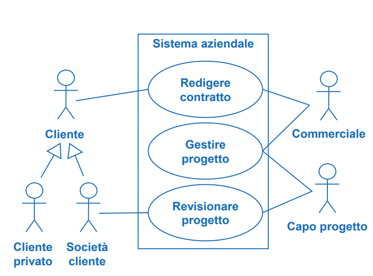
            </div>


2. Modello Dinamico: Basato sull'utilizzo di diagrammi di macchina a stati, attività o sequenza

## Classi ed Oggetti in UML

- **Classi**: Descrivono un tipo di oggetto
    - **Nome**: Nome della classe in maiuscolo e sempre al singolare.
    - **Attributi**: Tipizzati. Questi attributi seguono una specifica **sintassi**, ossia: $$ visibilità \: nome : tipo \: [molteplicità] = valore Iniziale \{ proprietà \}$$
    Un attributo ha una molteplicità, se è $[0 .. 1]$ allora è opzionale, invece se è esattamente $1$ viene omesso.
    
    - **Operazioni**: Metodi tipizzati, segue sistassi $$visibilità \: nome (tipoParametri) : tipoRitorno \:$$
    - **Classi Astratte e Interfacce**: Esistono anche questo tipo di classi e si indicano rispettivamente con le keyword $<<interface>>$ e $\{ abstract \}$.

- **Relazioni**: Permettono di correlare classi tra loro. Esistono le **Relazioni Cicliche** e permettono di stabilire gerarchie (come in BD). Poi abbiamo tipi diversi di relazioni tra classi:
    - **Associazione**: Riferimenti ad altre classi tramite attributi di tipo della classe a cui stiamo puntando.
    - **Molteplicità**: Come in BD, un associazione ha una molteplicità che indica il numero di oggetti coinvolti nell'associazione in un dato istante, da entrambi i versi dell'associazione. Queste associazioni spesso vengono rinominate, soprattutto se sono presenti molteplici associazioni tra stesse classi.
    - **Aggregazione**: Relazione poco forte, non ha un nome.
    - **Composizione**: Relazione molto forte, non ha un nome.
    - **Generalizzazione**: Relazione di sotto/superclasse, dove classi condividono attributi,
- **Dipendenze**: Solitamente una classe X **usa** un metodo di una classe Y.   Non è un se e solo se, non per forza un utilizzo causa una dipendenza, magari il metodo invocato da X aveva come tipo di ritorno un `void`.
- **Oggetti**: Istanze delle classi
- **Enumerazioni**: Non delle classi effettive, permettono la definizione di tipi $enum$.

Dato un concetto questo è una **Classe** o un **Attributo**? Dipende da se mi interessa descriverne ex novo una struttura oppure se volgio solo mantenere una informazione (es. degli Autori dei Libri come Classi oppure come Attributo di Libro)

### Identificazione Classi

Risulta quindi necessario stabilire delle pratiche per identificare le classi, queste infatti:

- Rappresentano l'astrazione di uno specifico elemento del dominio.
- Hanno numero ridotto di responsabilità.
- Alcune best practice: Evitare funzioni che si travestono da classi, ed evitare gerarchie di ereditarietà profonde.

Si seguono **due macro approcci** per l'identificazione di classi:

1. **Approccio Data Driven**: Si identificano i **dati del sistema** e si dividono in classi.
2. **Approccio Responsibility Driven**: Si identificano **responsabilità** e le si dividono in classi.

Un metodo comune di riconoscimento classi è tramite **analisi nome-verbo** dove solitamente:

1. I **sostantivi** sono **classi** oppure **attributi**.
2. I **verbi** sono **operazioni** e quindi responsabilità di una classe.

## Modellazione Processi

- Modellazione di processi dinamici tramite cose come **diagrammi di flusso**, per descrivere il **modello dinamico** di un **dominio**.

- **Attività in UML**: Attività contenuta in un rettangolo con gli angoli smussati, che definiranno i nodi di un grafo diretto:
    - Ciascun **nodo** indica un **azione** (diverso da uno stato di un automa a stati finiti). Ci aspettiamo solo un arco uscente e solo un arco entrante in un nodo.
    - Ciascun **arco** rappresenta il **control flow**, ossia la sequenza del flusso possibile trovandosi nell'azione del nodo.
- **Nodi di Controllo**: 
    Due frecce entranti in un azione (NON UTILIZZATE IN QUESTO CORSO) hanno la semantica di una join, mentre due frecce uscenti in un azione (NON UTILIZZATE IN QUESTO CORSO) hanno la semantica di una selezione di flusso.
    <div style="text-align: center;">
    
    </div>

    La **fork moltiplica i token**, dato un token in ingresso infatti li moltiplica per ogni freccia entrante, mentre la **join li consuma**, lasciandone uscire solo uno. Differente è il comportamento di una merge, che se posizionata dopo una fork lascia che tutti i token seguano lo stesso arco entrante, ma mantenendo la loro molteplicità.
- **Segnali ed Eventi**: Gestione asincrona di attività:
    - **Invio di Segnale**: Asincrono e non blocca l'attività corrente. Permette l'interazione con cose esterne, non parte del sistema.


    - **Accettazione di evento esterno**: Operazione duale alla precedente.


    - **Accettazione di evento temporale**: Permette di definire un attesa arbitraria (assoluta o relativa).
    
    <div style="text-align: center;">
    
    
    
    </div>

- **Sottoattività**: Possono indicare attività che mappano su sequenze di azioni atomiche, quindi descritte da un altra parte.

    <div style="text-align: center;">
    
    </div>

- **Partizioni**: Permettono di assegnare la responsabilità delle azioni a delle unità operative.
    <div style="text-align: center;">
    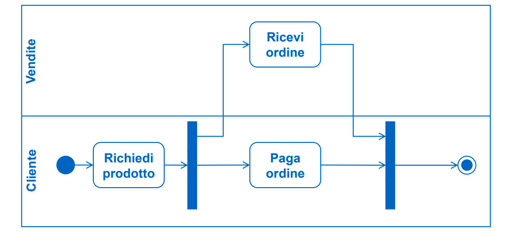
    </div>

## Comportamenti in UML - Diagramma di Macchina a Stati Finiti

- Una **macchina a stati finiti** ci permette di descrivere il **comportamento** delle **istanze** di una **classe**.
- Dunque l'evento non è più il rettangolo dagli angoli smussati, è lo stato indicato da un rettangolo ed un evento triggera lo spostamento da uno stato ad un altro

    <div style="text-align: center;">
    
    </div>

### Stati e Transizioni

La sintassi di una transizione è così definita:

<div style="text-align: center;">

</div>

Quindi in occorrenza di un **evento**, se la **condizione** risulta essere **vera** allora questo comporta l'**esecuzione delle azioni** elencate.

Un esempio potrebbe essere:

<div style="text-align: center;">

</div>

### Tipologie di Eventi

Esistono tre tipi di eventi: un **operazione** `op(a)`, un **evento di variazione** `when(exp)` oppure un **evento temporale** `after(t)`.

<div style="text-align: center;">

</div>

### Entry, Exit, Do, Transizioni Interne

- **Entry**: Azione eseguita appena entrati in uno stato.
- **Do**: Azione interna eseguita in modo continuato mentre l'oggetto si trova in quello stato.
- **Exit**: Azione eseguita appena usciti da uno stato.
- **Transizioni Interne**: Risposte ad un evento che causano l'esecuzione di un azione senza il cambio di stato esterno.

### Stato Composito

Stato che al suo interno contiene un altro automa. Questo favorisce la visualizzazione dell'automa, rendendolo meno complesso da un punto di vista grafico.

L'ingresso allo stato della macchina avviene se una freccia si posiziona sul suo bordo, proseguendo quindi dallo stato iniziale al suo interno.

L'uscita avviene da una transizione di completamento, quindi dallo stato finale dello stato composito in direzione della transizione di completamento.

<div style="text-align: center;">
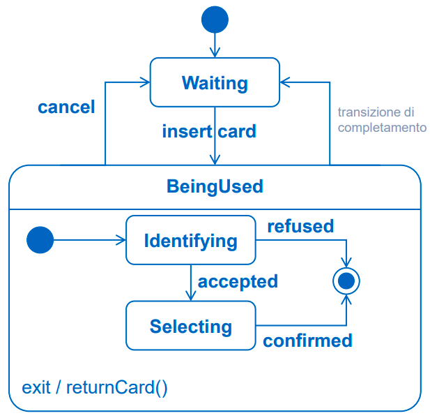
</div>

Questi possono essere sia sequenziali sia paralleli, quindi sottostati attivati per regione dello stato.

- **Sottomacchina**: Per **ragioni di fattorizzazione** potremmo pensare che sia utile poter definire tipi di stati compositi, questo porta all'utilizzo di **sottomacchine**, che ci permette di definire appunto un tipo di sottostati e riutilizzarli quando necessario.

<div style="text-align: center;">

</div>

- **Pseudostati: Scelta, Giunzione, History**
    - **Scelta**: definita pseudostato perchè non sto fermo nello stato, ma è stato di transizione e mi permette di valutare la guardia. Non posso sapere l'esecuzione prima dell'effettiva valutazione della guardia.
    - **Giunzione**: Le condizioni in questo caso sono valutabili staticamente, solitamente posto prima degli eventi che attivano le transizioni di ingresso.

    Quando viene scelto **Giunzione o Scelta**? Giunzione viene valutata la guardia prima di uscire dallo stato di partenza, invece Scelta viene valutata la guardia durante l'occorrenza dell'evento.

    - **History**: Indica lo stato da usare la prima volta che si entra in un macrostato sovrastante.

### Scelta Descrizione Modello Dinamico

- **Diagramma di Macchina a Stati**: descrive l'evoluzione delle istanze di un classificatore (Focus sull'evoluzione di un oggetto in relazione ad eventi che accadono).
- **Diagramma di Attività**: descrive un flusso di azioni da svolgere. (Focus sulla sequenza e l'ordine delle cose da fare).

Esistono quindi best practices per la buona definizione di Macchine a Stati/Attività.

# Lezione 11 - Progettazione Architettura Software

Progettazione delle componenti di un sistema più complesso

- **Architettura Software**: Struttura del sistema composta dalle parti, dalle relazione e dalle proprietà visibili.

- Come in vari ambiti ingegneristici, vogliamo standardizzare il linguaggio in cui esprimiamo la nostra progettazione. Esistono quindi vari stili che vengono analizzati in viste diverse.

## Viste del Software

### Vista Comportamentale 

- Permette di descrivere un **sistema SW** come **composizione** di **componenti SW**, definendo le componenti e le loro interfacce, caratterizzando i connettori.
- Descrive tramite uno snapshot di un sistema dinamico, quindi uno schema statico di un sistema dinamico.
- **Componente**: Unità di SW indipendente e riusabile.
    - Ha interfacce ben fissate.
    - Può essere indipendente dagli altri.
    - Il sistema viene composto da componenti che tra loro si collegano comunicando.
    - **Porti delle Interfacce**: Insieme di interfacce omogenee.
    - **Connettori**: Permette la connessioni di componenti, spesso con **prototipi** che spiegano il tipo di connessione. Nella versione semplificata si usa la notazione a lollipop e forchette, ma indicano solo chi invoca e chi viene invocato, ma in ogni caso queste possono essere sia get sia set quindi non si determina la direzione di comunicazione solo dalle notazioni lollipop/forchetta.

### Vista Strutturale

- Struttura effettiva del codice, analisi delle dipendenze.
- Si valuta la portabilità del SW
- Permette la progettazione dei test.
- Elementi di questa parte sono detti **moduli**, con relazioni di elementi del tipo **parte di**, **eredita da**, **dipende da**, **può usare**...
- E' importante definire **visibilità e metodi in questa sezione**

- **Tipi di Relazione**:

    - **Relazione d'Uso (dipendenza)**: Classe A usa Classe B. ATTENZIONE, invocazione e dipendenza non sono in se e solo se, se invoco un metodo esterno di cui non devo aspettare l'esito, allora non dipendo da esso.
    - **AllowedToUse (dipendenza asimmetrica)**: Se layerizzo a 3 strati, non permetto al livello 1 ed il 3 di comunicare direttamente, ma dovranno passare per il livello 2.
    - **Generalizzazione (Super/Sottoclasse)**: Relazione canonica di sottoclasse, ma posso farlo anche tra package. Questo risulta utile se voglio definire un interfaccia di package per poi implementarlo in modi differenti.

- **Tipi di Vista Strutturale**:

    - **Vista Strutturale di Decomposizione**: Basata sulla **relazione di generalizzazione** definita sopra, quindi se modulo A **fa parte** di modulo B.
    - **Vista Strutturale d'Uso**: Basata sulla **relazione d'uso** definita sopra, quindi **modulo A** **dipende** dalla presenza di **modulo B**.

### Vista Logistica o di Deployment

- Come viene allocato il software nell'ambiente di esecuzione.
- Ambienti di esecuzione vengono rappresentati come dei parallelepipedi
- Gli **artefatti sono gli eseguibili** che rilasciamo.


## Stili di Progettazione

- **Pipe & Filter**: Flusso di elaborazione dei dati, che viaggiano lungo le pipe e sono fitrati da filter.
- **Client/Server**:
    - **P2P**
- **Publish/Subscribe**: Basato sulle figure di Broker, Publisher e Subscriber.
    - Publisher: Genera classi di eventi
    - Broker: Smista gli eventi
    - Subscriber: Si abbona alle classi di eventi che ritiene rilevanti.

    Questo può seguire modalità diverse, ossia pull o push.
- **Model View Controller**: Viste differenti dal modello da view diverse controllate dal controller. La comunicazione viene fatta direttamente dal model alla view.

<div style="text-align: center;">
    
</div>

- **Model View Presenter**: Simile, ma l'aggiornamento della vista passa dal controller.

<div style="text-align: center;">
    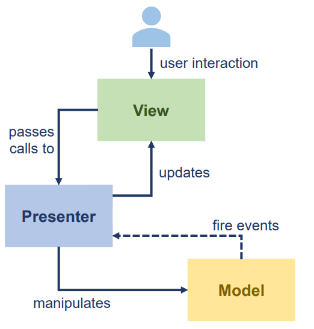
</div>

- **Process Coordinator**: Visto anche come pipeline, un client che invoca tanti servizi magari già preesistenti, li invoca nell'ordine giusto e rielabora fungendo da server per l'utente. Quindi una componente funge da coordinatore e le altre attendono quest'ultima.

# Lezione 12 - Diagramma di Sequenza

- Descrivono interazioni tra oggetti, organizzandole in una **sequenza temporale**.
- Formalizzano la sequenza principale degli utenti.
- Sintatticamente è uguale ad altri diagrammi, ma permette di raccontare la parte già vista con i casi d'uso in maniera dinamica rispetto al tempo.
- Quindi permette la **rappresentazione grafica alternativa** a descrizioni di casi d'uso.

## Descrizione Grafica

- **Linee di Vita**: Rappresentano oggetti partecipanti, dove il rettangolo sopra rappresenta il tipo dell'oggetto e la linea verticale l'oggetto.
- **Frecce**: Rappresentano le interazioni tra oggetti, come operazioni o segnali.
    - Possono essere sincrone oppure asincrone.
    - Possono essere etichettate, con un numero $n$, con un $nome$, ma sono tutte etichette opzionali.
    - Le operazioni possono essere anche **creazioni/distruzioni** di altri oggetti, questo graficamente viene rappresentato come un rettangolo più basso rispetto a chi ha creato quell'oggetto.
- **Frame Condizionali**: Permettono di descrivere un flusso in base a delle guardie, quindi eseguire operazioni o meno rispetto a delle condizioni.
- **Frame Opzionali**: Se etichettate con `opt`, l'operazione viene fatta solo se vale un ramo della condizione.
- **Frame Iterativo**: Nell'etichetta in alto a sinistra si indica il $min$ e $max$ di iterazioni, quindi anche se la guardia fosse ancora vera comunque si possono eseguire un massimo di iterazioni definite.

    - Codifica while

        $$ loop(0,*) [guardia]$$

    - Codifica for

        $$ loop(n) $$

- **Inclusione di Frame**: Possibile includere interazioni da altri frame. Questo attraverso l'utilizzo di **gate** di ingresso/uscita. Questo, con l'utilizzo dell'etichetta $ref$, ci permette di utilizzare diagrammi specificati altrove.

- **Vincoli di Durata**: Espressi tra parentesi graffe, permettono di specificare quando o quanto deve durare una specifica interazione.

<div style="text-align: center;">
    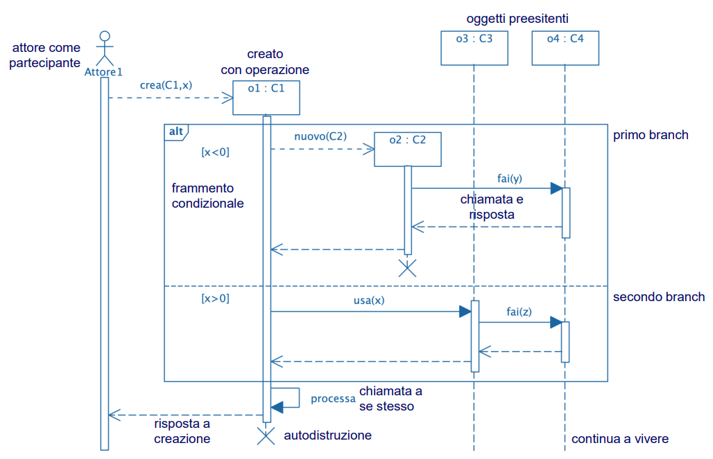
</div>

# Lezione 13 I - Principi Di Progettazione - Definizioni Iniziali

- Le tecniche di progettazione mirano a produrre un sistema che realizzi i requisiti funzionali ed i requisiti di qualità, ma allo stesso tempo si vuole rendere il prodotto facilmente manutenibile e riusabile.

- La **manutenzione** può essere di diversi tipi:
    - **Correttiva**: Rimuove bug, lasciando identica la specifica.
    - **Migliorativa**: Cambia anche la specifica e l'implementazione, ed in base alla quantità di cambiamenti si suddivide in altre due sottocategorie:
        - **Perfettiva**: Modifiche applicate per migliorare la qualità del SW.
        - **Adattiva**: Modifiche applicate a seguito di cambiamenti del contesto del prodotto, come ad esempio dei cambiamenti legislativi o nel sistema operativo.

## Principi di Progettazione

- **Information Hiding**: Permette la separazione tra **interfaccia visibile** come ciò che espone e **implementazione privata** definita in un corpo. Questo garantisce proprietà di comprensibilità, mautenibilità, possibilità di lavoro in team e sicurezza.
    - **Information Hiding $\neq$ Incapsulamento**: L'incapsulamento è una proprietà dell'OOP, quindi può generare information hiding ma non lo garantisce a priori. Per questo vengono definiti degli **attributi privati** delle classi e degli **accessors (getter)** e **mutators (setter)**.
- **Astrazione**: Permette la suddivisione di procedure in moduli, nascondendo la loro implementazione, costituendo librerie. In questo modo si possono definire interfacce stabili anche in caso di cambio di implementazioni.
- **Coesione**: Criterio per il quale procedure vicine devono essere offerte in una singola unità di modulo/componente. Per questo esistono **tipologie diverse di coesione**:
    - **Coesione Funzionale**: Gli elementi collaborano per realizzare una funzionalità
    - **Coesione Comunicativa**: Gli elementi operano sugli stessi dati in input e contribuiscono agli stessi dati in output.
    - **Coesione Procedurale**: Gli elementi realizzano i passi di una procedura.
    - **Coesione Temporale**: Gli elementi sono azioni che devono essere fatte in uno stesso arco di tempo.
    - **Coesione Logica**: Gli elementi sono correlati logicamente ma non funzionalmente.
    - **Coesione Accidentale**: Peggior forma di coesione, gli elementi non sono correlati ma piazzati nella stessa unità.
- **Disaccoppiamento**: Grado di indipendenza di un modulo dall'altro. L'obiettivo è quello di rendere il più indipendente un modulo da qualsiasi altro.

In generale quindi è considerata una best practice quella di mantenere **High Cohesion & Low Coupling**, perchè questo favorisce manutenibilità, riduce le interazioni tra i sottosistemi e migliora la comprensibilità totale.

Esistono quindi delle **collezioni** di **principi di progettazione**, come ad esempio **SOLID** e **GRASP**.

## Prima Introduzione al SOLID

Collezione di cinque principi di progettazione specifici:

1. **Single Responsibility**: Una classe o metodo dovrebbe avere solo un motivo per cambiare.
2. **Open Closed**: Estendere una classe non dovrebbe comportare modifiche su di essa.
3. **Liskov Substitution**: Istanze di sottoclassi possono sostituire istanze della classe base.
4. **Interface Segregation**: Interfaccia a grana fine e specifiche per ogni cliente.
5. **Dependency Inversion**: Programmare guardando le interfacce e non le implementazioni.

# Lezione 13 II - Principi Di Progettazione - In Verticale su SOLID & GRASP

## SOLID: Analisi in dettaglio dei Cinque Principi

- **Single Responsibility Principle**: Se una classe è adeguatamente coesa da un punto di vista funzionale allora un cambiamento deve impattare solo la classe che realizza la funzionalità in questione. Se dovessero esserci due motivi allora dobbiamo dividere in due classi.

    Questo garantisce coesione funzionale alla classe in questione.

    Si applicano delle eccezioni a queste regole solo se la separazione introducerebbe complessità non necessaria.

- **Open Closed Principle**: Quando i requisiti cambiano, bisogna aggiungere classi ma non bisogna modificare quelli già esistenti. Quindi una buona progettazione permette facilmente questo comportamento.

    Questo principio si basa sull'utilizzo di classi astratte che permettono modifiche di classi senza effetti su chi chiama quelle classi.

    - Aperti alle estensioni, tramite interfacce e classi astratte.
    - Chiusi al cambiamento, tramire delega e astrazioni.

- **Liskov Substitution Principle**: Questo principio è ben definito se un sottotipo $S$ di $T$, può sempre sostituire $T$. Ad esempio $Quadrato$ è sottotipo di $Rettangolo$. Quindi un Quadrato è sempre un Rettangolo. Ma questo può portare problemi in caso di `@Override`

- **Interface Segregation Principle**: I clienti non devono dipendere da interfacce che non usano, quindi **bisogna esporre solo i metodi necessari**. Quindi vogliamo evitare le **fat-interfaces**. 

    Quindi non voglio che una classe implementi un interfaccia che non la rappresenta, magari colmando buchi con implementazioni dummy su metodi di cui abbiamo definito la segnatura nell'interfaccia.

- **Dependency Inversion Principle**: Bisogna far riferimento alle interfacce e a ciò che espongono e non direttamente ad una classe reale.

    - **Iniezione di Dipendenza**: Si delega un iniettore, che definisce a chi sta invocando, cosa deve invocare nello specifico. Quindi conosce l'interfaccia e viene passato il riferimento all'oggetto da utilizzare.

## GRASP: General Responsibility Assignment Software Patterns

- Classi definite su uno schema più **Responsibility-Driven**.

Vanno quindi definite delle responsabilità di **due tipi**:

- **Fare**:
    - Fare qualcosa, creare ad esempio oggetto.
    - Iniziare l'azione di altri oggetti.
- **Conoscere**:
    - Conoscere i riferimenti agli oggetti da utilizzare.

Definizione di oggetti e relativi metodi seguendo dei pattern di assegnazione di responsabilità:

- Creator
- Information Expert
- High Cohesion
- Low Coupling
- Controller
- Polymorphism
- Indirection
- Pure Fabrication
- Protected Variations

## Delega vs Ereditarietà

- Ereditarità: La classe A estende il tipo definito dalla classe B, utilizzando l'interfaccia di B e aggiungendo campi e metodi specifici.
- Delega la classe A estende il comportamento di B incorporandone le funzionalità, utilizzando un istanza di B e chiamandone i metodi.

Un esempio è quello di una `MyStack` implementata ereditando da un `Vector` **(Ereditarietà)** oppure utilizzando una `Vector` nella sua implementazione privata **(Delega)**.

1. **Ereditarietà**:

```
MyStack extends Vector {
 public void push(Object element) { insertElementAt(element,0); }
 public Object pop () {
    Object result = firstElement();
    removeElementAt(0);
    return result;
 }
}
```

2. **Delega**:

```
class MyStack {
 // Campo privato per contenere l'istanza di Vector
 private Vector _vector = new Vector();

 // Metodi delegati semplici per le operazioni di base
 public int size() { return _vector.size(); }
 public boolean isEmpty() { return _vector.isEmpty(); }

 // Nuovi metodi specifici della pila
 public void push(Object element) { _vector.insertElementAt(element, 0); }
 public Object pop() {
    if (_vector.isEmpty()) { throw new IllegalStateException("La pila è vuota"); }
    Object result = _vector.firstElement();
    _vector.removeElementAt(0);
    return result;
 }
}
```

Quindi si eredita se la nuova classe "è un tipo" della classe vecchia, ma se la relazione è di "è un ruolo di" allora è meglio la delega.

Da un punto di vista prestazionale è meno performante, non definisce una struttura definita seguendo la gerarchia delle classi, taglia un po' in diagonale questa gestione.

## Qualità del Software secondo la ISO 25010

<div style="text-align: center;">
    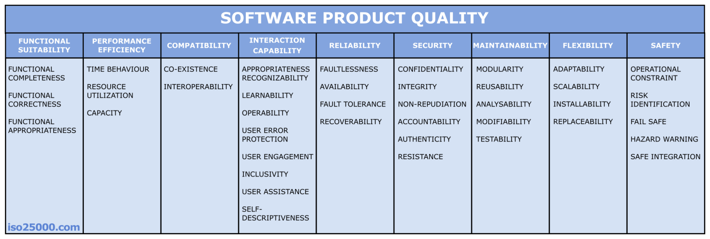
</div>  

Nelle slide (#13) è presente una descrizione accurata di ogni punto.

## Stili Architetturali e Caratteristiche Proprietà di Qualità del SW

- **Client/Server**
    - **Disponibilità**: I server di ciascun tier può essere replicato, quindi anche se uno fallisse non risulterebbe essere un grande problema.
    - **Fault Tollerance**: La richiesta ad un server che fallisce può essere reindirizzata ad una replica, di conseguenza non risulta essere un problema.
    - **Modificabilità**: Molto alta dato il disaccoppiamento e coesione tipici di questa architettura.
    - **Performance**: Di base buona, ma dipende fortemente dalle velocità o dai thread sul server.
    - **Scalabilità**: I server sono replicabili a piacimento, l'unica cosa che potrebbe non scalare facilmente è il DB.

- **Pipes And Filter**
    - **Disponibilità**: Bisogna avere tutti i componenti che formano la catena.
    - **Fault Tollerance**: Un componente rotto deve essere sostituito da una replica.
    - **Modificabilità**: Si, ma solo se riguardano poche componenti.
    - **Performance**: Dipende dalla capacità del canale di comunicazione e dal filtro più lento che potrebbe fare da bottleneck.
    - **Scalabilità**: Può scalare.

- **Publish/Subscribe**
    - **Disponibilità**: Si possono creare cluster di dispatcher.
    - **Fault Tollerance**: Si creano dei dispatcher replica.
    - **Modificabilità**: Si può creare un numero arbitrario di publisher e subscribers, l'unica cosa da dover tenere costante è il formato del messaggio tra i due ruoli.
    - **Performance**: Performance buone ma che devono scendere a compromessi con requisiti come affidabilità e sicurezza.
    - **Scalabilità**: Buona scalabilità, con alta replicazione di dispatcher possono essere gestiti tanti messaggi.

- **P2P**
    - **Disponibilità**: Dipende dal numero di nodi attivi in rete.
    - **Fault Tollerance**: Gratis.
    - **Modificabilità**: Si, se si parla della parte di comunicazione.
    - **Performance**: Dipende dal numero di nodi attivi in rete.
    - **Scalabilità**: Gratis.

# Lezione 14 - Design Pattern Comportamentali (Strategy e State)

- Si suddividono in creazionali, strutturali e comportamentali

## 01 - Design Pattern - Strategy

Pattern Comportamentale

Problemi causati da un `@Override` per cui una sottoclasse si trova a forzare un metodo che ha ereditato. Una soluzione alternativa sarebbe definire un interfaccia specifica per contenere quel comportamento, ma questo implicherebbe la riscrittura dello stesso metodo per ogni classe che lo implementa.

Serve quindi una **strategia** dove si **utilizzano classi intermedie** di **behaviour** tra le **classi finali e l'interfaccia**, modellando quindi i comportamenti uniformi in una classe specifica.

Le classi foglia manterranno privata quindi un istanza del tipo della classe intermedia che permette la modellazione di quel comportamento.

Questo permette di cambiare dinamicamente il comportamento variando il tipo dell'oggetto istanza della classe intermedia.

<div style="text-align: center;">
    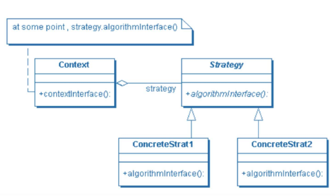
</div>

Quindi l'invocazione al metodo `quack()`, in base alla classe foglia, passerà per l'oggetto istanziato di tipo `Behaviour` che mantiene il comportamento e quindi invocherà l'implementazione fornita nel `Behaviour oggettoComportamento`.

Stiamo quindi utilizzando il concetto di delega presentato durante la lezione precedente.

- **Quando si usa questo pattern?**
    - Quando più classi correlate differiscono solo nel comportamento.
    - Quando servono più varianti diverse di uno stesso algoritmo.
    <div style="text-align: center;">
    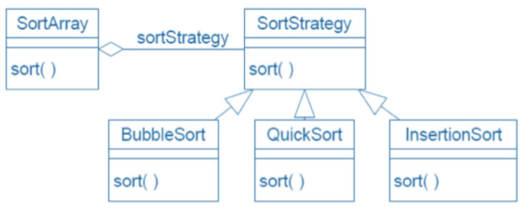
    </div>
    - Quando bisogna definire comportamenti diversi fornendo alternativa all'estensione della classe.
    - Si eliminano costrutti condizionali per determinare il comportamento.
    - Chiaramente richiede l'allocazione di oggetti di supporto che rappresentino il behaviour tramite il tipo.

- **Gestione dei parametri passati al costruttore della classe Context**: Chiaramente se i metodi delle classi reali, se hanno implementazioni diverse, avranno anche una segnatura diversa. Quindi devo gestire i problemi dei parametri del metodo.

## 02 - Design Pattern - State

Pattern Comportamentale

L'**invocazione di metodo** che può variare in base al tipo di comportamento (come in Strategy) **dipende** interamente dal **tipo di stato corrente**.

Ho quindi una struttura simile a prima, il `Context` delega ad un oggetto di tipo `State` definito dall'interfaccia `State`.

La differenza con `Strategy` è che il **metodo definito negli oggetti può causare un cambio di stato**, quindi è come se fosse che lo stato viene modificato dall'interno, come se in `Strategy` venisse **autoiniettato il comportamento** in base all'ultimo **metodo invocato**.

<div style="text-align: center;">
    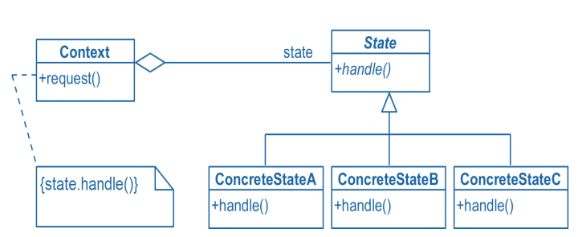
</div>

Quindi senza gestione dello stato lo `State` sarebbe uno `Strategy`

Un invocazione di metodo potrebbe anche portare solo ad un cambiamento di stato.

Ogni oggetto di tipo `State` allora potrebbero scegliere di tenersi un riferimento all'oggetto di tipo Context come `final` invece di richiederlo come parametro nel costruttore.

Posso anche scegliere se lo State sia un `Interfaccia` o una `Abstract Class`.

### Definizione in 6 passi di un Pattern State

Potrebbe essere definita in 6 passi:
- Si crea una **classe** che funzioni da **macchina a stati**.
- Creare una **classe** `State` che replichi i **metodi dell'interfaccia della macchina a stati**.
- Creare delle **sottoclassi** di `State` **per ogni stato del dominio**.
- La classe `Context` **mantiene** lo **stato corrente**.
- Le **richieste del client** sono delegate **dalla classe allo stato corrente**.
- I metodi della classe `State` modificano lo stato corrente.


### Esempio di Traduzione Automa in Pattern State in UML

Dato questo automa:

<div style="text-align: center;">
    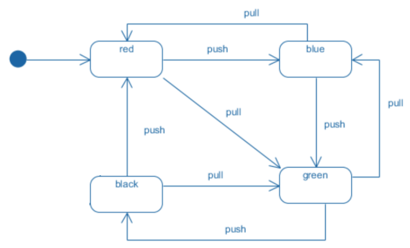
</div>

Lo traduciamo in queste classi:

<div style="text-align: center;">
    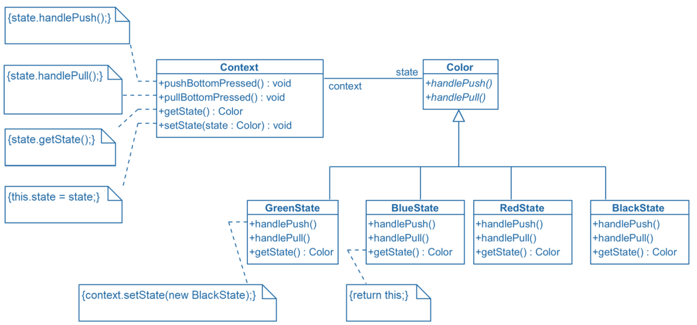
</div>

# Lezione 15 - Design Pattern Creazionali (Factory e Singleton)

## 03 - Design Pattern - Factory

Pattern Creazionali astraggono il processo di istanziazione di oggetti.

Quindi una classe factory ha il ruolo di istanziare oggetti di altre classi.

Di base il comportamento standard per istanziare un oggetto sarebbe:

```JAVA
List list = new ArrayList()
```

Ma in questo modo stiamo violando il principio code to an interface, perchè stiamo invocando il costruttore della classe effettiva e non interagiamo solo con l'interfaccia.

In questo modo posso invocare la factory delle liste, separando l'utilizzatore della lista dall'implementatore della lista.

### Tre Tipi di Factory

- **Simple Factory (aka Concrete Factory)**: Si delega ad un oggetto Factory che gestisce la creazione di istanze delle classi in questione. Possiamo gestire in maniera migliore la factory, splittando le responsabilità indipendenti da quelle comuni.

    Non è una formale classificazione di Factory, ma una **semplificazione della Abstract Factory**.

    ```java
    public class PizzaStore {
            // ===== PARTE INDIPENDENTE AL TIPO
            Pizza orderPizza(String type){
            Pizza pizza;
            // ===== PARTE DIPENDENTE AL TIPO
            if (type == "cheese")
            pizza = new CheesePizza();
            else if (type == "pepperoni")
            pizza = new PepperoniPizza();
            else if (type == "pesto")
            pizza = new PestoPizza();
            // ===== PARTE INDIPENDENTE AL TIPO
            pizza.prepare();
            pizza.bake();
            pizza.package();
            return pizza
        }
    }
    ```
    Possiamo quindi ottimizzare questo schema separando la gestione della parte dipendente e quella della parte indipendente.

- **Factory Method**: Ho una classe `Creator` e si **basa sull'ereditarietà**. Si definiscono quindi:
    - `Creator`: Classe astratta che ha due metodi:
        - `FactoryMethod`: Azioni non specificate nella superclasse, varieranno dopo nelle sottoclassi.
        - `AnOperation`: Azioni condivise, nell'esempio delle slide erano boxare pizza, tagliare pizza ecc... che sono le stesse per ogni tipo di pizza.
    - `ConcreteCreator`: Implementazione reale di Creator
        - `FactoryMethod` in `@Override`: Azioni indipendenti, nell'esempio delle slide erano i vari tipi di pizza ed i loro costruttori e metodi specifici.
    
    Quindi `FactoryMethod` cambia tra le varie Classi Concrete mentre `AnOperation` resta identica tra tutte le classi concrete, essendo implementato nella classe astratta.

    <div style="text-align: center;">
    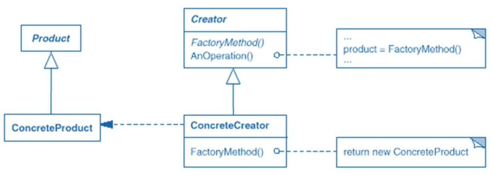
    </div>

    **Commentiamo la rappresentazione classe per classe**:

    - **Product**: Definisce l'interfaccia del tipo di oggetti prodotti dalla `Factory Method`.
    - **Concrete Product**: Implementa l'interfaccia `Product`.
    - **Creator**: Dichiara il **Factory Method** che verrà **implementato** dalle sottoclassi **ConcreteCreator** e implementa con `AnOperation` tutte le operazioni indipendenti dai sottotipi, che le sottoclassi erediteranno.
    - **Concrete Creator**: Sottotipo che sovrascrive il Factory Method per restituire un istanza del preciso sottotipo.

    Chi **opera da interfaccia** in questo caso quindi è la **classe astratta** `Creator.`
- **Abstract Factory**: Basato sulla delega.

    Il client conosce solo l'interfaccia dei prodotti `AbstractProductA` e `AbstractProductB` e l'interfaccia della factory `AbstractFactory` che garantisce la presenza di metodi di **creazione di ciascuno di quei prodotti**.

    <div style="text-align: center;">
    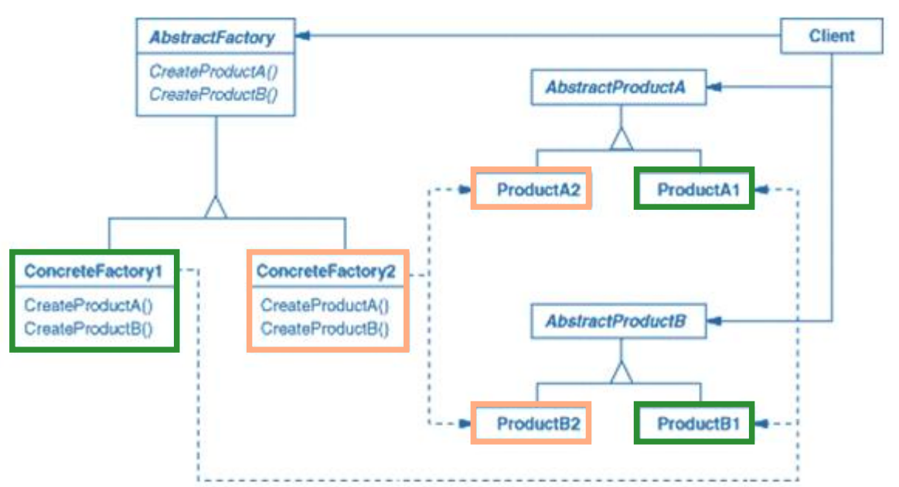
    </div>

### Esempio su Simple Factory vs Factory Method vs Abstract Factory

Assumiamo di voler modellare la produzione di due prodotti: Una TV ed un Remote Control di due Tipi: Philips e Samsung, assumendo questa gerarchia delle classi:

<div style="text-align: center;">
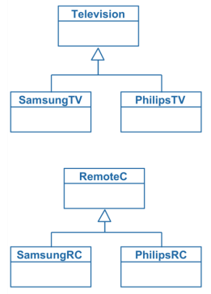
</div>

- Versione in **Simple Factory**:

    <div style="text-align: center;">
    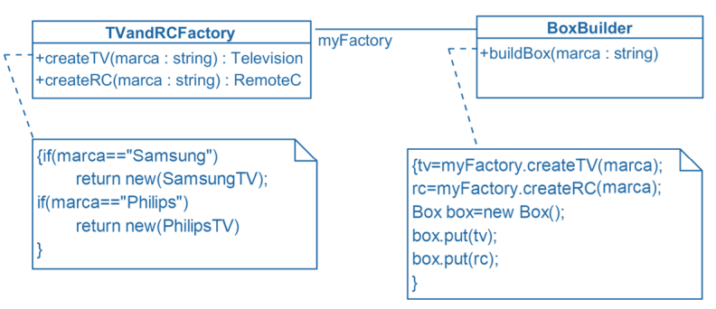
    </div>

- Versione in **Factory Method**:

    <div style="text-align: center;">
    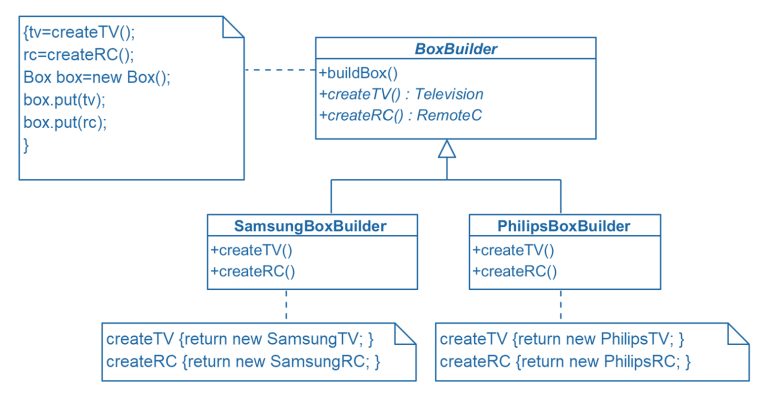
    </div>

- Versione in **Abstract Factory**:

    <div style="text-align: center;">
    
    </div>


## 04 - Design Pattern - Singleton

Si basa sul concetto per cui un oggetto fisico se ha un controllore allora questo deve essere uno, per evitare race conditions sull'oggetto.

### Istanziazione di un Singleton

Le fasi principali sono 3:

- Si rende il costruttore privato
- Si aggiunge un oggetto statico privato, che conterrà l'unica istanza disponibile
- Si rende l'unica istanza disponibile accessibile tramite un metodo statico

Questa è la sequenza formale per istanziare un singleton, ma esiste anche un inizializzazione lazy.

### Singleton e Multithread

Può avere problemi se più thread controllassero la condizione posta nel istanziazione lazy. Esistono quindi tre approcci per risolvere:

- Istanziazione eager
- Sincronizzazione a grana grossa sul metodo che genera il singleton
- Approccio di double locking.

### Singleton e Sottoclassi

Che succede se estendiamo un singleton? Dovrei gestire il metodo che ritorna l'istanza in base al nome della classe o qualche soluzione simile.

In ogni caso vado a infrangere principi di buona progettazione.

Il singleton permette di passare un riferimento ad una classe, invece una classe non posso riferirla direttamente. Quindi è proprio un problema concettuale, non ha senso generare più sottoclassi di una classe di un oggetto caratterizzato dall'essere uno solo.

# Lezione 16 - Design Pattern Strutturali (Decorator, Proxy, Facade e Adapter)

## 05 - Design Pattern - Decorator

Vogliamo preservare il principio Open Closed, cercando di gestire la proliferazione di classi e design rigido oppure funzionalità aggiunte alla classe base ma inappropriate per alcune sottoclassi.

Questo design pattern è anche detto **wrapper**.

<div style="text-align: center;">
    
</div>

Le classi foglia **in questo esempio** sono classi reali e radice e nodi intermedi sono classi astratte. Le classi reali decoratori mantengono un riferimento grazie ad una variabile di tipo della classe astratta radice.

<div style="text-align: center;">
    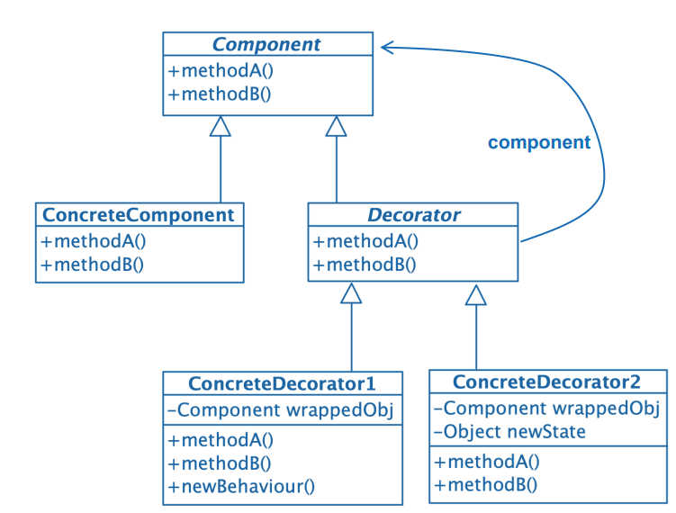
</div>

In questo modo si definisce anche come il comportamento è definito per delega, data la variabile mantenuta nelle classi decoratrici, il fatto che siano tutte classi che ereditano da `Beverage` è solo una questione di tipo.

### Pro e Contro dell'Utilizzo di Decorator

- **Pro**:
    - Più flessibile rispetto all'ereditarietà statica.
    - Più semplice rispetto all'ereditarietà multipla.
    - Permette la combinazione tra proprietà, anche se stessa.
    - Favorisce l'aggiunta incrementale di feature.
- **Contro**:
    - Se aumenta la complessità, il decorator diventa costoso.
    - Si aumenta la frammentazione del sistema, tendiamo alla definizione di un sistema come composizione di elementi molto piccoli.

## 06 - Design Pattern - Adapter

Converte l'interfaccia di una classe nell'interfaccia attesa dal cliente, tramite delega riferisce al metodo reale ma tramite un metodo che lo invoca.

<div style="text-align: center;">
    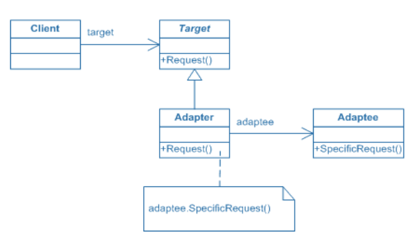
</div>

- Target: Interfaccia utilizzata da client.
- Client: Interagisce con oggetti conformi all'interfaccia.
- Adaptee: Definisce un interfaccia esistente da adattare.
- Adapter: Adatta l'interfaccia di Adaptee per renderla conforme a quella di Target.

## 07 - Accenno Design Pattern - Facade

Design pattern per il quale, se si hanno molte classi ed interazioni con esse, si definisce un **punto di accesso unico**, semplice, nascondendo i dettagli complessi del sottosistema.

## 08 - Design Pattern - Proxy

Un client comunica con un interfaccia, ed un proxy è dello stesso tipo dell'interfaccia originale. Questo permette al client di non accorgersi dell'utilizzo di un proxy grazie all'utilizzo della stessa interfaccia.

<div style="text-align: center;">
    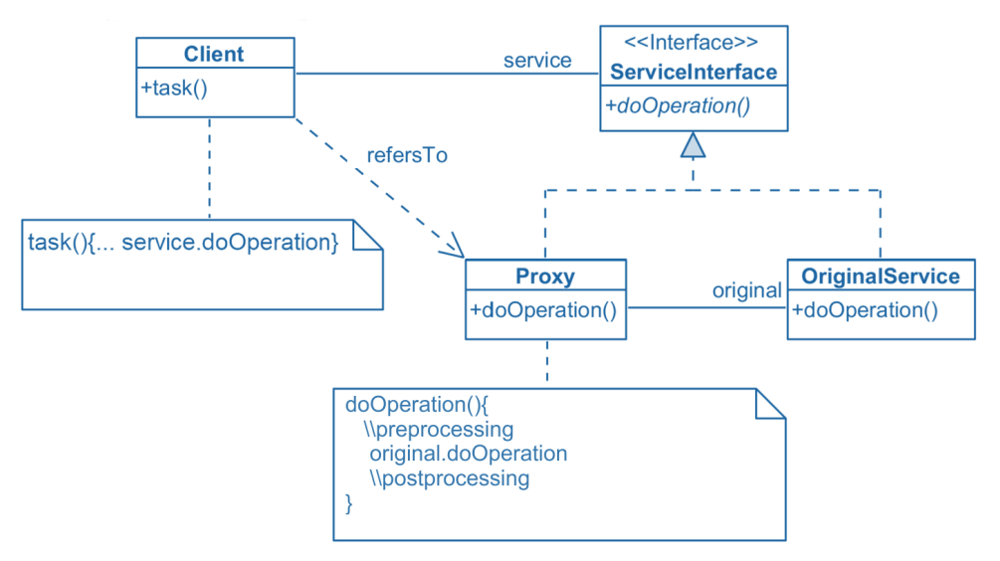
</div>

Si nota infatti che entrambe le classi `Proxy` e `OriginalService` sono dello stesso tipo, ossia l'interfaccia `ServiceInterface`.

### Tipi di Proxy

- **Remote Proxy**: Permette l'accesso ad oggetti remoti tramite serializzazione e deserializzazione.
- **Protection Proxy**: Implementa dei controlli.
- **Cache Proxy**: Mantiene coppie di richieste-risposta.
- **Synchronization Proxy**: Gestisce accessi concorrenti ad un servizio.
- **Virtual Proxy**: Permette di interfacciarsi al servizio prima che il servizio sia realmente in funzione.

# Lezione 17 - Esercitazione Design Pattern

## Esercizio 1 - Utilizzo pattern Singleton per gestire la creazione e l'accesso ad un oggetto CalendarioTurni

** Vedi slide **

## Esercizio 2 - Utilizzo pattern Strategy per la gestione di implementazioni diverse ad un metodo di cui è data la segnatura

** Vedi slide **

## Esercizio 3 - Utilizzo pattern Adapter per un metodo dato da una nuova classe rispettando l'Open Closed

** Vedi soluzioni slide, molto utile e chiaro per definizione di adapter **

## Esercizio 4 - Utilizzo pattern Factory Method

- Fondamentali le operazioni in comune all'inizio che portano alla scelta di questo pattern, perchè le assegnazioni iniziali saranno in comune a tutti i tipi di turni che genererà la Factory.

## Esercizio 5 - Utilizzo pattern Abstract Factory

** Vedi Slide **

## Esercizio 6 - Utilizzo pattern Proxy

** Vedi Slide **

### Esercizio 6.1 - Combo Proxy/Adapter

** Vedi Slide **

### Esercizio 6.2 - Combo Proxy/Strategy

** Vedi Slide **

## Lezione 18 - Verifica e Validazione

È **indecidibile** testare tramite un algoritmo se un altro algoritmo dato in input **sia o meno corretto**, dato che già è indecidibile capire se termini o meno.

Le tecniche di testing sono dette **stime ottimistiche**, dato che non potrò mai con il testing dimostrare formalmente che il programma sia corretto.

Esistono anche tipologie alternative come **stime pessimistiche** e per **proprietà semplici**, quali ad esempio correttezze statiche, triple di Hoare.

- Anche verificare se le triple di Hoare siano corrette o meno tramite un algoritmo è non decidibile.

### V&V (vedi slide)

### Fasi di Testing 

- (vedi slide)
- (vedi slide)
- Valutazione in **alpha/beta** test.
- Controllo delle release successive: Test e analisi del nuovo codice, ripetizione dei test, test di regressione, distinzione delle versioni.
- Miglioramento del processo

### Validazione VS Verifica

- Convalida: Risponde alla domanda: "Stiamo costruendo il sistema che **serve all'utente**?".
- Verifica: Risponde alla domanda: Stiamo costruendo un sistema che **rispetta le specifiche**?".