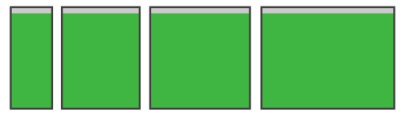
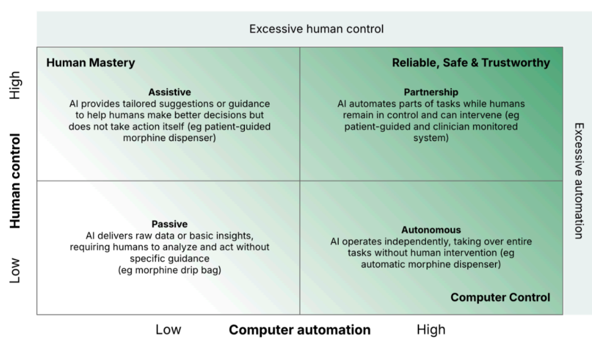
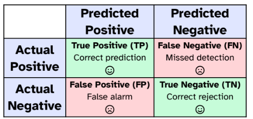

# Lezione 1 - Prodotto e Design dell'Interazione Uomo Macchina - 18/09/2025

- Obiettivo del corso: Fornire gli strumenti necessari a **comprendere** e gestire il **processo di sviluppo delle interfacce** e dei prodotti interattivi.
- L'**interazione** infatti tra **utente e prodotto** va progettata in modo tale da far sentire l'**utente a suo agio**.
- **Design**: Processo di progettazione e pianificazione, ma in italiano allo stesso tempo indica anche l'output stesso di questo processo.
## Pensiero Computazionale vs Design

- **Pensiero Computazionale**: Suddivisione di un **problema** in tanti **sottoproblemi** ed **approccio algoritmico** per la soluzione di ciascuno dei sottoproblemi identificati.
- **Design**: Non si pone l'obiettivo di risolvere il **problema** ma di **comprenderlo** nel suo insieme. Questo vuol dire che se esiste un problema di cui l'utente non è a conoscenza, allora per il design non è presente alcun problema.

Questo non implica che questi due elementi siano in mutua esclusione, anzi devono spesso coesistere.

## Interaction Design

L'obiettivo della **progettazione d'interazione** è quello di rendere macchine e **sistemi il più usabili dagli utenti**. Bisogna che al **centro** dello sviluppo siano messi i **bisogni degli utenti**. Nel nostro caso parleremo quindi di **Human Machine Interaction** (HMI) nello specifico.

Quindi l'Interaction Design si compone di **tre discipline**:

- **Product Design**: Progettazione di beni e servizi il cui obiettivo è quello di essere utilizzati da più utenti possibili.
- **User Experience Design**
- **User Interface Design**

# Lezione 2 - UX/UI e Human Centered Design - 19/09/2025

## UX - User Experience Design

- Lo scopo dell'UX Design è quello di **soddisfare il cliente**
e di renderlo più fedele al prodotto migliorandone l'**usabilità**. Questi aspetti possono ad esempio essere analizzati con una heatmap che mantiene traccia della navigabilità dell'app da parte dell'utente.
- E' anche ruolo del marketing quella di integrare tutti gli **aspetti di business, marketing e sviluppo del prodotto**.
- **Non puoi progettare** l'UX, ma puoi **progettare per** l'UX: Questo vuol dire che se un tecnico ha definito un interfaccia, **non potrà** mai prevedere il **comportamento di un utente**. Puoi invece progettare per l'UX, cercando di **immedesimarsi in un User**.
- **L'output "atteso"** alla fine di questa fase **non è un interfaccia**, ma una lista di **requisiti delle necessità degli utenti**.
- L'**obiettivo ideale** di questa fase è quella di **mettere a suo agio l'utente** nel momento in cui dovrà utilizzare il prodotto.

### UI - User Interaction Design

- L'UI Design è parte della UX Design, dopo un prodotto della UX viene fatta la UI Design.
- Quindi questa fase è la **creazione** di un **interfaccia**, **dopo** aver eseguito un **analisi della UX**.

## Human Centered Design

- La **capacità umana** di **adattamento allo sviluppo tecnico è bassa**, lo sviluppo tecnico è molto rapido.
- Il fondamento quindi è sviluppare software che sia amabile, in modo tale da stabilire un interazione tra l'uomo e la macchina. Da immaginare come una relazione tra uomo ed un altra specie, in **completa opposizione** all'**approccio tecno-centrico**, dato che rallenta la diffusione di un software.
- **Design antropocentrico**: si inverte il paradigma di progettazione mettendo l'utente al centro del processo. Questo approccio è normato dalla ISO. Non bisogna progettare per delle persone ideali che si comportano come vorremmo, ma progettare per come realmente sono.
- Molto spesso **l'utente non sa nemmeno cosa vuole** (simile al discorso della raccolta requisiti), di conseguenza risulta **necessario osservare l'utente** e non solo chiedere cosa vuole.
- L'obiettivo è creare empatia tra il SW e l'utente.
- Il **costo di transizione** è il costo principale per un utente per il cambiamento di prodotto (es. Edge vs Chrome a lezione delle tab. verticali).
- E' necessario pensare in maniera creativa ed iterativa seguendo le **fasi** di:
    1. **Proposta**
    2. **Test**
    3. **Analisi**
- **Flusso del processo** di **HCD (Human Centered Design)**:
    - Specificare il contesto d'uso
    - Specificare i requirements
    - Progettare la soluzione
    - Testare e valutare
- Le **metriche di utilizzo** sono pilastro dello **sviluppo HCD**, perchè ci permettono di **orientarci** studiando l'esperienza utente.


# Lezione 3 - Principi d'Interazione - 25/09/2025

## Progettazione dell'Interazione

1. **Discoverability**: Capacità di un sistema di comunicare i propri possibili usi all'utente. Il prodotto si autointroduce?
Questa proprietà dipende dall'utente a cui stiamo dando il prodotto.
Questo principio (**discoverability**) si basa su altri 6 principi psicologici:
    - **Affordances**: Un oggetto ha delle **proprietà** e un utente ha delle **capacità**. Il **rapporto** proprietà/capacità è detto affordance, quindi questa **NON è una proprietà dell'oggetto** ma un rapporto oggetto/utente. Ne è un esempio la vite del tappo della candeggina, che consente l'apertura ad un adulto ma non ad un bambino, chiaro esempio di **affordances**. Esiste anche un anti-affordance, ossia prevenzione d'interazione tra oggetto e utente. Le affordances non sono da subito chiare ma utilizzando il prodotto.
    - **Signifiers**: Elemento del design detto **significante** perchè da appunto **semantica** ad una **affordance**. Quindi le affordance non possono essere posizionate nel prodotto, solo i **signifiers possono essere posizionati**, e diranno **dove**, **cosa** e **perchè**. Questi però vanno usati con parsimonia, seguendo il paradigma Less is More. 
        - **Signifiers Intenzionale**: Segnali come "spingi" sulle porte.
        - **Signifiers Accidentale**: Azione compiuta da tanti potrebbe diventare involontariamente un signifier.
    - **Constraints**: Vincoli (vedi lez. successiva).
    - **Mapping**: Solitamente il **map** tra **affordances** e **signifiers** viene fatto per **convenzione**, però **dipende** fortemente **dal background dell'utente**. Questo mapping quindi può risultare ambiguo per utenti e non ambiguo per altri (esempio dell'indicatore del galleggiante di mezzi europei oppure giapponesi).
    - **Feedback**: L'utente si aspetta sempre un risultato da un azione che ha effettuato. L'utente associa la reazione dell'interlocutore come associata all'azione appena compiuta se il feedback arriva entro al massimo di $100 ms$. Lo stesso avviene con i SW, motivo per cui si preme più volte sui bottoni proposti, dato che l'utente ha il dubbio di non aver fatto nulla. 
    Il feedback deve essere informativo, solitamente viene anche fatto **prima** di una potenziale chiamata ad un API. Un feedback può essere anche **poor**, come ad esempio una lavastoviglie che ci informa di aver finito il suo ciclo alle tre di notte. I **poor feedback** sono **peggio di feedback mancati**, **perchè rendono inutili anche i feedback progettati bene**.

2. **Understanding**: Capacità di un sistema di comunicare il proprio corretto utilizzo.

# Lezione 4 - Conceptual Models - 26/09/2025

Un modello concettuale è una maniera semplice e schematica per spiegare come funziona qualcosa.

La **gestione logica dei file** in **file systems** non esisteva prima, ma qualcuno ha creato un **modello concettuale** basandosi sul **esempio reale di libreria**.

La **semplificazione** di un sistema mette in discussione le sue funzionalità. Ne è un esempio i file disponibili o meno in cloud, perchè la semplificazione sull'accesso ai file era si una bella astrazione ma la tecnologia del tempo di DropBox non era al passo con l'astrazione del modello concettuale stesso.

## Mental Model vs Conceptual Model

Un **Mental Model** è l'**interpretazione dell'utente** del **Conceptual Model** a cui si sta interfacciando. L'**obiettivo** del designer è quello di permettere il **fitting** tra **Mental Model** (dell'utente) e **Conceptual Model** (del designer).

Questo si applica molto bene alle lettere sui tastierini numerici dei vecchi telefoni. Quello è un conceptual model basato sul fatto che negli USA era possibile comprare e chiamare stringhe alfanumeriche. Il nostro Mental Model però non fitta perchè nella nostra cultura questo non era mai stato utilizzato.

## System Image

Sono istruzioni e guide per l'utente per interfacciarsi al Modello Concettuale.

Quindi:

1. Designer **progetta** un Design/**Conceptual Model**
2. Il designer deve comunicare qualcosa per rendere più probabile che **il Mental Model del utente fitti** il **Conceptual Model**, questa comunicazione avviene proprio tramite la **System Image**. Va "raccontato" all'utente il funzionamento di un prodotto e di come ci siamo immaginati che si utilizzi quel prodotto.

## Changing Conventions

All'utente solitamente risulta pesante ogni cambiamento effettuato al prodotto. Se le convenzioni vengono violate allora è necessario nuovo apprendimento da parte dell'utente. Di conseguenza nella progettazione risulta necessario mantenere consistenza, in modo tale da rendere il meno possibile frustrante la nuova esperienza d'apprendimento.

## Constraints

Noi capiamo come agire spesso in risposta a vincoli. Sviluppo quindi un modello concettuale in base a questi vincoli, che sono di 4 tipi:

1. Fisico
2. Culturale
3. Semantico: I cartelli semafori sono il più semplice esempio di vincolo semantico. Viene assegnato arbitrariamente un significato a dei segni.
4. Logico: Si evince un vincolo logico "intuendo".

**Esempio del Lego**: il fitting tra Conceptual Model e nostro Mental Model è completamente composto dai vincoli, che ci permettono di montare il lego senza istruzioni.

### Forcing Functions

1. **Interlock**: A volte i vincoli diventano **forcing functions**, ossia viene forzato il funzionamento completamente da un vincolo, ad esempio un tappo di un frullatore, se non inserito il prodotto non si avvia. Ma anche un 2fa è un **interlock** perchè senza 2fa non vogliamo che un utente possa utilizzare la nostra app. Quindi un **interlock** forza **operazioni** ad essere **eseguite** in una **sequenza prestabilita**.
2. **Lock-in**: Il lock-in mantiene un operazione attiva, **evitando** che **l'utente possa terminarla prematuramente**. Un classico esempio è il pop up che si apre in chiusura di un editor di file, previene la chiusura involontaria.
3. **Lock-out**: Il lock-out previene che un operazione in ingresso venga effettuata involontariamente, è necessario che l'utente riconfermi la propria operazione. Un classico esempio è il pop up che chiede di essere maggiorenni per poter accedere.

# Lezione 5 - Golfi di Esecuzione e Valutazione - 02/10/2025

## User Goals and Interaction

Il principio di **interazione** si basa su elementi di **sfida** in modo tale da capire come **fornire input** per ottenere uno **specifico output**.

## Definizioni di Golfo di Esecuzione/Valutazione

- **Golfo di Esecuzione**: Come mi posso interfacciare per fornire i miei input.
    - **Definizione**: sforzo mentale per tradurre obiettivi in azioni fisiche.
    - Ponte tra Intento e Azione.
    - Strettamente legato alle Affordances
    - Correlato all'esecuzione fisica dell'azione.

    L'idea sarebbe quella di compensare questo golfo utilizzando dei ponti. L'utente interagirà con il sistema, definendo il golfo, attraverso:
    - Le intenzioni, il goal dell'utente
    - Le azioni che eseguirà
    - Interfacciarsi con l'input da fornire al sistema

- **Golfo di Valutazione**: Capire cosa sia successo, nel momento in cui entro a contatto con l'output prodotto.
    - **Definizione**: Comprendere lo stato del sistema, capire se i cambiamenti percepiti hanno mosso il sistema verso il goal.
    - L'user richiederà quindi un feedback continuo riguardo i risultati e lo stato corrente del sistema.
    - **Obiettivo**: Gli utenti devono aver capito come funziona il sistema.

    Il golfo di Valutazione quindi è all'inizio valutato come semplice da compensare ed attraversare con un ponte, ma in realtà va definito tramite tre elementi:
    - Interfaccia (display) del sistema
    - Interpretazione
    - Valutazione

## 7 Stati dell'Azione

- La possibilità di saper utilizzare un prodotto non dipende esclusivamente dall'utente ma anche dal modo in cui il prodotto si pone. Molto spesso se non so come interfacciarmi con un sistema è anche causato dal sistema stesso.

- Descrizione degli Stati:
    - **Golfo d'Esecuzione**:

        1. **Specificare** il Goal
        2. **Pianificare** il Goal
        3. **Specificare** il Goal
        4. **Eseguire**
    - **Golfo di Valutazione**:

        5. **Percepire** l'Esito
        6. **Interpretare** l'Esito
        7. **Comparare** l'Esito 

- Spesso queste **fasi** sono **iterate** oppure basate su **feedback loop**, ossia che si interrompono su una specifica fase per testarla.

### Domande e Checklist per le 7 Fasi dell'Azione

- Domande per quella fase (per definire il ponte):
    - **Golfo d'Esecuzione - Feed Forward**:

        1. Cosa voglio ottenere?
        2. Quali sono le alternative?
        3. Cosa posso fare e come lo faccio?
        4. Esecuzione.
    - **Golfo di Valutazione - Feed Back**:

        5. Cosa è successo?
        6. Cosa vuol dire?
        7. E' quello che volevo fare?

### Funzionamento Feed Forward e Feed Back

- **Feed Forward**: si basa sull'utilizzo appropriato di signifiers, vincoli e ???
- **Feed Back**: ???

### I 7 Principi Fondamentali del Design - Ulteriore Presentazione

- Discoverability: Determinare il corrente stato del sistema.
- Feedback: Avere un esito da un azione eseguita per definire lo stato del sistema.
- Modello Concettuale: Proiezione del sistema che porta ad una convinzione ed un buon feeling sulla comprensione del sistema.
- Affordances: Rende possibili le azioni che l'user vuole eseguire.
- Signifiers: Migliora la discoverability per rendere migliore la comunicazione tra sistema ed utente.
- Mappings: Link tra funzionalità e layout presentato all'utente.
- ?:?

### Opportunistic vs Planned Actions

- **Azioni Opportunistiche**: Non tutto è risolvibile con un algoritmo, il comportamento trae vantaggio dalle circostanze attuali, invece che pianificare ed analizzare il range di azioni, e appena è presentata l'opportunità viene eseguita un azione. Si basa sul pensiero del subconscio.

- **Azioni Pianificate**: Richiedono più effort e pianificano algoritmicamente tutto il comportamento. Si basa sul pensiero conscio. L'**overlearning**, dopo anni d'esperienza, rende azioni pianificate ad azioni opportunistiche.

Vengono effettuati quindi processi di pattern matching del pensiero del subconscio, invece il pensiero conscio è più algoritmico.

## Livelli di Brain Processing

- **Livello Viscerale**: Ci permette di rispondere velocemente, senza controllo o awareness dell'azione che stiamo compiendo. Le risposte viscerali sono rapide ed automatiche e si basano sui concetti di buono, cattivo, pericoloso...
Da un **punto di vista di design**, molta risposta alla presentazione di un prodotto è viscerale, bravi designer utilizzano questi design estetici che tranquillizzino gli utenti in maniera primordiale. E' il livello più a contatto con il mondo.
- **Livello Comportamentale**: Si basa sulle skill acquisite e triggerate da situazioni che matchano il pattern. Le azioni di questo livello sono largamente appartenenti al subconscio, anche essendo consapevoli della situazione, non siamo coscienti del processo nello specifico. Il feedback è parte critica di questa fase sulla gestione delle aspettative, il tutto si basa su un feedback loop in relazione alle aspettative. Esiste un processo di nudging, guidando l'utente alla formazione di un modello mentale aderente al modello concettuale del sistema.
- **Livello Riflessivo**: Livello di analisi, conscio decision-making, ragionamento profondo. Solitamente la fase riflessiva è lenta, profonda e cognitiva. I livelli di emozioni più alti vengono dal livello riflessivo, qui assegno e peso tutti i feedback ottenuti essendo che sto anche pagando di più da un punto di vista di risorse mentali. Da un **punto di vista di design**, sappiamo che le scelte effettuate in questo livello sono quelle più durature, formano la memoria dell'utente sugli eventi accaduti. L'appeal di questo livello causa ad esempio una review positiva/negativa. ?MAPPING PRESENTE NELLE SLIDE (INSERISCI L'IMMAGINE)?

# Lezione 6

# Lezione 7 - - 16/10/2025

# Lezione 8 - Human Errors and Mitigation Strategies - 17/10/2025

## Errori e Causa

- La maggior parte degli errori è causata dall'uomo
- L'errore comune del designer è quello di considerare che l'utente interagirà continuamente al massimo dell'attenzione con l'applicazione in questione
- Quindi **interruzioni** e **comportamenti ripetitivi** spengono l'attenzione dell'utente. Può accadere quindi che una fase potenzialmente importante, che richiederebbe davvero l'attenzione dell'utente, viene approcciata con poca attenzione, ormai persa.
- E' una **bad practice** quella di **dare la colpa all'utente** per un cattivo utilizzo del prodotto. Questo non porterebbe nulla di vantaggioso al design del prodotto stesso, a massimo si cerca la colpa lato progettazione.

### Route Cause Analysis

Gli incidenti avvengono a causa di insiemi di sorgenti. Quindi vanno seguiti dei principi, come ad esempio limitando il dominio dell'utente, per limitare i potenziali casi di errore. Si acquisiscono quindi ad esempio le analitics degli utenti e poi si segue lo schema **The Five Whys**, ossia non basta chiedersi solo una volta perchè è stato commesso un errore ma tante volte (ad esempio 5 volte).

### 5 Motivazioni per cui Chiedersi 5 Perchè

- Identificare la causa e non curare solo i sintomi.
- Rendere oggettivo il mondo, per rendere evidente tramite dati delle scelte
- Migliorare problemi sul prodotto per il bene generato.
- Ricercare miglioramente e accettare il cambiamento.
- Embrace della cultura del progresso.

## Classificazione di Errori

Suddivisi in due macroclassi: **slips** e **mistakes**:

- **Slips - (Tradotti come Lapsus)**:
    - **Action Based**: Azioni svolte in "autopilot", lapsus di azione, pianifico e specifico bene l'azione ma la eseguo in maniera sbagliata. 
    
        Esempio: "Devo uscire di casa con la moto, prendo le chiavi, ho preso le chiavi della macchina."
    - **Memory Lapse**: Non eseguo l'azione. 
    
        Esempio: "Devo uscire di casa con la moto, non prendo le chiavi"
- **Mistakes - (Tradotti come Errori Cognitivi)**:
    - **Knowledge Based**: L'user non ha capito il funzionamento, di conseguenza ha un modello mentale disallineato dal modello concettuale progettato.
    - **Rule Based**
    - **Memory Lapse**: Dimenticanza, come se fosse un lapsus di memoria nello stato di transizione tra i golfi, che causa un interruzione nelle fasi di pianificazione.


## Feedback e Utenti Esperti

Abbiamo già detto come il feedback sia utile ad un utente, ma diventa inutile per gli utenti esperti, ad esempio il feedback speech può risultare pesante ed inutile in determinati contesti.

## Error Prevention

- Capire le cause degli errori per minimizzarle.
- Fare sensibility check, solitamente magari non viene mai fatta un azione e quindi viene effettuato un secondo check prima di effettuare l'operazione. Esempio: "Solitamente la media del bonifico è 2000$, ne viene effettuato uno da $20000 allora si chiede una conferma esplicita."
- Possibilità dell'azione di undo.
- Rendere semplice per l'utente capire quale sia l'errore.
- Non bisogna trattare azioni distanti da quelle attese come errori.

### Constraint to Block Errors

Vedi Slide

### Conferme e Messaggi d'Errore

Vedi Slide

### Minimizzazione Slips

Difficile pensare di diminuire gli slips degli utenti, quindi gli slips devono essere fatti ma senza danni. Non devono essere eliminati gli errori, ma **bisogna fare in modo** che quegli **errori non causino incidenti**

### Key Principles

- Bisogna mettere l'utente nella posizione di sapere tutto il necessario per operare con la nostra teconologia.
- Vedi slide
- Bisogna progettare per colmare la distanza tra due golfi

# Lezione 9 - Information Architecture - 23/10/2025

## GUI Design in Generale

- Il design di interfacce grafiche si basa sull'anticipare cosa l'utente vuole fare, garantendo che quest'ultimo abbia gli strumenti di cui ha bisogno. La progettazione di queste intefacce si basa su concetti di **interaction design**, **visual design** e **information architecture**.

- Questo design quindi si basa su una rappresentazione a strati, ossia:
    1. **Data and Content**: Information Architecture
    2. **Functionality, Inputs and Outputs**: ...
    3. **Presentation Layer**: ...

- Focus di questa lezione è il **layer di Data and Content**, che ha anche maggiore priorità rispetto agli altri layer dato che definirà dei constraint per i livelli successivi.

## Users Behavior Patters

- Pattern più a basso livello di come un utente si interfaccerà con il prodotto, nello specifico con la UI.

- L'analisi di questi pattern ci permette di applicare uno studio a prescindere dal contesto di progettazione.

1. **Self Exploration**: Esplorazione senza che l'utente possa perdersi o fare azioni pericolose.
    - Spesso l'utente skippa l'onboarding o non legge il manuale.
    - I primi momenti saranno dedicati all'esplorazione dell'utente, e l'interfaccia deve essere progettata in questa direzione.
    - Quindi creare possibilità di esplorazione, ad esempio tramite menù, che indichi il modo per interagire con l'applicazione.
2. **Instant Gratification**: L'utente vuole essere gratificato al momento dell'esecuzione dell'azione.
    - Le prime azioni dovrebbero essere assolutamente semplici per gratificare e direzionare l'utente ad un buon rapporto con l'interfaccia.
    - Successivamente può diventare difficili, ma l'ingresso confident dell'utente può spingerlo a continuare.
    - Da evitare lunghe istruzioni, tempi di caricamenti lunghi o pubblicità vanno contro questo pattern.
3. **Satisficing**: Buono abbastanza, meglio qualcosa che funziona adesso che qualcosa che funzionerà meglio dopo.
    - Satisficing: Satisftying + Sufficing.
    - Bene abbastanza è meglio di ottimo in relazione all'investimento di tempo e impegno.
    - Scelta delle etichette che non generi confusione tra i significati nell'interfaccia.
    - Cambiare qualcosa dell'interfaccia, anche se dovesse velocizzare i processi dell'utente, questo probabilmente troverà comodo non cambiare e restare nella routine di cui è abituato, diventa quasi una sorta di debito nei confronti del design, dato che durante la progettazione bisogna trovare un compromesso con questo effetto.
4. **Changes in Midstream**: L'interfaccia non deve chiudere l'utente in un ambiente con poche scelte. La navigazione dovrebbe essere globale, per permettere all'utente di spostarsi senza perdere lo stato corrente.
5. **Deferred Choices**: Rispondere al minimo richiesto, l'utente non risponde a domande non necessarie, quindi bisogna permettere di rispondere dopo.
    - Bisognerebbe fornire valori dei campi di default.
6. **Incremental Construction**: Bisogna dare all'utente la possibilità di affinare dopo l'azione che sta eseguendo.
    - Soprattutto in applicazioni creative, bisognerebbe tenere gli utenti in uno stato di flow, quindi aumentando la skill dell'utente dovrebbe aumentare anche la difficoltà dell'interfaccia.
7. **Habituation**: Le gesture spesso sono molto legate ad una familiarità di azioni eseguite altrove.
    - Capire cosa le persone sanno, per fare in modo di poter supportare quei comportamenti.
8. **Microbreaks**: Le interfacce devono supportare questo comportamento per cui gli utenti tendono a fare delle pause tra i task.
9. **Spatial Memory**: Spesso gli utenti legano una funzionalità rispetto alla posizione della sua etichetta.
10. **Prospective Memory**: Lo stesso concetto di lasciare non letta una mail, voglio fare in modo che si supporti l'utente con piccoli reminder.
11. **Streamlined Repetition**: Comportamenti ripetitivi vanno resi rapidi, permettere ad esempio la selezione multipla nello spostamento di file.
12. **Keyboard Only**: Sono date per scontate le shortcut, come `ctrl-s`, `ctrl-z`, ...
13. **Other People's Advice**: Spesso le persone sono influenzate da scelte di altri. Spesso quindi online community sono grandi asset per un servizio.

### Systematic Ways to Support Patterns

**vedi dettagli slide**

- Organizing content
- Structuring navigation
- vedi slide
- vedi slide

## Information Architecture

L'**obiettivo** di questa architettura è quello di aiutare **gli utenti a trovare le informazioni** che cercano.

Si basa tanto sul contenuto, dal contesto e dagli utenti a cui punta.

### Organization Schemes

Come viene categorizzato il contenuto della nostra interfaccia? Questo può essere definito da **schemi esatti o soggettivi**, che **non sono tra loro mutuamente esclusivi**.

1. **Exact Organization Schemes**: Dividere informazioni in sezioni mutualmente esclusive. Di carattere molto **data-driven**:
    - Lo schema alfabetico è un esempio classico di questo tipo di schema.
    - Lo schema temporale (in base alla data)
    - Lo schema geografico 


2. **Subjective Organization Schemes**: Non sono oggettivi ma dipendono dagli utenti. Difficili da modellare perchè devono essere aderenti al modello mentale dell'utente. Degli esempi potrebbero essere:
    - **Topic Schema**: Ad esempio le sezioni di Netflix in apertura.
    - Task Schema: Schema che cercano di guidare l'utente nei task che deve effettuare.
    - **Audience Schema**: Clusterizzare in base al segmento utente (bambini, adulti...)
    - **Metaphor Schema**: Usare metafore per clusterizzare funzionalità (come il cestino come astrazione sopra fs di un sistema).

Queste tipologie possono essere combinate tra loro generando **schemi misti**

### Organizational Schemes

Vanno definite delle relazioni tra pezzi di content. Esistono quattro main strutture organizzative:
- **Modello Gerarchico**: Da categorie generali di informazioni scendendo giù verso informazioni precise (a simil albero). I menù a tendina sono i classici esempi di strutture gerarchiche.
- **Modello Sequenziale**: Informazioni definite step-by-step, un classico esempio è il checkout di Amazon.
- **Modello Matriciale**: Ogni utente può definire il proprio path di navigazione, un esempio classico è la navigazione di HTML.
- **Modello a Database**: Permette la ricerca dell'informazione, classico esempio Google.

Bisogna considerare che anche allo **scalare delle informazioni**, lo schema scelto deve risultare **sostenibile**, permettendo e facilitando la crescita del sistema.

Si **evitano** strutture che siano **troppo verticali o troppo orizzontali**.

Un interfaccia deve essere **findable**, al sapere di che informazione sto cercando devo essere in grado di trovare quell'informazione nell'interfaccia, garantendo quindi una **buona navigazione**. Una struttura gerarchica quindi potrebbe non risultare molto efficace se non conosco a priori il path per raggiungerlo. Quindi una **search bar** in questo caso migliorerebbe la **discoverability**. Quindi vanno considerate contemporaneamente sia discoverability sia findability.

### Interfaces Components

Si utilizzano elementi standard che siano familiari con gli utenti:

- **Input Controls**: vedi slide
- **Navigational Components**: slider, paginazione, tags, icone
- **Informational Components**: modali, messages boxes, icone
- **Containers**: vedi slide

# Lezione 10 - Innovation Methods - 24/10/2025

## Sustaining vs Disruptive Innovation

Esistono due tipi di innovazione, ossia la **costruttiva** e la **distruttiva**:

- **Sustaining Innovation**: Basata sull'innovazione incrementale, vengono quindi effettuate microinnovazioni su sistemi già esistenti.
    - Mercato di riferimento rimane lo stesso, mercato prevedibile-
    - I big player non hanno motivo di distruggere il mercato innovando in maniera eccezionale.
    - Mercato già esistente che resta lo stesso nel tempo.
- **Disruptive Innovation**: Basata sull'innovazione estrema, che spazza via tutto il mercato costruito fino a quel momento. Un esempio potrebbe essere Spotify che entra sul mercato rinnovandolo del tutto.
    - Creazione di un nuovo mercato.
    - L'innovazione è pesante
    - La disruptive è pesantemente Human Centered, spesso l'innovazione estrema cerca di mettere come focus la persona e i vantaggi che porta a quest'ultimo.

Non per forza tutte le innovazioni sono distruttive, anche se rivoluzionarie. Esempio: Non è stato il motore a scoppio (lato tecnico) ad avviare l'utilizzo massiccio di macchine, ma dello studio di come poteva essere posizionato nel mercato (lato economico).

## Product Manager vs Project Manager

Il **product manager** analizza il mercato, analizza il mercato con le user stories e produce un backlog da consegnare ad un **project manager**.

Quindi esiste una profonda differenza tra Product Management e Project Management.

## Human Centered Design Process

L'HCI è una forma mentis, l'HCDP è un processo che permetta di generare qualcosa che sia HCI. Quindi si definisce un metodo a step, detto metodo a **doppio diamante**, definita a divergenza e convergenza:

### Modello a Doppio Diamante

- **Fase Inspiration**: User Stories.
- **Fase Ideation**: Scenarios.
- **Fase Implementation**: Implementazione.

Le fasi in parallelo invece sono quelle divergenti e convergenti:

- **Fase Divergente**: Si lascia libertà alle persone del team di essere creativi.
- **Fase Convergente**: Si definisce una conversazione, in modo tale da sintetizzare un compromesso ragionato tra le parti.

Quindi si definisce uno spazio di problema ed uno della soluzione.

### Design Thinking

- **Processo iterativo** basato su delle **fasi aggiuntive** rispetto al **doppio diamante**, **focussando di più sul prototipo ed il testing**, fornendo delle fasi specifiche per l'iterazione su prototipazione e testing.

- Il design thinking fornisce un approccio basato sulla risoluzione dei problemi delle persone.

- Definito da 5 fasi:
    - **Empathise**: Si studiano gli utenti
    - **Define**: Si definiscono bene le domande, le personas...
    - **Ideate**: Si propongono delle prime soluzioni
    - **Prototype**: Si definisce un prototipo
    - **Testing**: Si testa un prototipo

## Human Centered Design vs Thinking Design

Tutte queste tecniche sono ben definite per stabilire soluzioni che siano capaci di generare soldi. Quindi l'HCI centra i bisogni delle persone che sono quindi disposte a pagare.

Quindi se vogliamo sono due processi (HCD Process e Design Thinking) cercano di implementare l'idea del HCD. I due processi non sono tra loro antitetiche, possono entrambe essere applicate.

## Agile & Scrum

- **Progetto a Cascata (Waterfall)**: Definizione dei requisiti e di tutte le fasi successive in maniera sequenziale.
- **Agile**: Nel software non lo si utilizza, dato che le componenti possono essere definite anche nel mentre, quindi si definisce l'approccio **Agile**. Viene dall'abilità di creare e rispondere in base al cambiamento.
    - L'Agile non è un metodo ma una **forma mentis**, definito da un **manifesto**:
        - Gli individui e le interazioni battono i processi ed i mezzi.
        - Software funzionante è meglio di documentazione estesa.
        - Collaborazione dei clienti è meglio della negoziazione dei contratti.
        - Rispondere al cambiamento è meglio di seguire piani.
    - Testing e costo dei fallimenti: Più si va avanti nelle fasi di sviluppo e più costa cambiare qualcosa e fallire.
    - Non si mette in discussione la data di rilascio, quindi è un approccio **time constrained**, si preferisce ridurre le feature al mettere in discussione la data d'uscita.

- **Scrum**: Lo scrum è um processo che cerca di implementare la forma mentis agile, definita da specifiche fasi, attori ed altri elementi.
    - **Sprint**: Set temporali, unità base dello sviluppo in Scrum, solitamente durano $k$  settimane, ed ognuna di queste fasi include le sottofasi di $\{ Plan, Design, Build, Test, Review, Launch \} $.
    - **Task**: La grande differenza è che ogni dipendente quindi è responsabile di tutte le sottofasi dello sprint elencate prima.
    - **Standup**: Si interazione tra Scrum Master e i membri del team che si confronta per capire cosa farà nella giornata e quale sottofase.
    - **Backlog**: Definisce le feature da implementare.

# Lezione 11 - Wireframing & Responsive Design - 30/10/2025

## Wireframing

Se non stiamo lavorando da soli dobbiamo essere in grado di **comunicare quali siano le nostre intenzioni**. Quindi un **wireframe** è letteralmente uno schema fatto carta e penna per poter buttare giù un **primo schema**.

Quindi sono schemi che permettono di comunicare tra team diversi, magari team di design e team di sviluppo. Vanno quindi messi in pratica i concetti dell'Information Architecture.

Quindi definiamo schemi, e mentre li definiamo possiamo cambiarli, vantaggio di questo tipo iniziale di prototipazione.

**Cosa può fare un Wireframe?**

- Deve dare l'impressione di una prima forma dell'interfaccia, non il feeling della forma finale dell'UI.
- Incoraggia la discussione tra i team, ma non definisce le funzionalità effettive.
- Determina quali saranno le funzionalità esposte nell'AI.

Solitamente si **utilizzano tanti placeholder**, ad esempio per immagini o per colori...

### Tipi di Wireframe

Esistono due macrotipologie di Wireframe

- **Low-Fidelity Wireframe**: Sketch semplici, con focus sulla struttura generale.
- **High-Fidelity Wireframe**: Sketch dettagliati.

## Adaptability, Responsive Design & Accessibility

Se il wireframing rappresentava un mock dei requisiti funzionali, allora questa sezione tratta i requisiti non funzionali. Quindi si caratterizzano dettagli non funzionali importanti per la UX.

Il **ruolo del contesto è fondamentale**, quindi la struttura dell'**interfaccia** **mobile** sarà completamente diversa **da quella di un laptop**. 

### Adaptability

No ---- VEDI SLIDE

## User Flows

Permette la definizione di flussi di sequenza degli use cases.

- Possiamo definire anche degli **wireflows**, ossia un diagramma dove gli stessi nodi sono dei wireframe.

## Mockups

Il **prototipo è diverso da mockup**, la **differenza fondamentale** è che **non è interattivo**, quindi un mockup è un passo successivo al wireframe, ma non è ancora un prototipo.

E' quindi molto orientato alla UI.

$$ Wireframe \rightarrow Mockup \rightarrow Prototipo $$

Quindi i mockup sono utili in fase di comunicazione e di confronto tra il team di UI/UX per capire quale sia il mockup finale.

## Responsive Design

Il content dovrebbe adattarsi ad ogni dispositivo. Il front-end dovrebbe quindi adattarsi automaticamente al sistema. A volte definito anche come mobile first, aggiungendo dopo informazioni, mantenendo sempre le informazioni fondamentali.

### Tecniche di Design Responsive

- Interfaccia Flessibile
- Immagini Flessibili
- Media Queries & Breakpoint: Stili gestiti da condizioni basate sulle dimensioni.

### Adaptive Design

Ci adattiamo alle caratteristiche del dispositivo dell'utente, si crea in direzione di potersi adattare ad ogni tipo di dispositivo.

# Lezione 12 - Pre/ProTyping - 31/10/2025

Gestione moderna di prototipazione.

## Pretotypes

- **Thoughtland/Actionland**: Se abbiamo un idea, per capire se questa ha valore anche per gli altri, allora bisogna definire qualcosa di esistente che venga provato da persone.

Quindi bisogna definire un pretotipo che ci permette di identificare una primissima forma di prodotto, e che se fallisce, non abbiamo ancora investito troppe risorse in esso.

**Definizione**: Devo capire se voglio o meno dare interesse e risorse ad un idea, quindi "testo l'idea", prima ancora di definire ancora un alpha o una beta.

### Pretotype Flow

- **Step 1**: Isolare l'assunzione chiave dell'idea, ha senso?
- **Step 2**: Scegliere un tipo di pretotipo, che tipo di pretotipo potrebbe mettere in discussione la nostra idea.
- **Step 3**: Scelta di un segmento di mercato ipotetico per testare il pretotipo.
- **Step 4**: Testare il pretotipo, iniziando da qualcosa di piccolo.
- **Step 5**: Imparare dagli errori, definire nuovi segmenti e modificare il pretotipo su questi dati raccolti.

### Tipi di Pretotype

- **Fake Door**: Una semplice presentazione di un idea ed un submit per ricevere aggiornamenti. Noi ancora non abbiamo definito alcuna funzionalità, ma già abbiamo un dato che ci permette di capire se qualcuno sia o meno interessato alla nostra idea.
- **Mechanical Turk**: Si finge l'esistenza di un prodotto, magari non implementando un prodotto ma fingendo la sua funzionalità, magari con delle persone dietro che simulino le funzionalità.
- **Impersonator**: Un esempio è utilizzare un nuovo front-end su un API già esistente, per raccogliere le analytics riguardo il nostro front-end.
- **Pinocchio**: Un dummy non funzionante del prodotto che abbiamo in mente. Ad esempio un cellulare finto che renda l'idea di cosa voglia dire andare in giro con un cellulare.
- **One Night Stand**: ??? vedi slide ???
- **Facade**: Noleggio di prodotti ed equipaggiamenti, per simulare un prodotto offerto da noi.

### Minimum Viable Product

Prima versione di prototipo, primo stato in uscita da pretotipo ma non ancora del tutto prototipo. Questa fase intermedia ci permette ulteriormente di testare un prodotto prima di investire risorse in esso.

## Prototypes

Un prototipo è un sample sperimentale ed iniziale del prodotto in questione.

E' necessario per progettare il prodotto reale, testando le idee sugli users per ridefinire le nostre progettazioni in base al feedback ricevuto.

**Definizione**: Ho già investito risorse e dato interesse all'idea, il prototipo è qualcosa su cui ho già investito tempo e potenziamente implementato qualcosa.

### Perchè definire Prototipi

Permette di definire solide basi alle idee, i cambiamenti vengono quindi fatti in fasi iniziali non costose in termini di risorse umane e di lavoro come sarebbe stato successivamente.

Minimizza errori prima del rilascio effettivo sul mercato, per capire cosa funziona meglio per il nostro problema e relativa soluzione che stiamo cercando di fornire.

### Prototype Fidelity e Tipi di Fidelity

La fedeltà del prototipo è quanto questo si avvicina al prodotto finale, non solo da un punto di vista visivo ma anche dal punto di vista funzionale.

1. **Low Fidelity Prototypes**: Bassa fedeltà, prototipi definiti molto velocemente su carta e penna, manca realismo d'interazione, creato in poco tempo.
2. **High Fidelity Prototypes**: Alta fedeltà, possono essere realmente definiti implementandoli, permettono maggiore interazione e richiedono maggiori risorse.
3. **Mid Fidelity Prototypes**: Esistono vie di mezzo tra le due tipologie viste sopra, 

### 6 Dimensioni di Fidelity Prototype

1. **Realismo Fisico/Visuale**: Quanto si avvicina al prodotto finale da un punto di vista grafico.
2. **Scope**: Quanto il prototipo si avvicina, in verticale o in orizzontale, al prodotto finale.
    - **Scope Orizzontale**: Quante funzionalità sono presenti nel nostro prototipo? Listo tutte le funzionalità ma non sto definendo se posso o meno utilizzarle.
    - **Scope Verticale**: Definizione di tutta la funzionalità specifica in dettaglio.
3. **Funzionalità**: Quante funzionalità del prototipo sono aderenti a quelle attese del prodotto finale
4. **Data**: Dati (DB, Backend) su cui opera il prototipo se sono o meno dei mockup anche loro.
5. **Autonomia**
6. **Piattaforma**

### Tipi di Prototypes

1. **Paper Prototypes**: Poco costosi, utilizzati all'inizio dello sviluppo.
2. **Wireframe Prototypes**: Fornisce il layout basic, più avanzato rispetto al tipo precedente.
3. **Wizard of Oz/Mechanical Turk Prototype**: Si simula il comportamento di un prodotto o servizio utilizzando un umano alle spalle, in sostituzione alla tecnologia. Questo ad esempio può risultare utile se vogliamo testare un interfaccia grafica che ho ma di cui ancora non ho gestito i servizi backend alle spalle.
4. **Functional Prototypes**: Prototipi parzialmente funzionanti, con quasi tutte le funzionalità attese, per testare anche le caratteristiche tecniche, per modificare. Questo chiaramente richiede sforzo e implementazioni, quindi solitamente arriva verso la fine dello sviluppo.
5. **Non-Functional Prototypes**: Prototipi che sono comunque interattivi ma non funzionali, immagina un front-end che simula Amazon, ma a tempo di invio di ordine non invoca nessun servizio alle spalle.

    Questo risulta molto utile per testare la UX o l'aspetto grafico.

## Wireframe vs Mockup vs Prototypes

- Wireframe: Non si testano, danno solo un idea grafica e la struttura del layout.
- Mockup: Composizione di Wireframe per simulare l'esperienza. Solitamente ha anche immagini, colori, testi...
- Prototipo: Interattivo e potenzialmente anche funzionale.

    ??? IMMAGINE NELLE SLIDE CHE DEFINISCE BENE LE DIFFERENZE TRA QUESTI TRE ???

# Lezione 13 - Design for Everyone and Everywhere - 06/11/2025

- Vogliamo che le interfacce moderne siano funzionali **per tutti**, in base alle abilità e necessità, **ovunque** ossia mobile, desktop ed in **maniera consistente** tra le varie sue forme di interfaccia.

## Principi di Design Scalabile

Definizione dei **principi del Design Scalabile**:

1. **Accessibilità**: Standard di progettazione di interfacce per tutti gli utenti, includendo anche chi ha disabilità
2. **Responsive Design**: Tecniche per creare interfacce che si adattino ad ogni tipo di device o dimensione dello schermo.
3. **Design Systems**: Frameworks che ci permettono di mantenere consistenza tra tutti i tipi di interfacce.

## Accessibilità

Guardando le percentuali, è molto probabile che l'utente abbia delle forme di disabilità, anche se minime. Questo potrebbe essere già un motivo per progettare interfacce accessibili per poter includere quante più persone possibili.

Esiste uno standard di riferimento, ossia il `WCAG 2.2`, che viene aggiornato periodicamente ed ha una **struttura ben definita**:
- **4 principles**:
    - **Perceivable**: Le informazioni devono essere presentabili in modo tale da essere notate anche in maniera alternativa, tramite alt text oppure captions.
    - **Operable**: Le componenti dell'UI devono essere operabili sempre, quindi ad esempio accesso tramite tastiera o tempo sufficiente per interagire.
    - **Understandable**: Informazioni e operazioni devono essere chiare.
    - **Robust**: Il content deve essere accompagnato da labels.

    L'**utilizzo di questi principi** viene **classificato in livelli**:
    - **Level A**: Minimo, alcuni utenti sono completamente impossibilitati nell'utilizzo dell'interfaccia.
    - **Level AA**: Raccomandato, spesso utilizzato come standard richiesto legalmente.
    - **Level AAA**: Alto, interfaccia molto inclusiva.

- **13 guidelines**: Le guidelines per un Level AA sono ad esempio:
    - Contrasto dei colori
    - Accesso con Tastiera ovunque
    - Alt text per le immagini
    - HTML semantico, la cui gerarchia ha senso
    - Consistenza della navigazione
    - Zoom permesso senza perdita di funzionalità dell'interfaccia

    Esistono dei **tool automatizzati di testing**, come WAVE, axe DevTools, che permettono di effettuare test automatici all'accessibilità. Alcune non sono applicabili automaticamente, ad esempio la navigazione con la tastiera e simili sono richiesti gli utenti per testare (user study).

- **78 success criteria**
- **3 conformacnce levels**

## Responsive Design

Ogni device ha il proprio form factor, quindi si hanno una miriade di tipi di dispositivi con input diversi ed output diversi. Il **Responsive Design** **permette alle interfacce di adattarsi in base alle caratteristiche** di dove si stanno fruendo queste ultime.


### Tecniche Chiave del Responsive Design
- **Griglie fluide** invece che fisse
- **Media** ed immagini **flessibili**
- **Media Queries**, ossia CSS basato sul contesto dell'interfaccia
- **Mobile First**: 
    - Prima ci mettiamo un sacco di paletti e mano mano li rimuoviamo in base a quanto il contesto di permette di fare. E' molto più facile iniziare a progettare con un sacco di vincoli e poi toglierli, che non il contrario. 
    - Oltre a questo attualmente l'utenza è spostata molto su mobile.
    - Mira quindi molto al miglioramento progressivo.

### Strategia di Breakpoint

- Setto breakpoints in base alla larghezza dello schermo in `px`.
- Questo funziona fino ad un certo punto, se viene messo sul mercato un nuovo dispositivo allora devo aggiungere nuovi breakpoint.
- **Non** devo quindi effettuare **design in base al dispositivo**, **ma** faccio **design per il contenuto**.

### Grid System

Divido tutto il mio schermo in un numero $n$ di colonne.

Inizio quindi a piazzare regole sugli elementi e la loro dimensione in colonne.

Abbiamo quindi modo di assegnare colonne ai contenuti e non allo schermo. Lo schermo ha infatti un numero di colonne che deve riempire.

Lo span di colonne può essere anche adattivo in base al contesto, quindi un elemento è da 6 colonne su mobile ma 8 su fisso.

Bootstrap e Tailwind utilizzano questo sistema.

### Responsive Patterns

In tutti questi pattern presentati si assume di iniziare a progettare da mobile.
E non sono mutualmente esclusivi, quindi possono essere usati in combinazione.

- **Tiny Tweaks**:
    - Layout che resta simile tra tutti gli schermi
    - Magari abbiamo progettato un interfaccia per mobile, ma si adatta involontariamente bene al fisso, quindi sistemo solo qualcosa, in maniera ridotta.
    

- **Column Drop**:
    - Si inizia con una sola colonna per mobile e aggiungendo larghezza allora si aggiungono colonne e gli elementi scivolano alla riga precedente affiancandosi alla colonna.
    - Viene utilizzato in contesti content-heavy, diventa multicolonna solo in contesti più larghi.
- **Mostly Fluid**:
    - Quando aumento la dimensione di schermo non aumento in proporzione la dimensione degli elementi, definendo ad esempio una larghezza massima agli elementi, si lasciano quindi aumentare i margini vuoti da un certo breakpoint.
- **Layout Shifter**:
    - Interfacce che cambiano in maniera consistente tra i vari breakpoint.
    - Viene effettuata una riorganizzazione totale dell'interfaccia.
    - Si usa quando l'esperienza lo necessita, differenziando quella mobile da quella desktop.
    - Richiede più impegno, dato che si disegna una nuova interfaccia quasi da capo da un certo breakpoint in poi.
- **Off Canvas**:
    - Si sceglie di nascondere il contenuto quando la dimensione dello schermo non ci permette di mostrarlo.
    - Si utilizza molto in contesti di tanta navigazione, lasciando spazio per il contenuto principale

### Touch vs Mouse Interaction

Dato che varia il paradigma d'interazione, perdiamo ad esempio con il touch del tutto lo stato di `hover`, ma si aggiungono nuove gesture come `swipe`, `pinch`, `long-press`.

Molto importante diventa anche la `thumb-zone`.

### Responsive Images e Media

Inviare immagini desktop media verso mobile spreca banda. Quindi le soluzioni potrebbero essere:
- Fornire attributi di negoziazione di `src`, magari tramite `srcset`.
- Caricamento lazy dei media dopo l'interfaccia.
- Grafica vettoriale dove possibile.

Un esempio di **Tecniche CSS**:

```CSS
/* Mobile first */
.container { display: flex; flex-direction: column; }

/* Tablet and up - MEDIA QUERIES */
@media (min-width: 768px) {
.container { flex-direction: row; }
}
```

### Performance Considerations

Preferendo la piattaforma mobile bisogna ridurre le richieste HTTP, ottimizzare le immagini, effettuando caricamenti lazy delle immagini.

## Design System

Le inconsistenze tendono ad accumularsi e la qualità può degradare nel tempo. Quindi bisogna anche porsi dei vincoli nella progettazione.

### What is a Design System

Solitamente questo include:
- Libreria dei componenti (Vedi Atomic Design Methodology)
- Design token (palette colori, spaziatura, font, ombre)
- Guide d'utilizzo e Documentazione
- Principi di sviluppo e pattern
- Implementazione del codice

Quindi l'idea è quello di non utilizzare dei componenti a priori ma bisogna contestualizzarli.

### Benefits of Design Systems

Consistenza, Efficienza, Qualità, Scalabilità e Manutenzione sono proprietà garantite dall'utilizzo di Design System

### Atomic Design Methodology

Metodologia di progettazione di Design System.

Si basa su una gerarchia di

- **Atomi**: Bottoni, Campi Input, Label.
- **Molecole**: Composizione di Atomi, come ad esempio una Search Bar.
- **Organismi**: Header del sito, composizione di Molecole.
- **Templates**: Permette di mostrare la struttura del content della pagina.
- **Pagine**: Istanza di template con content reale.

### Design Tokens

Un esempio può essere:

```CSS
color-primary-500: #3B82F6
spacing-md: 16px
font-size-lg: 18px
shadow-md: 0 4px 6px rgba(0,0,0,0.1)
border-radius-sm: 4px
```

Non dipendono dalla piattaforma, e da questi possono essere esportati i formati per CSS, Android, IOS...

### Guide di Stile

Documentazione per applicazioni web, per pattern visivi, tramite codice per implementazioni reali.

# Lezione 14 - Usability ...  - 07/11/2025

## Definizione di Usability di Nielsen

Questa definizione potrebbe essere utile da un punto di vista formativo per il progetto.

- Learnability: Quanto è facile capire come si utilizza un interfaccia la prima volta
- Efficiency: Quanto velocemente, una volta capito il design dell'interfaccia, l'utente può concludere un task in quanto tempo?
- Memorability: Passato un po' di tempo, quanto è facile per l'utente ricordarsi come utilizzare il sistema.
- Errors: Quanto l'interfaccia evita all'utente di fare errori.
- Satisfaction: Quanto è piacevole l'utilizzo di quell'interfaccia.

## Definizione di Usability secondo la ISO9241-11

L'idea è quella di definire utenti specifici che hanno obiettivi specifici con proprietà di **Effectiveness** (Efficacia), **Efficiency** e **Satisfaction**.

Questa non è misurabile a priori, ma solo a posteriori di specifici test.

### Effectiveness ISO9241-11

Misurare l'efficacia e la completezza di ogni utente nel completare un task correttamente.

- Successo dei task in percentuale
- Rate degli errori
- Completezza a task completato correttamente

### Efficiency ISO9241-11

Risorse utilizzate in relazione al risultato ottenuto.
Si misura assieme efficienza del sistema ed efficienza dell'utente nello svolgere un task.

- Time on task
- Throughput di click/steps per ogni task
- Human Effort, ossia quanto un utente debba sforzarsi per utilizzare l'interfaccia.

### Satisfaction ISO9241-11

Come l'utente si è sentito durante l'utilizzo dell'intefaccia.

- SUS (System Usability Scale) che misura la Satisfaction della Usability chiedendolo all'utente.
- UMUX-Lite che è simile alla SUS ma più breve.

## Usability and Utility

- **Usability**: Quanto uno specifico utente ottiene specifici obiettivi in uno specifico contesto.
- **Utility**: Individuare la necessità di utilizzo, le funzioni che servono ad utenti.
- **Useful**: La giusta combinazione tra le due.

## Usability Testing

Parte in cui si testa il testing tramite utenti. Presentiamo ogni tipologia di Testing in questo contesto:

1. **Heuristic Evaluation**: Questa valutazione solitamente impiega un piccolo gruppo di valutatori. Da una prima valutazione sommaria senza alcuni fondamenti oggettivi. Esistono le 10 euristiche di Nielsenn
    - Visibilità del sistema, se interagisco con esso
    - Match tra sistemi e mondo reale in cui sta l'utente, cose date da cultura generale e conoscenze pregresse
    - Controllo dell'utente e libertà d'utilizzo
    - Consistency and Standards
    - Error Prevention
    - Recognition Rather Than Recall
    - Flexibility (utilizzo di shortcut)
    - Estetica e Design Minimalista
    - Riconoscimento, Diagnosi e Recupero da Errore
    - Aiuto e Documentazione

2. **Cognitive Walkthrough**: Un utente esperto si mette nei panni di un utente comune. Questo processo si basa su 4 elementi su cui dovrà basarsi l'esperto, ossia:
    - Descrizione dell'utente
    - Descrizione del sistema
    - Descrizione del task
    - Sequenza delle azioni

    E subito dopo l'esperto dovra porsi specifiche domande:

    - E' il prossimo obiettivo chiaro?
    - L'azione da eseguire è ovvia?
    - E' chiaro che le azioni portino a quel risultato?
    - Che problemi ci sono nello svolgimento del task?

3. **User and Usability Testing**: Si basa su tre protagonisti
    - **Facilitatore**: Guida l'utente tramite istruzioni, risponde alle domande dell'utente. L'obiettivo del facilitatore è produrre dati riguardanti il test che siano consistenti, validi, senza influenzare il partecipante.
    - **Task**: I task devono essere più realistici possibili, non bisogna suggerire il comportamento da assumere, ma solo il compito che deve svolgere l'utente. Bisogna quindi isolare task e come si fa il task.
    - **Partecipante**: Idealmente bisognerebbe sceglierli in base alle personas definite prima. Il facilitatore potrebbe richiedere al partecipante di descrivere vocalmente cosa stanno per fare, bisogna però fare attenzione a questo approccio perchè i partecipanti potrebbero essere influenzati da questa richiesta.

### Tipi di Usability Testing 

- **Test Qualitativo**: Se dovessi registrare un esito simile in una variabile allora probabilmente sarà una stringa che lo descrive.
- **Test Quantitativo**: Quantità definibili da un numero, magari tempo oppure dati simili.

Si sceglie qualitativo o quantitativo anche in base allo stato del prodotto, alla fase in cui si trova il prodotto. 

Un esito qualitativo è qualcosa che faremmo all'inizio dello sviluppo di un prodotto, ha anche bisogno di meno utenti. Definisce perchè qualcosa avviene.

Un esito quantitativo invece può produrre dati, studiarli attraverso dei trend e strumenti analitici. Definisce se e quanto qualcosa avviene.

### Pianificazione di un Usability Test

**The Goal**: Bisogna per prima cosa definire quale sia l'obiettivo della ricerca, e questo può guidarci sul cosa utilizzare (se qualitativo o quantitativo).

**The Format**: In un laboratorio o in campo reale? Gestito o non gestito? Di persona o da remoto.

**Number Of Partecipants**: Nielsen definiva che per studi qualitativi sono sufficienti già dalle 5 persone, mentre per studi quantitativi dalle 20 persone.

**Recruit Right Partecipants**: Bisogna definire un tipo aderente a chi utilizzerà il prodotto, il segmento target del prodotto.

**Write Right Task**: Bisogna definire il task, senza dare soluzione all'interno del task stesso.

**Reharse It First**: Bisognerebbe prima effettuare un piccolo studio pilot, per testare il test, prima di andare in verticale sul test reale.

**Decide The Metrics**: Bisogna definire listener e simili per poter raccogliere dati quantitativi. In caso di dati qualitativi invece devo studiare bene le domande da porre agli utenti.

**Write Down Plan**: Documentare il processo.

**Don't Do It Alone**: Per raccogliere tutti i dati è difficile farlo da soli, cercando di evitare di scaricare tutto il lavoro su una sola persona.

# Lezione 15 - UX per IoT  - 13/11/2025

Internet è stato costruito per comunicare, per semplificare la comunicazione tra punti. Internet è quindi un mezzo di comunicazione, dove si è iniziato a trasferire ogni tipo di media, non solo audio come nel caso del telefono.

L'obiettivo quindi era quello di mettere in comunicazione persone, in modo tale che queste potessero scambiare informazione, a prescindere dal media e dalla piattaforma.

## Internet of Things (Output/Outcome)

Andrebbe letto al contrario, quindi "le cose su internet", specchiando il paradigma, in ogni caso vogliamo che sia sempre la persona al centro. 

Differenti sono quindi output ed outcome di portare "le cose" su Internet, l'importante è l'outcome che ho riguardante l'utilizzo effettivo di quell'oggetto su internet.

Bisogna quindi valutare vantaggi e svantaggi di connettere un frigorifero ad Internet. Questo ha dell'output, ma anche degli svantaggi perchè dobbiamo tenere conto di tanti problemi, come la manutenibilità del software e del servizio che permette la gestione di questi dispositivi IoT.

Quindi la complessità di progettazione e l'aftersales peggiore in termini di ordini di complessità. Quindi va fatto il rapporto $\frac{output}{outcome}$.

### Industry 4.0

Industria basata sull'integrazione orizzontale e verticale:
- **Verticale**: Ogni robot di una fabbrica ha il proprio software e questo viene controllato da un utente. 
- **Orizzontale**: La versione 4.0 permette direttamente da una zona centrale che orchestra tutti i roboti settoriali. L'orchestratore è detto **MES** e l'**IRP** ancora più sopra permette l'organizzazione in generale non solo di produzione effettiva.

In realtà attualmente si sta virando alla 5.0, che permette l'analisi anche di dati di un layer superiore, non solo relativi a costi reali, ma anche a costi futuri, conseguenze sull'ambiente, quindi una gestione multidominio.

Fino ad ora il passaggio da 1.0 a 2.0 a 3.0 a 4.0 in **Sustaining Innovation**. Da un punto di vista dei processi gestionali non è stato cambiato nulla, seguendo le stesse fasi di sviluppo dei processi.

Quindi l'idea di passaggio da 4.0 a 5.0 dovrebbe essere in **Disruptive Innovation**, non cercando di creare output dall'IoT ma outcome, rendendole utili per le persone, cercando di orchestrare questi oggetti connessi ad internet.

### Digital Twin

Un digital twin è una rappresentazione digitale nell'infrastruttura di un oggetto fisico connesso ad internet. Quindi devono essere presenti non solo i dati dei sensori, ma tanti altri, come stato salute oggetto, analytics. Va modellato nello schema concettuale.

L'obiettivo è sempre quello di mappare i bisogni del utente sul prodotto, quindi generare valore e outcome per l'utente utilizzando l'oggetto.

### IoT come Tecnologia Abilitante

Non va visto l'IoT come qualcosa di innovativo che va per forza di cose aggiunto al nostro progetto perchè appunto innovativo. È uguale a tutte le altre tecnologie ed esistono contesti in cui rende molto, ma non va sempre utilizzato a priori.

### Oggetti Servitizzati: Valutazione del Rapporto Output/Outcome con Modello Concettuale e Preview della User Experience

- Gli oggetti fisici IoT vengono servitizzati, ossia basati su un servizio ad abbonamento, quindi gli utenti definiranno questo rapporto non solo sul modello concettuale ma anche una preview dell'esperienza utente, perchè non valuteremo più feature tecniche dell'oggetto, ma dell'esperienza utente di cui usufruiremo di quell'oggetto servitizzato. L'oggetto diventa quindi solo uno strumento tramite cui ci viene erogato un servizio.

### UX per IoT - Caratteristiche

- La progettazione per interfacce IoT è più complesso di progettazione interfacce web. Progettare l'UX di una lampadina non è banale, quindi si imposta in maniera "IoT First", e le piattaforme web e mobile dovrebbero letteralmente riportare l'esperienza di essersi interfacciati all'IoT.

- Andrebbe mantenuta coerenza quindi tra ipotetiche interfacce mobile/web e interfaccia IoT dello stesso prodotto.

- **IoT e Distribuzione**: Spesso non cerchiamo di gestire un singolo dispositivo, ma più dispositivi, quindi dobbiamo immaginare un architettura di questi dispositivi, ad esempio un termostato che funziona da "Main" e tutte le valvole sono dispositivi dumb per questioni di consumo energetico. La progettazione dell'interfaccia però non deve rappresentare questa architettura implementativa, ma l'utente vuole solo gestire la temperatura delle stanze. Quindi **non** dobbbiamo **raccontare come funziona il sistema**, ma **come lo si usa**.

- **Inesistenza di Azione di Undo**: In ambito IoT e dispositivi fisici non esiste in `CTRL+Z`. L'azione viene eseguita se startata. Quindi programmare azioni da remoto è più complesso in ordini, perchè il sistema non è affidabile, perche non esiste l'undo e anche perchè causiamo azioni di sistemi fisici che possono avere conseguenze.

- **Condizioni della Rete in Progettazione**: In un prodotto web non teniamo in considerazione se l'utente riesca o meno a raggiungere il sito, lo si assume. In contesto IoT si considera esattamente l'opposto, quindi non si da per scontato che il dispositivo sia sempre perfettamente raggiungibile. Questo porta anche a progettare più reazioni da parte del sistema, dato che potrei avere la necessità di aspettare più tempo a causa del esecuzione dell'azione fisica.

- **Design per Power Saving**: La comunicazione bidirezionale ad esempio potrebbe non essere data per scontata, se siamo in contesto di dispositivi a consumo. Quindi varie problematiche del genere potrebbero necessitare di soluzioni hardware.

# Lezione 16 - UX per AI  - 14/11/2025

L'AI opera secondo un criterio non deterministico, di conseguenza bisognerebbe guidare l'utente a formare un modello mentale su qualcosa del genere. Questo perchè sono sistemi probabilistici, che allo stesso input forniscono output diversi.

Quindi ad un utente comune l'AI è visto come una black box a cui forniscono input e viene loro restituito dell'output.

Devo quindi progettare l'interfaccia anticipando il fatto che il sistema può fallire e sbagliare.

## Human Centered AI

Il vecchio approccio poneva il focus sul modello, cercando di migliorarlo da un punto di vista tecnico. L'approccio nuovo cerca invece di facilitare la **collaborazione tra umano ed AI**, non mirando a sostituire l'umano ma di supportarlo quanto più possibile. Quindi l'obiettivo è far sentire l'utente come se avesse il controllo della situazione.

Quindi prestazione umana che viene supportata tramite AI, con amplificazioni, supporti. Questo permette comunque alle persone di poter mantenere stabilità di cosa sta sviluppando.

## Appropiate Intelligence

L'AI deve essere forte anche nello sviluppo in contesti reali e non solo in contesti demo. Quindi l'obiettivo è quello di renderla il più deterministica possibile, quindi dovrebbe:

- Essere corretta quante più volte possibili
- Quando corretta deve anche essere una buona soluzione

Quindi l'interfaccia deve ammettere anche il caso in cui l'AI fallisce, dato che questo può accadere.

## Building Appropriate Reliance

Con Reliance si intende quante volte un utente si riferisce ad un sistema nel caso in cui ha una necessità. Spesso definita in italiano anche come fiducia.

### Reliance vs Trust

- **Trust**: Definita come quanto un utente è confidente in un sistema di AI, è molto personale e psicologica.
- **Reliance**: Definita come quantità misurabile oggettivamente, quanto effettivamente l'utente usa lo strumento AI.

### Reliance Problem

- **Over Reliance**: Gli utenti dipendono dall'AI anche in contesti in cui non dovrebbe.
- **Under Reliance**: Gli utenti ignorano l'AI quando potrebbe essere utile.
- **Appropriate Reliance**: Gli utenti si affidano all'AI rispetto alla sua reale funzionalità.

Questo match della reliance è correlata molto alla system capability:

- **High Accuracy + Low Stakes Domains**: Alta affidabilità su contesti non critici, allora dovrei affidarmi molto all'AI.
- **Low Accuracy + High Stakes Domains**: Bassa affidabilità su contesti critici, allora non dovrei affidarmi molto all'AI.

### The Reliance Toolkit

Per costruire adeguata reliance andrebbero seguiti questi passi:

1. **Explainability**: Aiutare gli utenti a capire come funzioni l'AI, cercando di "aprire" la black box, cercarndo di matcharlo ad un modello che può risultare chiaro all'utente.
2. **Transparency**: Cercare di essere trasparenti con l'utente sulle percentuali di successo in specifici contesti, magari avvisando quando si sta lavorando fuori dal dominio su cui il modello è stato allenato.
3. **Control**: Automazione e controllo sono pesantemente correlati, ma non in maniera monodimensionale, il livello di controllo ed automazione dipende quindi dal contesto e dai tipi di task.



## Feedback & Learning

I sistemi AI si basano molto sull'acquisizione di feedback per formare il proprio comportamente, quindi si parla di 3 tipologie di feedback:

- **Feedback Esplicito**: Correzioni, analytics di attività, like e dislike
- **Feedback Implicito**: Inferito dal comportamento del feed, quindi pattern di click, tempo di visione di media, skip rate...
- **Feedback Duale**: Si combinano le due categorie appena definite per sintetizzare un feedback complessivo.

Il feedback andrebbe **acquisito nella maniera più facile possibile**, cercando anche di **mostrare l'impatto di aver condiviso quelle informazioni** e **mai cercando troppo di forzare questa acquisizione di feedback**.

## Design Principles for AI

- **Principio 1 - Set Clear Expectations**: Maneggiare le aspettative, non promettendo nulla di troppo, cercando di spiegare come funziona durante l'onboarding. E anche durante il suo funzionamento va mostrato come si sta cambiando, indicando quando un risultato potrebbe essere incerto.
- **Principio 2 - Design For Errors**: Bisogna supportare l'handling di errore tramite strategie specifiche, come indicare quando avviene un errore, spiegare cosa sia successo, lasciare il controllo in mano all'utente in caso di errore, utilizzare gli errori stessi come feedback.
- **Principio 3 - Balance Complexity and Control**: 
    - Scoperta delle funzionalità complesse esplorando il sistema, scoprendo gradualmente il sistema stesso.
    - Rispetto dell'autonomia dell'utente, potendo sempre cancellare o modificare i dati forniti dall'AI.
    - Il pattern è quindi dare all'inizio tanto controllo e poca automatizzazione all'utente e gradualmente aumentare l'automazione mantenendo il controllo.

## Context & Tradeoffs

È fondamentale il contesto del rischio e del contesto, quindi low e high stakes.

È fondamentale capire anche la precisione e la possibilità di errore in relazione a falsi positivi e falsi negativi.



I problemi sono quindi casi di falsi negativi e falsi positivi.

È quindi capire se siamo in Precision oppure Recall.

- Precision: Se la cosa peggiore è un falso allarme (falso positivo), come nel caso dello spam detection, anche se dovesse capitare un falso positivo non sarebbe un problema.
- Recall: Contesto in cui la cosa peggiore è missare una detection, quindi i falsi negativi, come nei casi di medical screening.

## Design Process

- **AI Design Process**: Vanno seguiti criteri per cui scegliere di utilizzare o meno l'AI, non utilizzarlo solo perchè disponibile. Dovrei sempre preferire soluzioni deterministiche anche se non ottimali alle soluzioni inverse.

- **Testing AI Systems**: Capire tramite test se realmente necessario l'utilizzo di AI.

