# Lezione 1 - Introduzione al Corso - 05/02/2025

Cenni storici ed introduzione. Vedi slide.

# Lezione 2 - Agenti - 05/02/2025

`Rif: Slide Lezione_1 - AIMA Cap: 2`

## Agenti ed Ambiente

- **Agente**: Un agente razionale **percepisce** il suo **ambiente** tramite **sensori** ed agisce sull'**ambiente** tramite **attuatori**.

    Questi possono avere intenzioni e credenze specifiche, questi possono essere sia fisici che virtuali.
- **Percezione e Sequenza Percettiva**: La percezione singola è l'acquisizione di informazioni sull'ambiente da parte dell'agente.
- **Scelta dell'Azione**: Dipende da cosa l'agente ha percepito fino ad ora e cosa ha come conoscenza iniziale.
- **Funzione/Programma Agente**: La funzione agente è una funzione matematica astratta, mentre il programma agente è l'implementazione concreta. Il nostro obiettivo è quello di **implementare** il **programma agente**.

### Razionalità degli Agenti

L'obiettivo è che l'agente interagisca in maniera corretta nell'ambiente secondo **parametri di valutazione oggettiva**.
- **Misura prestazione esterna**: Come vogliamo che il mondo evolva.

**Definizione** di **razionalità** basata su 4 fattori:
- **Misura di Prestazione**: Definisce criterio di successo.
- **Conoscenza Pregressa**: dell'ambiente da parte dell'ambiente.
- **Azioni**: che l'agente può eseguire.
- **Sequenza Percettiva**: dell'agente fino all'istante corrente.

**Definizione di Agente Razionale**: per ogni sequenza di percezioni compie l’azione che massimizza il valore atteso della misura di prestazione considerando le sue percezioni passate e la sua conoscenza pregressa.

Questo **non implica l'onniscenza o l'onnipotenza** dell'agente, ma deve essere in grado di imparare man mano che acquisisce più **percezioni** ed **esperienza**.

### Natura degli Ambienti

Gli **ambienti** sono in realtà **definiti come problemi**, cercando di descrivere le caratteristiche del problema, detto anche ambiente operativo, in cui l'**agente deve operare**.

- **Descrizione PEAS**: Descrizione dell'ambiente operativo:
    - **Performance**: Misura di prestazione.
    - **Environment**: Ambiente.
    - **Actuators**: Attuatori.
    - **Sensors**: Sensori.

- **Proprietà degli Ambienti**:
    - **Osservabilità**: 
        - **Ambiente Completamente Osservabile**: I sensori dell'agente permettono di capire lo stato completo dell'ambiente in ogni momento. Se riesce a percepire tutto in maniera completa, non bisogna che l'agente memorizzi tutti gli aspetti acquisiti sull'ambiente.
        - **Ambiente Parzialmente Osservabile**: L'agente non può acquisire in ogni istante tutto, quindi bisogna memorizzare le informazioni acquisite.
    - **Molteplicità di Agenti**: 
        - Bisogna distinguere cosa sia e cosa non sia un agente nell'ambiente.
        - **Sistemi Multiagente Competitivo**: Ambienti multiagente competitivi potrebbero scontrarsi tra loro per massimizzare la propria misura di prestazione.
        - **Sistemi Multiagente Cooperativo**: Gli agenti collaborano per massimizzare la misura di prestazione.
    - **Predicibiltà**:
        - **Deterministico**: Stato successivo completamente determincato dallo stato corrente e dall'azione.
        - **Stocastico**: Esistono degli elementi di incertezza con probabilità associata.
        - **Non Deterministico**: Esistono vari esiti possibili di una stessa azione, ma non in base ad una probabilità definita.
    - **Episodico/Sequenziale**:
        - **Episodico**: Esperienza agentica suddivisa in eventi atomici.
        - **Sequenziale**: Ogni azione influisce la successiva azione.
    - **Ambiente Statico/Dinamico**:
        - **Statico**: L'ambiente non cambia mentre l'agente pensa l'azione.
        - **Dinamico**: L'ambiente cambia mentre l'agente pensa l'azione.
        - **Semidinamico**: L'ambiente non cambia ma la valutazione della prestazione si, ad esempio il tempo che scorre in un gioco influisce sulla valutazione della prestazione finale.
    - **Stati Discreti/Continui**: Se gli stati definiti sono discreti, o stati continui, come il tempo.
    - **Ambiente Noto/Ignoto**: Stato di conoscenza dell'agente circa le leggi fisiche dell'ambiente. Concetto diverso da osservabile, ad esempio l'ambiente di un gioco di carte sarà noto ma parzialmente osservabile, questo perchè l'agente conosce le regole del gioco ma non può vedere tutte le carte.

Gli ambienti possono essere simulati per testare l'agente.

### Struttura di Agenti

L'**agente** quindi è definito come $Agente = Archiettettura + Programma$, dove il programma è la funzione $Programma: Percezione \to  Azione$

- **Agente su Tabella**: Si basa sull'accesso all'azione definita in pseudocodice come

    ```
    azione = tabella.get(percezione)
    ```

    Ma questo andrebbe in contro ad un esplosione combinatoria, il gioco degli scacchi dovrebbe ad esempio portarsi dietro tutte le possibili combinazioni (sono tante).

- **Agente Reattivo Semplice**: Si **ignora** la **memoria pregressa**, ma si sceglie l'azione in base all'attuale acquisizione e all'insieme di regole. Questo ci permette di scalare, dato che dovranno essere memorizzate solo le regole, non tutte le possibili sequenze.

<div style="text-align: center;">
    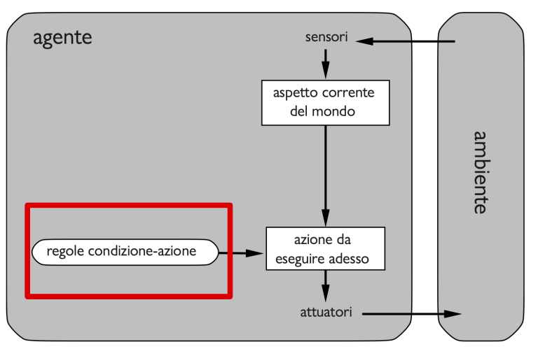
</div>

- **Agente Basato su Modello**: L’agente mantiene uno stato interno che serve per tenere traccia della parte del mondo che non può vedere all’istante corrente. Lo stato dipende dalla storia delle percezioni.

<div style="text-align: center;">
    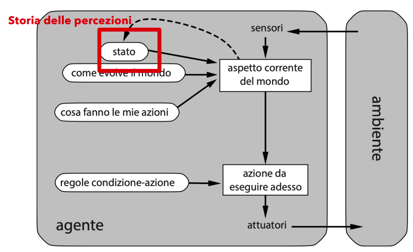
</div>

- **Agente Con Obiettivo**: Oltre allo stato, l'agente ha anche un goal, quindi gli obiettivi e la componente di come cambia il mondo eseguendo un azione.

<div style="text-align: center;">
    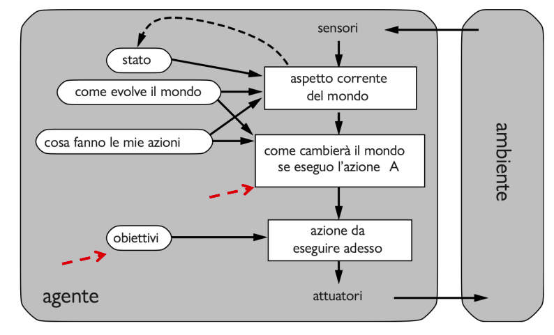
</div>

- **Agente con Funzione di Utilità**: Per dare un peso in termini di utilità agli obiettivi, che potrebbero essere molteplici, si utilizza una **funzione di utilità** con codominio sui reali, per settare ipotetiche priorità tra i vari obiettivi.

<div style="text-align: center;">
    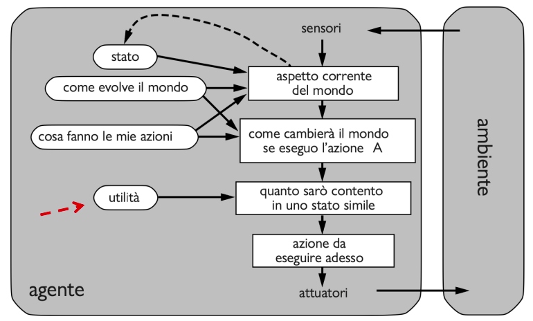
</div>

- **Agenti che Apprendono**: Qualsiasi tipo di agente visto finora può essere
costruito come agente in grado di apprendere. Un agente capace di apprendere può essere diviso in quattro componenti astratti.

<div style="text-align: center;">
    
</div>

### Tipi di Rappresentazioni di Ambienti

Esistono varie rappresentazioni di ambiente dell'agente:
- **Atomica**: Ogni stato del mondo è indivisibile.
- **Fattorizzata**: Si suddivide in insiemi di variabili o attributi, ed ognuno di questi può avere un valore.
- **Strutturata**: Suddivide ogni stato in un insieme fissato di variabili o attributi, ognuno dei quali può avere un valore e delle relazioni con altre variabili. 

## Risolvere Problemi con la Ricerca

**Ricerca**: Processo computazionale condotto da un agente risolutore di problemi.

Si **assumono** degli **ambienti semplici**: episodici, a singolo agente, completamente osservabili, deterministici, statici, discreti e noti.

**Algoritmi Informati/Non Informati**: Se l'agente è in grado rispettivamente di identificare o non identificare la distanza dall'obiettivo.

- **Processo di Risoluzione**
    - **Formulazione obiettivo**: Obiettivo da raggiungere.
    - **Formulazione problema**: Elaborazione di un modello astratto descrivendo il mondo reale.
    - **Ricerca**: Simulazione in sequenze di azioni, fino a che non trova una sequenza che conduce all'obiettivo.
    - **Esecuzione**: Eseguire le azioni specificate nella soluzione.

### Definizione Problemi di Ricerca e Soluzioni

Possiamo definire un problema di ricerca tramite 6 elementi:

- **Spazio degli stati**: Insieme di possibili stati in cui si può trovare l'ambiente.
- **Stato iniziale**: Lo stato in cui si trova l'agente inizialmente.
- **Stato obiettivo**: Può essere uno solo o più di uno, quindi qualcosa del genere $goalTest(state) \in \{ True, False \}$
- **Azioni**: Insieme finito di azioni che possono essere eseguite in uno stato. Ad esempio $Azioni(Stato) = \{ Azione_1, \cdots, Azione_n \}$
- **Modello di transizione**: Descrizione dell'azione, del tipo $Risultato(Stato, Azione) = Stato^{I}$
- **Funzione Costo**: Definisce il costo di eseguire una specifica azione partendo da uno specifico stato: $CostoAzione(Stato, Azione, Stato^{I})$

Quindi un **cammino** rappresenta una **sequenza di azioni**, una **soluzione** è un **cammino** che parte dallo **stato iniziale** ed arriva ad uno **stato obiettivo**. Tra tutte le soluzioni ne esiste una **ottimale**, ossia di **costo minimo**.

# Lezione 3 - Algoritmi di Ricerca e Strategie Ricerca non Informata - 10/02/2025

`Rif: Slide Lezione_2 - AIMA Cap: 3, Sez: 3.3, 3.4`

Ripartendo dalle definizioni della lezione successiva, ricordiamo che $\text{spazio stati} \neq \text{albero di ricerca}$

## Algoritmo di Ricerca

- **Espansione di un Nodo**: Considerando le azioni disponibili nello stato corrispondente, si genera un nuovo nodo figlio nell'albero di ricerca in corrispondenza di ciascuna delle azioni possibili dato lo stato corrente.
    - **Frontiera**: insieme dei nodi generati ma non ancora espansi. Frontiera perchè rappresenta un confine tra **regione interna** espansa e **regione esterna** di stati non ancora raggiunti.
    - **Stati Raggiunti**: stati del grafo per cui esiste un corrispondente generato nell'albero di ricerca.

    <div style="text-align: center;">
    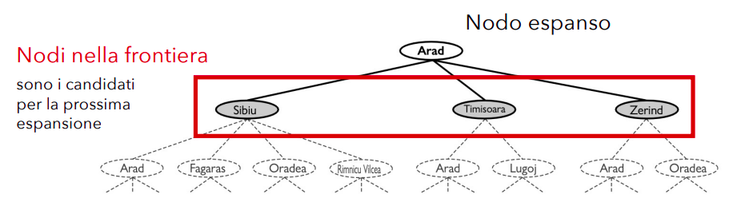
    </div>

    Quindi una ricerca va avanti espandendo ogni volta un nodo della frontiera. L'**algoritmo di ricerca** specifico quindi si occuperà di **scegliere quale** tra i **nodi di frontiera bisogna sviluppare**.

### Strategia Best-First

Si sceglie il nodo sulla frontiera in cui $f(n)$ ha valore minimo:
- **Nuovo nodo non raggiunto**: sicuramente viene aggiunto in frontiera.
- **Nuovo nodo già raggiunto**: viene aggiunto in frontiera solo se migliora il costo di valutazione.

Questo algoritmo iterativo conclude o con fallimento oppure con un cammino che porta ad un obiettivo.

Questa è più una strategia, non un algoritmo reale, perchè non abbiamo definito cosa sia la specifica $f(n)$, e si sta seguendo un approccio greedy.

<div style="text-align: center;">
    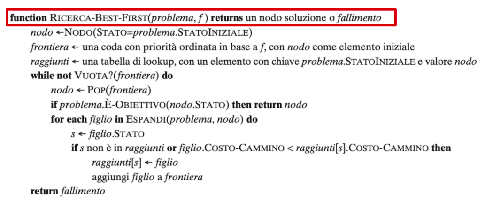
</div>

### Strutture Dati per la Ricerca

- **Nodo**: Immaginando una struttura ad oggetto:
    - `n.stato`: Lo stato a cui corrisponde il nodo.
    - `n.padre`: Il nodo dell'albero di ricerca che ha generato il nodo corrente.
    - `n.azione`: L'azione applicata allo stato del padre per generare il nodo corrente.
    - `n.costoCammino`: Costo totale del cammino dallo stato iniziale a questo nodo.

- **Frontiera (Coda)**:
    - `frontiera.checkVuota`: ritorna true/false in base a se sia o meno vuota.
    - `frontiera.pop`: rimuove elemento in cima.
    - `frontiera.top`: riferisce l'elemento in cima.
    - `frontiera.add`: inserisce nodo secondo l'implementazione della coda.

    Esistono quindi implementazioni diverse di coda in base a che logica forniamo a questi metodiquindi ad esempio **coda con priorità** (su cui si basa la best-first), **coda FIFO** (su cui si basa la ricerca in ampiezza) o **coda LIFO** (su cui si basa la ricerca in profondità).

- **Stati Raggiunti (Tabella Lookup)**: Ogni stato è una chiave, ogni valore è il nodo per tale stato.

### Concetti di Stato Ripetuto, Ciclo, Cammini Ridondanti

- **Stato Ripetuto**: Stato che corrisponde a più nodi nello stesso cammino.

<div style="text-align: center;">
    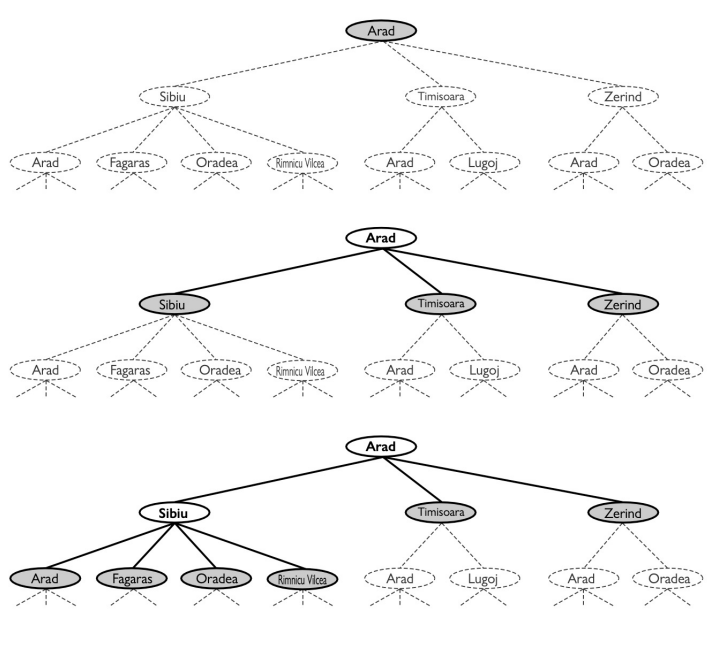
</div>

- **Cammino Ciclico**: Anche dato uno spazio degli stati finito, l'albero di ricerca generato è infinito a causa dei cicli.

<div style="text-align: center;">
    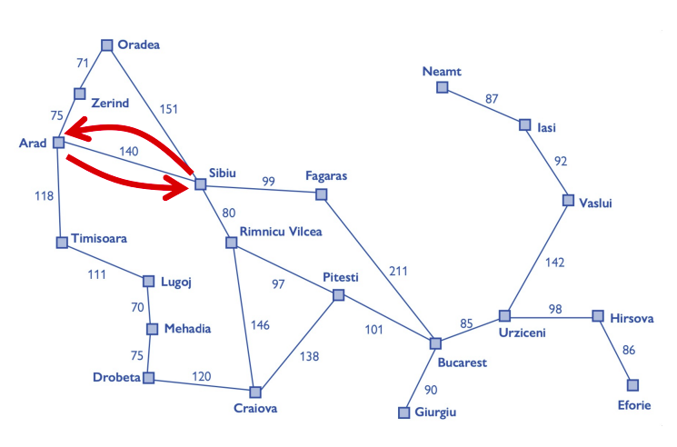
</div>

- **Cammino Ridondante**: Una via peggiore per raggiungere qualcosa di già raggiunto.
    - **Ricerca su Grafo**: Viene controllata la presenza di cammini ridondanti.
    - **Ricerca ad Albero**: Non viene controllata la presenza di cammini ridondanti.

    Esistono specifici **approcci** per controllare **cammini ridondanti**:
    - **Ricordare** tutti gli stati **precedentemente raggiunti**.
    - **Non preoccuparsi** dei **cammini ridondanti**.
    - Controllare presenza di **cammini ciclici** (sottocaso dei cammini ridondanti), ma non quindi il superinsieme di quelli ridondanti. Quindi questo è un po' una via intermedia tra i due approcci sopra.
        - Si potrebbe ad esempio controllare tramite la catena di puntatori mantenuta da tutti i nodi.

## Misure di Prestazione: Valutazione di Bontà Algoritmo

Quattro parametri per la valutazione di algoritmi:
- **Completezza**: Garantisce di riportare una soluzione, se esiste, e di riportare correttamente il fallimento, se esiste. Deve quindi procedere in maniera sistematica.
- **Ottimalità rispetto al costo**: L'algoritmo trova la soluzione con il costo di cammino minimo.
- **Complessità temporale**: Quanto tempo impiega l'algoritmo a trovare una soluzione.
- **Complessità spaziale**: Quanta memoria utilizza l'algoritmo per effettuare la ricerca.

### Misurazione della Complessità

Se il grafo viene espresso in maniera esplicita allora la complessità è formulata in termini di $|V| + |E|$, ma in pratica si misura in termini di:
- **Profondità dell'albero generato (d)**: quindi dimensione in numero di azioni di una soluzione ottima.
- **Massima profondità (m)**: Numero massimo di azioni in un qualsiasi cammino $(d \leq m)$.
- **Branching Factor (b)**: Numero di successori di un nodo.

## Algoritmo Ricerca in Ampiezza

Appropriata quando tutte le azioni hanno lo stesso costo.

- **Implementazione 1**: Tramite istanziazione della BestFirst, settando $f(n) = depth(n)$.
- **Implementazione 2**: Tramite utilizzo di una coda FIFO per la frontiera, dove i nodi inseriti nella frontiera verranno espansi in ordine di inserimento.
    - Questi nodi raggiunti quindi non verranno mantenuti in una lookup table, ma tramite la coda stessa.
    <div style="text-align: center;">
    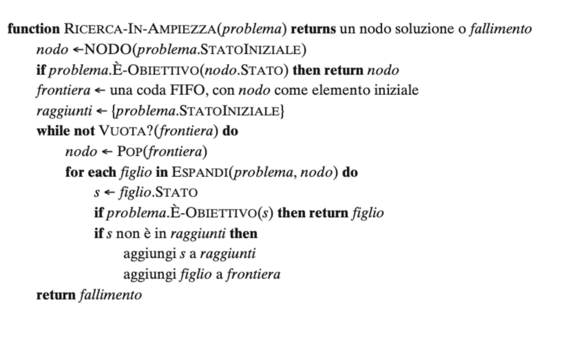
    </div>

### Analisi Misure Prestazione Ricerca in Ampiezza

- **Completa**: ricerca sistematica
- **Ottima rispetto al costo**: Se ogni azione costa 1, allora lo è, altrimenti non è ottima.
- **Costo Temporale e Spaziale**: Scala esponenzialmente, data la $b$ branching factor allora $\sum_{i=0}^d b^i = O(b^d) $. Quindi il **costo in memoria è esponenziale**. Quindi può essere utilizzato solo su istanze piccole.

## Algoritmo di Dijkstra (a Costo Uniforme)

Va bene se le azioni hanno tra loro costi diversi.

Si può **implementare tramite bestFirst** con $f(a)$ settata come costo del cammino dalla radice fino al nodo corrente.

<div style="text-align: center;">
    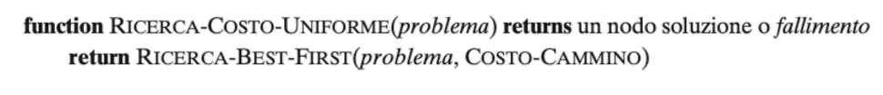
</div>

### Analisi Misure Prestazione Ricerca a Costo Uniforme

- **Completa**: è sistematica, e non entra mai in ciclo infinito sull'assunzione che ogni costo sia sempre positivo.
- **Ottima rispetto al costo**: La prima soluzione che trova ha un costo basso almeno come quello di ogni altro nodo sulla frontiera.
- **Complessità**:
    - $C^*$: costo della soluzione ottima.
    - $\epsilon$: limite inferiore imposto al costo di ogni azione
    - $floor(\frac{C^*}{\epsilon})$: numero maggiore possibile di azioni che servono per raggiungere il costo della soluzione ottima. Ci permette di supporre una profondità massima.
    - **Costo in tempo e spazio**: $O^{1+floor(\frac{C^*}{\epsilon})}$, scala quindi esponenzialmente.

## Algoritmo Ricerca in Profondità

Si sviluppa il nodo più in profondità.

- **Implementazione 1**: Tramite istanziazione della BestFirst, settando $f(n) = -depth(n)$.
- **Implementazione 2**: Tramite utilizzo di una coda LIFO, quindi tramite ricerca ad albero senza tabella dei raggiunti.

### Analisi Misure Prestazione Ricerca in Profondità

- **Completa**:
    - Per spazi degli stati finiti e che sono alberi, è completa ed efficiente.
    - Per spazi degli stati aciclici resta sistematica
    - Per spazi con cicli può bloccarsi in cicli infiniti
    - Per spazi **stati infiniti non è sistematica**, quindi **incompleta**.
- **Costo in Tempo e Spazio**: Devo tenere in memoria solo la frontiera, quindi **memoria** $O(bm)$, mentre **tempo** O(b^m)
    - In caso di **backtracking**, espandendo un nodo viene generato solo un successore e si ricorda quale deve essere generato in seguito, passando in **memoria** a $O(m)$.

## Algoritmo Ricerca in Profondità Limitata

Si basa su un limite settato $l$ di profondità, per evitare che quest'ultimo si perda in un cammino infinito. Il valore $l$ può essere scelto in base a:
- In base alla conoscenza del problema
- Diametro dello spazio degli stati

<div style="text-align: center;">
    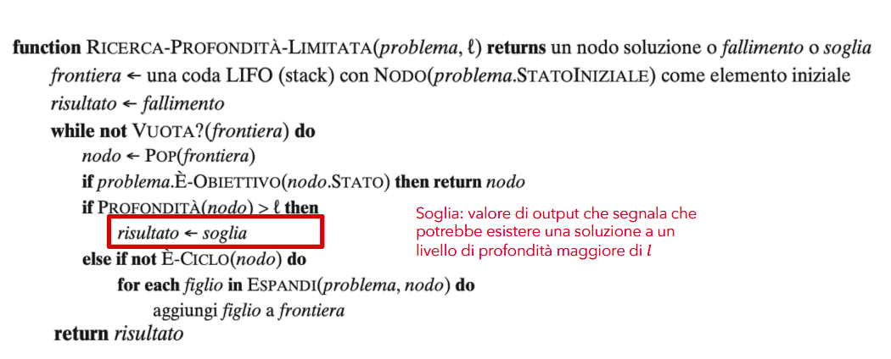
</div>

### Analisi Misure Prestazione Ricerca in Profondità Limitata

- **Completezza**: Dipende dalla scelta di $l$.
- **Non Ottimale**.
- **Complessità Temporale**: $O(b^l)$
- **Complessità Spaziale**: $O(bl)$

## Algoritmo Ricerca ad Approfondimento Iterativo

Si cerca iterativamente il valore di $l$ invocando l'algoritmo definito prima, quindi a ricerca limitata.

<div style="text-align: center;">
    
</div>

Questo potrebbe sembrare uno spreco di iterazioni, ma aumentando profondità sappiamo che l'algoritmo in profondità scala esponenzialmente, quindi in relazione a questo le iterazioni in più non sono significative.

### Analisi Misure Prestazione Ricerca ad Approfondimento Iterativo

- **Completezza**: Completa su spazi di stati aciclici finiti, o su qualsiasi spazio degli stati finito se controlliamo la presenza di cicli risalendo l'intero cammino.
- **Ottima per problemi** in cui tutte le **azioni** hanno lo **stesso costo**.
- **Complessita Temporale**: $O(b^d)$ se esiste una soluzione, $O(b^m)$ se esiste una soluzione.
- **Complessita Spaziale**: $O(bd)$ se esiste una soluzione, $O(bm)$ se non esiste.

## Direzione della Ricerca

Esiste ricerca in avanti $statoIniziale \to obiettivo$ o all'indietro $obiettivo \to statoIniziale$.
- **All'indietro** si può applicare solo se l'obiettivo è ben definito.
- **In avanti** quando ci sono più obiettivi

### Ricerca Bidirezionale

Stesso algoritmo ma due problemi di ricerca, dove nel **forward** si **setta normalmente stato iniziale e obiettivo**, mentre nel **backward si invertono** questi due.

Si procede quindi in entrambe le direzioni fino ad incontrarsi.

Bisogna quindi tenere traccia di **due frontiere** e **due tabelle di raggiunti**.

Non si procede però espandendo due nodi contemporaneamente, si sceglie infatti un solo nodo in una delle due frontiere.

### Analisi Misure Prestazione Ricerca Bidirezionale

- **Complessità Tempo**: $O(b^\frac{d}{2})$.
- **Complessità Spazio**: $O(b^\frac{d}{2})$.

## Confronto Complessivo Misure Prestazione degli Algoritmi

<div style="text-align: center;">
    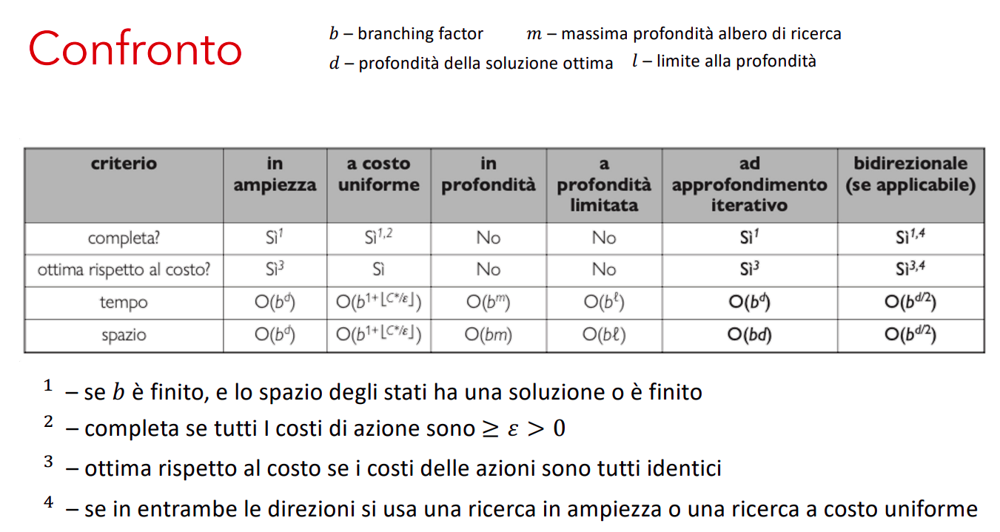
</div>

Quindi tutti questi sono detti di ricerca non informata perchè si basano solo sulla definizione del problema.

# Lezione 4 - Strategie di Ricerca Informata o Euristica - 12/02/2025

`Rif: Slide Lezione_3 - AIMA Cap: 3, Sez: 3.5, 3.6`

La ricerca informata si basa sulla conoscenza specifica di dove si potrebbe trovare l'obiettivo per accelerare la ricerca nello spazio degli stati.

**Funzione Euristica**: si definisce una funzione $h(n)$, costo stimato del cammino.

## Ricerca Best-First Greedy

Espandere prima il nodo con il valore più basso di $h(n)$, quindi $f(n) = h(n)$, con $f(n)$ il costo della Best-First.

- Esempio con distanza in linea d'aria, oltre alle informazioni sul problema descritto, abbiamo anche una conoscenza sulla funzione $h$.

Si basa solo sull'euristica.

### Analisi di Best First Greedy:

- Completa in spazi di stati finiti, ma non in quelli infiniti.
- Non ottima rispetto al costo
- Complessità spaziale e temporale $O(|V|)$

## Ricerca A*

Ricerca best-first che usa la seguente funzione di valutazione:

$$ f(n) = g(n) + h(n) $$

dove

- $f(n)$: costo stimato del cammino migliore che continua da $n$ fino ad un nodo
obiettivo
- $g(n)$: costo del cammino dal nodo iniziale ad $n$.
- $h(n)$: costo stimato del cammino più breve da $n$ ad uno stato obiettivo.

Quindi il concetto fondamentale è tener conto sia del costo fino ad ora sia il costo dell'euristica in $f(n)$.

### Analisi A*

- Completa
- Ottima rispetto al costo se l'euristica $h(n)$ è **ammissibile**.

### Ammissibilità di Euristica

Un **euristica** è **ammissibile** se **non sovrastima** mai il **costo** per raggiungere un obiettivo, quindi se $h(n) \leq h^*(n)$, dove $h^*(n)$ è il costo minimo di un cammino da $n$ fino ad un goal.

### Dimostrazione: Se h() ammissibile allora A* è ottimo

Si imposta per assurdo:

$A^*$ restituisce un cammino di costo $C$, ma esiste un $C^* < C$

Allora certamente esiste un nodo n sul cammino ottimo che non è stato espanso.

Denotiamo con
- $g^*(n)$ costo del cammino ottimo dall'inizio fino ad n
- $h^*(n)$ costo del cammino dottimo da n fino ad un obiettivo

Quindi:

- $f(n) > C^*$, altrimenti n sarebbe stato espanso.
- $f(n) = g(n) + h(n)$, per definizione.
- $f(n) = g^*(n) + h(n)$, siccome n si trova su un cammino ottimo.
- $f(n) \leq g^*(n) + h^*(n)$, siccome $h(n)$ è ammissibile allora $h(n) \leq h^*(n)$.
- $f(n) \leq C^*$, dato che per definizione (vedi slide)

quindi per 1. e 5. abbiamo raggiunto l'assurdo.

### Euristica Consistente

Un **euristica** è **consistente** se, per ogni nodo n, e per ogni successore $n'$ di n generato da un azione $a$ risulta essere: 
$$h(n) \leq c(n,a,n') + h(n')$$

<div style="text-align: center;">
    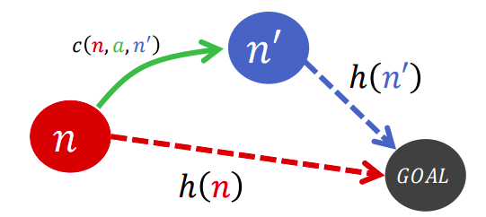
</div>

**Consistente** implica **ammissibile**, più **forte come condizione**.

Se $h$ è un euristica consistente allora $f = g + h$ non decresce mai lungo i cammini.

### Euristica Inconsistente

Possiamo trovarci con **più cammini** che raggiungono lo **stesso stato**.

Se ogni cammino nuovo ha costo inferiore al precedente finiremo con l'avere più nodi corrispondenti a quello stato sulla frontiera.

Inconsistente non implica non ammissibile.

### Algoritmo A* con Euristica Consistente, Inconsistente, Inammissibile

- **A\* con Euristica Consistente**:
    - **Ottimo rispetto** al **costo**.
    - La **prima volta** che **raggiungiamo uno stato** sarà su un **cammino ottimo**.
- **A\* con Euristica Inconsistente**:
    - Possiamo trovarci con **più cammini** che raggiungono lo **stesso stato**.
    - Se ogni cammino nuovo ha costo inferiore al precedente finiremo con l'avere più nodi corrispondenti a quello stato sulla frontiera, portando ad un **aggravio** di **costo spaziale e temporale**.
- **A\* con Euristica Inammissibile**:
    - Può essere ottima rispetto al costo in due casi
        - Esiste un **cammino ottimo** rispetto al costo lungo cui $h(n)$ è **ammissibile per tutti i nodi sul cammino**.
        - Se la soluzione ottima ha costo $C^{*}$ e la seconda soluzione migliore ha costo $C_{2}$, e se $h(n)$ sovrastima i costi, ma al massimo di una quantità $k \leq C_{2} - C^{*}$

### Confini della Ricerca A* e Caratteristiche A*

- Si basa sullo sviluppo di bande concentriche basate sulla $f$.
- **Caratteristiche di A\***: Assumendo che $C^*$ sia costo del cammino della soluzione ottima:
    - **A\* espande tutti i nodi** che possono essere raggiunti dallo stato iniziale su **un cammino in cui per ogni nodo** si ha $f(n) < C^{*}$.
    - **A\* può espandere** alcuni dei nodi sul confine obiettivo, quindi dove $f(n) = C^{*}$ prima di selezionare il nodo obiettivo.
    - **A\* non espande** alcun nodo con $f(n) > C^{*}$

### A* come Algoritmo Ottimamente Efficiente

Fornendo ad **A\* un euristica consistente** è **ottimanente efficiente**, quindi qualsiasi altro algoritmo che estente cammini di ricerca a partire dallo stato iniziale e sua la stessa euristica deve espandere tutti i nodi che sono certamente espansi da A*.

### Ricerca Soddisfacente

Il problema di A* è che **espande un grande numero di nodi**, di conseguenza preferiamo a volte accettare **soluzioni subottime** ma **sufficientemente buone**, solo per **diminuire in numero di nodi esplorati**.

### Ricerca A* Pesata

Viene definita un $W > 1$ fattore moltiplicativo per dare maggiore peso al valore dell'euristica, quindi $f(n) = g(n) + W h(n)$

In questo modo possiamo esplorare meno stati con un trade-off sul costo, quindi assumendo che la soluzione ottima abbia costo $C^{*}$, allora troverà una soluzione di costo compreso tra $C^{*}$ e $W \times C^{*}$.

In realtà la **ricerca A\* pesata** può essere vista come una **generalizzazione delle altre**.

<div style="text-align: center;">
    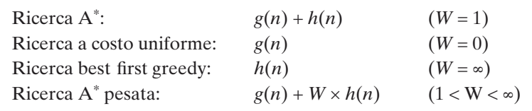
</div>

### Varianti A* per Limitazioni

- **Algoritmi di Ricerca Subottima**:
    - **Ricerca a subottimalità limitata**: Cerchiamo una soluzione con granzia che si trovi entro un fattore costante $W$ del costo ottimo, come $A^{*}$ pesata.
    - **Ricerca a costo limitato**: cerchaimo una coluzione il cui costo sia inferiore ad una costante C.
    **Ricerca a costo illimitato**: Accettiamo una soluzione di qualsiasi costo, purchè riusciamo a trovarla rapidamente.
- **Ricerca con Memoria Limitata**: Si tenta tramite due ottimizzazioni di migliorare l'utilizzo di memoria dell'algoritmo $A^{*}$.
    - Gli stati sono **presenti** solo in una delle due posizioni, quindi **frontiera** o **raggiunti**.
    - Rimuovere gli stati dai raggiunti quando si può dimostrare che non servono più.
- **Ricerca Beam**: Limitare la **dimensione della frontiera**, mantendendo solo i $k$ nodi con i migliori costi $f$. Questo definisce **incompletezza** e **subottimalità**, esplorando solo un settore dei confini concentrici.
- **Ricerca A\* con Approfondimento Iterativo - (IDA\*)**: Ricerca ad approfondimento iterativo combinata con $A^*$, quindi non tiene in memoria tutti gli stati raggiunti. La soglia è settata sul valore $f = g + h$.
    - Si effettua quindi, per ogni iterazione, una ricerca esaustiva in profondità fino ad un costo $f_{l}$, quindi quando viene trovato un nodo $n$ con costo $f(n) > f_{l}$, termina iterazione e ricomincia la successiva con $f_{l} = f(n)$.
- **Ricerca Best First Ricorsiva - (RBFS)**: Ricerca in BestFirst, con interruzione quando $f$ supera un valore $f_{limite}$. Se viene superato questo limite, la risocrsione torna al cammino alternativo.
- **Memory Bounded A\* - (SMA\*)**: Si basa sull'utilizzo di **tutta** la **memoria disponibile** fino al suo esaurimento, poi **dimentica** il nodo peggiore memorizzando nel nodo del padre il valore del nodo dimenticato.

## Funzioni Euristiche

- Nel caso del rompicapo degli 8 tasselli possiamo immaginare 2 esempi di funzione $h$ euristica:
    - $h_{1}$ numero di tasselli fuori posto.
    - $h_{2}$ somma delle distanze di tutti i tasselli dalla loro posizione corrente alla configurazione obiettivo.

Ciascuna di queste funzioni euristiche ha delle caratteristiche:
- **Fattore di ramificazione effettivo**: Si basa sugli elementi:
    - $N$ numero totale di nodi generato da $A^*$.
    - $d$ profondità dell'albero generato da $A^*$.
    - $b^*$ fattore di ramifiazione che un albero uniforme di profondità $d$ dovrebbe avere per contenere $N+1$ nodi, quindi: 
    
    $$N + 1 = 1 + b^* + (b^*)^2 + \cdots + (b^*)^d$$

    Una buona funzione euristica dovrebbe avere un valore di $b^{*}$ vicino ad $1$.

### Dominazione di Euristiche

Date due euristiche $h_1, h_2$ si dice che $h_1$ **domina** $h_2$ se per ogni nodo $n$ vale che $h_1(n) \leq h_2(n)$.

## Costruzione di Euristiche

### Euristica da Problema Rilassato

Costruzione del problema originale con meno vincoli sulle azioni che si possono compiere. Potremmo ad esempio immaginare di aggiungere archi allo spazio degli stati.

Quindi il costo di una soluzione ottima per un problema rilassato è un euristica ammissibile per il problema originale.

### Massimizzazione di Insieme di Euristiche Ammissibili

Dato un insieme di euristiche ammissibili $h_{1}, \cdots, h_{m}$ costruiamo $h(n) = max \{ h_{1}(n), \cdots ,h_{m}(n) \}$.

Se tutte le funzioni $\{ h_{1}(n), \cdots ,h_{m}(n) \}$ sono ammissibili allora anche $h$ lo è, e domina tutte le altre.

### Euristica da Sottoproblema

Un altro metodo per costruire euristiche è quello di tenere in considerazione solo una parte del problema originale.

<div style="text-align: center;">
    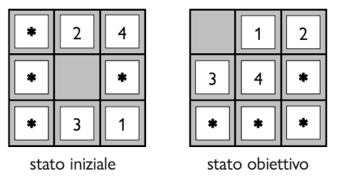
</div>

Il **costo dela soluzione** ottimale di un **sottoproblema** è una **sottostima del costo del problema originale**, quindi è un **euristica ammissibile**.

### Database di Pattern Soluzioni

Possiamo **memorizzare** i costi esatti delle soluzioni di ogni possibile istanza di un sottoproblema, definendo quindi un **euristica ammissibile** $h_{db}$ per ogni stato **incontrato durante la ricerca**, estraendo dal database la configurazione corrispondente del sottoproblema.

Non possiamo però a priori sommare i valori di ciascuna soluzione di istanza, dato che le soluzioni ai sottoproblemi possono interferire.

- **Landmarks**: Tramite il **pre-calcolo** di alcuni **costi di cammino ottimo** ed il **salvatagglio rispetto a punti di riferimento rilevanti** è possibile ottimizzare il calcolo effettivo a tempo di esecuzione dell'algoritmo.

- **Apprendere dall'esperienza**: Si basa sull'apprensione di istanze del problema già risolte, basandosi sull'utilizzo di features dello stato fornite per predire il valore dell'euristica.

    - Nell'esempio dei tasselli potremmo indicare con $x_1$ in *numero di tasselli fuori posto*, $x_2$ *numero di tasselli adiacenti che sono adiacenti anche nella soluzione* e $c_1, c_2$ *appresi tramite algoritmo di apprendimento* formulando quindi l'euristica come: 
    $$\boxed{h(n) = c_{1} \: x_{1}(n) + c_{2} \: x_{2}(n)}$$

# Lezione 5 - Ricerca Locale e Cenni di Ricerca Online - 17/02/2025

`Rif: Slide Lezione_4 - AIMA Cap: 4, Sez: 4.1, 4.2, 4.3`

Fino ad ora abbiamo assunto **forti condizioni**:
- Ambienti **deterministici** e **completamente osservabili**.
- Agenti in grado di produrre offline un piano che può essere eseguito senza imprevisti.

Potremmo quindi tenere conto di ambienti un po' più realistici, quindi:
- L'agente ha bisogno di un **piano condizionale** (basato su OR, AND, IF...), in un mondo non deterministico, quindi rilassamento del determinismo.
- Ricerca di stati buoni in spazi discreti o continui.
- **Rilassamento** della condizione per cui tutti gli **stati** sono **completamente osservabili**, gli agenti avranno visibilità parziale degli stati.
- **Rilassamento del vincolo** sull'**ambiente noto**, guidando l'agente attraverso uno spazio sconosciuto, mediante ricerca online.

## Ricerca Locale

Gli algoritmi di ricerca locale operano a partire da uno stato iniziale e procedono verso gli stati adiacenti, **senza tenere traccia dei cammini** e **senza tenere traccia** degli **stati** già **raggiunti**.
- Quindi **per definizione** questi **algoritmi non** sono **sistematici**, quindi potrebbero non esplorare un sottospazio degli stati dove risiede una soluzione.
- Usano poca memoria e riescono a trovare stati goal (soluzione) in spazi degli stati molto grandi.

### Problemi di Ottimizzazione (Hill Climbing, Simulated Annealing, Local Beam Search)

Lo scopo è quello di **trovare** lo **stato migliore** secondo una **funzione obiettivo**.

<div style="text-align: center;">
    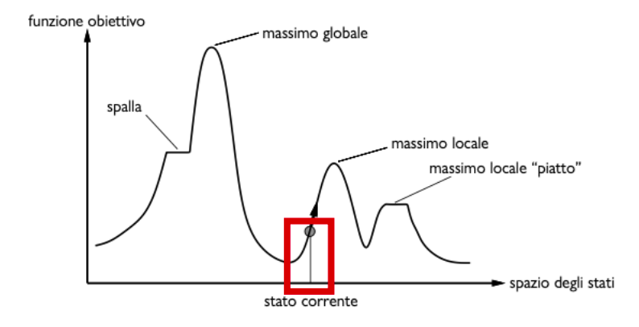
</div>

Esistono vari tipi di ricerca dell'ottimo:

- **Ricerca Hill Climbing**:
    - Ricerca **locale greedy**, si tiene conto solo dello stato corrente.
    - Si cerca di andare nella posizione che porta ad un incremento di altezza.
    - Si **fermerà** quindi al **primo massimo locale** che trova.
    - Per un minimo locale si utilizza lo stesso algoritmo, negando la funzione obiettivo.

    <div style="text-align: center;">
        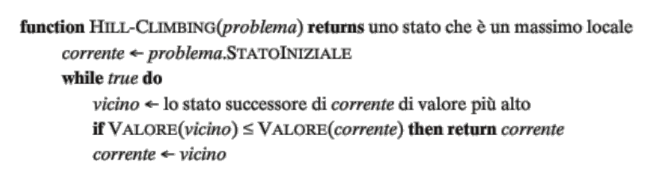
    </div>

    - **Soffre vari pattern comuni** dato il fatto che cerca degli ottimi locali, quindi ad esempio **creste**, **plateau**...
    - Nel problema delle 8 regine ad esempio l'algoritmo hill climbing **si blocca** nel $86\%$ delle volte e **trova la soluzione** il $14\%$ delle volte, ma è **molto veloce**.
    - **Miglioramenti Hill Climbing**:
        - **Mossa Laterale**: Si **permette** l'**esplorazione dei plateau**, permettendo quindi un **numero limitato di passi** anche se il valore della **funzione obiettivo resta invariato**. Questo nel caso del problema delle 8 regine porta ad un successo il $94\%$ delle volte.
        - **Hill Climbing Stocastico**: Si sceglie a caso tra tutti gli stati che portano ad una crescita della funzione obiettivo. Converge più lentamente dell'originale ma può trovare soluzioni migliori.
        - **Hill Climbing Con Prima Scelta**: Generare a caso i successori dello stato attuale, fino ad ottenerne uno preferibile a quello corrente.
        - **Hill Climbing Con Riavvio Casuale**: Serie di ricerche hill climbing partendo da stati iniziali generati casualmente, fino a che non viene raggiunto un obiettivo.
            - **Tradeoff** quindi di **efficienza per completezza**.
            - Data $p$ probabilità di successo per l'algoritmo Hill Climbing, allora il numero atteso di riavvii sarà $\frac{1}{p}$.
    - **Successo ed insuccesso** **dipendono** quindi fortemente dalla **forma** dello **spazio degli stati**, ma in un contesto reale è molto probabile che ci sia uno spazio degli stati eterogeneo.

- **Simulated Annealing**: 
    - Cerca di **combinare Hill Climbing ed Esplorazione Casuale**, quindi rispettivamente non scendere mai e scelta casuale.
    - Si cerca di **perturbare** il risultato di **Hill Climbing** per cercare di **uscire da punti di minimo locale** (si ragiona in termini di minimizzazione).

    <div style="text-align: center;">
        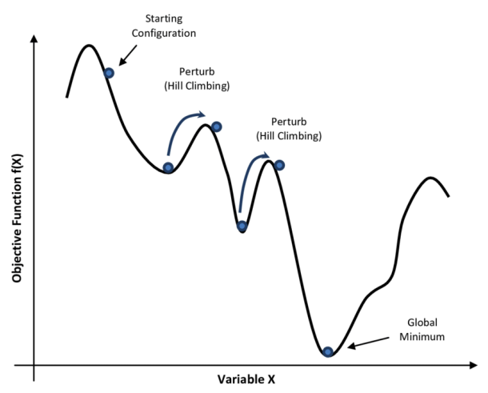
    </div>

    - Il funzionamento si basa sull'**accettare o meno** una **scelta casuale**:
        - Se la mossa è migliorativa allora viene accettata.
        - Altrimenti viene accettata secondo una probabilità $prob < 1$.
            - La **probabilità** deve **decrescere esponenzialmente** rispetto a quanto **peggiora la valutazione** $\Delta E$, ed oltre a questo **decresce** con la **temperatura** $T$, che scende costantemente, quindi

                $$prob = e^{-\frac{\Delta E}{T}}$$
        - Il valore della temperatura $T$ diminuisce rispetto ad una velocità di raffreddamento. Se questo valore decresce abbastanza lentamente allora l'algoritmo troverà un massimo globale con probabilità che tende ad $1$.

    <div style="text-align: center;">
        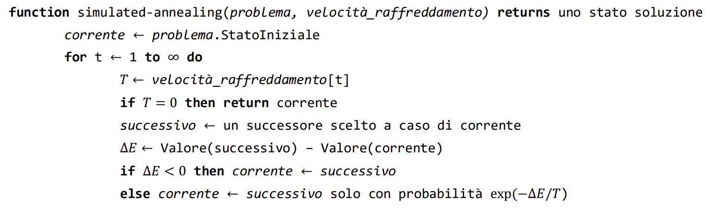
    </div>

- **Local Beam Search**:
    - Si tiene traccia di $k$ stati, quindi un intervallo attorno allo stato corrente invece che uno solo.
    - Questo permette l'abbandono preventivo a situazioni infruttuose.
    - Esiste anche una **versione stocastica**, che sceglie i **successori** con **probabilità** proporzionale al loro **valore**.

- **Algoritmi Evolutivi**: Variante della ricerca beam stocastica basata su un comportamento simile alla selezione naturale:
    - Degli **stati**, tra questi vengono **trovati i migliori**, questi vengono **ricombinati tra di loro** per essere utilizzati e trovarne ancora dei migliori.
    - Quindi ogni **stato mappa** su un **individuo**.
    - Quindi un individuo può ad esempio essere rappresentato con una stringa.
    - Caratteristiche:
        - **Numero di genitori** $\rho = 2$ che si uniscono per generare la prole.
        - **Processo di selezion**e genitori della prossima generazione, si seleziona con una **certa probabilità** rispetto ad un **valore** dipendente dalla funzione obiettivo, detto **fitness**.
        - **Procedura di ricombinazione**: Si seleziona un **punto di crossover**, quindi assumendo che i due **genitori** siano **due stringhe**, si definiscono dei **punti** in cui le stringhe vengono rispettivamente **tagliate e concatenate tra loro**.
        - **Mutazione**: A tempo di generazione della prole, i figli non saranno uguali a metà genitori ma esisterà una **mutazione** post-generazione, con **probabilità** data dal **tasso di mutazione**.
        - La **formazione** della **nuova generazione** potrebbe essere semplicemente la nuova prole, oppure **mantenere** tramite **elitismo** **genitori migliori rispetto a correnti figli**. Oppure anche tramite **abbattimento**, eliminando correnti figli sotto una certa **soglia di fitness**.

        Un esempio di applicazione di questo tipo di algoritmo sul problema delle 8 regine:
        <div style="text-align: center;">
        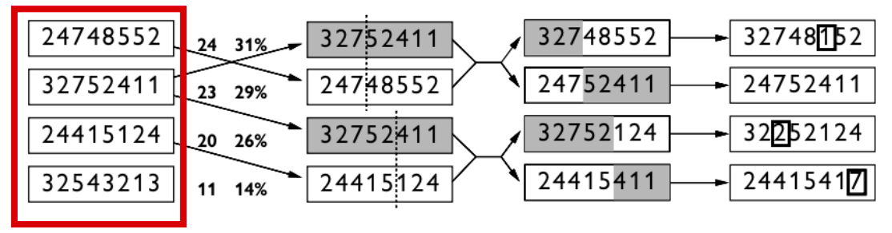
        </div>

        Questi algoritmi genetici si applicano bene a specifici contesti e funziona bene su problemi i cui stati possono essere rappresentati in stringhe.

## Ricerca Locale in Spazi Continui

Lo spazio non è più discreto ma descritto da **variabili continue** del tipo $x_1, \cdots, x_n$. L'**esplorazione** di questo tipi di spazi **può portare** a **fattori di ramificazione infiniti**, se utilizzassimo approcci visti fino ad ora.

- **Approccio di Spazi Continui**:
    - **Discretizzazione**: Si sovrappone una griglia allo spazio continuo.
    - **Gradiente Empirico**: Si limita il fattore di ramificazione mediante un campionamento casuale degli stati successori, valutando ad esempio un valore perturbato di un $x$ iniziale, tramite ad esempio una $f(x+\delta)$.
        - Se $f$ è **continua e differenziabile** rispetto ad $x$, allora è possibile cercare **max e min** utilizzando il **gradiente**, che restituisce la **direzione di massima pendenza**. Quindi ha tutte le derivate parziali rispetto alle dimensioni della funzione $f$.

### Utilizzo Hill Climbing in Spazi Continui con Gradiente

Possiamo applicare qualcosa come Hill Climbing tramite l'utilizzo del gradiente con la formula 

$$\boxed{x_{new} = x + \eta\nabla f(x)}$$

dove $\eta$ è una costante positiva detta **step size**. 

Questo meccanismo quindi ci fornisce la garanzia di crescita/descrescita.

## Ricerca con Azioni non Deterministiche

Il piano generato in caso di determinismo è una sequenza di azioni ed eseguita senza imprevisti.

In questo caso **rilassiamo il determinismo**, un **azione** ha come **codominio un insieme di stati** e non uno stato, di conseguenza l'entità agentica dovrà **tramite percezioni che restringe lo spazio degli stati** acquisendo informazioni sullo stato corrente. Questo è detto quindi **stato-credenza**, **insieme** percepito dalle **percezioni dell'agente**.

Quindi dato ad esempio il problema dell'aspirapolvere, per trovare una soluzione non costruiremo un modello di transizione su cui costruiamo un percorso, ma definiamo un **albero AND-OR** che tiene conto delle condizioni su tutte le percezioni fatte durante il percorso e di questo ne **selezioniamo** un **sottoalbero**.

<div style="text-align: center;">
    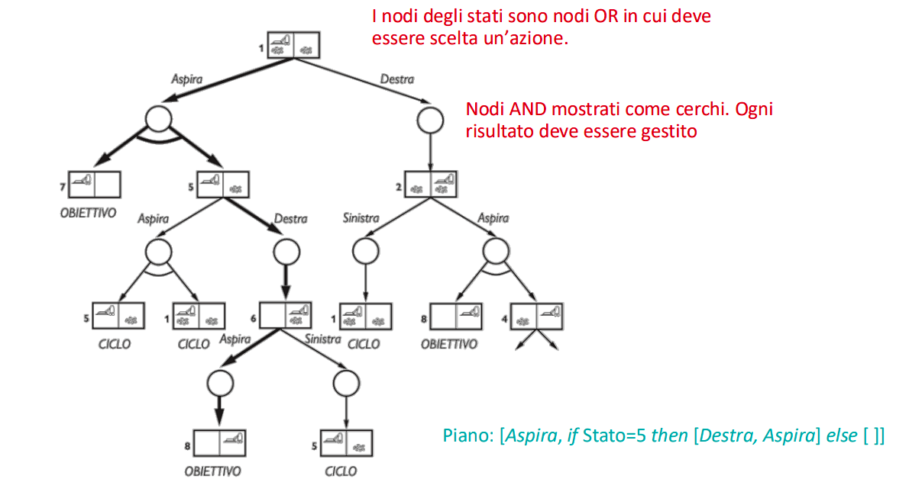
</div>

In questo caso il sottoalbero soluzione è quello rappresentato in grassetto.