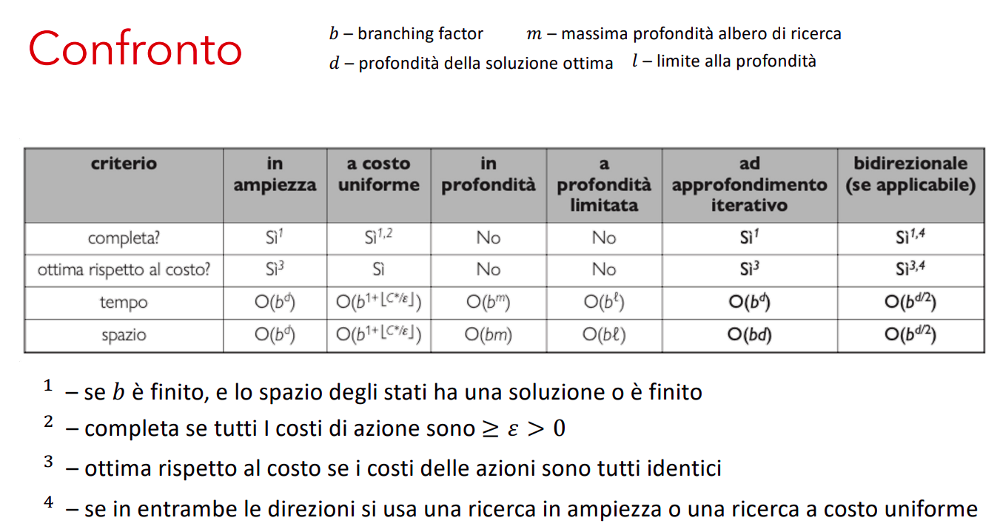
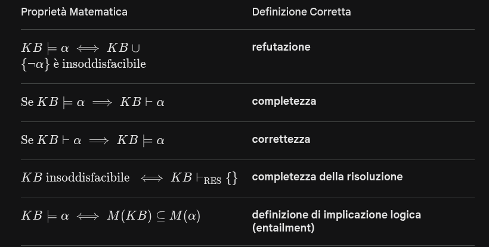
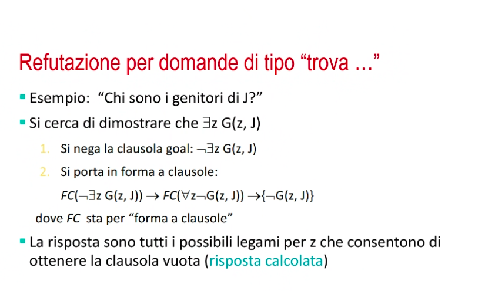

# Riassunto Pre Esame

## 01 - Problemi su Grafi: Algoritmi Informati e Non Informati

### Formulazione Agenti

- **Razionalità**: Basata su quattro principi:
    - Misura di Prestazione.
    - Conoscenza Pregressa.
    - Azioni che agente può eseguire.
    - Sequenza Percettiva dell'agente fino a quel punto.

#### Ambienti degli Agenti

- **Descrizione PEAS**: Descrive l'ambiente operativo secondo i seguenti principi:
    - **Performance**: Misura di prestazione
    - **Environment**.
    - **Actuators**.
    - **Sensors**.

- **Proprietà Ambienti**: Descriviamo quelle un po' più delicate
    - **Osservabilità**: Se l'agente riesce ad osservare lo stato di tutto l'ambiente o meno, senza doverlo quindi memorizzare.
    - **Predicibilità**: Se la funzione di transizione tra gli stati sia o meno deterministica.
    - **Notorietà Ambiente**: Se l'agente sia o meno a conoscenza delle regole dell'ambiente.

#### Tipi di Agenti

- **Agente su Tabella**: Accesso a tabella del tipo `azione = tabella.get(percezione)`, porta ad esplosione combinatoria.
- **Agente Reattivo Semplice**: Non mantiene alcuna memoria pregressa e sceglie in base all'**attuale percezione** ed all'**insieme di regole**.
- **Agente su Modello**: Aggiunge uno stato interno per tenere traccia della storia delle percezioni.
- **Agente con Obiettivo**: Come il precedente ma aggiungendo un obiettivo.
- **Agente con Funzione di Utilità**: Si pesano gli obiettivi, potendoli così ordinare.
- **Agente che Apprendono**: Aggiunge un fattore di apprendimento.

### Formulazione come Problemi di Ricerca

- **Assunzioni sull'Ambiente**: L'ambiente sarà
    - Episodico.
    - A singolo agente.
    - Ambienti completamente osservabili.
    - Ambienti deterministici.
    - Ambienti statici.
    - Ambienti discreti.
    - Ambienti noti.

- **Definizione Problema Ricerca/Soluzioni**:
    - **Spazio Stati**: Insieme di tutti i possibili stati.
    - **Stato Iniziale**.
    - **Stato Obiettivo/Goal**: $goalTest(state) = \{ True, False \} $
    - **Azioni**: $Azioni(state) = \{ azione_1, \dots, azione_n \}$
    - **Modello di Transizione**: $Risultato(stato, azione) = stato'$.
    - **Costo Azione**: $CostoAzione(stato, azione, stato')$

### Algoritmi di Ricerca Non Informati con Frontiera e Approccio Best First

- **Esplorazione Albero di Ricerca**: Assumendo che esistano due **regioni** dell'albero (**interna/esterna**), definiamo **frontiera** l'insieme dei nodi che separa appunto queste due regioni. Quindi la **frontiera** si compone di **nodi generati ma non ancora espansi**.
    - **Strategia Best First**: L'idea quindi è quella di **selezionare** il **nodo dalla frontiera** tale per cui si **minimizza il valore di $f(n)$**.

#### Ricerca in Ampiezza (BFS) - Non Informata

##### Definizione

Si definisce istanziando la strategia BestFirst settando $f(n) = depth(n)$, oppure tramite una coda FIFO, estraendo i nodi secondo l'ordine FIFO appunto.

##### Misure di Prestazione

- Ricerca completa.
- Ottima rispetto al costo per problemi in cui azioni (archi) hanno tutte costo 1.
- Costo **temporale** e **spaziale**: Definendo $b$ il branching factor e $d$ la profondità otteniamo $\sum_{i=0}^{d} b^d = O(b^d).$

#### Ricerca a Costo Uniforme (Dijkstra) - Non Informata

##### Definizione

Si definisce istanziando la strategia BestFirst settando la funzione $f(n) = \text{costo cammino da radice fino a nodo}$.

##### Misure di Prestazione

- Ricerca **completa e sistematica**.
- **Ottima rispetto al costo azioni** (archi) anche se queste non sono tutte 1.
- Costo in **Tempo** e **Spazio**: Definendo $C^*$ costo della soluzione ottima e $\epsilon$ limite inferiore imposto al costo di ogni azione allora il costo è $ O(1 + \lfloor \frac{C^*}{\epsilon} \rfloor) $

#### Ricerca in Profondità (DFS) - Non Informata

##### Definizione

Si definisce istanziando la strategia BestFirst settando $f(n) = -depth(n)$, oppure tramite una coda LIFO, estraendo i nodi secondo l'ordine LIFO appunto.

##### Misure di Prestazione

- Ricerca **incompleta** per **stati infiniti**.
- Costo **temporale** e **spaziale**: Assumiamo $b$ come nodi generati per ciascuno dei livelli $m$ di profondità dell'albero.
    - **Temporale**: $O(b^m)$
    - **Spaziale**: $O(bm)$
        - **Spaziale con Backtracking**: $O(m)$

#### Ricerca in Profondità Limitata - Non Informata

##### Definizione

Si definisce istanziando la strategia BestFirst settando $f(n) = -depth(n)$, oppure tramite una coda LIFO, estraendo i nodi secondo l'ordine LIFO appunto, aggiungendo un limite $l$ oltre il quale non si scende.

##### Misure di Prestazione

- Completezza dipende dalla scelta $l$.
- **Non ottimale** per il **costo archi**.
- **Costo in Tempo e Spazio**: $b$ resta il numero di nodi generati per ciascuno dei livelli ed $l$ è il limite:
    - **Costo Tempo**: $O(b^l)$
    - **Costo Spazio**: $O(bl)$

#### Ricerca ad Approfondimento Iterativo - Non Informata

##### Definizione

Si applica tante volte l'algoritmo DFS limitato, cercando iterativamente un valore della $l$. Se questo potesse sembrare uno spreco di iterazioni dobbiamo ricordare che il costo scala esponenzialmente, di conseguenza ha senso ritentare da $1 \dots l$ per cercare eventualmente la giusta profondità $l$.

##### Misure di Prestazione

- Completa se effettuata su spazi di stati aciclici e finiti.
- Ottima per problemi con archi tutti con lo stesso costo.
- **Costo in Tempo e Spazio**: $b$ resta il numero di nodi generati per ciascuno dei livelli, $d$ la profondità ed $m$ massima profondità dello spazio degli stati:
    - **Costo Tempo**: $O(b^d)$ se esiste soluzione, $O(b^m)$ altrimenti.
    - **Costo Spazio**: $O(bd)$ se esiste soluzione, $O(b^m)$ altrimenti.

#### Ricerca Bidirezionale - Non Informata

##### Definizione

Si mantengono due frontiere e si avanza sia in avanti che all'indietro.

##### Misure di Prestazione

- **Costo in Tempo e Spazio**: $b$ resta il numero di nodi generati per ciascuno dei livelli, $d$ la profondità ed $m$ massima profondità dello spazio degli stati:
    - **Costo Tempo**: $O(\frac{b^d}{2})$.
    - **Costo Spazio**: $O(\frac{b^d}{2})$.

#### Riassunto Tutte Misure Prestazioni Alg. Non Informati

    

### Algoritmi di Ricerca Informati con Frontiera

Definiamo una funzione $f(n) = g(n) + h(n)$ ed in base al peso che diamo ad una componente o all'altra definiamo algoritmi diversi.
- **La BestFirst Greedy** (la più semplice) setta $f(n) = h(n)$ dando quindi solo peso all'euristica.

#### Algoritmo $A^*$

Ricerca best first che definisce $f(n) = g(n) + h(n)$ dove:
- $g(n)$ è costo del percorso fino ad $n$.
- $h(n)$ costo stimato (euristica) da $n$ al nodo obiettivo.

##### Misure di Prestazione ed Euristiche

- **Algoritmo completo** ed **ottimo** rispetto al **costo archi se** l'**euristica scelta** è **ammissibile**.

##### Euristica Ammissibile vs Consistente

- **Ammissibile**: Se non sovrastima l'ottimo, quindi se $h(n) \leq h^*(n)$.
- **Consistente**: Se vale che $h(n) \leq c(n,a,n') + h(n')$, quindi aggiunta di eventuale arco fa per forza di cose crescere $h(n)$.
    - Consistente implica ammissibile.

#### Costruzione e Caratteristiche di Euristiche

Per uno stesso problema esistono ovviamente più euristiche e queste sono **caratterizzate da $3$ elementi**:
- $N$ numero totale di nodi generato da A^*.
- $d$ profondità dell'albero generato da $A^*$
- $b^*$ fattore di ramificazione.

Una **buona funzione euristica** in questo contesto dovrebbe avere un $b$ vicino ad $1$.

- **Dominazione**: Se $\forall n$ vale che $h_2(n) \geq h_1(n)$ si dice che $h_2$ domina $h_1$.

### Ricerca Locale

Contesto più realistico, si rilassano ipotesi di determinismo, piena osservabilità e notorietà ambiente.

- Noti per non tenere traccia dei cammini e senza tenere traccia degli stati già visti.
- Ovviamente non sono sistematici e possono bloccarsi in stati migliori solo localmente.

#### Hill Climbing

Dato uno stato corrente si cerca di massimizzare la quantità target e si fermerà al primo massimo locale che trova. Quindi tiene conto solo dello stato corrente, in pieno stile greedy.

- Soffre pattern come creste e plateau
- Esistono dei **miglioramenti** dell'**Hill Climbing**:
    - **Mossa Laterale**: Si gioca sui plateau, permettendo il loro attraversamento.
    - **Stocastico**: Si sceglie randomicamente uno stato che porta ad una crescita della funzione obiettivo.
    - **Prima Scelta**: Si generano successori dello stato corrente fino ad ottenerne uno preferibile a quello corrente.
    - **Riavvio Casuale**: Si sceglie casualmente uno stato iniziale e si reiterano delle Hill Climbing fino al raggiungimento di un risultato soddisfacente.

#### Simulated Annealing

Combina **Hill Climbing** ed **Esplorazione Casuale**, **perturbando** il risultato dell'Hill Climbing per risolvere situazioni di minimo/massimo locale.

Tutto il funzionamento si basa sull'accettare o meno una scelta casuale:
- Se la mossa è migliorativa la si accetta.
- Se la mossa non lo è viene accettata secondo una probabilità $prob = e^{\frac{\Delta E}{T}}$. Questa probabilità decresce esponenzialmente quanto peggiora la valutazione data da $\Delta E$. Il comportamento sperato è che l'algoritmo trovi un massimo globale con probabilità che tende ad $1$.

#### Local Beam Search

Tiene traccia solo di $k$ stati attorno a quello corrente invece che uno solo.

#### Ricerca Locale su Spazi Continui

Cercando di usare gli stessi approcci visti finora sul continuo otterremmo fattori di ramificazione infiniti. Si utilizzano quindi approcci diversi da quelli visti finora:
- **Discretizzazione**: Si cerca di mappare il continuo sul discreto.
- **Gradiente Empirico**: Si limita il fattore di ramificazione mediante un campionamento casuale degli stati successori, valutando ad esempio un valore perturbato di un $x$ iniziale, tramite ad esempio una funzione $f(x + \delta)$.
    - Se la funzione $f$ è **continua e differenziabile** allora utilizziamo il **gradiente** per guidare questa scelta.
    - **Hill Climbing su Continuo con Gradiente**: Generiamo il nuovo passo come $x_{new} = x + \eta \nabla f(x)$.

## 02 - Logica

### Agenti basati su Knowledge Base

Si rappresenta la conoscenza in modo tale da poter **definire espressività** e **capacità di inferenza**.

**Definizione Conseguenza Logica**: Data una $KB$ ed una proposizione $\alpha$ se $KB \models \alpha$ quindi per ogni modello di $KB$ questo è anche modello di $\alpha$.
- In altri termini vuol dire che tutte le interpretazioni che rendono vera la $KB$ devono rendere vera anche $\alpha$.

### Equivalenza Logica, Validità, Soddisfacibilità

- **Equivalenza Logica**: Due formule sono equivalenti se sono vero nello stesso insieme di modelli.
- **Validità**: Una formula è detta valida, ma anche tautologia, se per ogni interpretazione data questa risulta essere vera.
- **Soddisfacibilità**: Una formula è detta soddisfacibile se esiste almeno un interpretazione in cui è vera.

### Algoritmo TV-Consegue

Si seguono queste fasi:
- Enumerazione tutte le possibili interpretazioni di $KB$
    - Su $k$ simboli produrra $2^k$ possibili interpretazioni.
- Per ciascuna interpretazione
    - Se non soddisfa $KB$ viene marcata come OK.
    - Se soddisfa KB si controlla che soddisfi anche $\alpha$.
- Se si trova solo una interpretazione che soddisfa $KB$ e non $\alpha$ la risposta sarà NO.

### Forma Normale Congiuntiva (CNF)

I termini nelle clausole sono in **OR** e le clausole tra loro sono in **AND**.

La trasformazione in CNF segue queste fasi:
- Eliminazione del $\Leftrightarrow$
- Eliminazione del $\Rightarrow$
- Negazioni all'interno con De Morgan.
- Distribuzione di OR su AND.

### Algoritmo DPLL

Si basa su un **enumerazione ricorsiva in profondità** di tutte le possibili interpretazioni alla **ricerca di un modello**, partendo da una **KB in CNF**. Si basa su tre ottimizzazioni rispetto ad TV-Consegue:
- **Terminazione Anticipata**: Trovando già solo una clausola falsa l'interpretazione non può essere modello.
- **Euristica Simboli Puri**: Simboli che appaiono tutti con lo stesso segno possono essere arbitrariamente assegnati con `true` o `false`.
- **Clausole Unitarie**: Una clausola se è composta da un singolo letterale non assegnato allora va assegnata per prima.

### Algoritmo WalkSat

Si seguono questi passi:
- Si sceglie una clausola ancora non soddisfatta.
- Si individua un simbolo della clausola in questione da flippare, basandosi su una probabilità $p = 0.5$ tra:
    - Scegliere un simbolo a caso
    - Scegliere quello che rende più clausole soddisfatte, detto passo di ottimizzazione.
- Ci si ferma dopo un numero fissato di flip.

**Caratteristiche**: Usato se si sa che esiste un modello, non se non lo si sa. Quindi **non viene usato per trovare insoddisfacibilità**.

### Proprietà di Correttezza e Completezza

- **Correttezza**: $KB \vdash \alpha \text{allora} KB \models \alpha$ che vuol dire:
    - Tutto ciò che è derivabile diventa conseguenza logica, viene preservata la verità.
- **Completezza**: $KB \models \alpha \text{allora} KB \vdash \alpha$
    - Tutto ciò che è conseguenza logica è derivabile tramite il sistema deduttivo.

### Utilizzo in Composizione di Th. Refutazione e Th. Risoluzione

- **Th. Refutazione**: $KB \models \alpha \Leftrightarrow KB \cup \{ \lnot \alpha \}$ è insoddisfacibile.
- **Th. Risoluzione**: $KB \text{è insoddisfacibile} \Leftrightarrow KB \vdash \{  \} $

### First Order Logic - (FOL)

Per i dettagli sintattici e semantici guarda gli appunti, qui segnati solo dettagli più specifici.

#### Sostituzione per Gestione Quantificazione

- **Quantificazione Universale $\forall$**: Si gestisce tramite una semplice sostituzione lessicale, quindi tutte le variabili quantificate universalmente vengono sostituite con un **termine ground** secondo una sostituzione del tipo $\{ x/y \}$, dove y in questo caso è il **termine ground**.
- **Quantificazione Esistenziale $\exists$**: Assumendo di avere una variabile $y$ quantificata esistenzialmente $\exists y$:
    - Se $y$ **non compare** nello scope di un $\forall$ allora verrà semplicemente sostituita.
    - Se $y$ **compare** nello scope di $\forall$ allora va skolemizzata, usando quindi una funzione.

#### Grounding e Th. di Herbrand

- **Grounding**: Processo di proposizionalizzazione:
    - Si creano tante istanze delle formule quantificate universalmente quanti sono gli oggetti menzionati.
    - Si eliminano i quantificatori esistenziali skolemizzando.
    - Si sostituiscono le formule atomiche ground con simboli proposizionali.

- **Th. di Herbrand**: Se $KB \models \alpha$ allora esiste una dimostrazione che coinvolge solo un sottoinsieme finito della KB proposizionalizzata.

#### Trasformazione in FC della FOL

La procedura segue questi passi:
- Eliminazione delle implicazioni.
- Negazioni all'interno.
- Standardizzazione delle variabili, quindi ogni quantificatore deve usare variabili diverse, anche se non sono in conflitto.
- Skolemizzazione di eventuali quantificatori esistenziali.
- Eliminazione quantificazione universale.
- Forma Normale Congiuntiva.
- Notazione a Clausole.
- Variabili diverse in clausole diverse.

#### Algoritmo di Unificazione della FOL

A differenza della PROP non troveremo un $A, \lnot A$ quindi si utilizza la sostituzione per mettersi in quelle condizioni.
- Le **sostituzioni devono essere valide**, in alcuni casi possono "lanciare eccezione" dell'**occur check**, ossia dei casi di sostituzione del tipo $x = f(x)$.
- Tutto il funzionamento si basa sul raggiungimento di $$ KB \cup \{ \lnot \alpha \} \: \text{è insoddisfacibile} \: \Leftrightarrow KB \models \alpha $$

### Cenni di Sistemi a Regole

- **Clausole di Horn**: **Disgiunzione di letterali** che contiene al **massimo un letterale positivo**:

$$ \{ Q, \lnot P_{1} , \dots , \lnot P_{k} \} \:\:\:\: \lnot P_{1}, \dots, \lnot P_{k} \Rightarrow Q $$

dove $\lnot P_{1}, \dots, \lnot P_{k} \Rightarrow Q$ è quindi **una regola** mentre $Q$ è un fatto.

- Si può procedere iniziando sia dalle **premesse** che dalle **conclusioni**, due approcci rispettivamente definiti come **forward** e **backward** chaining.

## 03 - Machine Learning

### 03.01 - Introduzione al Machine Learning

Yap, guardati tabella definizione ed appunti main.

### 03.02 - Concept Learning

#### Formulazione Prototypical Concept Learning Task

Si definiscono: 
- **Attributi**: $X = \{ x_1, \dots, x_n \}$
- **Funzione Target**: $c: X \to {0,1}$
- **Ipotesi H**: Congiunzione finita di letterali.

#### Algoritmo Find-S

- Per ogni istanza di training positiva:
    - Per ogni attributo $a_i$ in $h$
        - Se l'attributo non è soddisfatto si sostituisce $a_i$ con il vincolo più generale possibile.

- Non sappiamo se converge al target e ignoriamo completamente i casi negativi.

#### Algoritmo Candidate Elimination

Guardati gli appunti main.

## 03b - Machine Learning Lista Def.

| Lezione | #Num | Nome | Definizione |
| :---: | :---:   | :---: | :---: |
| 01 | 01 | Supervised Learning | **Dati** gli esempi di training della forma $(\bold{x}, d)$ per una funzione ignota $f$, si **trova** una buona approssimazione ad $f$.
| 01 | 02 | Classificazione/Regressione | **Classificazione** ritorna l'assunta corretta classe per $\bold{x}$ quindi $f$ è una funzione discreta, mentre **Regressione** ritorna un valore reale in output, quindi la funzione $f$ approssima un valore in $\mathbb{R}^n$.
| 01 | 03 | Modello | Ha come obiettivo quello di descrivere relazioni tra i dati, definisce la **classe di funzioni** che il **machine learning può implementare**, ossia lo **spazio d'ipotesi**.
| 01 | 04 | Algoritmo di Learning | Basandosi su task, dati e modello, l'algoritmo di learning è una ricerca della migliore ipotesi $h$ nello spazio delle ipotesi $H$. Tipicamente migliore vuol dire con il minimo errore.
| 01 | 05 | Errore di Generalizzazione | Misura quanto il modello sia in grado di predire su dati **nuovi**
| 02 | 06 | Ordinamento tra Ipotesi | Date due ipotesi $h_j$ ed $h_k$ definite come funzioni booleane su $X$. Si dice che $h_j$ è più generale di $h_k$ se e solo se vale che $\forall x \in X : [ (h_k(x) = 1) \to (h_j(x) = 1) ]$
| 02 | 07 | Version Space | Il version space $VS_{H,D}$, rispettando lo spazio d'ipotesi $H$ ed il training set $D$ è il sottoinsieme di ipotesi da $H$ consistente con tutti gli esempi di training.
| 02 | 08 | Version Space e Th. Boundaries | Si definisce $G$ insieme membri più generici ed $H$ insieme membri più specifici. Il teorema afferma che tutti i membri del version space sono contenuti tra questi due bound, formalmente $ VS_{H,D} = \{ h \in H \mid (\exists s \in S)(\exists g \in G)(g \geq h \geq s) \} $
| 02 | 09 | Unbiased Learner | Un learner senza bias non è in grado di generalizzare.
| 02 | 10 | Inductive Bias | L'inductive bias di L (algoritmo di concept learning) è l'insieme minimo di asserzioni $B$ tali per cui ogni concetto target $c$ ed ogni corrispondente dato di training $D_c$ vale che $(\forall x_i \in X) [B \land D_c \land x_i] \vdash L(x_i, D)$
| 03 | 11 | Regressione Lineare Univariata | $\text{output} = h(x) = w_1 x_1 + w_0$ dove $\bold{w}$ è vettore dei pesi o vettore dei parametri liberi.
| 03 | 12 | Formulazione $h(x)$ in LMS | **Dati** un insieme con $l$ esempi di training della forma $(\bold{x}_p, y_p)$, **si trova** $h_w(x)$ nella forma $w_1 x_1 + w_0$ che **minimizzi la loss** sui dati di training.
| 03 | 13 | Definizione LMS | Trovare $\bold{w}$ per minimizzare la somma residua dei quadrati, ossia $[argmin_{\bold{w}} Error(\bold{w}) \:\: \text{in} \:\: L_2]$
| 03 | 14 | Definizione Loss | $Loss(h_{\bold{w}}) = E(\bold{w}) = \sum_{p=1}^{l} (y_p - h_{w}(x_p))^2 = \sum_{p=1}^{l} (y_p - (w_1 x_p + w_0))^2 $
| 03 | 15 | Gradiente | Direzione di crescita/decrescita, possiamo spostarci verso il minimo utilizzando $\delta \bold{w} = - \text{gradiente di } \:\: E(\bold{w})$
| 03 | 16 | Ricerca Locale Iterativa | $\bold{w}_{new} = \bold{w} + \eta \delta \bold{w}$
| 03 | 17 | Iperpiano: Estensione ad $n$ dimensione | $h(\bold{x}_p) = \bold{x}_p^T \bold{w} = \sum_{i=0}^n x_{p,i} w_i$
| 03 | 18 | Loss: Estensione ad $n$ dimensione | $E(\bold{w}) = \sum_{p=1}^{l} (y_p - \bold{x}_p^{T} \bold{w})^2 = \|\| \bold{y} - \bold{Xw} \|\|^2 $
| 03 | 19 | Loss: Estensione ad $n$ dimensione | $E(\bold{w}) = \sum_{p=1}^{l} (y_p - \bold{x}_p^{T} \bold{w})^2 = \|\| \bold{y} - \bold{Xw} \|\|^2 $
| 03 | 20 | Passo Algoritmo a Gradiente Discendente | $ \Delta w_i = - \frac{\delta E(\bold{w})}{\delta w_i} = 2 \sum_{p=1}^{l} (y_p - h_{\bold{w}} (\bold{x}_p)) x_{p,i} = 2 \sum_{p=1}^{l} (y_p - \bold{x}_p^T \bold{w} ) x_{p,i} $
| 03 | 21 | Algoritmo a Gradiente Discendente | Si seguono tre step, ossia   - Si inizia da un piccolo vettore $\bold{w}$ e da un $\eta$ fissato.   - Calcola $\Delta \bold{w} = - \frac{\partial E(\bold{w})}{\partial \bold{w}}$   - Calcola $\bold{w}_{new} = \bold{w} + \eta \Delta \bold{w}$
| 03 | 22 | Linear Basis Expansion (LBE) | $h_{\bold{w}}(x) = \sum_{k=0}^{K} w_k \phi_k (\bold{x})$   La $\Phi$ ci permette di aumentare il livello di espressività toccando solo le feature ma rimanendo lineare nei pesi di $\bold{w}$.
| 04 | 23 | Loss in Ridge Regression/Regolarizzazione di Tikhonov | $Loss(h_w) = \sum_{p=1}^{l} (y_p - h_{\bold{w}}(\bold{x}_{p}) )^2 - \lambda \|\| \bold{w} \|\|^2 $
| 04 | 24 | Classificazione in Linear Decision Boundary - Linear Threshold Unit (LTU) | Si definisce una $h(x)$ tale per cui $\bold{wx} + w_0 \geq 0$ restituisce 1 altrimenti restituisce 0   Definita anche come $h(\bold{x}) = sign(\bold{wx} + w_0) $
| 04 | 25 | Loss in Classificazione | $$L(h(\mathbf{x}_p), d_p) = \begin{cases} 0 & \text{if } h(\mathbf{x}_p) = d_p \\ 1 & \text{altrimenti} \end{cases}$$   $$\mathit{mean\_err} = \frac{1}{l} \sum_{\substack{p=1 }}^{l} L(h(\mathbf{x}_p), d_p)$$
| 04 | 26 | Problema Linearmente Separabile | Due insiemi di punti in uno spazio bidimensionale si dicono linearmente separabili se possono essere completamente divisi da una singola linea
| 05 | 27 | Entropia | $Entropy(S) = - p_{+} log_{2} p_{+} - p_{-} log_2 p_{-}$
| 05 | 28 | Gain | $ Gain(S,A) = Entropy(S) - \sum_{v \in Values(A)} \frac{\| Sv \|}{\|S\|} Entropy(Sv) $
| 05 | 29 | GainRatio | $ GainRatio(S,A) = \frac{Gain(S,A)}{SplitInformation(S,A)} $
| 05 | 30 | SplitInformation | $ SplitInformation(S,A) = - \sum_{i=1}^{c} \frac{\| S_i \|}{\| S \|} log_2 \frac{\| S_i \|}{\| S \|} $
| 05 | 31 | Search Bias - Bias di Ricerca | Rappresentano delle preferenze, causate dalla strategia di ricerca
| 05 | 32 | Language Bias - Bias di Linguaggio | Rappresentano delle restrizioni, date dall'insieme delle ipotesi considerabili o esprimibili
| 05 | 33 | Definizione Overfitting I | Un ipotesi $h \in H$ fa overfitting sui dati di training se esiste un alternativa ipotesi $h' \in H$ tale per cui vale che $error_{D}(h) < error_{D}(h')$ e $error_{X}(h') < error_{X}(h)$ dove $error_{D}$ rappresenta l'errore empirico mentre $error_{X}$ l'errore reale.
| 06 | 34 | Model Selection | Stima la performance (errore di generalizzazione) di modelli diversi con l'obiettivo di scegliere il migliore in capacità di generalizzazione. **Ritorna quindi un modello**.
| 06 | 35 | Model Assessment | Avendo scelto un modello si stima la sua capacità di generalizzazione. **Ritorna quindi una stima**.
| 06 | 36 | Training, Validation e Testing Set | **Training Set** usato per per fittare il dataset   **Validation Set** utilizzato per scegliere il modello migliore   **Test Set** utilizzato per una stima della capacità di generalizzazione del modello scelto
| 06 | 37 | Ricerca Iperparametri | Si scorre in una griglia di candidati iperparametri, per ciascuno di essi si calcola l'accuracy sul Validation Set. Permette la scelta di quello con la maggiore accuracy
| 06 | 38 | K-Fold Validation | Vedi main appunti
| 06 | 39 | Risk Function | $ R = \int L(d,h(\bold{x})) d P(\bold{x},d) $
| 06 | 40 | Loss Function | $ L(d,h(\bold{x})) = (d - h(\bold{x}))^2 $
| 06 | 41 | Empirical Risk | $R_{emp} = \frac{1}{l} \sum_{p=1}^{l} (d_p - h(\bold{x}_p))^2$ 
| 06 | 42 | VC-dim | Misura della complessità di $H$, ossia la flessibilità nel fittare i dati.
| 06 | 43 | VC-bound | $R \leq R_{emp} + \epsilon(1/l, VCdim, 1/\delta)$
| 06 | 44 | VC-confidence | $\epsilon(1/l, VCdim, 1/\delta)$
| 07 | 45 | Support Vectors | $ \| \bold{w}^T \bold{x}_p + b \| = 1 $
| 07 | 46 | Training Problem | Trova $(\bold{w}, b)$ tale per cui tutti i punti sono classificati correttamente ed il margine è massimizzato
| 07 | 47 | Massimizzazione Margine | Definito come $\frac{2}{\|\| \bold{w} \|\|}$, massimizzare il margine vuol dire quindi minimizzare $\|\| \bold{w} \|\|$
| 07 | 48 | VC-dim in SVM | La VC-dim in SVM ha un valore inverso a quello del margine, quindi massimizzare il margine comporta un controllo della complessità misurata dalla VC-dim
| 07 | 49 | Training Problem (Primal Form) | Minimizzazione di $\|\| \bold{w} \|\|^2/2$ tale per cui $(\bold{w}^T \bold{x}_p + b)y_p \geq 1$
| 07 | 50 | SVM Hypotesis | $h(x) = sign(\bold{w}^T \bold{x} + b) = sign(\sum_{p \in SV} \alpha_p y_p \bold{x}_p^T \bold{x} + b )$
| 07 | 51 | Training Problem (Primal Form) Soft Margin | Minimizzazione di $\|\| \bold{w} \|\|^2/2 + C \sum_p \xi_p $ tale per cui $(\bold{w}^T \bold{x}_p + b)y_p \geq 1 - \xi_p $
| 07 | 52 | Kernel Trick | $h(x) = sign(\sum_{p \in SV} \alpha_p y_p K(\bold{x}_p, \bold{x} ) )$
| 07 | 53 | Kernel Lineare | $ K(\bold{x}_p, \bold{x} ) = \bold{x}^T_i \bold{x} $
| 07 | 54 | Kernel Polinomiale | $ K(\bold{x}_p, \bold{x} ) = (1 + \bold{x}_i^T \bold{x}_j )^k $
| 07 | 55 | Kernel RBF | $ K(\bold{x}_p, \bold{x} ) = e^{\frac{\|\| \bold{x}_{i} - \bold{x}_{j} \|\|}{ 2 \sigma^2 }} $
| 07 | 56 | Nearest Neighbor Index $(K=1)$ | $i(\bold{x}) = argmin\: d(\bold{x}, \bold{x}_p)$
| 07 | 57 | Nearest Neighbor Distanza Euclidea | $d(\bold{x}, \bold{x}_p) = \sqrt{\sum_{i=0}^{n} (x_t - x_{p,t})^2} = \|\| \bold{x} - \bold{x}_{p} \|\|^2  $
| 07 | 58 | K-Nearest Neighbors | $ avg_k(\bold{x}) = \frac{1}{k} \sum_{\bold{x}_i \in N_k (\bold{x}) } y_i $   Questo modello è detto lazy, memory based e distance based.
| 07 | 59 | Clustering (K-means) | Partizioni di dati tra loro simili, definiti grazie ad un **centroide** centrale.   Basati sulla funzione di loss $L(h(\bold{x}_p)) = \|\| \bold{x}_p - c(\bold{x}_p) \|\| $
| 07 | 60 | Alg. K-Means | Si seguono i seguenti passi:   - Si scelgono $k$ centri di cluster (**centroidi**) in maniera casuale   - Si assegna ad ogni pattern il **centroide più vicino**.   - Si ricalcolano i centroidi utilizzando l'attuale clusterizzazione.   - Se non è raggiunto il criterio di convergenza atteso allora si reitera ripartendo dalla fase 2.
| 07 | 61 | Formule K-Means | Si definiscono due formule:    $i^*(\bold{x}) = argmin \|\| \bold{x} - c_{i} \|\|^2$   $ c_i = \frac{1}{\| cluster_{i} \|} \sum \bold{x}_j $
| 07 | 62 | PCA e Riduzione Dimensioni | $<x_1, x_2, \dots, x_n> \to <x_1', x_2', \dots, x_n'>$ con $n > n'$

## 04 - Note Esercizi

- **Calcolo Proposizionale e Decidibilità**: Il problema della soddisfacibilità per il calcolo proposizionale è decidibile
- **Tikonov/Ridge Regression**: Il lambda in ridge regression permette la penalizzazione di pesi grandi. Quindi un lambda grande alza il rischio empirico e abbassa la VC-confidence.
- **Iperparametro C**: in SVM soft margin permette minimizzazione rischio empirico. Aumenta C diminuisce rischio empirico e aumenta VCconfidence.
- **Local Beam Search e valore K**: Se settiamo $k$ ad esempio al numero massimo di possibili successori di un nodo questo non da garanzie sulla completezza.
- **Bias Induttivo**: Insieme di assunzioni che l'algoritmo di apprendimento utilizza per predire l'output su input mai visti. Quindi il bias induttivo si può comporre sia di bias ricerca che linguaggio contemporamente.
    - **Bias di Linguaggio**: Vincoli sulla forma del modello, limitazioni a priori sullo spazio $H$.
    - **Bias di Ricerca**: Come viene esplorato lo spazio delle ipotesi.
- **Forza di Bias Induttivo**: Bias Induttivo di FindS è più forte di CE, questo perchè a parità di bias di linguaggio, il primo algoritmo assume che la prima ipotesi consistente più specifica sia la migliore, ne mantiene una, invece il CE tenta di mantenere tutto il version space all'interno.
- **Formulazione Primale/Duale SVM**: Nella primale cerchiamo direttamente vettore pesi w e bias b. Invece nella duale non cerchiamo w ma $\alpha$ ossia coefficienti moltiplicatori. Questo permette di far scomparire completamente lo spazio delle feature $D$. Questo permette l'utilizzo del Kernel Trick.
- **Slack Variable**: Tramite $\xi$ si indica l'errore assegnato ad ogni dato nel dataset e sono calcolati dall'algoritmo e non forniti come iperparametro.
- **SVM e Massimizzazione Margine**: L'obiettivo della SVM è ma massimizzazione del margine, che comporta una minimizzazione del vettore pesi.
- **SVM e VC-Confidence**: Più il margine di SVM è ampio e più la VC-Confidence è bassa. SVM ottimizza il classificatore massimizzando il margine.
- **Tempra Simulata/Simulated Annealing**: Un valore alto della temperatura favorisce scelte casuali nella scelta.
- **Completezza Local Beam Search**: Settare il $k$ come massimo di possibili successori di un nodo non garantisce completezza dell'algoritmo.
- **Passo Ottimizzazione WalkSat**: Un flip di letterale per cui si rendono soddisfatte più clausole.
- **Clausole, Termini e CNF**: I termini nelle clausole sono in **OR** e le clausole tra loro sono in **AND**.
- **SVM e Obiettivi**: L'SVM non tende solo a minimizzare l'errore di training, infatti questo porterebbe ad un alto overfitting. Gli obiettivi reali sono due:
    - Cerca la massimizzazione del margine, tramite minimizzazione della norma del vettore dei pesi.
    - Controllo dell'errore tramite Soft Margin, tramite penalizzazione di punti sbagliati tramite slack variables
- **SVM e Vincoli**: Intrinsecamente una formulazione primale di SVM è vincolata tramite formulazione lineare.
- **A\* e Completezza**: Il test obiettivo per A* va controllato solo quando un nodo viene estratto dalla frontiera e non quando viene generato, altrimenti l'algoritmo perde di completezza.
- **Refutazione, Completezza, Correttezza e Implicazione Logica**:

    

- **Metodi di Cancellazione nelle KB**:
    - **Sussunzione**: Se esistono clausole più specifiche (che contengono più letterali, dato che sono in or) di altre allora si cancellano.
    - **Tautologie**: se appare in una clausola un $A$ e $notA$
    - **Letterali Puri**: Se un predicato appare in una sola forma positiva o negativa può essere rimosso.
- **Grid Search ed Errore Medio Validazione**: La Grid Search permette la scelta della configurazione che fornisce un errore pari all'errore minimo di validazione calcolato tra le varie configurazioni.
- **Consistenza Locale e A\***: In una versione grafo la A\* se utilizza la consistenza locale oltre che l'ammissibilità dell'euristica garantisce due cose:
    - Che gli stati vengano espansi in ordine di $f$ crescente.
    - Che si possano trascurare in fase di generazione gli stati che si trovano già nella lista degli esplorati.

    

- **WalkSat e Passi Random/Ottimizzazione**: A prescindere dal tipo di passo che si sta effettuando, si parte sempre dalla **prima clausola non soddisfatta**.
    - **Break-count**: Se ci sono n letterali in questa prima clausola non soddisfatta, e bisogna sceglierne uno da flippare, si sceglie
    quello con il break-count più basso, ossia quel letterale che flippato spacca meno clausole possibili.
- **Consistenza Euristica**: Se viene dato un grafo e viene chiesto se un euristica sia consistente, allora bisogna verificare per ogni nodo che
il valore della h sia inferiore o uguale alla somma del costo dell'arco e del nodo in uscita.

- **Ascesa/Discesa Gradiente in Ricerca Locale in Continuo**: Tenendo in considerazione la formula $\bold{w}_{new} = \bold{w} + \nabla \bold{w}$ se segno $+$ siamo in ascesa di gradiente, se $-$ siamo in discesa di gradiente.