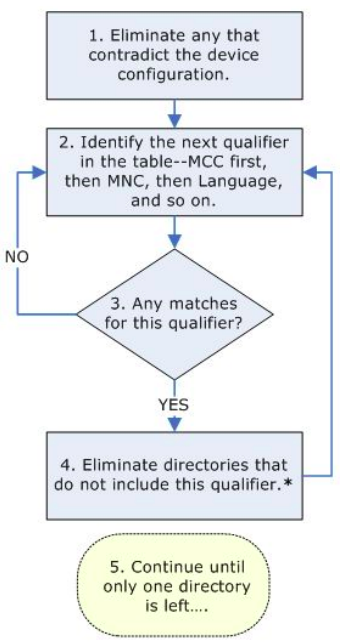

# Lezione 01 - Introduzione al Corso e Storia di Android - 04/02/2026

- Android e Frammentazione: La gestione della frammentazione di tutte le versioni di Android è effetturata tramite degli API Level:
    - **API Level Minimo, Target e Massimo**, il massimo in realtà non è più utilizzato.

# Lezione 02 - Programmazione Android I, Architerrua OS ed App - 06/02/2026

## Architettura

- Basata su architettura a livelli
    - Non propriamente basata su servizi chiamati tra i livelli, ma il paradigma è inverso, è l'OS a chiamare le applicazioni.

- **Dalvik e ART**:
    - **Dalvik**: Macchina virtuale come una JVM, specifica di Android con a massimo ottimizzazioni di JIT, quindi l'ottimizzazione maggiore era compilare eventuali segmenti di bytecode per evitare che venissero inutilmente interpretati dalla VM.
    - **ART**: Ad install-time, motivo per cui si usano degli apk, viene compilato il bytecode Dalvik verso compilato della macchina.

    

- **Diritti e user ID**
    - Gli user ID non identificano gli utenti ma le applicazioni, per ciascuna applicazione si crea "un sotto fs" ed un ambiente specifico per l'esecuzione di quell'applicazione. Raramente più applicazioni condividono lo stesso ambiente.
    - A causa della nascita della necessità di gestire però anche gli utenti si è quindi preferito il prodotto tra gli utenti e l'user id secondo una sintassi `utente0_a100`

## Struttura dell'Applicazione Android

Segue tre fasi:

- **Build**: $sorgente \to apk$
- **Deploy**: $apk \: \text{(su store)} \to apk \: \text{(su device)}$
    - Un `.apk` è un `.jar` specializzato, che a sua volta è uno `.zip` specializzato.
- **Run**: $apk \: \to \text{processo}$

# Lezione 03 - Gestione delle Risorse - 06/02/2026

## Resources vs Assets

Di due macro categorie:
- **Resources**: Risorse di cui l'OS è a conoscenza. Mai gestiti a mano, ma gestiti dal resource manager dell'OS. Quindi sono poste solitamente per convenzione nella sottodir `./res`.  Quindi queste risorse vengono compattate in binario. Nello specifico il tool aapt segue diverse fasi:
    - **Conversione XML** in **binario**
    - Generazione **tabella di corrispondenza** fra **ID** e **offset** per accesso $O(1)$.
    - Si genera una **classe java** `gen/R.java` che **mantiene corrispondenza** tra nome simbolico della risorsa e id nella tabella, quindi fa da indice per tutte le risorse.
    - Questa **classe viene compilata** e **messa a disposizione** come tutte le altre.
- **Assets**: Risorse di cui l'OS non è a conoscenza, solitamente compattati in un `.zip`. Questi non vengono identificati da un id di risorsa, vengono quindi trattati tramite un oggetto `AssetManager`

Questa gestione delle risorse ha il vantaggio di poter effettuare un binding dinamico in base al tipo di risorsa che vogliamo richiedere, (ad esempio in base alla nazionalità o a giorno/notte...)

- **Tipi di Risorse**: Sono ad esempio
    - **Animation**
    - **Color State List**
    - **Drawable**
    - **Layout**
    - **Menu**
    - **String**

Possiamo anche riferire risorse all'interno di altre risorse, ad esempio `"@string/hello"`. In Kotlin non viene generato il sorgente di `R` ma direttamente le classi di `R`.

L'accesso alle risorse avviente tramite `@NOMEPACKAGE/tipo/nome`

`Context` e `Environment` classi standard ci permettono rispettivamente di ottenere informazioni sul contesto e sul dispositivo. Le `Activity` sono **sottoclassi** di `Context`.

## Gestione di Risorse Alternative

Le risorse possono essere specializzate tramite tipo di qualificatori, ad esempio tramite una forma della directory del tipo `res/tipo-QUALIFICATORI/file`.

Questo ci permette di qualificare anche sulla versione di Android con la flag `-v[VERSIONE]`.

A runtime il Resource Manager cerca tra le tante alternative secondo una specifica procedura:

    

Quindi vengono riavviate tutte le applicazioni per fare in modo che siano ricaricate le risorse.

Nell'android manifest è possibile dichiarare esplicitamente cosa sia richiesto per installare l'applicazione.