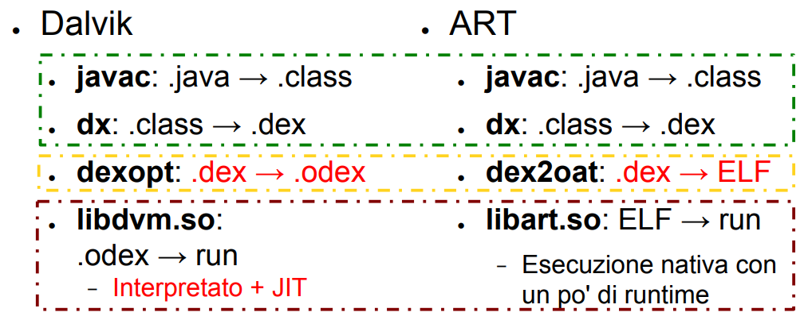

# Lezione 01 - Introduzione al Corso e Storia di Android - 04/02/2026

- Android e Frammentazione: La gestione della frammentazione di tutte le versioni di Android è effetturata tramite degli API Level:
    - **API Level Minimo, Target e Massimo**, il massimo in realtà non è più utilizzato.

# Lezione 02 - Programmazione Android I - 06/02/2026

## Architettura

- Basata su architettura a livelli
    - Non propriamente basata su servizi chiamati tra i livelli, ma il paradigma è inverso, è l'OS a chiamare le applicazioni.

- **Dalvik e ART**:
    - **Dalvik**: Macchina virtuale come una JVM, specifica di Android con a massimo ottimizzazioni di JIT, quindi l'ottimizzazione maggiore era compilare eventuali segmenti di bytecode per evitare che venissero inutilmente interpretati dalla VM.
    - **ART**: Ad install-time, motivo per cui si usano degli apk, viene compilato il bytecode Dalvik verso compilato della macchina.

    

- **Diritti e user ID**
    - Gli user ID non identificano gli utenti ma le applicazioni, per ciascuna applicazione si crea "un sotto fs" ed un ambiente specifico per l'esecuzione di quell'applicazione. Raramente più applicazioni condividono lo stesso ambiente.
    - A causa della nascita della necessità di gestire però anche gli utenti si è quindi preferito il prodotto tra gli utenti e l'user id secondo una sintassi `utente0_a100`

## Struttura dell'Applicazione Android

Segue tre fasi:

- **Build**: $sorgente \to apk$
- **Deploy**: $apk \: \text{(su store)} \to apk \: \text{(su device)}$
    - Un `.apk` è un `.jar` specializzato, che a sua volta è uno `.zip` specializzato.
- **Run**: $apk \: \to \text{processo}$

