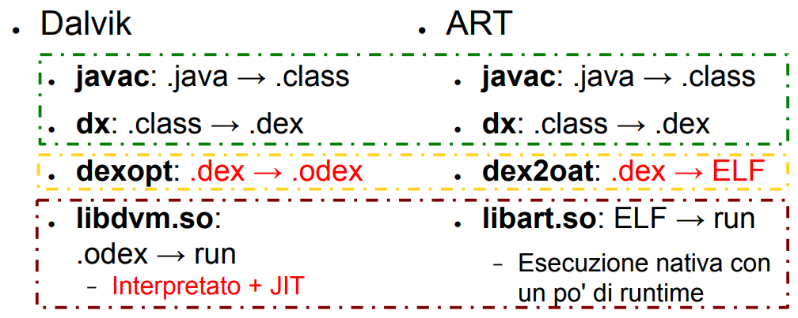
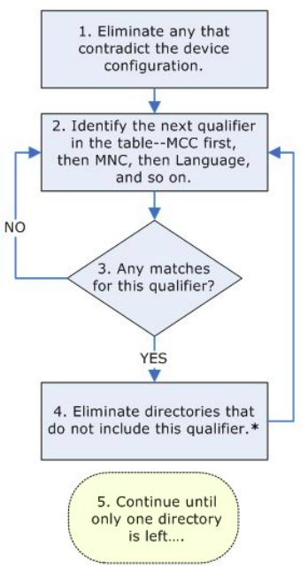
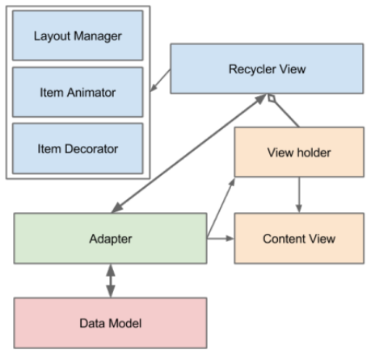

# Lezione 01 - Introduzione al Corso e Storia di Android - 04/02/2026

- Android e Frammentazione: La gestione della frammentazione di tutte le versioni di Android è effetturata tramite degli API Level:
    - **API Level Minimo, Target e Massimo**, il massimo in realtà non è più utilizzato.

# Lezione 02 - Programmazione Android I, Architerrua OS ed App - 06/02/2026

## Architettura

- Basata su architettura a livelli
    - Non propriamente basata su servizi chiamati tra i livelli, ma il paradigma è inverso, è l'OS a chiamare le applicazioni.

- **Dalvik e ART**:
    - **Dalvik**: Macchina virtuale come una JVM, specifica di Android con a massimo ottimizzazioni di JIT, quindi l'ottimizzazione maggiore era compilare eventuali segmenti di bytecode per evitare che venissero inutilmente interpretati dalla VM.
    - **ART**: Ad install-time, motivo per cui si usano degli apk, viene compilato il bytecode Dalvik verso compilato della macchina.

<div style="text-align: center;">
    
</div>

- **Diritti e user ID**
    - Gli user ID non identificano gli utenti ma le applicazioni, per ciascuna applicazione si crea "un sotto fs" ed un ambiente specifico per l'esecuzione di quell'applicazione. Raramente più applicazioni condividono lo stesso ambiente.
    - A causa della nascita della necessità di gestire però anche gli utenti si è quindi preferito il prodotto tra gli utenti e l'user id secondo una sintassi `utente0_a100`

## Struttura dell'Applicazione Android

Segue tre fasi:

- **Build**: $sorgente \to apk$
- **Deploy**: $apk \: \text{(su store)} \to apk \: \text{(su device)}$
    - Un `.apk` è un `.jar` specializzato, che a sua volta è uno `.zip` specializzato.
- **Run**: $apk \: \to \text{processo}$

# Lezione 03 - Gestione delle Risorse - 06/02/2026

## Resources vs Assets

Di due macro categorie:
- **Resources**: Risorse di cui l'OS è a conoscenza. Mai gestiti a mano, ma gestiti dal resource manager dell'OS. Quindi sono poste solitamente per convenzione nella sottodir `./res`.  Quindi queste risorse vengono compattate in binario. Nello specifico il tool aapt segue diverse fasi:
    - **Conversione XML** in **binario**
    - Generazione **tabella di corrispondenza** fra **ID** e **offset** per accesso $O(1)$.
    - Si genera una **classe java** `gen/R.java` che **mantiene corrispondenza** tra nome simbolico della risorsa e id nella tabella, quindi fa da indice per tutte le risorse.
    - Questa **classe viene compilata** e **messa a disposizione** come tutte le altre.
- **Assets**: Risorse di cui l'OS non è a conoscenza, solitamente compattati in un `.zip`. Questi non vengono identificati da un id di risorsa, vengono quindi trattati tramite un oggetto `AssetManager`

Questa gestione delle risorse ha il vantaggio di poter effettuare un binding dinamico in base al tipo di risorsa che vogliamo richiedere, (ad esempio in base alla nazionalità o a giorno/notte...)

- **Tipi di Risorse**: Sono ad esempio
    - **Animation**
    - **Color State List**
    - **Drawable**
    - **Layout**
    - **Menu**
    - **String**

Possiamo anche riferire risorse all'interno di altre risorse, ad esempio `"@string/hello"`. In Kotlin non viene generato il sorgente di `R` ma direttamente le classi di `R`.

L'accesso alle risorse avviente tramite `@NOMEPACKAGE/tipo/nome`

`Context` e `Environment` classi standard ci permettono rispettivamente di ottenere informazioni sul contesto e sul dispositivo. Le `Activity` sono **sottoclassi** di `Context`.

## Gestione di Risorse Alternative

Le risorse possono essere specializzate tramite tipo di qualificatori, ad esempio tramite una forma della directory del tipo `res/tipo-QUALIFICATORI/file`.

Questo ci permette di qualificare anche sulla versione di Android con la flag `-v[VERSIONE]`.

A runtime il Resource Manager cerca tra le tante alternative secondo una specifica procedura:

<div style="text-align: center;">
    
</div>

Quindi vengono riavviate tutte le applicazioni per fare in modo che siano ricaricate le risorse.

Nell'android manifest è possibile dichiarare esplicitamente cosa sia richiesto per installare l'applicazione.

# Lezione 04 - Componenti di un Applicazione Android - 20/02/2026

## Tipi di Component

`Component` è ua classe astratta, che non viene mai istanziata, ma ha **quattro grandi tipologie**:
- `Activity`: Una cosa che l'utente fa, un azione atomico. Quindi un codice con corrispondente interfaccia utente **UI**.
    - Può essere composta da vari `Fragment`.
- `Service`: Codice senza un interfaccia utente, quindi logica che espone un **API**, non interagendo direttamente con l'utente, ma con le applicazioni, solitamente eseguiti **in background** quindi non visibile.
- `Content Provider`: Funge da base di dati, quindi un componente che pubblica contenuti. Anche questa offre un interfaccia programmatica, ma offrendo contenuti, non funzionalità.
- `Broadcast Provider`: Componente che ascolta messaggi globali, si registra come listener per acquisire eventi globali.

## Intent

Tutti questi componenti dialogano tra loro attraverso un **sistema di messaggistica** di `Intent`.
- Messaggi che definiscono l'intenzione di fare qualcosa, nata dall'Intent di un utente a monte.
- Possono essere aggiunti dati non fissati tramite payload.
- Può essere definito un destinatario, oppure inviare questi messaggi in broadcast.
- Ciascun componente può registrarsi ad `Intent` a cui è interessato.
- Il filtro non è propriamente un filtro, ma più una registrazione del tipo publisher/subscriber.

### Lancio di App tramite Intent

- Il **launcher** (un tipo di Activity) **avvia** la **prima Activity** dell'App, inviandole un **Intent** che indica l'**intenzione di lanciarla**.
- L'**Activity** in questione lancia la **propria UI**.
- Il sistema **chiama** certi **metodi** dell'**Activity** (**callback**) in risposta alle azioni dell'utente.
- Ciascuna di **queste callback** potrà ad esempio **lanciare altre Activity**, **inviare Intent** ad altre Activity, **interagire** con **Services**, **recuperare dati** dai **Content Provider** o **terminare l'Activity**.

### Tipi di Intent

- **Explicit Intent**: Definisce esplicitamente il destinatario. In questo caso non viene utilizzato l'Intent Filter.
- **Implicit Intent**: Non si definisce chi sia il destinatario, ma sarà il sistema tramite il filtro degli intenti a capire quale Activity invocare. Se ci fosse più di una possibilità allora si lascia la scelta all'utente.

L'idea e l'astrazione che si vuole fornire è quella che tutti i componenti, anche se non caricati in memoria ma presenti su disco, sono disponibili all'acquisizione di un Intent se registrato tra gli interessati.

### Contenuti di un Intent

Un intent contiene 7 campi:
- **Action**: Che azione si vuole ottenere, definito tramite una stringa.
- **Data**: Su quali dati operare, definito tramite URI.
- **Category**: Categoria dell'azione, definito tramite stringa.
- **Type**: tipo MIME di Data, definito tramite stringa.
- **Component**: Componente a cui è indirizzato il messaggio.
- **Extras**: un Bundle, ossia mappa chiave valore, di campi ulteriori.
- **Flag**: 32 bit aggiuntivi, riservato a future espansioni.

### Intent Filter

- L'Intent Filter non è propriamente un filtro, ma più una registrazione del tipo publisher/subscriber.
- Si definiscono le registrazioni solitamente in maniera statica nel `AndroidManifest.xml`, solitamente in base ad Action, Category e Data.
- Gli interessi possono essere registrati anche a tempo d'esecuzione, ma è più raro.

## Android Manifest XML

Si tratta del manifesto dell'Applicazione che include:
- Configurazione dell'app (nome, icona, package)
- Informazioni sui permessi
    - Fino ad Android 6 era statica la gestione dei permessi, poi sono stati chiesti a runtime. Da Android 11 i permessi più critici vengono chiesti uno per volta, secondo la one-time permission.
- Elenco dei componenti dell'applicazione
    - Configurazione di ciascun componente, inclusa classe Java
    - Dettagli sugli Intent dei vari componenti
- Altri metadati, come librerie, strumenti di profiling.

# Lezione 05 - Activity I - 25/02/2026

`Basato sul PDF Lezione 05`

Le **activity** sono **componenti** di un **applicazione**.
- La **dimensione** di un activity **non è prefissata**, la si determina a tempo di sviluppo.
- I **task utente** si compongono di varie **Activity**.
    - Lanciando un **Intent** si collegano le varie **Activity** del **Task** che sta eseguendo l'utente. Questo si basa su uno Stack, quindi ogni avvio di Activity provoca un push sullo Stack.
    - L'Interazione Utente quindi avviene solo sul Top della pila.
- In realtà in modalità Overview, quando vediamo tutte le applicazioni, non vedo un solo Stack ma molteplici Stack, quindi molteplici Stack di Activities di un Task, dove uno di questi è quello in Foreground. Quindi per ogni Task uno Stack.
- Tutto quello che vediamo nella Overview sono screenshot del runtime dei Task, ma in realtà non è assolutamente necessario che tali Applicazioni siano caricate in memoria.
- Da Android Nougat e Oreo sono state rispettivamente aggiunte Split Screen e Picture-in-Picture che permettono di avere più Top sullo Stack contemporaneamente.

## Comportamento a tempo di Avvio di Activity

### Comportamento e Gestione di Flag

Se si avvia un Activity:
- Se non esisteva un task contenente l'Activity allora viene creato un nuovo task con Stack contenente solo un istanza del Activity richiesta.
- Se viene riavviata un'activity che era top del suo stack, si torna a quella particolare istanza.
- Se viene riavviata un activity che non era top del suo stack allora viene lanciata una nuova istanza e messa in cima allo stack

La **gestione** di queste Activities **può essere** anche **personalizzata** tramite l'utilizzo di flags:
- **Standard**: Crea sempre una nuova istanza dell'Activity nel task di destinazione.
- **SingleTop**: Se l'Activity è top, riavvia l'istanza esistente, altrimenti crea una nuova istanza.
- **SingleTask**: Può esistere una sola istanza dell'Activity. Se ce n'è già una in qualche Task viene riavviata quella, altrimenti si crea un nuovo Task, che ha l'Activity come unico elemento.
- **SingleInstance**: Come la precedente, ma se si crea un nuovo task non consente di creare ulteriori Activity al suo interno.

Anche lato Intent possono essere lanciate con opzioni specifiche tramite la flag `FLAG_ACTIVITY_*`, ad esempio:
- `FLAG_ACTIVITY_NEW_TASK`: L'Activity viene lanciata in un nuovo stack di cui è unico membro
- `FLAG_ACTIVITY_CLEAR_TOP`: Se l'Activity esiste nello stack corrente tutte quelle sopra di essa vengono chiuse, e l'Activity diventa top.
- `FLAG_ACTIVITY_SINGLE_TOP`: Se l'Activity è già quella top nello stack corrente allora non viene lanciata.

### Lancio di un Activity

Il lancio di un App su Android è **disaccoppiato** da un punto di vista **logico** e **fisico**. Quindi un Applicazione può essere in Overview ma non necessariamente caricato in memoria.

Si segue, per il lancio di Intent espliciti un pattern di programmazione asincrona, dato che la UX è fondamentale.

Tutti i metodi di `onCreate()`, `onActivityResult()` sono appartenenti alle Activity e verrano invocate dal sistema per eseguire quell'azione.

### Disaccoppiamento Memoria Logica/Fisica Android

Un **Activity a runtime** è anch'essa **disaccoppiata**, **terminare un Activity** e riavviarla **non necessariamente implica** l'allocazione su Heap, per la stessa questione di prima di disaccoppiamento fisico/logico.
- Il disaccoppiamento può anche portare alla deallocazione fisica di un oggetto Activity in memoria anche se da un punto di vista logico è ancora attivo.
- Questo è un approccio completamente opposto all'utilizzo dell Swap ad esempio in Unix, in quel caso l'OS non sa minimamente cosa si stia spostando su disco.
- Allo stesso tempo Android non usa lo Swap anche perchè impossibile che si utilizzino dei dischi, che non risentono di ripetute scritture.

Si seguono quindi delle **politiche di priorità** per la **gestione della deallocazione**:
- **Priorità Critica**: Activity top dello Stack corrente, non viene mai deallocata.
- **Priorità Alta**: Activity visibili tramite le trasparenze di quella top.
- **Priorità Bassa**: Activity visibili e non utilizzate.

Quindi ogni **Activity** dovrebbe **gestire** le **informazioni di salvataggio** di stato d'istanza, per far conoscere al sistema le informazioni fondamentali se dovesse riprendere in memoria fisica un istanza dell'Activity.

### Fasi di un Ciclo di Vita di un Activity

- `onCreate()`: Creazione dell'attività.
- `onStart()`: Prepara la UI.
- `onResume()`: Da un punto di vista logico stai per interagire con l'utente.
- `onPause()`: Si passa in background da un punto di vista logico, quindi la sua priorità si abbassa da Critica ad Alta. Si dice esplicitamente che non si riceverà input dall'utente, ma potrebbe essere ancora parzialmente visibile tramite ad esempio trasparenza.
- `onStop()`: L'applicazione oltre ad essere in background non è nemmeno visibile.
- `onDestroy()`: Da un punto di vista logico l'Activity è terminata.

#### Salvataggio Stato Istanza Activity

Ciascuna Activity dovrebbe fornire al sistema una `onSaveInstanceState()` quando è necessario salvare parte dello stato dell'activity per il ripristino a breve.
- Se termina il ciclo di vita logico allora questo metodo non verrà mai invocato dal sistema dato che abbiamo la garanzia che fisicamente non avremo mai bisogno di quei dati.
- Se, al contrario, il ciclo logico non è finito allora `onSaveInstanceState()` è importante se dovesse essere necessario rialzare il processo fisico.
- Lo stato viene salvato in un oggetto di tipo Bundle, che è una mappa con specifici metodi `putString()`, `putInt()`, `putBundle()`. 
    - Questo viene anche salvato su disco se il dispositivo viene spento.

## Ripresa Bundle della Lezione Precedente

- Riprendendo dal concetto di Bundle, questo mantiene le informazioni e lo stato dell'astrazione logica del Activity.
- Con la `onSaveInstanceState()` probabilmente salveremo parte della UI tramite le View.
    - L'implementazione di default visita l'albero del XML della UI e salva lo stato per ogni nodo dell'intera interfaccia utente, in base a quanto quest'ultimo crede di voler essere salvato.

## Due Stili di User Interface UI

Gestione con due stili
- **Tradizionale basato su `View`**: nativo di Android ma molto consistente.
    - Definisce tutta la UI come un albero di oggetti Java.
- **Moderno basato su `Composable`**: basato sull'utilizzo di lambda, utilizzabile solo in Kotlin.
    - Utilizza una libreria moderna detta Kotlin, basata su design pattern.

## UI basata su Layout e View

Due classi principali `ViewGroup` e `View`, dove la prima è sottoclasse della seconda e corrisponde ai nodi intermedi, fornendo metodi per la gestione dei figli.

L'interazione è basata su Eventi e relative Handler registrati per la gestione di quell'Evento.
- Gli handler vengono registrati come inner interfaces all'interno della classe View.
- Ogni interfaccia definisce un metodo `on ... Listener()`

# Lezione 06 - Esempio di App BMI Calc - 27/02/2026

Interamente riferita alla gestione su Android Studio di un dummy di una App BMI Calc.

# Lezione 07 - Interazione con la UI - 04/03/2026

## Layout e View

- `LayoutManager`: Particolare tipo di `ViewGroup`, che specifica posizionamento dei figli oltre ad averne e toglierne.
    - Si definisce il posizionamento tramite un processo di negoziazione, in maniera tale da gestire i figli.
    - Esistono Layout predefiniti: 
        - `AbsoluteLayout` fissando le coordinate
        - `LinearLayout` scalando verticalmente e orizzontalmente
        - `RelativeLayout` con posizione di ogni componente relativa agli altri o al contenitore
        - `GridLayout` definita tramite una griglia di celle logiche di dimensione variabile.
        - `FrameLayout`: I figli di questo nodo vengono messi uno sopra l'altro, utilizzato per presentazione iniziale di UI.
        - `DrawerLayout`: Utilizzati per i menù a scorrimento laterale.
        - `SwipeRefreshLayout`: Supporta lo swipe to refresh.

Esistono anche `Layout` contenitori specifici che non sono `LayoutManager` con figli prefissati come `Gallery`, `CalendarView`...

- Le `View` sono invece le foglie della UI, e non per forza di cose bisogna utilizzare quelli predefiniti, se ne possono anche definire di personalizzati.

- Le `View` tra `XML` e classi Java devono corrispondere.
    - Questo permette di fare riferimento a classi del package `android.widget` per **tag non qualificati** e classi custom per tag qualificati

## Listener

Citate solo alcune delle interfacce, non tutte, consulta slide per maggiori informazioni.

- `OnAttachStateChangeListener`
    - Le `View` possono essere inserite o rimossa da un albero dinamicamente (a run-time)
    - `onViewAttachedToWindow(View v)`
    - `onViewDetachedFromWindow(View v)`
- `OnDragListener`
    - Le `View` possono essere drag-droppate una sull'altra
    - `onDrag(View v, DragEvent e)`
    - Vengono chiamati gli `onDrag()`, secondo un protocollo
    noto
        - della vista draggata
        - di quella da cui viene draggata
        - di quelle su cui passa
        - di quella su cui viene droppata

## Menu, Opzioni e ActionBar

- `Menu`: L'App dichiara quali scelte offre all'utente, ed il sistema sceglie come presentarli. Quindi non bisogna strutturare in maniera gerarchica il contenuto, va solo listato.

```xml
<?xml version="1.0" encoding="utf-8"?>
<menu xmlns:android="http://schemas.android.com/apk/res/android">
    <item android:id="@+id/menu1" android:icon="@drawable/ic_menu1"
    android:title="@string/menu1" />
    <item android:id="@+id/menu2" android:icon="@drawable/ic_menu2"
    android:title="@string/menu2" />
    <item android:id="@+id/sottomenu" android:icon="@drawable/ic_sottomenu"
    android:title="@string/sottomenu" >
    <menu>
        <item android:id="@+id/sotto1" android:title="@string/sotto1" />
        <item android:id="@+id/sotto2" android:title="@string/sotto2" />
    </menu>
    </item>
</menu>
```

Quindi questo permette di dichiarare un menu in senso logico, ma non abbiamo nessuna garanzia sul come questo menù verrà mostrato.

- Il ciclo di vita dei menu si basa su dei metodi relativi alla transizione di stato specifica:
    - `onCreateOptionsMenu()`: crea il menu
    - `onPrepareOptionsMenu()`: sta per visualizzare il
    menu
    - `onOptionsItemSelected()`: reagisce alle selezioni

    Da Android 3 in poi viene dato per scontato che il menu non venga modificato fino ad una specifica invocazione di metodo.

### Context Menu

Da un punto di vista concettuale sono **l'equivalente del tasto destro** su Windows, **dipendono** dalla **View** specifica dove si invocano.

### Context Actions

Normalmente esiste una actionbar, ma questa può completamente variare in base al `Context Action`, implementando un interfaccia `ActionMode.Callback`, specificando anche come si entra in questa nuova modalità tramite il metodo `startActionMode(ActionMode mode, Menu menu)`

### Popup Menu

Simile ad un menu, ma anche **collegato ad una View** anche **fisicamente**, non solo logicamente.

### Creazione Menu Dinamico in base ad Intent Filter

Un Menu può essere definito anche in base all'Intent Filter, inserendo tutti i receiver per qui dati.

Si può anche definire tramite un azione definita nell'Intent Filter, inserendo quindi tutti i receiver in grado di compiere quell'azione.

### Menu con Jetpack Compose Introduzione

Approccio moderno di definizione di Menu, sotto uno snippet per rendere l'idea.

```kotlin
@Composable
fun MinimalDropdownMenu() {
    var expanded by remember { mutableStateOf(false) }
    Box( modifier = Modifier.padding(16.dp) ) {
    IconButton(onClick = { expanded = !expanded }) {
            Icon(Icons.Default.MoreVert, contentDescription = "More options")
        }
        DropdownMenu(
            expanded = expanded,
            onDismissRequest = { expanded = false }
        ) {
            DropdownMenuItem(
            text = { Text("Option 1") },
            onClick = { /* Do something... */ }
            )
            DropdownMenuItem(
            text = { Text("Option 2") },
            onClick = { /* Do something... */ }
            )
        }
    }
}
```

# Lezione 08 - View e Layout Custom - 06/03/2026

Definire proprie View secondo l'approccio della rappresentazione in memoria degli oggetti View e Layout, approccio Java.

## Definire una Propria View

Tutte le View personalizzate sono sottoclassi di View, quindi estendendo View ed implementando specifici metodi per:
- `onMeasure(int widthSpec, int heightSpec)`: Gestisce la negoziazione tramite i requisiti passati come argomenti, non solo **dimensioni** ma anche **modi**.
    - Deve essere invocato all'interno della funzione `onMeasure` il metodo `setMeasuredDimension(int width, int height)`, che passa le dimensiori richieste.
    - Si basa su un costrutto di sovrascrittura di eventuali implementazioni di sottoclassi, disaccoppiando definizione della funzione e suo ritorno, pattern non comune nella programmazione ad oggetti.
    - Questo processo permette di gestire la negoziazione delle dimensioni tra genitori 
- `onDraw()`: Tempo di rappresentazione viene invocato questo metodo, a cui viene passato un `Canvas` dal sistema. Da un punto di vista logico è la superficie di disegno.
    - In questo `Canvas` si disegnano oggetti di tipo `Paint`, quindi cosa disegno.
    - Supporta primitive di disegno **geometriche**, **immagini**, **testo** e trasformazioni affini come **rotazioni** e **spostamento**.
    - Tipi di Metodi di `Canvas`:
        - Clipping
        - Trasformazioni Affini
        - Primitive di Disegno
        - Informative
    - `Paint`: Oggetto che permette la definizione di una primitiva grafica che deve essere disegnata.
    - **Reinvocazione**: A tempo di aggiornamento di stato, andrebbe ridisegnata la grafica, di conseguenza esiste un metodo `invalidate()` che va invocato per dire esplicitamente ad Android che la visualizzazione va aggiornata.

## Definizione Attributo Custom in XML

In un container resources va dichiarato un nodo di tipo `<declare-stylable>`

```xml
<resources>
    <declare-styleable name="CartaQuadretti">
        <attr name="dimquad" format="integer"/>
        <attr name="righino" format="color"/>
    </declare-styleable>
</resources>
```

E successivamente va importato come nuove risorse stylable con relativo namespace:

```xml
<LinearLayout
 xmlns:android="http://schemas.android.com/apk/res/android"
 xmlns:tools="http://schemas.android.com/tools"
 xmlns:cq="http://schemas.android.com/apk/res/it.unipi.di.sam.customviewtest"
 …
>
…
 <it.unipi.di.sam.customviewtest.CartaQuadretti
cq:righino=”@color/red” cq:dimquad=”32” … />
…
</LinearLayout>
```

Si gestiscono quindi così i namespace.

## Scrivere un Proprio Layout

Un layout personalizzato deve fare override di un solo metodo ossia `onLayout`.

```java
@Override
protected void onLayout(boolean changed, int left, 
    int top, int right, int bottom) {
    int lato = getLato();
    int w = (right-left)/lato;
    int h = (bottom-top)/lato;
    for (int i = 0; i < this.getChildCount(); i++) {
        View v = getChildAt(i);
        int x = i%lato, y = i/lato;
        v.layout(x*w, y*h, (x+1)*w, (y+1)*h);
    }
}
```

Si eredita dalla classe `ViewGroup`, lasciando la possibilità di disporre i figli secondo criteri personalizzati.

# Lezione 09 - Kotlin e Compose - 11/03/2026

Per tutti gli aspetti sintattici del Kotlin si consiglia la [documentazione Kotlin](https://kotlinlang.org/docs/home.html).

In queste note analizziamo alcuni elementi fondamentali (caratteristiche e zucchero sintattico del Kotlin):

## Lambda in Coda

Se una funzione ha come ultimo argomento, *anche se unico*, una lambda, allora questa può essere portata fuori dalle parentesi in questo modo:

    ```
    // forma iniziale
    f(args, () -> g(...))

    // forma kotlin
    f(args) g(...)
    ```

    Questo caratterizza il modo in cui vengono scritte le `@Composable`:

    ```
    Row {
        Text("Altezza")
        TextField(value = altezza, {altezza = it})
        Text("m")
    }
    ```

Abbiamo quindi l'**impressione** che siano tutte **funzioni invocate una dopo l'altra**, ma in realtà sono **ciascuna argomento** della **funzione precedente**.

## Classi Sealed di Default

Di default le classi non sono estendibili, solo se dichiarate con `open` lasciamo la possibilità di estensione di queste.

Lo stesso vale per i metodi, non possono essere overridati se non dichiarati come `open`.

## Proprietà Delegate

Esiste un costrutto nativo per la gestione della **delega**, ossia il `by` utilizzato secono la sintassi `var id: T by exp`.
- L'oggetto risultante dall'evalutazione di `exp` deve implementare per la variabile un **setter** ed un **getter**.
- Un esempio potrebbe essere:
    ```
    var showDialog by remember { mutableStateOf(false) }
    ```
    - `by` permette la delega al getter/setter restituito da `remember`
    - `remember` implementa il pattern lazy di memoization, quindi tiene cachato il valore fino a quando questo non viene modificato.
    - `{ mutableStateOf() }` Implementa qualcosa di simile al *pattern publish/subscriber*, in particolare:
        - Se viene chiamato `setValue()` e c'è stato almeno un `readValue()` allora invalida la corrente composizione.
    - Un eventuale `showDialog = true` quindi farebbe partire tutto il procedimento di redraw, detto **recompositing**, grazie a tutta la logica spiegata sopra.

## Accenno a logica di Jetpack Compose

La GUI, non più gestita con un albero di `View`, si compone di questi elementi:

- Si dichiara una **gerarchia** di **chiamate di funzione**, ciascuna delle quali ha pezzi di stato come argomenti.
- Quando lo stato viene modificato, il sistema invoca la prima funzione.
- Si utilizzano sistemi di caching per evitare chiamate inutili (come mostrato prima con `remember`).
- Tutte le funzioni sono `@Composable`, prendono come argomenti **stato** e **configurazione** e producono **pezzi di GUI**.
    - L'argomento `contents=...` permette di rappresentare i figli nella gerarchia di contenimento.
    - I `@Composable` possono essere chiamati in parallelo o in qualsiasi ordine.

### Stato ed Eventi secondo il Paradigma Model/View con Kotlin e Compose

Mostriamo quindi un micro esempio di Model/View citando gli elementi mostrati sopra:

```
var peso by remember { mutableStateOf("40") }
// ...
TextField(value = peso, onValueChange = { peso = it })
```

Quindi stato ed eventi seguono due versi opposti:
- **Direzione Stato**: Lo stato segue il verso $ chiamante \to chiamato $.
- **Direzione Eventi** Gli eventi seguono il verso $ chiamato \to chiamante $.

# Lezione 10 - ListView e Data Adapter - 13/03/2026

Definiamo il meccanismo molto utilizzato di lista nella GUI di Android.

- La `ListView` è un `ViewGroup`, anche non essendo un `Layout`, composta da figli che vengono aggiunti man mano che la lista viene visitata.
    - **ListView Statiche**: Definite tramite il file XML, con righe definite tramite l'attributo `android:entries`. Questo può avere senso se sono risorse fisse e abbiamo la necessità di configurarle in base a lingua, regione ecc...
    - **ListView Dinamiche**: Generati dal programma, magari dopo una query di un DB.
        - Funziona tramite un **Adapter**, che pareggia il dato acquisito verso la `ListView`. Nello specifico segue fasi precise:
            - Ottiene i dati raw
            - Costruisce una View che rappresenti graficamente i dati raw.
            - Fornire la View al ViewGroup a cui l'Adapter è associato.
            - Notificare gli Observer quando cambiano i dati.
            - Altri compiti di gestione.
## Adapters

Tipi diversi di Adapters, non tutti, ne accenniamo alcuni

- `ArrayAdapter<T>`: Array Java di elementi, con specifici argomenti da passare al costruttore, come ad esempio:
    - `Context` per l'accesso alle risorse.
    - `ID` del `Layout XML` da utilizzare.
    - `ID` della `TextView` dentro il Layout da popolare con i dati.

- `CursorAdapter`: Sottoclasse di Adapter che gestisce i dati ottenuti da una query SQL.
- `ResourceCursorAdapter`: Adatta i risultati di un Cursor cun un layout da risorsa XML.

Il motivo per cui esiste l'Adapter è proprio quello di non tirare giù in memoria tutte le entry dal DB, ma passarle in maniera dinamica in base alla ListView corrente.

### Gallery

Dato che l'`Adapter` ci permette di decidere quali `View` visualizzare in `ViewGroup` è usata in altri widget.

Gallery mostra una striscia di `View`.

## ListActivity

Sottoclasse di `Activity`, deprecata, specializzata per contenere `ListView`.
- Ha solo due figli `View`, uno da mostrare se sono presenti 0 items o almeno 1 l'altro.

## RecyclerView

Si disaccoppiano le operazioni di **adattamento delle View con dati dinamici** e **riciclo per risparmiare memoria**.
- Bisogna quindi dividere questi comportamenti:
- `RecyclerView` si occupa della gestione della memoria, e riferisce a classi esterne per operazioni che non siano questa di gestione memoria:
    - **LayoutManager**: Definita come inner class, ereditata da `RecylerView.LayoutManager`.
    - **Adapter**: Eredita da `VH extends RecyclerView.ViewHolder`, ossia un contenitore per View "cachate".
        - Bisogna implementare i soliti metodi `getItemCount()`, `getItemId()`.
    - **Operazioni di Binding**: Il processo di binding consiste nel modificare un `ViewHolder` in modo da mostrare i dati corrispondenti a un dato indice.
    - **Decorazioni e Animazioni**: Permettono la decorazione di una vista, tramite il metodo `onDraw()` della classe `RecyclerView.ItemDecoration` 

- Riferisce quindi ad un architettura un po' più complessa di quella precedente

- Spesso si usa una `RecyclerView` come contenitore e delle `CardView` come contenuto.

<div style="text-align: center;">
    
</div>

# Lezione 11 - WebView e Drawable - 18/03/2026

`Basato sul documento di slide PDF Lezione 11`

Una `WebView` è una `View` che incapsula un web browser
- Permette autenticazione, utilizzo di JS
- Gesisce errori di rete, scroll e zoom

Esistono due approcci diversi:
- Si lancia il browser web preferito dell'utente tramite l'utilizzo di un `Intent`.
- Incorporare la `WebView` nell'`Activity` stessa.
    - Per utilizzare questo approccio chiaramente l'Activity deve avere il permesso ad utilizzare Internet.

## Delega per Gestione Operazioni WebView

Per rispettare i principi di Responsibilità Singola si definiscono delle sottoclassi di classi date che implementano metodi per la gestione di responsabilità "installabili" alla WebView:
- Sottoclasse di `WebChromeClient`
- Sottoclasse di `WebViewClient`
- Sottoclasse di `WebSettings`

Ciascuna di queste sottoclassi implementano metodi per operazioni aggiuntive.

## Interprete JS nella WebView e Binding

La WebView può eseguire nativamente il codice Javascript presente nella pagina.

Quindi si possono invocare funzioni JS sia identificandole oppure bindando oggetti tra bytecode JAVA e JS

Questo secondo approccio si effettua tramite l'utilizzo del metodo `addJavascriptInterface(oggetto, nome)`

Su questo approccio di bridging si basano tutte le strutture di WebApp viste come se fossero native su Android. Vivono nella WebView, come in **Cordova** di **Apache**.

Xamarin è un altro approccio cross platform che permette gestione nativa solo della UI e tutti i servizi offerti in ambiente .NET

## Drawable

La classe Drawable è la superclasse per le cose che possono essere disegnate.

Ne esistono di diverse già implementate, vale la pena guardarle prima di definirne di proprie.
- Spesso grande espressività si ottiene combinando i drawable tra loro.

- `StateDrawable`: Viene disegnato in base allo stato corrente, come ad esempio stati di un pulsante.
- `LevelDrawable`: Viene disegnato rispetto al livello passato, quindi ad esempio il livello di batteria è un singolo `Drawable` ma modellato rispetto al numero passato.

### NinePatch Drawable

Si dichiara quale zona del drawable può essere stretchata, per fare in modo che resti consistente anche a dimensioni variabile

# Lezione 12 - Notifiche - 20/03/2026

`Basato sul documento di slide PDF Lezione 11`

Lezione sulla spiegazione di notifiche, che si classificano in 
- **Toast/Snackbar**: Popup brevi sopra la corrente activity che appare e scompare automaticamente.
    - Brevi, veloci, utilizzati per eventi "poco asincroni", quindi qualcosa che ho fatto di recente.
    - Solitamente viene creato tramite un metodo statico, secondo il pattern Factory.
        ```JAVA
        Toast.makeToast(context, text, duration).show()
        ```
    - Le **Snackbar** è implementazione di un toast ma sono attaccate all'albero delle Activity, quindi garantisco il contesto ma se appaiono durante un altra Activity non le vedo.
        - Utilizzano un `CoordinatorLayout` in caso di effetti per animazioni.
        - Si assegna nella View normalmente una dimensione in altezza di $0$ e vengono sincronizzati i Layout dal coordinator, che da e toglie spazio dando animazione.
        ```JAVA
        Snackbar sb = Snackbar.make(myCoordinatorLayout, R.string.sb, 500)
        ```
- **Status bar Notification**: Classiche notifiche
    - Segnalazione di eventi in background da parte di Activity o Services.
    - Hanno cicli di vita completamente disaccoppiati dal componente che le ha generate.
    - Possono fornire anche comandi o progress bar.
    - **Classi Notification vs NotificationManager**:
        - **Notification**: L'oggetto che rappresenta la singola notifica in questa si definiscono
            - L'icona
            - Il testo da mostrare
            - L'istante della notifica
            - Creata in maniera originale con
            ```JAVA
            Notification not = new Notification(icon, tickerText, when)
            ```
            - Dopo Android 12 si utilizzano molti più metadati per la descrizione di una notifica, secondo il solito paradigma per cui si disaccoppia e si utilizza una Factory per creare una notifica
        - **NotificationManager**:
            - **Servizio di sistema** che gestisce le notifiche, a cui viene passato l'ID per essere effettivamente visualizzata in tendina, per intenderci.
            - Si wrappano gli Intent con dei PendingIntent che mantiene tutte le informazioni di contesto della Intent, per avere tutte le info necessarie a lanciare l'Intent quando necessario.
    - **Notifiche Heads-Up**: Esempio classico di arrivo telefonata durante un altra Activity, si posiziona in alto ed è più invasiva rispetto ad una normale notifica
    - Canali di Notifica: Una app può inviare una notifica ad uno specifico canale:
        - Ogni canale definisce ad esempio priorità, segnale sonoro, vibrazione, se vanno su lockscreen, se vanno mostrate 
- **Dialog**: Gestione di modali a finestre, non molto utilizzate in contesto mobile, sono più da contesto desktop

