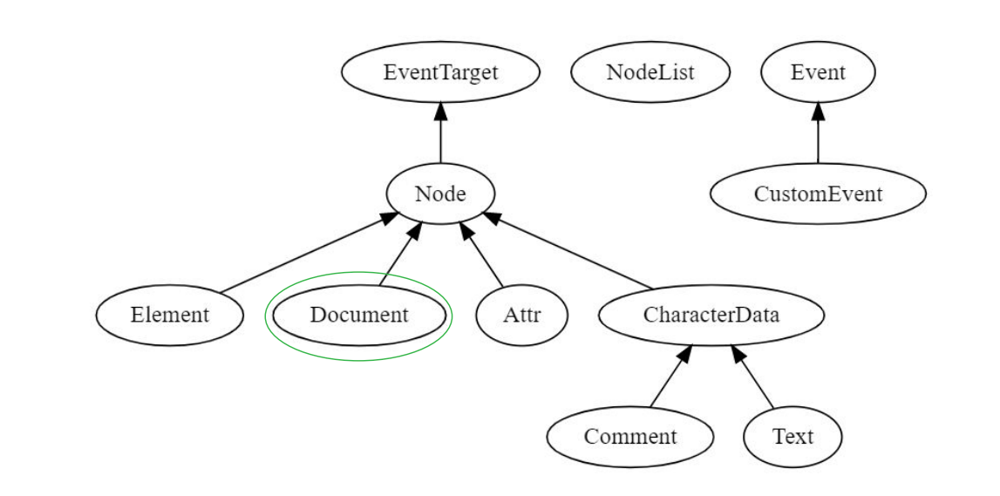

# Lezione 1 - Introduzione al Corso - 02/02/2026

Cenni storici allo sviluppo web, eventualmente vedi `PDF 01` del corso.

# Lezione 2 e 3a - HTML e CSS - 04/02/2026

`Basato sul PDF 03`

## HTML come Linguaggio di Markup

Descrizione di una **pagina web** tramite un **albero di Elements**. 

Un oggetto **Document** rappresenta un **documento HTML**.

La descrizione è semantica perchè un titolo, con token title indica sia come token che come significato che è un titolo.

### Struttura base Head e Body

Definito da `head` e `body`

### Elementi ed Attributi

- **Elementi**:

    Si basano sull'utilizzo dei tag di apertura/chiusura, non tutti hanno bisogno di essere chiusi.

    ```HTML
    <tag attr1 attr2 … attrn>content</tag>
    <tag attr1 attr2 … attrn>
    ```

- **Attributi**:

    Una particolarità è che possiamo utilizzare un prefisso come `&` oppure `#` per riferire al simbolo relativo nella unicode, questo procedimento è detto **character reference**.

## Content e Tipologie

Esistono vari tipi di contenuto, ad esempio:
- **Metadata Content**: No rendering, informazioni meta non renderizzate.
- **Flow Content**: Contenuto effettivo renderizzato.
- **Sectioning Content**: Definiscono gli elementi di header e footer.
- **Embedded Content**: Contenuto multimediale della pagina.
- **Interactive Content**: Definito per l'interazione dell'utente (audio, buttons...)

**Dialog vs Modale**: Rispettivamente il primo non blocca l'interazione con il resto della pagina mentre il secondo si, sono entrambe finestre che appaiono nella pagina.

**img vs svg**: Il primo è un immagine definita come "matrice di pixel", la seconda è vettoriale, quindi il tutto è definito da funzioni matematiche, quindi allo zoom non si perde risoluzione.

**Forms**: Permette l'interazione con un server tramite anche attributo `action` e `method`, in questo modo si possono passare informazioni.

**Gestione Input**: Options, Radio/Checkbox, File, Range ...

**Tag Script**: Permette l'inserimento di JS.

## CSS - Cascade Style Sheets

Permette la definizione di stile in base al tipo di media, grazie ad esso si può ruotare ad esempio un elemento HTML.

- **Selettori/Dichiarazioni**: Insieme di regole ciascuna definita come lista di **selettori** e da un insieme di **dichiarazioni**:

    ```CSS
    h1 { /* Selettore */
        color: blue; /* Dichiarazione */
    }
    ```

- **Cascading**:

    Definite come regole cascading perchè segue a cascata l'ordine in cui vengono definite, quindi l'ultima definita sarà quella utilizzata.

    Esiste un costrutto `!important` che si svincola da questo ordine predefinito.

    ```CSS
    p {
        color: blue;
    }

    p {
        color: red; /* quella che ha importanza di default */
    }
    ```

- **Gerarchie e Classi di Selettori**: Possiamo definire gerarchie tra selettori di regole, e questi possono essere identificati in maniera univoca tramite `id` oppure tramite `pseudoclassi`. Queste possono essere utilizzate tramite operatore `:`, quindi `selettore:pseudoclasse` istanziando potrebbe essere `selettore:first-child`

- Il **CSS** può essere utilizzato **inline**, **internamente** al file tramite tag `<style>` oppure **esternamente** linkandolo.

- **CSS**: unità di misura, può essere assoluta
    - **Assoluta**: cm, inch, mm
    - **Relativa**: em (in base al font), rem (relativo alla dimensione del font), vw, wh (relativo alla dimensione whidth ed height) della viewport.

- **Box Model**: Ogni elemento HTML è avvolto in un box di layer:
    - **Content**: Contenuto del box.
    - **Padding**: Spazio attorno al contenuto, tra content e border.
    - **Border**: Bordo attorno a padding e contenuto.
    - **Margin**: Lo spazio all'esterno del bordo.

- **Box Model Positioning**: Specifica il posizionamento da usare per un elemento, ne esistono di 5 tipi:
    - `static`: Posizionamento statico di default
    - `relative`: Grazie a top, botto, left, right possiamo spostare l'elemento rispetto al suo posizionameto originale.
    - `absolute`: Posiziona l'elemento in base al più vicino antenato.

- **Flex Layout**: Dopo le prime versioni di CSS, viene portato il layout flex che permette di distribuire elementi a colonne, oppure righe. Si definisce quindi tutto in relazione ad un asse principale, che può essere x oppure y.

- **Grid Layout**: Permette la definizione bidimensionale di layout di elementi, definita da questi elementi principali:
    - **Line**: Linee orizzontali e verticali che dividono la griglia.
    - **Cell**: Unità più piccola della rappresentazione a griglia.
    - **Area**: Area rettangolare composta da una o più grid cell.
    - **Track**: Spazio tra due griglie adiacenti.
    - **Gutter**: Spazio tra le cell.

### Frameworks CSS

- **Bootstrap**: Classico framework che fornisce classi predefinite e forniva supporto al responsive design.
- **TailwindCSS**: Framework basato su mattoncini atomici, basato quindi sulla costruzione di componenti un po' più complessi, quindi più modulare e moderno.
- **SASS**: Linguaggio compilabile in CSS, che permette la definizione di annidamento o utilizzo di variabili, che nativamente non era supportato dal CSS.

# Lezione 3b - JavaScript - 09/02/2026

`Basato sul PDF 04`

- **nodejs**: Ha portato lato server l'interprete javascript ed oltre a questo ha permesso cose che prima non erano permesse per questioni di sicurezza, come l'accesso ai file.

- Come tutti i **global object** che abbiamo già visto, come **Math e JSON**, esiste anche la **window** in **contesto web**.

- **Chiusura di tipo statico**, quindi variabili libere vengono risolte a tempo di dichiarazione e non a tempo di chiamata di funzione, portandosi dietro la dichiarazione delle variabili a tempo di dichiarazione delle funzioni.

# Lezione 4 - JavaScript - 16/02/2026

## JSON

Formato standard per interscambio di dati, prima di `JSON` si utilizzava `XML`, ma è stato quasi del tutto sostituito.

### Differenze tra Object JS e JSON

- **Object Literal**: 
    - È un oggetto
    - Il nome delle proprietà può essere un numero o una sequenza di caratteri
    - Il nome delle proprietà può essere una regexp
    - Il nome delle proprietà può essere undefined
    - Il nome delle proprietà può essere una funzione
- **JSON**:
    - Statico, quindi può essere un numero o una sequenza di caratteri ma non tutti gli altri.

### Classi e Prototipi

L'ereditarietà si basa sulla catena dei prototipi, l'utilizzo dei costrutti come `Class` è zucchero sintattico per effettuare lo stesso tipo di operazione.

### Higher Order Functions

In JS sono presenti `map`, `forEach`, `reduce`...

## Promises

Permette la gestione di computazioni asincrone, ha **tre stati**:
- **pending**: stato iniziale
- **fulfilled**: successo
- **rejected**: fallimento

Le promises hanno hanno dei **fate**, ossia `resolved` oppure `unresolved`.

Utilizzeremo in serie `.catch()`, `.then()`, ma se vogliamo farlo sia in caso di fallimento che di successo allora utilizziamo `.finally()`, che viene eseguita in caso di `settled`.

### Async/Await

Sintassi alternativa per la computazione asincrona.

- `async function`: Dichiarazione di una funzione che restituisce una `Promise`. Oltre a questo ci permette di utilizzare await all'interno della funzione.
- `await`: attende che la promise sia risolta prima di continuare. Perdiamo quindi la possibilità formalmente di gestire in parallelo più promises, in realtà no però perchè potrei far seguire ad un await una `.all()`, ad esempio.

## Event Loop

Tutto il runtime di JS si basa su quattro oggetti principali:
- **Stack**: Implementa la pila dei frame d'attivazione delle funzioni. A tempo di `return` tutte le variabili locali ad una funzione vengono rimosse, a meno di chiusure.
- **Heap**: Zona di memoria di allocazione della memoria, allocata e deallocata automaticamente dal garbage collector.
- **Queue**: Lista messaggi da processare, modo in cui quindi vengono gestite le `setTimeout()` o altri eventi. Quando viene selezionato quel messaggio nella coda viene handlato dalla funzione passata.
- **Event Loop**: L'event loop non è nient'altro che un while che si occupa di effettuare delle pop dalla queue.
    - Tutti gli eventi standard, come l'utilizzo del click del mouse hanno degli handler associati.
    - Gli eventi senza handler associati vengono ignorati.
    - Gli iframe e di web worker sono delle eccezioni, perchè hanno i loro stack, heap e queue.

### Gestione con Observer Pattern

Sistema ad eventi si basa su due attori principali, `Observer` e `Subject`, dove il `Subject` quando varia il proprio stato deve notificare gli `Observer`.

<div style="text-align: center;">
    
</div>

## Gestione a Moduli di JS

In origine non esisteva alcuna gestione a moduli, ma permette più riusabilità la gestione a moduli.

Esistono vari approcci a pattern:

- **Module Pattern**: Esponiamo le funzionalità attribuendole ad un oggetto globale tramite dichiarazione come primo comando eseguito.
- **CommonJS**: Primo approccio a moduli effettivi, ma sincrono.
- **AMD**: Asynchronous Module Definition, che si basa sull'utilizzo della `define()`, che ha bisogno di specifici argomenti per definire un modulo. Oltre a questo si basa RequireJS, come file che si occupa di questa operazione.

In sintesi dei pro di ciascuno di questi pattern è nato **Browserify**, che permette di gestire tutto l'albero delle dipendenze in un `bundle.js` a cui riferità la pagina web.

- **UMD - Universal Module Definition**: Si occupa della gestione della coesistenza di gestione moduli, che a runtime si occupa di capire come sia stato importato un modulo, da utilizzare nel caso in cui si usassero più metodologie di import.

# Lezione 5 - Esercitazione HTML e CSS - 18/02/2026

Esercitazione in aula.

# Lezione 6 - DOM (Document Object Model) - 23/02/2026

`Riferisce al pdf delle slide Lezione 05 - DOM`

Il **DOM** è una **rappresentazione gerarchica** della **struttura del contenuto** di un **documento HTML**.

Quindi anche la **rappresentazione in memoria** di un **documento HTML**, e una **API** per la **manipolazione** di **documenti Web**.

La **gerarchia** segue uno **schema ad albero**, mantenendo tra le **risorse delle relazioni**.

Ogni DOM ha un nodo radice, esiste un rapporto tra DOM e JS, perchè è un astrazione (**global object window**) tramite la quale possiamo accedere agli elementi.

## Eventi

La programmazione web si basa sugli eventi (click, tastiera...), questi quindi possono essere emessi (**fire**) e successivamente handlati tramite una funzione handler specifica.

<div style="text-align: center;">
    
</div>

### Prevent Default

Esistono degli handler di default, se fossimo interessati a non eseguire questo comportamento allora possiamo utilizzare `event.preventDefault()`

### Event Bubbling

Gli eventi, se intercettano più di un elemento HTML, si segue un ordine dal più interno al più esterno, detto **event bubbling**.

Di default si segue una propagazione dall'interno verso l'esterno, bisogna definire una `stopPropagation()` se si vuole esplicitamente spezzare la catena di listening.

Possiamo anche invertire l'ordine, metodologia detta **capturing**, partendo dall'elemento più esterno a quello più interno, ma solitamente si segue l'event bubbling definito prima.

Il target quindi è l'elemento che si occupa del dispatch dell'evento.

### Classe EventTarget

Fornisce metodi che permettono la modellazione della gestione di eventi, tramite ricezione e gestione:

- `addEventListener`: Fornisce un handler ad un evento, secondo la forma

    ```javascript
    addEventListener(type, listener, options)
    //oppure
    addEventListener(type, listener, useCapture)
    ```
    - `type`: Rappresenta la stringa del tipo di evento
    - `listener`: un oggetto che ha il metodo handleEvent oppure una funzione JS per la gestione dell'evento, che abbia come parametro l'evento stesso
    - `options`: oggetto per passare opzioni
    - `useCapture`: definisce l'ordine.

- `removeEventListener`: Rimuove l'handler
    ```javascript
    removeEventListener(type, listener, options)
    //oppure
    removeEventListener(type, listener, useCapture)
    ```
    Solitamente utilizzato quando si rimuove un elemento dal DOM.

    Nel caso in cui si volessero rimuovere tutti i listener invece che uno solo dall'elemento specificato nel `listener` possiamo utilizzare un `abort` a cui passiamo un signal registrato nelle option a tempo di registrazione dell'evento.

- `dispatchEvent`: Trasmette un oggetto evento al target in maniera sincrona, invocandone l'handler associato.
    ```javascript
    elem.dispatchEvent(evt)
    ```
    Dove `evt` è l'evento da trasmettere ed `elem` è l'elemento HTML a cui trasmettere l'evento.

### Custom Event

Non per forza bisogna utilizzare Eventi appartenenti all'API del DOM ma possiamo anche definirne di nuovi

```javascript
const e = new Event("build")
elem.addEventListener(
    "build",
    (e) => {
        //...
    }
)

elem.dispatchEvent(e);
const e = new CustomEvent("build", { detail: 42 });
```

## Oggetto Node nel DOM

Tutti gli oggetti nel DOM sono `Node`, quindi `Node` è la classe astratta che viene implementata ad esempio da `Document` o `Element`.

Alla base della manipolazione degli elementi del DOM, quindi un interfaccia comune per ogni elemento.

Espone una serie di proprietà che ci permettono di navigare tra i nodi con ad esempio `firstChild`, `lastChild`, `parentElement`...

### Metodi dell'Oggetto Node

- `node.appendChild(newNode)`: aggiunge un nodo alla lista dei figli del nodo `node`.
- `parent.insertBefore(newNode, node)`: inserisce `newNode` come figlio di `parent` prima di `node`.

Esistono anche `removeChild` e `replaceChild` ed ulteriori metodi che permettono la manipolazione del DOM in maniera dinamica.

## Oggetto NodeList nel DOM

Rappresenta una lista di nodi del DOM, e ha metodi molto simili ad una mappa per permetterne la manipolazione:

- `nodeList.forEach()`: applica una funzione a ciascun elemento.
- `nodeList.keys()`: restituisce un iteratore sulle chiavi dei nodi della lista.
- `nodeList.values()`: restituisce un iteratore sulla lista.
- `nodeList.entries()`: restituisce un iteratore sulle coppie $(indice, valore)$ della lista.


## Oggetto Document nel DOM

Tramite le proprietà di questo oggetto possiamo accedere ad informazioni sull'intera pagina Web.

Rappresenta la root del documento HTML e serve da entry point a tutto il suo contenuto, tramite attributi come:

- `body`: riferimento al body.
- `head`: riferimento alla head.
- `cookie`: stringa di tutti i cookie separati da un `;`
- `URL`: location del documento sottoforma di stringa.
- `links`: lista dei link della pagina
- `images`: la lista di immagini della pagina

## Selezione Elementi tramite querySelector ed elementById

Selezionare elementi della pagina tramite selettori CSS

- `querySelector(selector)`: restituisce il primo elemento secondo il selettore passato.
- `querySelectorAll(selector)`: restituisce una NodeList (statica).
- `selectElementById(id)`: restituisce una HTMLElement (dinamica).

## Creazione dinamica di Nodi

Possiamo dinamicamente creare nodi tramite metodi di `Document`:

- `document.createElement(tagName)`: Definisce un elemento, distinguendolo con la stringa passata in `tagName`.
- `document.createTextNode(text)`: text è il contenuto del nodo testo.
- `document.createAttribute(name)`: viene assegnato un attributo `name`.

## Oggetto Element del DOM

Rappresenta la classe base per tutti gli elementi, deriva da `Node`, queste possono ad esempio essere `SVGElement` ed `HTMLElement`.

- `element.children`: lista di elementi figli di e.
- `element.attributes`: lista di attributi di e.
- `element.id`: identificatore unico dell'elemento.
- `element.innerHTML`: stringa che rappresenta l'intero sottoalbero dell'elemento, cambiarne il valore modificherebbe appunto tutto il sottoalbero.

### Manipolazione CSS tramite DOM

Ogni `HTMLElement` ha una proprietà style, rappresenta lo stile CSS per l'elemento.

Possiamo dinamicamente modellare lo stile di un elemento modificandone direttamente il valore, oppure accedendo alla proprietà read-only `classList`.

## Oggetto Attr e CharacterData del DOM

- **Attr**: Rappresenta un attributo di un elemento come oggetto e contiene l'associazione tra il nome dell'attributo ed il suo valore
- **CharacterData**: Interfaccia astratta che rappresenta un nodo che contiene caratteri

# Lezione 7 - NPM (Node Packet Manager) - 25/02/2026

## Definizione Package NPM

- Un package è una directory che contiene un file `package.json`
- Per NPM un modulo è un qualsiasi file o directory nella cartella `node_modules`
- Un modulo può non essere un package, per essere un package deve avere un `package.json`, ciascun modulo può essere ad esempio richiesto con require.
- Possono essere definite con **scoped** tramite l'utilizzo del `scope@package`

### Semantic Versioning

Si segue una sintassi del tipo `vMAJOR.MINOR.PATCH` dove:
- `MAJOR`: Cambiamenti breaking, non retrocompatibili.
- `MINOR`: Aggiunta di feature, nuove funzionalità ma retrocompatibile.
- `PATCH`: Fix, risoluzione di bug retrocompatibile.

### Anatomia di un package.json

```json
{
  "name": "test",
  "private": true,
  "version": "0.0.0",
  "main":"index.js",
  "type": "module",
  //possiamo eseguire questi comandi come npm run [script]
  "scripts": {
    "dev": "vite",
    "build": "tsc && vite build",
    "preview": "vite preview",
    "hello": "echo \"HelloWorld\" "
  },
  // coppie chiave valore (pacchetto, range versioni) di dipendenze
  // di cui ha bisogno il nostro pacchetto
  // nello specifico per dipendenze a runtime
  "dependencies": {
    "typescript": ">5.9.3", //tutte quelle maggiori a quelle
    "vite": "~7.3.1", //circa, accettiamo tutte quelle che variano
    //  in MINOR o PATCH DEL VERSIONING
    "vite1": "^7.3.1" //hat indica compatibili, quindi =x.y.z e <(x+1).y.z
  },
  // simile, ma non per runtime,
  // per dipendenze per sviluppo non necessario al runtime
  "devDependencies": {
    "typescript": "~5.9.3",
    "vite": "^7.3.1"
  }
}

```

### NPM package-lock.json

Il `package-lock.json` descrive in maniera univoca un albero delle dipendenze.

Se ne utilizza uno aggiuntivo `package.json` perchè il package dipende dal "quando", qualcosa può variare in base al tempo di installazione delle dipendenze. 
- Potrebbe essere cambiato il pacchetto ma non la sua versione

Quindi il `package.json` definisce le dipendenze del pacchetto, mentre il `package-lock.json` descrive univocamente tutte le sue dipendenze tramite un albero.

### Comando npx

Comando da CLI che esegue un comando locale o remoto, questi vengono cercati nel path `./node_modules/.bin`

### Bun e Deno

Alternative ad npm per gestione pacchetti:
- **Bun**: Scritto in Zig, pensato per le massime prestazioni in termini di velocità.
- **Deno**: Scritto dagli stessi autori di Node, pensato per la solidità basandosi sull'esperienza con Node.
    - Supporto nativo con typescript
    - Rispetta nativamente le API del browser
    - Elimina le necessità delle node_modules tramite le registry

# Lezione 8 - Frameworks - 02/03/2026

- **Framework**: Piattaforma per lo sviluppo di applicazioni software, che fornisce una base su cui gli svilupatori possono costruire programmi per una piattaforma specifica.
    - Permette la gestione strutturata invece che codice ripetuto in JS, detto boilerplate.
    - Si seguono principi di design che semplificano lo sviluppo.

- **Frontend**: Tutta la logica con cui interagisce l'utente.
- **Metaframework**: Framework di framework, permettono l'utilizzo di più framework contemporaneamente, ad esempio con NextJS.

## Concetti Ricorrenti nei Framework

- **Componente**:
    - Parte della UI che contiene la logica di rendering e la gestione delle informazioni ad essa associata.
    - Hanno un ciclo di vita e sono riutilizzabili.
        - Suddiviso quindi in fasi da quando viene aggiunto al DOM fino a quando viene rimosso da esso.
- **Reattività**:
    - Gestione della propagazione dei cambiamenti di stato
    - Capacità per ciascun componente può cambiare, ad esempio a causa dell'esecuzione di un azione da parte dell'utente oppure per informazioni ottenute dal server.
- **Template**:
    - Estensione della sintassi HTML per agganciare HTML logica di presentazione con logica di business.
- **Data Flow**:
    - Meccanismi di comunicazione inter-componente.

## Strategie di Rendering

- **Client Side Rendering - CSR**:
    - Il server invia un file **HTML minimale**.
        - Nel HTML viene riferito anche il JS, che viene fornito in bundle dal server.
        - Il `div` vuoto riempie la pagina, seguendo la logica fornita nel bundle JS.
    - **Vantaggi**:
        - Post rendering la pagina è molto fluida, in Single Page Application
    - **Svantaggi**:
        - First Contentful Paint (FCP) lento, impatto negativo dato dal primo caricamento che può risultare lento.
        - A carico del client, quindi dipendente dal dispositivo da cui stiamo eseguendo.

- **Server Side Rendering - SSR**:
    - Il server riceve la richiesta, recuperai dati, genera l'intero HTML completo per quella pagina e la invia al browser.
    - **Vantaggi**:
        - Caricamento iniziale quasi istantaneo, ideale per dispositivi poco performanti.
    - **Svantaggi**:
        - Perdita di interattività immediata, tramite **Hydration**, in cui il framework a tempo d'interazione deve occuparsi di aggiornare la pagina acquisendo le informazioni dal server.

## Introduzione a React

- Libreria **dichiarativa** (si descrive cosa deve essere fatto ma non come deve essere fatto, per ripassare cosa si intenda con dichiarativo) sviluppata da Meta per creare interfacce utente.
- Nasce per questione di manutenibilità di Facebook, poi disaccoppiato all'acquisizione di Instagram e ancora dopo reso open source.
- Nasceva come libreria, successivamente diventata un framework.

### Componenti React

Ogni componente è una funzione JS, accetta input tramite `Props` e restituisce un `ReactElement`, utilizzando nel suo corpo la sintassi **JSX**, mescolando **HTML** e **JS**.

```JSX
function SAW() {
    return <div>
        <h1> SAW TODO </h1>
        <p> Welcome to SAW React </p>
    </div>
}
```

- **Sintassi e Regole JSX**: 
    - Un espressione JSX deve restituire un singolo elemento radice, racchiudendo ad esempio tutto in un `<div>`.
    - Tutti i div devono essere chiusi a differenza di **HTML5**.

- **Relazione tra Componenti**: Possiamo chiamare in una funzione che ritorna Componenti delle funzioni che ritornano altri componenti.

    ```JSX
    function UserInfo() {
        return (
            <div>
                <Avatar />
                <Age />
                <Name />
            </div>
        )
    }
    ```

### Props React

I componenti dovrebbero essere funzioni pure rispetto alle Props passate, non modificandole ma andando solo in readonly.

```JSX
function Avatar(props) {
    return 
}
```

### Hooks React

Gli Hook in Reacto sono funzioni JavaScript che possono essere usati nei componenti, ora i componenti si definiscono solo secondo il paradigma funzionale.

Evitano scrittura di classi per definire Componenti, permettono la gestione di stato e dei side effects.

Bisogna seguire due regole:
- Bisogna utilizzare gli hook a top level del componente.
- Gli hook possono essere chiamati solo dentro altre funzioni chiamate.

#### Hook useState

Hook che permette di gestire una variabile di stato per componente. Lo stato è privato al componente.

Si basa sulla restituzione di un getter ed un setter come primi due valori di un array.

```JSX
function ClickCounter() {
    const [n, setN] = useState(0);

    function handleClick() {
        setN((v) => v + 1)
        setN((v) => v + 1)
    }

    return (
        <button onClick={handleClick}>
            Add 2 to count: {n}
        </button>
    )
}
```

Viene utilizzata al **referential equality**, quindi se passiamo un oggetto ad una useState, questi verranno confrontati per riferimento, se vengono modificati questi l'oggetto sarà ancora lo stesso. Quindi va eventualmente copiato e modificata la copia dell'oggetto.

```JSX
//esempio di deep copy per gestione della referential equality
function Exam() {
    const [exam, setExam] = useState({ name: "SAW", grade: 17})

    function incrementGrade() {
        setExam((e) => ({...exam, grade: e.grade + 1}))
    }

    return (
        <div>
            <p> All'esame di {exam.name} hai preso {exam.grade} </p>
            <button onClick = {incrementGrade}> Alza il voto </button>
        </div>
    )
}
```

#### Hook useRef

Restituisce un oggetto con la proprietà `current`, ossia riferimento al valore attuale. È possibile modifcare il valore riferito, utile per ottenere un riferimento ad un elemento HTML.

#### Hook useEffect

Serve a sincronizza re un componente con un sistema esterno, ad esempio per chiamare una API per aggiungere o rimuovere event handler.