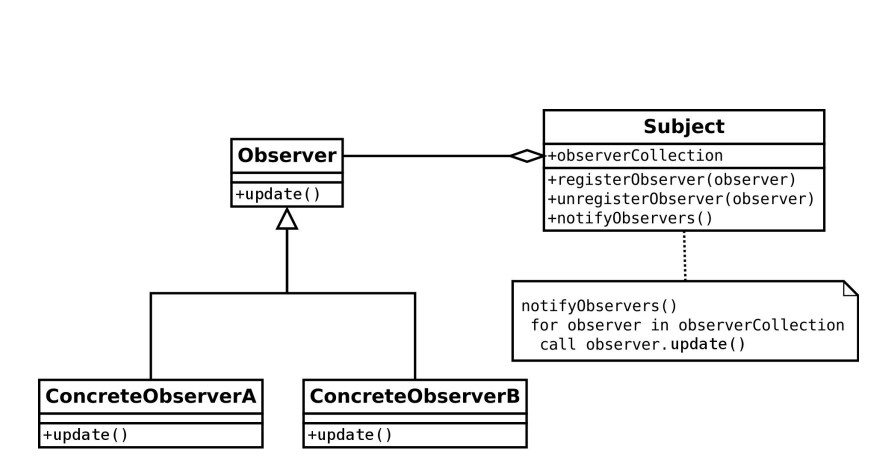
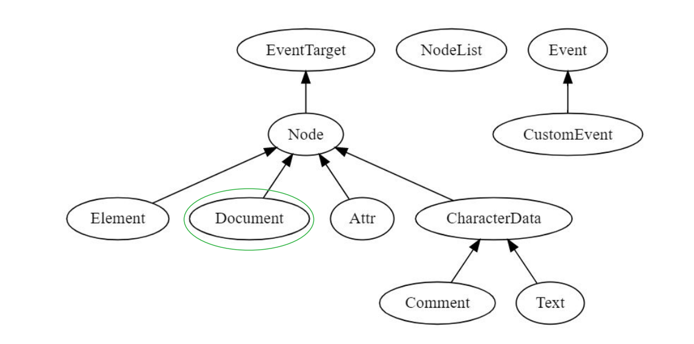
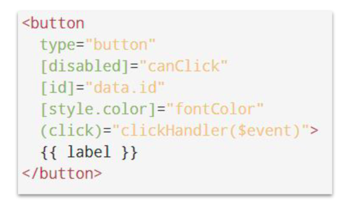
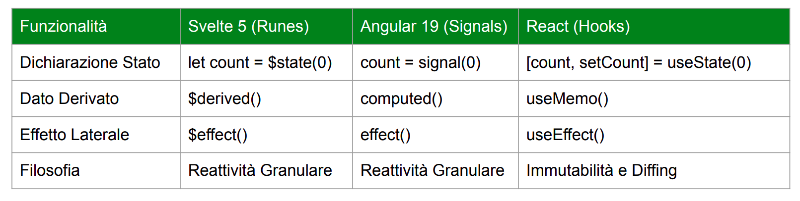
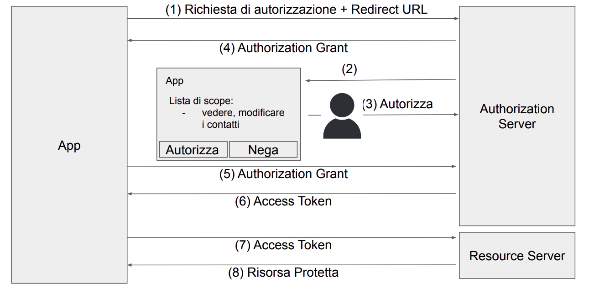

# Lezione 1 - Introduzione al Corso - 02/02/2026

Cenni storici allo sviluppo web, eventualmente vedi `PDF 01` del corso.

# Lezione 2 e 3a - HTML e CSS - 04/02/2026

`Basato sul PDF 03`

## HTML come Linguaggio di Markup

Descrizione di una **pagina web** tramite un **albero di Elements**. 

Un oggetto **Document** rappresenta un **documento HTML**.

La descrizione è semantica perchè un titolo, con token title indica sia come token che come significato che è un titolo.

### Struttura base Head e Body

Definito da `head` e `body`

### Elementi ed Attributi

- **Elementi**:

    Si basano sull'utilizzo dei tag di apertura/chiusura, non tutti hanno bisogno di essere chiusi.

    ```HTML
    <tag attr1 attr2 … attrn>content</tag>
    <tag attr1 attr2 … attrn>
    ```

- **Attributi**:

    Una particolarità è che possiamo utilizzare un prefisso come `&` oppure `#` per riferire al simbolo relativo nella unicode, questo procedimento è detto **character reference**.

## Content e Tipologie

Esistono vari tipi di contenuto, ad esempio:
- **Metadata Content**: No rendering, informazioni meta non renderizzate.
- **Flow Content**: Contenuto effettivo renderizzato.
- **Sectioning Content**: Definiscono gli elementi di header e footer.
- **Embedded Content**: Contenuto multimediale della pagina.
- **Interactive Content**: Definito per l'interazione dell'utente (audio, buttons...)

**Dialog vs Modale**: Rispettivamente il primo non blocca l'interazione con il resto della pagina mentre il secondo si, sono entrambe finestre che appaiono nella pagina.

**img vs svg**: Il primo è un immagine definita come "matrice di pixel", la seconda è vettoriale, quindi il tutto è definito da funzioni matematiche, quindi allo zoom non si perde risoluzione.

**Forms**: Permette l'interazione con un server tramite anche attributo `action` e `method`, in questo modo si possono passare informazioni.

**Gestione Input**: Options, Radio/Checkbox, File, Range ...

**Tag Script**: Permette l'inserimento di JS.

## CSS - Cascade Style Sheets

Permette la definizione di stile in base al tipo di media, grazie ad esso si può ruotare ad esempio un elemento HTML.

- **Selettori/Dichiarazioni**: Insieme di regole ciascuna definita come lista di **selettori** e da un insieme di **dichiarazioni**:

    ```CSS
    h1 { /* Selettore */
        color: blue; /* Dichiarazione */
    }
    ```

- **Cascading**:

    Definite come regole cascading perchè segue a cascata l'ordine in cui vengono definite, quindi l'ultima definita sarà quella utilizzata.

    Esiste un costrutto `!important` che si svincola da questo ordine predefinito.

    ```CSS
    p {
        color: blue;
    }

    p {
        color: red; /* quella che ha importanza di default */
    }
    ```

- **Gerarchie e Classi di Selettori**: Possiamo definire gerarchie tra selettori di regole, e questi possono essere identificati in maniera univoca tramite `id` oppure tramite `pseudoclassi`. Queste possono essere utilizzate tramite operatore `:`, quindi `selettore:pseudoclasse` istanziando potrebbe essere `selettore:first-child`

- Il **CSS** può essere utilizzato **inline**, **internamente** al file tramite tag `<style>` oppure **esternamente** linkandolo.

- **CSS**: unità di misura, può essere assoluta
    - **Assoluta**: cm, inch, mm
    - **Relativa**: em (in base al font), rem (relativo alla dimensione del font), vw, wh (relativo alla dimensione whidth ed height) della viewport.

- **Box Model**: Ogni elemento HTML è avvolto in un box di layer:
    - **Content**: Contenuto del box.
    - **Padding**: Spazio attorno al contenuto, tra content e border.
    - **Border**: Bordo attorno a padding e contenuto.
    - **Margin**: Lo spazio all'esterno del bordo.

- **Box Model Positioning**: Specifica il posizionamento da usare per un elemento, ne esistono di 5 tipi:
    - `static`: Posizionamento statico di default
    - `relative`: Grazie a top, botto, left, right possiamo spostare l'elemento rispetto al suo posizionameto originale.
    - `absolute`: Posiziona l'elemento in base al più vicino antenato.

- **Flex Layout**: Dopo le prime versioni di CSS, viene portato il layout flex che permette di distribuire elementi a colonne, oppure righe. Si definisce quindi tutto in relazione ad un asse principale, che può essere x oppure y.

- **Grid Layout**: Permette la definizione bidimensionale di layout di elementi, definita da questi elementi principali:
    - **Line**: Linee orizzontali e verticali che dividono la griglia.
    - **Cell**: Unità più piccola della rappresentazione a griglia.
    - **Area**: Area rettangolare composta da una o più grid cell.
    - **Track**: Spazio tra due griglie adiacenti.
    - **Gutter**: Spazio tra le cell.

### Frameworks CSS

- **Bootstrap**: Classico framework che fornisce classi predefinite e forniva supporto al responsive design.
- **TailwindCSS**: Framework basato su mattoncini atomici, basato quindi sulla costruzione di componenti un po' più complessi, quindi più modulare e moderno.
- **SASS**: Linguaggio compilabile in CSS, che permette la definizione di annidamento o utilizzo di variabili, che nativamente non era supportato dal CSS.

# Lezione 3b - JavaScript - 09/02/2026

`Basato sul PDF 04`

- **nodejs**: Ha portato lato server l'interprete javascript ed oltre a questo ha permesso cose che prima non erano permesse per questioni di sicurezza, come l'accesso ai file.

- Come tutti i **global object** che abbiamo già visto, come **Math e JSON**, esiste anche la **window** in **contesto web**.

- **Chiusura di tipo statico**, quindi variabili libere vengono risolte a tempo di dichiarazione e non a tempo di chiamata di funzione, portandosi dietro la dichiarazione delle variabili a tempo di dichiarazione delle funzioni.

# Lezione 4 - JavaScript - 16/02/2026

## JSON

Formato standard per interscambio di dati, prima di `JSON` si utilizzava `XML`, ma è stato quasi del tutto sostituito.

### Differenze tra Object JS e JSON

- **Object Literal**: 
    - È un oggetto
    - Il nome delle proprietà può essere un numero o una sequenza di caratteri
    - Il nome delle proprietà può essere una regexp
    - Il nome delle proprietà può essere undefined
    - Il nome delle proprietà può essere una funzione
- **JSON**:
    - Statico, quindi può essere un numero o una sequenza di caratteri ma non tutti gli altri.

### Classi e Prototipi

L'ereditarietà si basa sulla catena dei prototipi, l'utilizzo dei costrutti come `Class` è zucchero sintattico per effettuare lo stesso tipo di operazione.

### Higher Order Functions

In JS sono presenti `map`, `forEach`, `reduce`...

## Promises

Permette la gestione di computazioni asincrone, ha **tre stati**:
- **pending**: stato iniziale
- **fulfilled**: successo
- **rejected**: fallimento

Le promises hanno hanno dei **fate**, ossia `resolved` oppure `unresolved`.

Utilizzeremo in serie `.catch()`, `.then()`, ma se vogliamo farlo sia in caso di fallimento che di successo allora utilizziamo `.finally()`, che viene eseguita in caso di `settled`.

### Async/Await

Sintassi alternativa per la computazione asincrona.

- `async function`: Dichiarazione di una funzione che restituisce una `Promise`. Oltre a questo ci permette di utilizzare await all'interno della funzione.
- `await`: attende che la promise sia risolta prima di continuare. Perdiamo quindi la possibilità formalmente di gestire in parallelo più promises, in realtà no però perchè potrei far seguire ad un await una `.all()`, ad esempio.

## Event Loop

Tutto il runtime di JS si basa su quattro oggetti principali:
- **Stack**: Implementa la pila dei frame d'attivazione delle funzioni. A tempo di `return` tutte le variabili locali ad una funzione vengono rimosse, a meno di chiusure.
- **Heap**: Zona di memoria di allocazione della memoria, allocata e deallocata automaticamente dal garbage collector.
- **Queue**: Lista messaggi da processare, modo in cui quindi vengono gestite le `setTimeout()` o altri eventi. Quando viene selezionato quel messaggio nella coda viene handlato dalla funzione passata.
- **Event Loop**: L'event loop non è nient'altro che un while che si occupa di effettuare delle pop dalla queue.
    - Tutti gli eventi standard, come l'utilizzo del click del mouse hanno degli handler associati.
    - Gli eventi senza handler associati vengono ignorati.
    - Gli iframe e di web worker sono delle eccezioni, perchè hanno i loro stack, heap e queue.

### Gestione con Observer Pattern

Sistema ad eventi si basa su due attori principali, `Observer` e `Subject`, dove il `Subject` quando varia il proprio stato deve notificare gli `Observer`.

<div style="text-align: center;">
    
</div>

## Gestione a Moduli di JS

In origine non esisteva alcuna gestione a moduli, ma permette più riusabilità la gestione a moduli.

Esistono vari approcci a pattern:

- **Module Pattern**: Esponiamo le funzionalità attribuendole ad un oggetto globale tramite dichiarazione come primo comando eseguito.
- **CommonJS**: Primo approccio a moduli effettivi, ma sincrono.
- **AMD**: Asynchronous Module Definition, che si basa sull'utilizzo della `define()`, che ha bisogno di specifici argomenti per definire un modulo. Oltre a questo si basa RequireJS, come file che si occupa di questa operazione.

In sintesi dei pro di ciascuno di questi pattern è nato **Browserify**, che permette di gestire tutto l'albero delle dipendenze in un `bundle.js` a cui riferità la pagina web.

- **UMD - Universal Module Definition**: Si occupa della gestione della coesistenza di gestione moduli, che a runtime si occupa di capire come sia stato importato un modulo, da utilizzare nel caso in cui si usassero più metodologie di import.

# Lezione 5 - Esercitazione HTML e CSS - 18/02/2026

Esercitazione in aula.

# Lezione 6 - DOM (Document Object Model) - 23/02/2026

`Riferisce al pdf delle slide Lezione 05 - DOM`

Il **DOM** è una **rappresentazione gerarchica** della **struttura del contenuto** di un **documento HTML**.

Quindi anche la **rappresentazione in memoria** di un **documento HTML**, e una **API** per la **manipolazione** di **documenti Web**.

La **gerarchia** segue uno **schema ad albero**, mantenendo tra le **risorse delle relazioni**.

Ogni DOM ha un nodo radice, esiste un rapporto tra DOM e JS, perchè è un astrazione (**global object window**) tramite la quale possiamo accedere agli elementi.

## Eventi

La programmazione web si basa sugli eventi (click, tastiera...), questi quindi possono essere emessi (**fire**) e successivamente handlati tramite una funzione handler specifica.

<div style="text-align: center;">
    
</div>

### Prevent Default

Esistono degli handler di default, se fossimo interessati a non eseguire questo comportamento allora possiamo utilizzare `event.preventDefault()`

### Event Bubbling

Gli eventi, se intercettano più di un elemento HTML, si segue un ordine dal più interno al più esterno, detto **event bubbling**.

Di default si segue una propagazione dall'interno verso l'esterno, bisogna definire una `stopPropagation()` se si vuole esplicitamente spezzare la catena di listening.

Possiamo anche invertire l'ordine, metodologia detta **capturing**, partendo dall'elemento più esterno a quello più interno, ma solitamente si segue l'event bubbling definito prima.

Il target quindi è l'elemento che si occupa del dispatch dell'evento.

### Classe EventTarget

Fornisce metodi che permettono la modellazione della gestione di eventi, tramite ricezione e gestione:

- `addEventListener`: Fornisce un handler ad un evento, secondo la forma

    ```javascript
    addEventListener(type, listener, options)
    //oppure
    addEventListener(type, listener, useCapture)
    ```
    - `type`: Rappresenta la stringa del tipo di evento
    - `listener`: un oggetto che ha il metodo handleEvent oppure una funzione JS per la gestione dell'evento, che abbia come parametro l'evento stesso
    - `options`: oggetto per passare opzioni
    - `useCapture`: definisce l'ordine.

- `removeEventListener`: Rimuove l'handler
    ```javascript
    removeEventListener(type, listener, options)
    //oppure
    removeEventListener(type, listener, useCapture)
    ```
    Solitamente utilizzato quando si rimuove un elemento dal DOM.

    Nel caso in cui si volessero rimuovere tutti i listener invece che uno solo dall'elemento specificato nel `listener` possiamo utilizzare un `abort` a cui passiamo un signal registrato nelle option a tempo di registrazione dell'evento.

- `dispatchEvent`: Trasmette un oggetto evento al target in maniera sincrona, invocandone l'handler associato.
    ```javascript
    elem.dispatchEvent(evt)
    ```
    Dove `evt` è l'evento da trasmettere ed `elem` è l'elemento HTML a cui trasmettere l'evento.

### Custom Event

Non per forza bisogna utilizzare Eventi appartenenti all'API del DOM ma possiamo anche definirne di nuovi

```javascript
const e = new Event("build")
elem.addEventListener(
    "build",
    (e) => {
        //...
    }
)

elem.dispatchEvent(e);
const e = new CustomEvent("build", { detail: 42 });
```

## Oggetto Node nel DOM

Tutti gli oggetti nel DOM sono `Node`, quindi `Node` è la classe astratta che viene implementata ad esempio da `Document` o `Element`.

Alla base della manipolazione degli elementi del DOM, quindi un interfaccia comune per ogni elemento.

Espone una serie di proprietà che ci permettono di navigare tra i nodi con ad esempio `firstChild`, `lastChild`, `parentElement`...

### Metodi dell'Oggetto Node

- `node.appendChild(newNode)`: aggiunge un nodo alla lista dei figli del nodo `node`.
- `parent.insertBefore(newNode, node)`: inserisce `newNode` come figlio di `parent` prima di `node`.

Esistono anche `removeChild` e `replaceChild` ed ulteriori metodi che permettono la manipolazione del DOM in maniera dinamica.

## Oggetto NodeList nel DOM

Rappresenta una lista di nodi del DOM, e ha metodi molto simili ad una mappa per permetterne la manipolazione:

- `nodeList.forEach()`: applica una funzione a ciascun elemento.
- `nodeList.keys()`: restituisce un iteratore sulle chiavi dei nodi della lista.
- `nodeList.values()`: restituisce un iteratore sulla lista.
- `nodeList.entries()`: restituisce un iteratore sulle coppie $(indice, valore)$ della lista.


## Oggetto Document nel DOM

Tramite le proprietà di questo oggetto possiamo accedere ad informazioni sull'intera pagina Web.

Rappresenta la root del documento HTML e serve da entry point a tutto il suo contenuto, tramite attributi come:

- `body`: riferimento al body.
- `head`: riferimento alla head.
- `cookie`: stringa di tutti i cookie separati da un `;`
- `URL`: location del documento sottoforma di stringa.
- `links`: lista dei link della pagina
- `images`: la lista di immagini della pagina

## Selezione Elementi tramite querySelector ed elementById

Selezionare elementi della pagina tramite selettori CSS

- `querySelector(selector)`: restituisce il primo elemento secondo il selettore passato.
- `querySelectorAll(selector)`: restituisce una NodeList (statica).
- `selectElementById(id)`: restituisce una HTMLElement (dinamica).

## Creazione dinamica di Nodi

Possiamo dinamicamente creare nodi tramite metodi di `Document`:

- `document.createElement(tagName)`: Definisce un elemento, distinguendolo con la stringa passata in `tagName`.
- `document.createTextNode(text)`: text è il contenuto del nodo testo.
- `document.createAttribute(name)`: viene assegnato un attributo `name`.

## Oggetto Element del DOM

Rappresenta la classe base per tutti gli elementi, deriva da `Node`, queste possono ad esempio essere `SVGElement` ed `HTMLElement`.

- `element.children`: lista di elementi figli di e.
- `element.attributes`: lista di attributi di e.
- `element.id`: identificatore unico dell'elemento.
- `element.innerHTML`: stringa che rappresenta l'intero sottoalbero dell'elemento, cambiarne il valore modificherebbe appunto tutto il sottoalbero.

### Manipolazione CSS tramite DOM

Ogni `HTMLElement` ha una proprietà style, rappresenta lo stile CSS per l'elemento.

Possiamo dinamicamente modellare lo stile di un elemento modificandone direttamente il valore, oppure accedendo alla proprietà read-only `classList`.

## Oggetto Attr e CharacterData del DOM

- **Attr**: Rappresenta un attributo di un elemento come oggetto e contiene l'associazione tra il nome dell'attributo ed il suo valore
- **CharacterData**: Interfaccia astratta che rappresenta un nodo che contiene caratteri

# Lezione 7 - NPM (Node Packet Manager) - 25/02/2026

## Definizione Package NPM

- Un package è una directory che contiene un file `package.json`
- Per NPM un modulo è un qualsiasi file o directory nella cartella `node_modules`
- Un modulo può non essere un package, per essere un package deve avere un `package.json`, ciascun modulo può essere ad esempio richiesto con require.
- Possono essere definite con **scoped** tramite l'utilizzo del `scope@package`

### Semantic Versioning

Si segue una sintassi del tipo `vMAJOR.MINOR.PATCH` dove:
- `MAJOR`: Cambiamenti breaking, non retrocompatibili.
- `MINOR`: Aggiunta di feature, nuove funzionalità ma retrocompatibile.
- `PATCH`: Fix, risoluzione di bug retrocompatibile.

### Anatomia di un package.json

```json
{
  "name": "test",
  "private": true,
  "version": "0.0.0",
  "main":"index.js",
  "type": "module",
  //possiamo eseguire questi comandi come npm run [script]
  "scripts": {
    "dev": "vite",
    "build": "tsc && vite build",
    "preview": "vite preview",
    "hello": "echo \"HelloWorld\" "
  },
  // coppie chiave valore (pacchetto, range versioni) di dipendenze
  // di cui ha bisogno il nostro pacchetto
  // nello specifico per dipendenze a runtime
  "dependencies": {
    "typescript": ">5.9.3", //tutte quelle maggiori a quelle
    "vite": "~7.3.1", //circa, accettiamo tutte quelle che variano
    //  in MINOR o PATCH DEL VERSIONING
    "vite1": "^7.3.1" //hat indica compatibili, quindi =x.y.z e <(x+1).y.z
  },
  // simile, ma non per runtime,
  // per dipendenze per sviluppo non necessario al runtime
  "devDependencies": {
    "typescript": "~5.9.3",
    "vite": "^7.3.1"
  }
}

```

### NPM package-lock.json

Il `package-lock.json` descrive in maniera univoca un albero delle dipendenze.

Se ne utilizza uno aggiuntivo `package.json` perchè il package dipende dal "quando", qualcosa può variare in base al tempo di installazione delle dipendenze. 
- Potrebbe essere cambiato il pacchetto ma non la sua versione

Quindi il `package.json` definisce le dipendenze del pacchetto, mentre il `package-lock.json` descrive univocamente tutte le sue dipendenze tramite un albero.

### Comando npx

Comando da CLI che esegue un comando locale o remoto, questi vengono cercati nel path `./node_modules/.bin`

### Bun e Deno

Alternative ad npm per gestione pacchetti:
- **Bun**: Scritto in Zig, pensato per le massime prestazioni in termini di velocità.
- **Deno**: Scritto dagli stessi autori di Node, pensato per la solidità basandosi sull'esperienza con Node.
    - Supporto nativo con typescript
    - Rispetta nativamente le API del browser
    - Elimina le necessità delle node_modules tramite le registry

# Lezione 8 - Frameworks e Introduzione React - 02/03/2026

- **Framework**: Piattaforma per lo sviluppo di applicazioni software, che fornisce una base su cui gli svilupatori possono costruire programmi per una piattaforma specifica.
    - Permette la gestione strutturata invece che codice ripetuto in JS, detto boilerplate.
    - Si seguono principi di design che semplificano lo sviluppo.

- **Frontend**: Tutta la logica con cui interagisce l'utente.
- **Metaframework**: Framework di framework, permettono l'utilizzo di più framework contemporaneamente, ad esempio con NextJS.

## Concetti Ricorrenti nei Framework

- **Componente**:
    - Parte della UI che contiene la logica di rendering e la gestione delle informazioni ad essa associata.
    - Hanno un ciclo di vita e sono riutilizzabili.
        - Suddiviso quindi in fasi da quando viene aggiunto al DOM fino a quando viene rimosso da esso.
- **Reattività**:
    - Gestione della propagazione dei cambiamenti di stato
    - Capacità per ciascun componente può cambiare, ad esempio a causa dell'esecuzione di un azione da parte dell'utente oppure per informazioni ottenute dal server.
- **Template**:
    - Estensione della sintassi HTML per agganciare HTML logica di presentazione con logica di business.
- **Data Flow**:
    - Meccanismi di comunicazione inter-componente.

## Strategie di Rendering

- **Client Side Rendering - CSR**:
    - Il server invia un file **HTML minimale**.
        - Nel HTML viene riferito anche il JS, che viene fornito in bundle dal server.
        - Il `div` vuoto riempie la pagina, seguendo la logica fornita nel bundle JS.
    - **Vantaggi**:
        - Post rendering la pagina è molto fluida, in Single Page Application
    - **Svantaggi**:
        - First Contentful Paint (FCP) lento, impatto negativo dato dal primo caricamento che può risultare lento.
        - A carico del client, quindi dipendente dal dispositivo da cui stiamo eseguendo.

- **Server Side Rendering - SSR**:
    - Il server riceve la richiesta, recuperai dati, genera l'intero HTML completo per quella pagina e la invia al browser.
    - **Vantaggi**:
        - Caricamento iniziale quasi istantaneo, ideale per dispositivi poco performanti.
    - **Svantaggi**:
        - Perdita di interattività immediata, tramite **Hydration**, in cui il framework a tempo d'interazione deve occuparsi di aggiornare la pagina acquisendo le informazioni dal server.

## Introduzione a React

- Libreria **dichiarativa** (si descrive cosa deve essere fatto ma non come deve essere fatto, per ripassare cosa si intenda con dichiarativo) sviluppata da Meta per creare interfacce utente.
- Nasce per questione di manutenibilità di Facebook, poi disaccoppiato all'acquisizione di Instagram e ancora dopo reso open source.
- Nasceva come libreria, successivamente diventata un framework.

### Componenti React

Ogni componente è una funzione JS, accetta input tramite `Props` e restituisce un `ReactElement`, utilizzando nel suo corpo la sintassi **JSX**, mescolando **HTML** e **JS**.

```JSX
function SAW() {
    return <div>
        <h1> SAW TODO </h1>
        <p> Welcome to SAW React </p>
    </div>
}
```

- **Sintassi e Regole JSX**: 
    - Un espressione JSX deve restituire un singolo elemento radice, racchiudendo ad esempio tutto in un `<div>`.
    - Tutti i div devono essere chiusi a differenza di **HTML5**.

- **Relazione tra Componenti**: Possiamo chiamare in una funzione che ritorna Componenti delle funzioni che ritornano altri componenti.

    ```JSX
    function UserInfo() {
        return (
            <div>
                <Avatar />
                <Age />
                <Name />
            </div>
        )
    }
    ```

### Props React

I componenti dovrebbero essere funzioni pure rispetto alle Props passate, non modificandole ma andando solo in readonly.

```JSX
function Avatar(props) {
    return 
}
```

### Hooks React

Gli Hook in Reacto sono funzioni JavaScript che possono essere usati nei componenti, ora i componenti si definiscono solo secondo il paradigma funzionale.

Evitano scrittura di classi per definire Componenti, permettono la gestione di stato e dei side effects.

Bisogna seguire due regole:
- Bisogna utilizzare gli hook a top level del componente.
- Gli hook possono essere chiamati solo dentro altre funzioni chiamate.

#### Hook useState

Hook che permette di gestire una variabile di stato per componente. Lo stato è privato al componente.

Si basa sulla restituzione di un getter ed un setter come primi due valori di un array.

```JSX
function ClickCounter() {
    const [n, setN] = useState(0);

    function handleClick() {
        setN((v) => v + 1)
        setN((v) => v + 1)
    }

    return (
        <button onClick={handleClick}>
            Add 2 to count: {n}
        </button>
    )
}
```

Viene utilizzata al **referential equality**, quindi se passiamo un oggetto ad una useState, questi verranno confrontati per riferimento, se vengono modificati questi l'oggetto sarà ancora lo stesso. Quindi va eventualmente copiato e modificata la copia dell'oggetto.

```JSX
//esempio di deep copy per gestione della referential equality
function Exam() {
    const [exam, setExam] = useState({ name: "SAW", grade: 17})

    function incrementGrade() {
        setExam((e) => ({...exam, grade: e.grade + 1}))
    }

    return (
        <div>
            <p> All'esame di {exam.name} hai preso {exam.grade} </p>
            <button onClick = {incrementGrade}> Alza il voto </button>
        </div>
    )
}
```

#### Hook useRef

Restituisce un oggetto con la proprietà `current`, ossia riferimento al valore attuale. È possibile modifcare il valore riferito, utile per ottenere un riferimento ad un elemento HTML.

#### Hook useEffect

Serve a sincronizza re un componente con un sistema esterno, ad esempio per chiamare una API per aggiungere o rimuovere event handler.

# Lezione 9 - React - 04/03/2026

## Custom Hooks

Si possono definire hooks personalizzati per condividere logica tra componenti.

Tutti gli hooks iniziano per `use` per convenzione, e vengono chiamati tutte le volte che il componente viene nuovamente renderizzato.

Si utilizza anche la convenzione per cui gli hook vengono scritti in testa ai componenti per fare in modo che
questi non vengano definiti in `for` o `if`, e non dipendano quindi dalla logica del programma ma si può definire
staticamente quali hooks verranno chiamati da un componente.

## Error Boundary

Permette la reazione ad errori, tramite la renderizzazione del componente definito nel fallback.

```JSX
<ErrorBoundary fallback={<p> Errore </p>}>
    <Children/>
</ErrorBoundary>
```

## Suspense

Utilizzato per gestione di eventi asincroni:

```JSX
<Suspense fallback={<h1> Loading </h1>}>
    <InnerComponent p = {loadData()} />
</Suspense>
```

In questo caso la funzione passata al `InnerComponent` è asincrona e ritorna una `Promise`, di conseguenza viene gestita wrappandola con il componente `Suspense`.

## Costrutto use

Permette la gestione delle `Promise`, come in std `async` avremmo fatto con await, permette quindi la valutazione di `Promises`.

Questo può tornare utile per gestire `Promises` all'interno di if o for, quindi non utilizzando un hook ma direttamente all'interno della logica del componente.

```JSX
function Message({ messagePromise }) {
    const content = use(messagePromise)
    return <p> Message: {content} </p>
}
```

## Condivisione Stato tramite Prop/Context

- **Tramite Props**: Un modo che potremmo immaginare per condividere lo stato tra `Components` tramite le Prop passando per la gerarchia di componenti. Questo può portare alla Prop Drilling, magari condividendo stato tra componenti che non necessitano di quello stato.
- **Tramite Context**: Si proietta l'informazione tramite un `Context`.
    - Si basa sulla creazioni di contesto nel Componente più alto nella gerarchia e tutti quelli sotto avranno visibilità su quelle informazioni di `Context`.
    - Utili quindi quando bisogna passare informazioni ad un grande sottoalbero di componenti di un componente radice, come ad esempio il tema, l'informazione del corrente utente connesso...

## useReducer

Maniera alternativa per gestire lo stato rispetto a `useState()`:
- Si definiscono delle funzioni pure `reducer()` fuori dal componente.
- Non si invoca quindi `setState()` ma si effettua un **dispatch di action**.
- In questo modo si sposta la logica del funzionamento fuori dal componente, utile se aumenta la complessità per disaccoppiare le due cose.

```JSX
// ESEMPIO DALLA DOCUMENTAZIONE DI REACT
import { useReducer } from 'react';
import AddTask from './AddTask.js';
import TaskList from './TaskList.js';

// FUNZIONE REDUCER: Per convenzione ha tasks ed action, dove un action
// ha un campo .type che permette di differenziare le operazioni da eseguire
function tasksReducer(tasks, action) {
  switch (action.type) {
    case 'added': {
      return [...tasks, {
        id: action.id,
        text: action.text,
        done: false
      }];
    }
    case 'changed': {
      return tasks.map(t => {
        if (t.id === action.task.id) {
          return action.task;
        } else {
          return t;
        }
      });
    }
    case 'deleted': {
      return tasks.filter(t => t.id !== action.id);
    }
    default: {
      throw Error('Unknown action: ' + action.type);
    }
  }
}

export default function TaskApp() {
// Come per l'useState, la useReducer restituisce:
// 1. Lo stato corrente della collezione/variabile che stiamo modellando
// 2. Non un getter diretto ma una funzione di dispatch, che ci permette 
    // di fare di più rispetto ad un semplice setter, in questo caso infatti 
    // ci permette di differenziare il tipo di azioni in base, in questo caso,
    // al type passato
// 3. Il dispatch, come il setter, va invocato all'interno 
    // di una funzione di Handle, che verra registata sull'evento nel div

  const [tasks, dispatch] = useReducer(
    tasksReducer,
    initialTasks
  );

  function handleAddTask(text) {
    dispatch({
      type: 'added',
      id: nextId++,
      text: text,
    });
  }

  function handleChangeTask(task) {
    dispatch({
      type: 'changed',
      task: task
    });
  }

  function handleDeleteTask(taskId) {
    dispatch({
      type: 'deleted',
      id: taskId
    });
  }

  return (
    <>
      <h1>Prague itinerary</h1>
      <AddTask
        onAddTask={handleAddTask}
      />
      <TaskList
        tasks={tasks}
        onChangeTask={handleChangeTask}
        onDeleteTask={handleDeleteTask}
      />
    </>
  );
}

let nextId = 3;
const initialTasks = [
  { id: 0, text: 'Visit Kafka Museum', done: true },
  { id: 1, text: 'Watch a puppet show', done: false },
  { id: 2, text: 'Lennon Wall pic', done: false }
];

```

### useState vs useReducer

- Dimensione del codice minore con `useState()`, ma `useReducer()` permette di fattorizzare la logica del componente per riutilizzarla, quindi potrebbe risultare anche più leggibile.
- Anche da un punto di vista del testing risulta meglio `useReducer()`, potendo riferire a delle funzioni pure.

## Actions

Supporto nativo per gestione dei tag form e l'utilizzo in essi di prop action.

```JSX
<form action = {async (formData) => {
    await updateName(formData.get("name"));
}}>
```

- La gestione dello stato delle Action avviene tramite l'utilizzo di un hook `useActionState`, restituisce infatti lo stato corrente, la funzione da collegare ai form.

### UseActionState per gestione stato Actions

Hook per gestire risultato di una `Action`, sostituisce `useFormState`.

```JSX
const [state, formAction, isPending] = useActionState(fn, initialState)
```

Si definisce quindi in `fn` la funzione da eseguire e in `initialState` lo stato iniziale, qualora si volesse partire ad esempio disattivando pulsanti.

```JSX
// ESEMPIO DALLA DOCUMENTAZIONE DI REACT
import { useActionState, startTransition } from 'react';
import { addToCart, removeFromCart } from './api';
import Total from './Total';

async function updateCartAction(prevCount, actionPayload) {
    switch (actionPayload.type) {
    case 'ADD': {
        return await addToCart(prevCount);
    }
    case 'REMOVE': {
        return await removeFromCart(prevCount);
    }
    }
    return prevCount;
}

// La useActionState, dopo aver visto la useReducer, è abbastanza lineare:
// 1. Il getter count permette l'accesso al corrente stato della variabile
// 2. La dispatchAction è l'operazione identica di dispatch vista prima, 
    // solo che questa volta viene utilizzata in un contesto di azione async,
    // quindi si invoca all'interno di una startTransaction
// 3. isPending viene utilizzato nel rendering condizionale del componente, per
    // avere la possibilità di gestire dei caricamenti ed 
    // eventuali cambi di stato

export default function Checkout() {
  const [count, dispatchAction, isPending] = useActionState(updateCartAction, 0);

  function handleAdd() {
    startTransition(() => {
      dispatchAction({ type: 'ADD' });
    });
  }

  function handleRemove() {
    startTransition(() => {
      dispatchAction({ type: 'REMOVE' });
    });
  }

  return (
    <div className="checkout">
      <h2>Checkout</h2>
      <div className="row">
        <span>Eras Tour Tickets</span>
        <span className="stepper">
          <span className="qty">{isPending ? '🌀' : count}</span>
          <span className="buttons">
            <button onClick={handleAdd}>▲</button>
            <button onClick={handleRemove}>▼</button>
          </span>
        </span>
      </div>
      <hr />
      <Total quantity={count} isPending={isPending}/>
    </div>
  );
}

```

## useFormStatus

Hook che permette l'acquisizione di informazioni sull'ultimo form compilato.

```JSX
const { pending, data, method, action } = useFormStatus();
```

Mostriamo e commentiamo un esempio completo:

```JSX
// ESEMPIO DALLA DOCUMENTAZIONE DI REACT
import {useState, useMemo, useRef} from 'react';
import {useFormStatus} from 'react-dom';

export default function UsernameForm() {
  const {pending, data} = useFormStatus();

  return (
    <div>
      <h3>Request a Username: </h3>
      <input type="text" name="username" disabled={pending}/>
      <button type="submit" disabled={pending}>
        Submit
      </button>
      <br />
      <p>{data ? `Requesting ${data?.get("username")}...`: ''}</p>
    </div>
  );
}
```

## Optimistic Update tramite useOptimistic

Si mostra all'utente uno stato diverso mentre l'operazione è in esecuzione:
- Se l'esecuzione ha avuto successo il valore viene confermato
- Se l'esecuzione fallisce allora si fornisce un fallback da eseguire.

Quindi si basa sull'utilizzo di due stati, uno **reale** ed uno **ottimistico**, chiamando la funzione di aggiornamento subito prima di far partire l'operazione verso il server.

## React Server Components

React offre un servizio di rendering lato server, di default con il settato con Vite della lezione è client side.

Porta vari vantaggi, è il default da React 19, vantaggi come:
- **Bundle Size ridotto**: Il componente si trova sul server e non sul client.
- **Accesso Diretto al Backend**: Possibile interrogare databases direttamente dal backend senza utilizzo di token per API.
- Segue un "paradigma" differente rispetto al client side.

## Passi per Costruzione Web App in React

- Divisione della UI in una gerarchia di componenti.
- Costruire una versione statica in React.
- Identificare lo stato dell'Applicazione.
- Identificare dove dovrebbe stare lo stato.
- Gestire il flusso inverso dei dati per la gestione del cambiamento di stato.

# Lezione 10 e 11 - React II (Esercitazione To Do) - 11/03/2026

Tutta la lezione è basata su esercitazione React, si riportano solo alcune note.

## Note

### Single Page Application Routing

In single page application più pagine vanno gestite in routing.

Il routing non è gestito nativamente, nella lezione si cita quindi la libreria `React Routing`, wrappando tutta l'App annidando in `Route` i componenti da renderizzare:

```JSX
<BrowserRouter>
  <Routes>
    <Route ... />
    <Route ... />
  </Routes>
</BrowserRouter>

```

### Context

Il contesto lo si crea a partire dalla funzione `createContext()` che prende come argomento lo stato iniziale del dato che stiamo monitorando.

Si preferisce effettuare accesso al Context in Custom Hooks, per fare in modo che se dovessimo rimodellare il suo utilizzo allora non dovremmo farlo per tutti i componenti ma solo fixando gli eventuali Custom Hooks.

# Lezione 12 - Angular I - 18/03/2026

Framework completamente basato su Typescript:
- Framework e insieme di librerie per sviluppo, testing e build in ambito web.

**Inclusi in Angular**:
- Routing per navigazione client side
- Forms, due modelli per gestione delle form
- HttpClient per la comunicazione client-server
- Sistema di Animazioni di default
- Tool per PWA di default
- Scaffolding per gestione boilerplate

**AngularCLI**: Permette da terminale la generazione di template di stubs, pipes, componenti...

## Decorator Pattern

Utilizzato ampiamente in Angular, citiamo la loro definizione

```typescript
function color(value: string) {
  return function(target) {
    // ... usa il valore passato come parametro
  }
}
```
Possono essere quindi espresse in annotazioni `@Decoratore` come zucchero sintattico.

## Componenti in Angular

Sono classi Typescript decorate con `@Component()` che specifica:
- **Selettore CSS**, come per React c'era nome del Componente.
- **Template HTML**, qualcosa di simile al JSX.
- **Insieme** di **stili CSS**.

Possiamo partire da 0 oppure usare uno stub per creare un componente.

### Templates in Angular

Estensione dell'HTML simil JSX ma meno permissivo da un punto di vista di utilizzo del JS.

<div style="text-align: center;">
    
</div>

Le **parentesi quadre** provocano l'**evalutazione dell'exp** sulla dx, mentre le **parentesi tonde** **registrano** a quell'**evento** l'**invocazione di una funzione**.

### Signals in Angular

Wrapper di valori, permettono di notificare quando questi cambiano.

Offrono getter e setter, per spacchettare il valore dal Signal.

- **Writable Signals**: Vengono creati tramite invocazione di 

  ```tsx
  const count = signal(0)
  count.set(3)
  count.update( value => {
    value + 1
  })
  ```
- **Computed Signals**: Sono segnali **read-only** che definiscono il proprio valore **in base ad altri segnali**.
  - Questi sono valutati in maniera **lazy e memoized**, quindi calcolati e memoized per gestione delle performance.
  - Questa modalità di calcolo dei **segnali lazy è gestita tramite un grafo delle dipendenze**, per capire o meno se bisogna invocare funzioni.

    ```tsx
    const count = signal(0)
    const doubleCount = computed(() => {
      count() * 2
    })
    ```

### Effect in Angular

Operazione che viene eseguita quando uno o più segnali cambiano valore e viene eseguito almeno una volta.
- I valori che vengono osservati sono inferiti, non dichiarati esplicitamente come tali.
- Spesso sconsigliato il suo utilizzo dato che si può ottenere uno stesso risultato con un *Computed Signal*.

## Gestione Dati tra Componenti

### Input Signals - Passare dati ai Componenti Figli 

Il **signal input** rende visibile la proprietà al componente padre.
Si indicano input obbligatori tramite `input.required`.

```typescript
import { Component, input } from '@angular/core';

@Component({
  selector: 'app-greeter',
  // Nel template del figlio, 'name' è un signal e viene richiamato come funzione
  template: `<p>Hello {{ name() }} </p>`,
})
export class GreeterComponent {
  // Dichiarazione di un input obbligatorio tramite signal
  name = input.required<string>();
}

@Component({
  selector: 'my-app',
  // Il padre passa il valore usando la proprietà tra parentesi quadre [name]
  template: `<app-greeter [name]="name"></app-greeter>`,
})
export class AppComponent {
  name = "folks";
}
```

### Output Signals - Passare eventi al Componente Padre

Cosa non permessa in React, il padre di un componente può rispondere agli eventi del figlio
- Il figlio dichiara delle proprietà come event emitter attraverso **output signal**.
- Il componente padre ascolta quell'evento

```typescript
import { Component, input, output } from '@angular/core';

@Component({
  selector: 'app-btn',
  // Al click, viene chiamato il metodo .emit() dell'output signal
  template: `<button (click)="exploded.emit(true)">Explode!</button>`,
})
export class BtnComponent {
  // Il figlio dichiara un event emitter tramite la funzione output()
  exploded = output<boolean>();
}

@Component({
  selector: 'my-app',
  // Il padre ascolta l'evento tramite le parentesi tonde (exploded)
  // $event contiene il dato passato dal metodo emit()
  template: `<app-btn (exploded)="onExplode($event)"></app-btn>`,
})
export class AppComponent {
  onExplode(evt: boolean) {
    console.log("exploded!", evt);
  }
}
```

### Model Signals - Passaggio dati bidirezionale

Il Model Signal implementa il two way data binding, quindi combinazione tra input ed output.

```typescript
import { Component, model, signal } from '@angular/core';

@Component({
  selector: 'custom-checkbox',
  template: '<div (click)="toggle()"> ... </div>',
})
export class CustomCheckbox {
  // 'checked' è un model input: permette sia di ricevere dati che di emetterli
  checked = model(false);

  toggle() {
    // Aggiorna il valore del signal; il cambiamento verrà propagato al padre
    this.checked.set(!this.checked());
  }
}

@Component({
  selector: 'user-profile',
  // La sintassi "banana-in-a-box" [()] crea il two-way binding
  template: '<custom-checkbox [(checked)]="isAdmin" />',
})
export class UserProfile {
  protected isAdmin = signal(false);
}
```

### Linked Signal

Un segnale che dipende da un altro segnale, come il computed, ma vuole essere anche write, non solo read.

Il suo classico utilizzo è la gestione della stato di una lista interna che dipendente dalla gestione dello stato della lista esterna, quindi lo si utilizza per evitare scrittura di boilerplate.

## Resource

La reattività di tutti i segnali visti fino ad ora sono sincroni, se viene aggiornata una foglia dell'albero delle dipendenze viene aggiornato anche tutto il resto.

La resource permette quindi l'utilizzo di chiamate asincrone.

## Ciclo di Vita dei Componenti

- Creato a tempo di invocazione del costruttore.
- Notato Cambiamento tramite utilizzo di segnali.
- Rendering del componente.
- Distruzione del componente.

## Attribute Directive

Modo per aggiungere logica agli elementi HTML di base.
- L'elemento a cui si riferiscono viene passato nel costruttore.

## Control Flow in Angular

Corrispondono al *rendering condizionale* di React, nel corpo permettono la scrittura di templates.

- If: @if {then} @else
- Switch
- For
- `@defer` Permette lazy loading dei componenti eventualmente grandi.
- `@placeholder` Permette di piazzare qualcosa prima del rendering effettivo. Viene mostrato a prescindere.
- `@loading` Simile a placeholder, ma viene mostrato solo dopo che il caricamento di defer inizia.
- `@error` Come i precedenti ma esiste per la gestione degli errori.

## Dependency Injection

Angular permette nativamente di gestire la delega di operazioni, costruendo delle dipendenze tramite `@Injectable`.

Esistono quindi i **ruoli** di **dipendenza (consumer)** e di **utilizzatore (provider)**.

Si definisce quindi una dipendenza per una classe Typescript senza preoccuparsi di istanziarla.

Permette la scrittura di codice e test più semplice.

La comunicazione tra **Consumer** e **Provider** avviene tramite l'**Injecton**:
- L'**Injector** è un **oggetto** che trova una dipendenza come **Singleton in cache** **oppure** la **fornisce** tramite un **Provider**.
- Viene costruito automaticamente per i moduli ed è disponibile per tutta l'applicazione.

L'`@Injectable` segue il pattern `@Singleton` per cui tutti visualizzano queste dipendenze.

# Lezione 12 - Angular II e Svelte - 25/03/2026

## Forms

Due metodologie:
- **Reactive Form**
- **Template Driven Form**

### Reactive Form

- Forniscono accesso diretto ed esplicito al modello dei dati del form
- Modello di flusso sincrono
- Sono robuste e scalabili, utilizzate quando i form sono parte fondamentale dell'applicazione
- Il modello è definito con la classe `FormControl`

```typescript
import { Component } from '@angular/core';
import { FormControl } from '@angular/forms';

@Component({
  selector: 'app-reactive-form',
  template: `
    <input type="text" [formControl]="colorControl">
  `
})
export class FavoriteColorComponent {
  colorControl = new FormControl('');
}
```

### Template Driven Form

- Si poggiano su direttive nei template per manipolare le form
- Utili in caso di poca business logic
- Usano un modello di flusso di dati asincrono
- Utilizzano il two-way data binding per aggiornare il modello

```typescript
import { Component } from '@angular/core';

@Component({
  selector: 'app-template-form',
  template: `
    <input type="text" [(ngModel)]="color">
  `
})
export class FavoriteColorComponent {
  color = '';
}
```

## Pipes

Sono funzioni che possono essere aggiunte ad un Template
- Si usano per trasformare un valore in input in un altro
  - Ad esempio data una `str` passiamo a `Date` oppure dato un `Object` passiamo a `JSON`.
  - Si utilizza questo costrutto proprio perchè nel Template HTML di Angular abbiamo solo un sottoinsieme di JS meno espressivo ad esempio del JSX di React, quindi questo costrutto può tornarci utile.

## RxJS

Libreria esterna per la composizione di programmi basati su eventi.
- Si basa sul concetto di `Observable`.
  - Uno stream di valori che cambia nel tempo, verso cui ci possiamo iscrivere.
- Si può definire in maniera dichiarativa, e permette la gestione di iscrizioni si Observable che risulterebbe macchinoso o completamente impossibile da implementare solo tramite l'utilizzo dei Framework.

## Moduli di Angular

Non molto utilizzato attualmente, permette di definire moduli tramite costrutti di `import` ed `export` su classi.

## Gestione DOM - Angular vs React

Si mettono **a confronto gli approcci** di **gestione del DOM** dei **due framework**:

## Zone.js - Angular

Libreria che implementa il concetto di `Zone`, ossia un contesto di esecuzione che persiste attraverso le operazioni asincrone.
- Crea una bolla attorno all'applicazione per uniformare le API che utilizza Angular.
- Ogni volta che termina un operazione asincrona, Zone.Js si occupa di avvisare Angular che controlla se deve aggiornare l'HTML.
  - Questo deresponsabilizzava il programmatore per il controllo sui cambiamenti, ma allo stesso tempo aggiunge codice alle librerie che stiamo utilizzando.
- **Zoneless**: Con Angular 18/19 la gestione è affidata invece completamente al grafo dei `Signal`, quindi grazie alla visita di questo grafo è Angular ad aggiornare il renderizzato.

## Virtual DOM - React

Per evitare di manipolare direttamente il DOM, operazione costosa, React gestisce un oggetto JS che virtualizza il DOM. Questo approccio segue delle fasi specifiche:

- **Render**: Quando un componente cambia, React genera un nuovo albero VDOM.
- **Diffing**: Confronta il nuovo albero VDOM con quello precedente.
- **Calcolo delle Differenze**: Si seguono due regole
  - Se cambia il tipo, ad esempio da div a span, allora React distrugge l'intero vecchio ramo e lo ricostruisce.
  - Se non cambia il tipo, allora React aggiorna solo l'attributo specifico nel DOM reale.
- **Commit**: Solo le differenze riscontrate con **diff** vengono riportate al DOM reale.

### Sintesi Differenze

- **ZoneJS - Angular**:
  - Focalizzato sul quando, non sul dove.
  - Non sa cosa sia cambiato ma è consapevole dell'occorrenza di un evento asincrono.
  - Permette ri-rendering più granulare
  - Analizzandone pro e contro potremmo dire che permette uno sviluppo trasparente, automatizzando il ri-rendering dei componenti ma allo stesso tempo potrebbe risultare difficile ottimizzare una grande quantità di componenti.
- **Virtual DOM - React**:
  - Si focalizza sul [dove, e non sul quando](https://www.youtube.com/watch?v=4QhyYngmW0I), rieseguendo sempre la funzione del componente ogni volta che lo stato cambia.
  - Permette la creazione di un nuovo albero virtuale effettuando diff con quello precedente.

## Svelte

Nasce da Reactive.js, framework interno usato per il The Guardian.
- La filosofia è quella di definire un framework che rimanesse vicino al vanilla js.
- Quindi vorrebbe essere più un linguaggio per interfacce web che non un framework.
- A tempo di build dell'applicazione il linguaggio Svelte viene compilato completamente in JS, HTML e CSS (vera in parte, attualmente ha un leggero runtime).

### Componenti

Compongono le applicazioni, vengono definiti in un unico file con estensione `.svelte`
- Si compongono di script, CSS ed HTML.
- La sezione module viene eseguita una sola volta e non per ogni istanza dei componenti.
- I componenti possono essere tra loro annidati.

### Snippet

Sono porzioni riutilizzabili di markup all'interno dei vari Componenti.

### Runes

Versione Svelte dei Signal di Angular, se ne elencano alcune:
- `$state` si definisce con `let count = $state(0)`, permette la dichiarazione di uno stato reattivo.
  - Anche array e oggetti sono in questo modo reattivi
- `$derived` dichiara il valore di una runa sulla base del valore di altre rune.
  - Se il valore di derived non è una semplice espressione usare `$derived.by`
  - Definisce la push-pull reactivity, ossia quando cambia lo stato tutto ciò che dipende da quello stato viene aggiornato, i valori derivati vengono calcolati solo quando vengono letti.
- `$effect` permette l'esecuzione di codice a tempo di aggiornamento di una delle sue dipendenze, utile per sincronizzarsi con sistemi esterni.
  - Viene eseguita anche quando il componente viene aggiunto al DOM.
- `$props` dichiara le proprietà del componente, permette il passaggio di valori dal componente padre al figlio.
- `$bindable` permette il passaggio di valori dal compomente figlio al padre.

### Rendering Condizionale

Basato su sintassi del tipo

```
{#if A}
  // A
{:else}
  {#if B}
    // B
...
```

### Iterazione, Blocchi Await ed Evemt Handlers

- **Iterazione**: Si basa su un blocco definito in questo modo
  ```
  <script>
    let colorModels = ["RGB", "HSV"]
  </script>

  {#each colorModels as c}
  ```
- **Blocchi Await**: Permettono la gestione di dati asincroni, quindi handlano il risultato di una chiamata ad una funzione asincrona.
  ```
  {#await getAnswer() then n}
    <p> The answer is {n} </p>
  {/await}
  ```
- **Event Handlers**: Utilizza gli stessi handler del DOM, ma il loro valore viene interpolato tramite l'utilizzo di `({})`.

### Lifecycle dei Componenti

Ciascun componente ha un ciclo di vita che inizia quando viene creato e termina con la sua distruzione sulla base di questi due metodi:
- `onMount()` viene eseguito al primo rendering del componente
- `onDestroy()` viene eseguito quando il componente viene rimosso, utile per operazioni di cleanup.

## Piccolo Confronto Finale tra Frameworks

<div style="text-align: center;">
    
</div>

# Lezione 13 - REST API - 30/03/2026

Con **REST (Representional State Transfer)** si definisce uno stile architetturale per sistemi distribuiti
  - Consiste di **6 vincoli** che si applicano agli elementi dell'architettura.
  - Basato su **risorse** e non su **azioni**.

## Risorse ed URI

Solitamente una comunicazione tra client e server avviene tramite verbi HTTP utilizzando una URI per identificare la risorsa.
- **Uniform**: Tipi diversi di risorse possono essere utilizzati nello stesso contesto, aggiungere nuovi tipi di risorse è semplice, gli identificatori possono essere riutilizzati in contesti diversi.
- **Resource**: Qualsiasi cosa possa essere identificato da un URI.
- **Identifier**: L'identificatore di una risorsa, una sequenza di caratteri che segue lo schema dell'immagine.

Separazione tra risorsa ed identificatore, infatti una risorsa può essere identificata da più di un URI.

### Rappresentazione di Risorse

Una risorsa può essere ad esempio una entry nel DB, e per ciascuna di queste risorse possono esistere più rappresentazioni (HTML, JSON, XML...)

Una rappresentazione si compone di dati e metadati, dove i metadati sono coppie $(nome, valore)$.

## Vincoli REST

- **Interfaccia Uniforme**:
  - Forte enfasi su un interfaccia uniforme fra i componenti dell'architettura
  - Migliora l'interoperabilità dei componenti
  - L'interfaccia viene definita da quattro vincoli
    - Identificazione delle risorse
    - Manipolazione delle risorse attraverso le rappresentazioni
    - Messaggi autodescrittivi
    - **HATEOAS**: Hypermedia as the Engine of Application State
      - Idealmente non sarebbe necessaria una documentazione su un API perchè i client ottengono informazioni dinamicamente tramite hypermedia tramite appunto i verbi.
      - Si basa quindi sul concetto di discoverability per cui l'API diventa esplorabile.
- **Stateless**:
  - La comunicazione fra client e server deve essere stateless, ossia il server non contiente alcuno stato del client.
  - **Prima di questo vincolo**, esisteva il **concetto di sessione**, che veniva **mantenuto lato server**.
  - Trade-off: aumenta la dimensione del payload ma semplifica la gestione del server.
- **Cacheable**:
  - In questo contesto di RESTFUL API, un client che fa una richiesta, può evitare di richiedere una risorsa se questa a tempo di prima richiesta è stata indicata come cacheable.
  - Questo va dichiarato esplicitamente e permette parzialmente di evitare la richiesta delle risorse.
- **Client-Server**:
  - Paradigma di chi visualizza una GUI e la gestione effettiva dei dati.
- **Sistema Stratificato**:
  - Tutti i componenti si interfacciano solo con lo stato che vedono direttamente.
  - Dall'esterno stiamo quindi esponendo solo un endpoint che offre delle funzionalità, astraendo da eventuali implementazioni o replicazioni del server.
  - Questa astrazione può portare anche a svantaggi, come ad esempio un maggiore overhead e/o latenza.
- **Code On Demand (Opzionale)**:
  - Permette di trasferire logica dal client al server, riducendo la complessità del client e richiedere al server l'esecuzione.

## Design di API REST

Ci basiamo sui **verbi del protocollo HTTP**.
- `GET` Permette l'acquisizione di una risorsa da una URI.
  - Se tutto `ok 200`, allora viene restituita la risorsa come JSON.
  - Se la risorsa non viene trovata viene restituito `404`
  - Se viene fatta una richiesta che il server non accetta ritorna `400`
  - Gli errori con `500` indicano errori  
- `POST` Aggiunge una risorsa ad una collezione.
  - Non idempotente
  - Permette lacrazione di una risorsa, passati i suoi attributi.
    - Per questo non è idempotente, eseguendo due volte la POST sulla stessa URI con stessi dati, sto creando più risorse istanziate allo stesso modo.
  - Va usata in modo canonico per la creazione di risorse.
- `PUT` Modifica sostituendo una risorsa.
  - Idempotente, perchè si occupa dell'aggiornamento dei campi passando tutto il nuovo oggetto.
  - Non andrebbe utilizzata per la creazione delle risorse.
- `PATCH` Modifica una risorsa dati alcuni suoi nuovi campi
  - Come la `PUT` ma si passa solo un sottoinsieme degli attributi della risorsa.
- `DELETE` elimina una risorsa
  - Non idempotente, proprio perchè alla prima invocazione idealmente la risorsa viene eliminata.

### Path alle Risorse

Solitamente definite secondo questi principi generali:
- Si usano nomi e non verbi, quindi risorse e non azioni.
- Si usano nomi sematnicamente interessanti nei path.
- Si sfruttano le gerarchie nei path.

### Ricerche, Filtri e Sort su Risorse

Si possono settare criteri più a grana fine sulla richiesta compilando i query parameters, non esiste uno standard però su quali di queste funzionalità siano disponibili, dipende da cosa il servizio sceglie di offrire.

### CORS - Cross Origin Resource Sharing

Meccanismo per richiedere dati da un origin URL ad un server su un altra URL.
- Potrebbero essere settate delle configurazioni di default sulla gestione della cross origin.
- Normalmente se il server si trova nella stessa origin la risposta sarà positiva.
- Se il server si trova su una altra URL allora quest'ultimo nella risposta invia l'header `Access-Control-Allow-Origin` impostato con la propria URL.

### OpenAPI

Standard per la definizione di interfacce per API HTTP.
- Agnostico rispetto al linguaggio
- Human e machine understandable
- Permette la generazione di stub lato client e server a partire dalla specifica.

# Lezione 14 - Sviluppo API REST

`Basato sulle Slide del PDF 12 - Sviluppare API REST`

Sviluppo di API REST basato su Express.

## NodeJS

Runtime JS open-source e cross-platform, nasce per portare JS lato backend.
- Come per il runtime di node lato browser, anche questo lato server è singlethreaded e basato su un singolo event loop.
- Permette gestione di http, fs ed altre funzioni non presenti in JS lato browser.

### nvm - Gestione versioni node

Tool che permette la gestione di versioni di node.

## Express

Framework minimalista che consiste in una serie di chiamate a **middlewares**.
  - Minimalista perchè senza middlewares l'applicazione ha funzionalità limitate.
  - L'intera libreria si basa su quattro oggetti:
    - **Application**: Rappresenta un intera applicazione express, la si inizializza invocando relativa funzione, ossia `app = express()`
      - Fornisce metodi per fare routing delle richieste HTTP
      - Configurare dei middleware
      - Fare rendering di HTML
      - Registrare un template engine
      - Il metodo `app.listen()` si occupa del binding tra host e porta con le connessioni al servizio.

      Permettiamo quindi con `app.METHOD(PATH, HANDLER)` la definizione di un metodo rispetto alla risorsa definita nel `PATH` gestita tramite funzione `HANDLER`.
        - `PATH`: Possono essere stringhe, regex o string pattern.
          - String pattern: Permette l'utilizzo di placeholder che verranno sostituiti da valori reali secondo la sintassi
            ```
            routepath = "/ricette/:id/ingredienti"
            ```
            Quindi `:id` verrà istanziato dopo.
    - **Request**: Oggetto che rappresente una richiesta HTTP.
      - Contiene tutte le proprietà relative alle informazioni relative alla richiesta.
        - `req.body` contiene gli effettivi dati.
        - `req.cookies` usando il middleware cookie-parser è un oggetto che contiene i cookie.
        - `req.params` contiene i path parameters della richiesta
        - `req.query` contiene i query parameters della richiesta
        - `req.get` contiene il valore dell'header passato come parametro.
    - **Response**: Oggetto che rappresenta una risposta HTTP.
      - `res.cookie(name, value, [,options])` imposta un cookie
      - `res.clearCookie(name [, options])` rimuove un cookie
      - `res.download(path)` trasferisce il file al path passato come parametro, il
      browser aprirà il prompt di download
      - `res.end` termina il processo di risposta
      - `res.get` restituisce il valore dell’header passato come parametro
      (case-insensitive)
      - `res.json([body])` invia una risposta JSON
      - `res.redirect([status], path)` ridireziona verso una URL
      - `res.send([body])` invia dei dati di risposta
      - `res.status(code)` imposta lo status code della risposta
      - `res.set(field, [,value])` imposta l’header della risposta
      - `res.type(type)` imposta il content type
    - **Router (Middleware)**:
      - È una sottoapplicazione all'applicazione stessa per la definizione di path e si comporta da **middleware**.
      - Se definissimo tutto l'insieme di path nell'applicazione allora questi dovrebbero aggiornare tutti i path esposti solo per l'aggiornamento della versione.
      - I **middleware** sono quindi **funzioni** che hanno tre parametri:
        - `req` request object
        - `res` response object
        - `next` la funzione del prossimo middleware

      Questo permette quindi di eseguire del codice, modificare req e res, teminare il ciclo di richiesta e risposta e chiamare un eventuale prossimo middleware.

### Tipi di Middleware

Esistono diversi tipi di Middlewares.

- **Middleware a livello Applicazione**: Si definisce letteralmente una catena di chiamate a middleware, in questo modo:

  ```typescript
  app.use((req, res, next) => {
    console.log("First Middleware exec!")
    next() //anche next passata è un middleware
  })
  ```

- **Middleware a livello Router**: Simili a quelli definiti sopra, ma passano per la creazione di un oggetto router.

### Built-In Middleware di Express

Esistono un po' di middleware predefiniti:
- `express.static` utile per servire file statici
- `express.json` parsa le richieste considerando il loro payload come JSON.
- `express.urlencoded` parsa le richieste con body urlencoded.

### Middleware di Terze Parti Utili

Potrebbero tornare utili `cookieParser = require('cookie-parser')` e anche `cors = require('cors')`.

## Chiamare un Backend in JS

Si utilizza la `fetch()`, funzione appartenente all'oggetto globale di JS, che restituisce una `Promise`.

```javascript
fetch(url, {
  method: "POST",
  mode: "cors",
  cache: "no-cache",
  credentials: "same-origin",
  headers: {
    "Content-Type": "application/json",
  },
  redirect: "follow",
  body: JSON.stringify(data),
}).then((response) => response.json());
```

# Lezione 15 - Autenticazione e Firebase Auth

`Basato sulle Slide del PDF 13 e 14 - Autenticazione, Firebase Auth`

## Autenticazione

**Autenticazione**: Capacità di stabilire l'**identità** di un utente per permettere di fornire contenuti personalizzati per un utente.
  - **Differente da autorizzazione**, che non è chi è che accede all'applicazione ma cosa quest'ultimo può fare, quindi **diritti** di **accesso alle risorse**.

Un modo classico è tramite l'utilizzo di nome utente e password.
  - Se l'**autenticazione va a buon fine** allora viene creata una **sessione**, o alternativamente viene richiesto che le credenziali vengano inviate ad ogni chiamata.
    - Attualmente **si preferisce approccio a scambio di token** e non a sessione.
    - Con scambio di credenziali non andrebbe mai passata in chiaro la password nel body.

### Basic Authentication

Metodo HTTP per richiedere nome utente e password quando si fa una richiesta.
- Il client invia una prima richiesta, a cui il server risponde 401 Unauthorized, settando l'header a `WWW-Authenticate: <type> realm = <realm>`
- Il client invia una richiesta con l'header *Authorization: Basic credential*, con encoding base64 di `username:password`.
- Se le credenziali sono corrette il server invia una risposta con codice di successo.
- Si può facilmente decodificare, quindi non è sicuro, le comunicazioni vanno su TLS.

### OAuth2

Framework pensato per l'autorizzazione, permette l'accesso ad applicazioni di terze parti di accedere ad un insieme di risorse attraverso un servizio HTTP.
- Permette l'autorizzazione, ma allo stesso tempo anche l'autenticazione.

Si segue questo **workflow**:
- L'applicazione che intende utilizzare un servizio HTTP deve registrarsi al servizio.
- Invia nome, sito web, callback URL all'API.
- L'API invia un ClientID ed un Client Secret.

<div style="text-align: center;">
    
</div>

### Access Tokens

Chi è in possesso del token può utilizzarlo per eseguire operazioni per conto di un utente.
- Solitamente vengono scambiati su Transport Layer Security TLS.
- Tipi noti di token:
  - **Basic Authentication Tokens**: definiti come `username:password` codificati in *base64*.
  - **Opaque Tokens**: Chunk di byte random.
  - **JWT**: token basati su JSON.
  - **Refresh Tokens**: utilizzati per rinnovare i token senza richiedere una nuova autenticazione.

### JWT

Standard che definisce un modo compatto ed autocontenuto per **scambiare informazioni** attraverso **oggetti JSON**.
- Permette la valutazione dell'integrità dell'informazione scambiata, utilizzando una firma digitale.
- Esistono **metodi diversi** di firma:
  - **Chiave simmetrica** (HMAC)
  - **Chiave pubblica/privata** (RSA, ECDSA)

#### Anatomia di JWT

Si compone di tre parti:
- **Header**: Contiene le informazioni sull'algoritmo utilizzato per il token e sul tipo di token.
- **Payload**: Contiene un insieme di claims, ossia le informazioni da condividere.
  - Possono essere opzionali oppure obbligatori.
- **Signature**: Viene utilizzata per verificare l'integrità del messaggio.

### JWT vs Token Opachi

- **JWT**
  - Contiene informazioni che possono essere decodificate e lette da chiunque.
  - Il payload è di dimensioni contenute
  - Verificabile
  - Difficile da revocare
  - Solitamente codificati e non cifrati
- **Token Opachi**
  - Le informazioni si trovano nel servizio
  - Il payload non è contenuto nel token
  - Possono essere revocati

## Introduzione a Firebase

Firebase è un BaaS, quindi Backend as a Service, quindi offrono gestione DB, Auth, Hosting, Cloud Storage....

### Progetti Firebase

L'unità principale di Firabase è il progetto, ossia un contenitore di App, Risorse e Servizi.
- Tutte le applicazioni dello stesso progetto condividono le risorse.

### Auth con Firebase

Si configura tramite l'utilizzo di firebaseConfig passato alla `initializeApp(firebaseConfig)`
  - L'api key non è sensibile in questo caso, può essere anche in chiaro, si passa per le security rules e non per la key.

